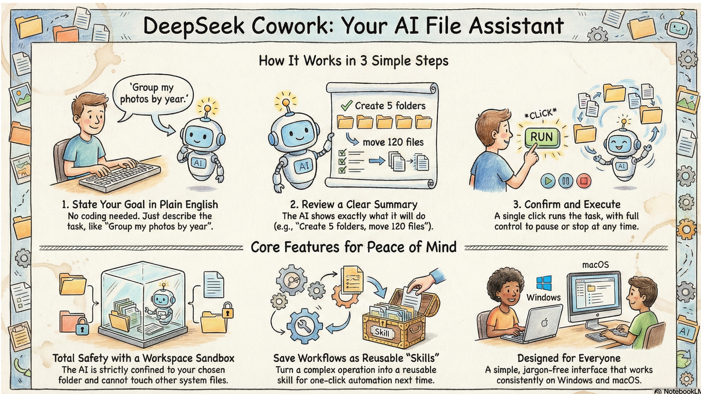
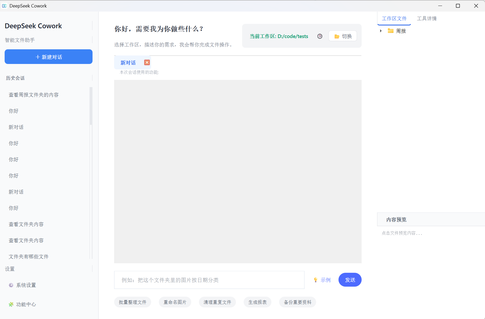
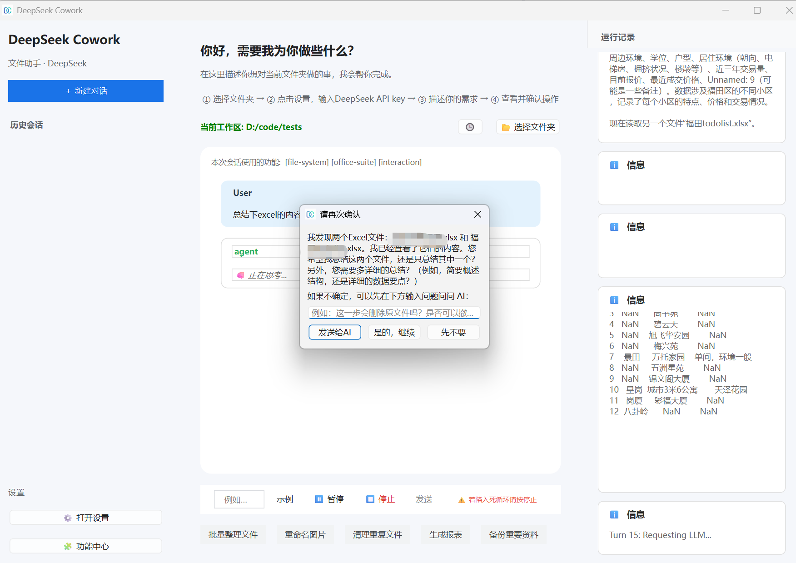

# DeepSeek Cowork

[中文文档](README_CN.md) | [English](README.md)

**DeepSeek Cowork** is a next-generation desktop agent framework inspired by **DeepSeek-V3.2 Interleaved Chain-of-Thought**. It leverages the latest **Reasoning with Tool Use** capabilities to plan, execute, and evolve through complex workflows.

By implementing an **Interleaved Chain-of-Thought (CoT)** architecture, the agent doesn't just "chat"—it actively thinks, writes code, executes system commands, and analyzes results in a continuous loop, all within a secure and modern desktop environment.





## 🚀 Key Features

### 🧠 Dual-Engine Support
*   **DeepSeek R1/V3**: Full support for DeepSeek's latest reasoning models, utilizing their powerful chain-of-thought capabilities for complex problem solving.
*   **Moonshot AI (Kimi 2.5)**: Native integration with Kimi's API, optimized for long-context understanding and strict tool-call schema compliance.

### ⚡ Interleaved CoT & "God Mode"
*   **Think-Call-Think**: The agent interleaves reasoning (`<think>`) with actual tool execution. It plans a step, runs a tool (e.g., searches the web, runs a Python script), reads the output, and then refines its plan—just like a human engineer.
*   **God Mode**: For power users, enable "God Mode" to bypass safety sandboxes, granting the agent full access to system-level subprocesses, registry, and file systems for unrestricted automation.

### 🔌 Self-Evolving Skill System
*   **Hot-Reloadable Skills**: Drop new Python scripts into `skills/` or `ai_skills/` and they are instantly available to the agent without restarting.
*   **AI-Generated Skills**: The agent can write its own tools (e.g., a `yt-dlp` wrapper or a specific data scraper) and save them for future use.
*   **Experience Learning**: The system tracks tool usage success/failure and automatically updates `SKILL.md` documents to "teach" the agent how to use tools better next time.

### 🖥️ Modern Desktop Experience
*   **Native UI**: Built with PySide6, featuring a clean, responsive **16:9** interface with a forced **Light Mode** for professional consistency.
*   **Real-Time Feedback**: Watch the agent's thought process and tool calls stream in real time via collapsible "Thinking" bubbles.
*   **Workspace Sandbox**: Operations are confined to your chosen project folder by default for safety.

### 🛰️ Headless Daemon
*   **Background Inference**: Run LLM inference in a headless daemon so the UI can stay lightweight.
*   **Streaming Events**: Stream reasoning and tool-call events back to the UI while the daemon is running.

## 📦 Installation

### Option 1: Run from Executable (Windows)
1.  Go to the [Releases](../../releases) page to download the latest version.
2.  Unzip and run `deepseek-cowork.exe`.
3.  No Python installation required.

### Option 2: Run from Source
**Prerequisites**: Python 3.10+

1.  Clone the repository:
    ```bash
    git clone https://github.com/chuancyzhang/deepseek-cowork.git
    cd deepseek-cowork
    ```

2.  Install dependencies:
    ```bash
    pip install -r requirements.txt
    ```

3.  Run the application:
    ```bash
    python main.py
    ```

## 📖 Usage Guide

### 1. Configuration
Launch the app and click the **⚙️ Settings** icon:
*   **API Key**: Enter your DeepSeek or other LLM provider API key.
*   **Provider**: Select between `openai` (for DeepSeek) or `anthropic`.
*   **God Mode**: Toggle this to enable/disable safety restrictions.

### 2. Select Workspace
Click the folder icon to select your working directory. The agent treats this folder as its "world" and can read/write files freely within it.

### 3. Start Automating
Type your request in natural language. Examples:
*   *"Scan this project for unused imports and remove them."*
*   *"Search for the latest stock prices of tech giants and plot a trend chart."*
*   *"Create a new skill to download YouTube videos using yt-dlp."*

### 4. Visual Monitoring
*   **Chat Tab**: Main interaction interface.
*   **Sub-Agent Monitor**: When the main agent spawns sub-workers for parallel tasks, watch their logs and status in real-time.

## 🏗️ Architecture

*   **`core/`**: The brain.
    *   `agent.py`: Handles the main event loop, thread management, and CoT logic.
    *   `llm/`: Adapter layer for OpenAI and Moonshot APIs.
    *   `skill_manager.py`: Dynamic tool registration and prompt injection.
*   **`skills/`**: Built-in system capabilities (File I/O, Python Runner, Web Search).
*   **`ai_skills/`**: User/AI-created extensions.
*   **`main.py`**: The PySide6 frontend.
*   **`core/daemon.py`**: Headless daemon server for background inference.

## 🛠️ Extending
To add a new capability, simply create a folder in `skills/` with:
1.  `impl.py`: Your Python functions.
2.  `SKILL.md`: A description of when and how to use these functions.

The system automagically bridges them to the LLM!

## 📄 License

[MIT License](LICENSE)
