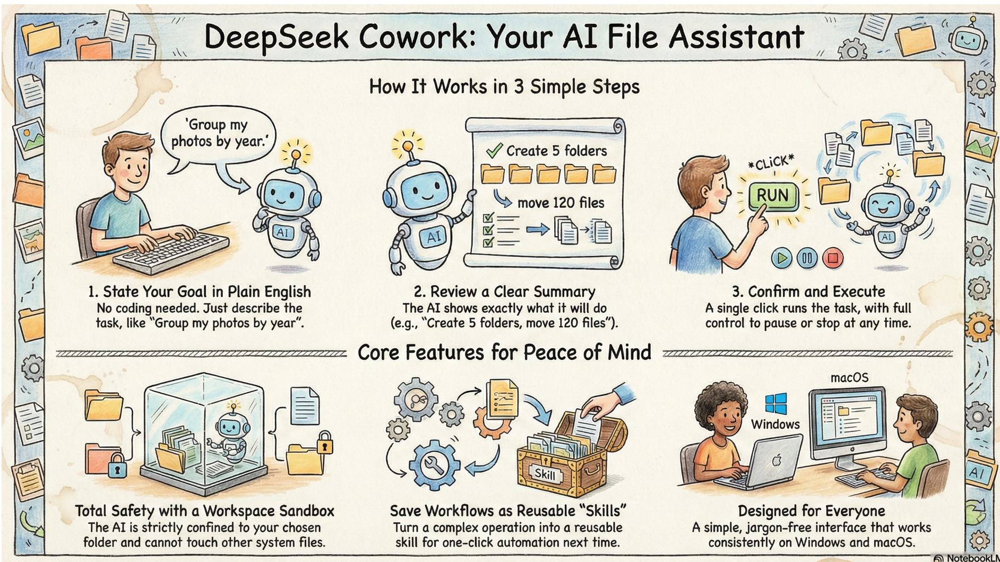

# DeepSeek Cowork

[中文文档](README_CN.md) | [English](README.md)

**DeepSeek Cowork** is a Windows desktop agent framework built on **DeepSeek-V3.2 Interleaved Chain-of-Thought**. It combines reasoning with tool use to plan, execute, and refine tasks across files, apps, and workflows in a secure desktop environment.(**This project is not an official DeepSeek development. It is a purely personal exploration driven by individual interest.**)

Built by **deepseek-cowork team**.




## 🚀 Key Features

### 🧠 Reasoning with Tool Use
*   **Interleaved CoT**: The agent thinks, calls tools, observes results, and continues reasoning in a single flow.
*   **Tool-First Exploration**: Reads real files before acting, reducing hallucinations.

### 🔌 Skill System
*   **Experience-First Skills**: Skills are treated as structured experience packages rather than a second execution protocol.
*   **Hot-Reloadable Skills**: Drop new skills into `skills/` or `ai_skills/` and use them immediately.
*   **Structured Experience Capture**: Runtime lessons can be stored as structured entries and synced back into `SKILL.md`.

### 🖥️ Desktop Experience
*   **PySide6 UI**: Modern chat bubbles, markdown rendering, and tool-call cards.
*   **Workspace Sidebar**: File tree and previews without leaving the app.
*   **Sub-Agent Monitor**: Observe parallel workers and their statuses.

### 🛰️ Daemon & IM Gateway
*   **Headless Daemon**: Background inference keeps UI responsive.
*   **Enterprise IM (Feishu)**: Send commands via IM with daily session rotation.
*   **Workspace Guardrails**: IM requests follow the same workspace limits unless God Mode is enabled.

## 📦 Installation

### Option 1: Run from Executable (Windows)
1.  Download the latest release from [Releases](../../releases).
2.  Unzip and run `deepseek-cowork.exe`.
3.  No Python installation required.

### Option 2: Run from Source (Windows)
**Prerequisites**: Python 3.10+

1.  Clone the repository:
    ```bash
    git clone https://github.com/chuancyzhang/deepseek-cowork.git
    cd deepseek-cowork
    ```

2.  Create and use the virtual environment:
    ```bash
    pip install -r requirements.txt
    ```

3.  Run the application:
    ```bash
    python main.py
    ```

## 📖 Usage Guide

### 1. Configuration
Open **⚙️ Settings**:
*   **API Key**: DeepSeek or other provider key.
*   **Provider**: `openai` (DeepSeek compatible) or `anthropic`.
*   **God Mode**: Toggle safety sandbox restrictions.

### 2. Select Workspace
Pick your working directory. The agent treats it as the boundary for file access.

### 3. Start Automating
Examples:
*   *"Scan this project for unused imports and remove them."*
*   *"Summarize all PDFs in this folder into a single report."*
*   *"Create a new skill to download videos using yt-dlp."*

### 4. Enterprise IM (Feishu)
Open **⚙️ Settings → Enterprise Messaging**, fill in **Feishu App ID / App Secret**, then start the gateway.

## 🏗️ Architecture

*   **`main.py`**: PySide6 desktop UI entry.
*   **`core/agent.py`**: Reasoning loop and tool orchestration.
*   **`core/daemon.py`**: Headless inference server.
*   **`core/im_gateway.py`**: Feishu IM integration.
*   **`core/skill_manager.py`**: Tool registry, experience package loading, relevance matching, and prompt injection.
*   **`skills/`**: Built-in system skills.
*   **`ai_skills/`**: AI or user-created skills.

## 🧩 Tool + Experience Model
- Tools are the only directly callable execution surface for the LLM.
- Tools are plain Python functions discovered from skill folders (`impl.py`) and converted into JSON-schema function calls.
- Skills are structured experience packages: guidance, boundaries, lessons learned, recommended workflows, and recommended tools.
- New experience can be recorded into structured entries first, then promoted back into `SKILL.md` summaries.
- Skills remain hot-reloadable without restarting.

## 🔄 Agentic Workflow
- Interleaved CoT: think → tool-call → observe → continue thinking → final answer.
- Streaming events: reasoning/content/tool_call/tool_result for live UI updates.
- Loop guards: detect repeated thoughts or tool signatures to stop runaway loops.
- Pause/Resume/Stop controls manage long operations safely.

## 🧠 Layered Memory & Context
- System context: workspace, OS, Python, date, and operational rules.
- Memories: optional `memories.md` auto-injected when present.
- Skill prompts: minimal experience briefs first, then fuller guidance only when needed.
- Progressive disclosure: references, structured experience entries, and larger directory context expand only when required.
- History hygiene: reasoning content deduplicated per turn to avoid clutter.

## 🛠️ Extending
Create a folder in `skills/` with:
1.  `SKILL.md`: the experience package body.
2.  `skill.json`: metadata such as capability group, tool refs, workflow, and disclosure defaults.
3.  Optional `impl.py`: tool source if the skill needs new callable tools.
4.  Optional `experience/entries.jsonl`: structured runtime lessons.

Mental model:
- `tool` = executor
- `skill` = experience package

See [SKILL_SYSTEM.md](SKILL_SYSTEM.md) for the full architecture.

## 📄 License

[MIT License](LICENSE)
