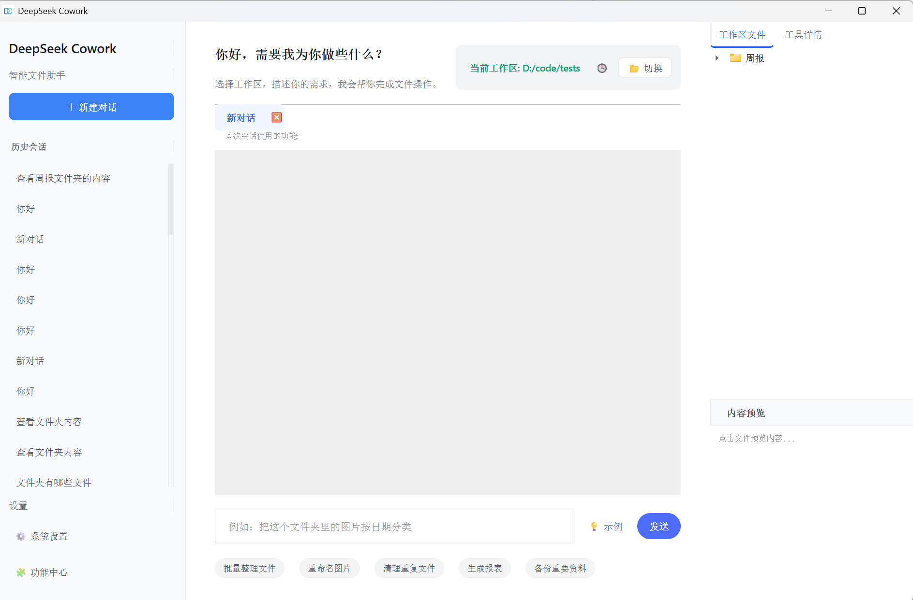
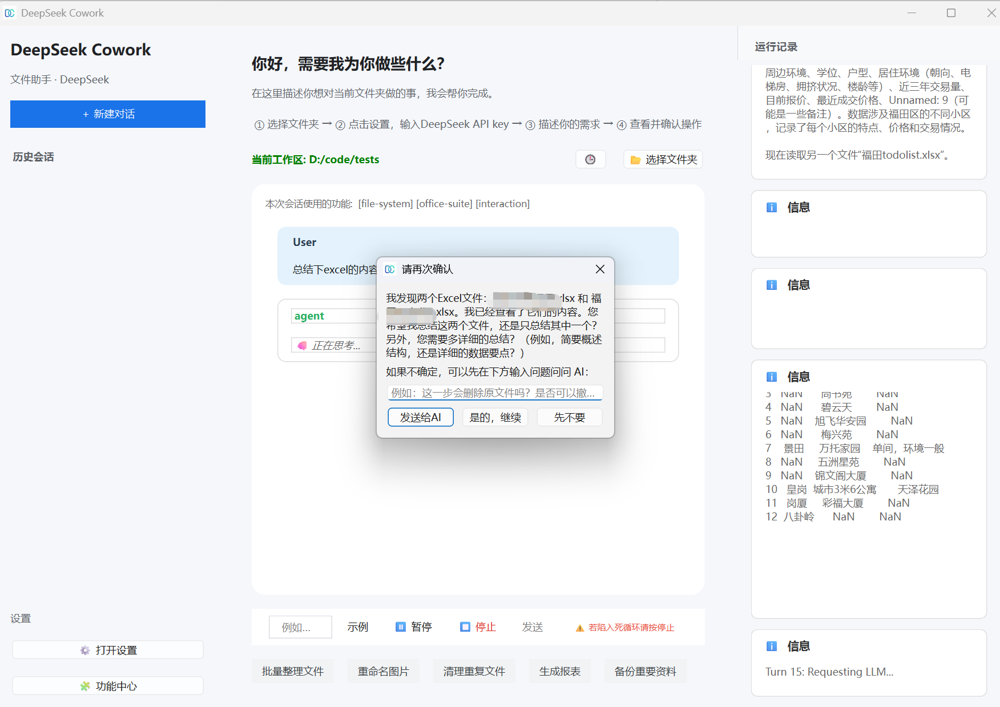

# DeepSeek Cowork

> HTML 交付物内嵌预览通过 Qt 原生输入与可拖动滚动条支持纵向、横向及嵌套区域滚动。

[中文文档](README_CN.md) | [English](README.md)

**DeepSeek Cowork** 是围绕 **DeepSeek V4 thinking 与工具调用工作流** 构建的 Windows 桌面智能代理框架。它将推理与工具调用融合在一个连续流程中，面向文件、应用与工作流提供稳定可控的自动化能力。（**本项目不是DeepSeek官方开发，纯个人探索和爱好**）

项目团队：**deepseek-cowork team**。

当前应用版本：**4.9.2**。

任务执行期间可继续在主输入框补充文字、图片或文件，并点击“引导”把新要求加入当前任务；引导会在下一次安全的模型请求节点生效，无需停止后重开任务。本地执行与后台 daemon 均支持该能力，自动化、独立子 Agent 和企业 IM 暂不开放中途引导入口。

供团队与 AI 共同查看的项目状态文件见 [ROADMAP.md](ROADMAP.md)。

安装、模型配置、项目对话与可编辑 PPTX 生成的完整步骤，请参阅图文版 [使用指南](USER_GUIDE.md)。




## 🚀 核心特性

### 🧠 推理与工具调用融合
*   **交错式 CoT**：思考中调用工具、观察结果、继续推理，减少幻觉。
*   **工具先探测**：先读取真实文件与环境，再做执行决策。

### 🔌 技能系统
*   **经验优先的技能**：技能被视为结构化经验包，而不是第二套执行协议。
*   **热重载技能**：将新技能放入 `skills/` 或 `ai_skills/`，无需重启即可使用。
*   **随包可选插件**：浏览器自动化、网页搜索、金融数据和 Office/PDF 读取作为 `ai_skills/` 下的随包插件提供；所需第三方库可在“设置 → 组件与依赖”提前安装，文档工具包包含用于生成 PDF 的 ReportLab。
*   **浏览器会话**：`browser-automation` 采用串行“观察—操作—验证”流程，支持专用持久 profile、临时隔离 profile，以及遵循 Chrome 授权流程的 Chrome 144+ 当前会话连接。
*   **独立量化策略 Skill**：`quant-strategy-management` 以独立 Skill 形式提供 Strategy DSL 解析、策略资产保存、日线回测和报告产物。
*   **可迁移能力包**：Skill 支持导出为 ZIP，也支持从 ZIP 文件或源码文件夹回导。
*   **结构化经验沉淀**：运行中的 lessons learned 可以先写入结构化 entry，再同步回 `SKILL.md` 摘要。
*   **会话沉淀为 Skill**：点击 `沉淀为 Skill` 可选择当前会话片段并提炼为可审阅草稿，用于新建 Skill 或更新已有 Skill，也可把已运行的 Python 片段保存为脚本入口。
*   **显式只读并行工具**：`parallel_tools` 可并发执行彼此独立的只读工具调用，保持结果顺序，并拒绝写入、审批、命令执行等非只读操作。

### 🖥️ 桌面体验
*   **PySide6 UI**：更克制的蓝白桌面界面，包含气泡对话、Markdown 渲染、工具调用卡片，以及会随窗口动态调整、接近 Codex 阅读比例的对话列。
*   **项目式左侧栏**：左侧栏以本地文件夹作为项目；顶部 `新建对话` 始终创建无项目纯对话，项目行 `+` 创建绑定到该项目的任务。`+` 使用 Qt 确定性绘制，在不同系统和 DPI 下保持可见，项目悬浮提示也统一为浅色样式。点击项目标题只负责展开/收起会话，当前项目始终跟随当前可见对话。
*   **无项目纯对话**：未选择工作区时仍可直接问答，界面显示 `未连接项目 · 纯对话`，并关闭文件、命令和自动化等本地能力；点击 `连接项目` 后保留上下文并将当前对话归入所选项目。
*   **右侧上下文抽屉**：文件、交付物、任务观测、子 Agent 状态通过紧凑图标按钮按需展开；打开后不会因点击聊天区自动收起，只通过右上角关闭按钮或 `Esc` 主动关闭。左侧项目栏保持紧凑，中间聊天列主动利用可用空间，右侧抽屉为交付物与观测保留更稳定的工作宽度，形成接近 Codex 的三栏比例；子 Agent 活动只点亮面板提示，不强制打开抽屉。
*   **HTML 连续创作流**：右侧交付物页将 HTML 作为可持续迭代的创作源；选中后使用轻量模式自动渲染，通过 Qt 原生滚轮输入与可拖动滚动条稳定支持纵向、横向和嵌套区域滚动，未变化页面直接复用，工作区产物在后台扫描。用户仍可强制刷新、放大预览、拖动抽屉宽度和上下分区，并在切换会话后恢复当前 HTML。生成 PPTX、DOCX 或 PDF 时会将当前 HTML 附加到当前对话，继续复用已有创作上下文。
*   **Prompt 缓存观测**：系统提示词页会区分稳定前缀、每轮运行态上下文和已披露 skill context；观测日志聚焦 provider 返回的 cached input token、未缓存 input token 与命中率，不再在首页展示 prompt / tools / message-prefix 指纹。
*   **图片理解附件**：输入区添加的图片会保留结构化附件信息，只有当前模型开启 `支持图片理解` 时才会作为多模态输入发送。
*   **主输入框纯文本粘贴**：从网页、微信、Office 等来源粘贴到主输入框时会自动去掉富文本样式，只保留纯文本内容与换行。
*   **自动化中心**：左侧边栏提供独立 `自动化` 按钮，可查看已配置任务、执行历史和任务模板；定时任务同时支持 crontab 表达式和快捷配置。
*   **会话级控制**：输入区可将文件作为“用户添加的文件”附件 chip 添加，插入智能体、绑定自动化模板、指定本会话可用能力或开启反问模式；输入框会随内容自动增高并在窄宽度下重新换行，已绑定的自动化和已选能力 chip 可一键移除。
*   **消息原地编辑**：已完成的用户消息可直接切换为带“取消 / 发送”的气泡内编辑器；发送后在当前会话截断后续历史并重新生成，删除则只移除当前用户消息、保留后续内容。
*   **对话置顶与归档**：项目内和无项目对话行在悬停时提供置顶、归档按钮；置顶对话优先排序且不会改写最近活动时间，归档后立即从侧边栏隐藏。全局工具提示使用不透明浅色表面，避免 Windows 原生窗口出现黑块。
*   **长提问气泡完整展示**：用户气泡会完整展示提问内容，中文长句、长英文标识符、文件名和带连字符的文本都会按宽度自动换行，不再被蓝色气泡裁掉或隐藏。
*   **系统状态提示条**：聊天流里的系统提示改为更轻的 Apple 风格状态条，使用低饱和底色、自动换行和自动消失，而不是整块高对比通知框；需要人工确认的自动化步骤会在聊天流里显示确认、重跑和跳过操作条。
*   **多分身监控**：在当前任务内以轻量时间线摘要查看并行子任务的输入、工具调用、工具结果、流式输出与最终输出；打开面板后会在主线程短延迟批量渲染，保持 UI 稳定。
*   **安全的子 Agent 生命周期**：子 Agent 的结果落库、状态流转与工作线程回收分离，避免并行任务完成或续跑时影响桌面应用稳定性。
*   **设置保存更顺滑**：设置对话框会把模型、MCP、智能体、工作区和企业消息配置合并为一次落盘；只调整模型配置时不会重扫能力，只有 MCP 服务器变化才刷新能力注册表，减少保存后的界面卡顿。
*   **启动与运行更顺滑**：主窗口会先完成显示，再分阶段后台补默认工作区、侧边栏历史、托盘、守护进程预热、守护进程监控和自动化调度；点击开始任务或运行代码时不再等待主线程内的多次连接重试。
*   **后台进程唯一启动**：重复点击 exe、开始任务、运行代码或启动企业消息网关时，UI 会先靠主进程运行锁和本地激活重试收敛成一个窗口，daemon 和 IM 网关子进程也会继续用单例锁确保只保留一个存活实例。
*   **Daemon 上下文快照**：桌面端发起 daemon 推理时会带上当前窗口内存中的完整会话快照，避免 daemon 空闲挂起并恢复缓存后，继续聊天时丢失可见上下文。
*   **历史加载保护**：恢复历史会话时，在 SQLite 消息加载完成并重新绑定为窗口唯一消息列表之前，输入与后台保存保持禁用，避免空快照提前覆盖既有上下文。
*   **长对话快速路径**：侧边栏默认只走 SQLite 历史索引，不再每次刷新都全量扫描旧版 `chat_history_*.json`；需要保留旧历史时，可从侧边栏菜单手动迁移。
*   **流式输出合并刷新**：模型输出的小片段会按短定时器合并后刷新，避免每个 token 都触发富文本重排。
*   **Markdown / HTML 渲染缓存**：历史气泡和最终回复重复渲染时复用缓存结果，减少 Markdown 转 HTML 的重复开销。
*   **聊天气泡虚拟化**：长会话滚动时，远离视口的气泡会折叠成固定高度占位，靠近视口后自动恢复，降低滚动和布局压力。
*   **会话异步保存**：高频会话保存改为后台队列合并落库；消息改写、重命名、归档、删除、长期记忆更新和应用退出等强一致路径仍会先 flush，避免读到旧历史或关应用时丢消息。
*   **超长回复轻量渲染**：很长的助手回复依然完整显示；流式输出阶段可临时走纯文本快路径，最终回复优先保留 Markdown / HTML 富文本渲染，仅极端巨大的普通文本才降级。
*   **隐藏 Windows 控制台启动**：Python、Bash、更新 fallback、更新后重启、应用启动和系统工具子进程统一使用无窗口启动参数，减少正常使用时闪出 CMD 黑框。
*   **按需运行诊断**：高频子 Agent 生命周期日志默认关闭；需要排查时设置 `COWORK_RUNTIME_DEBUG_LOG=1`，即可写入应用数据目录或便携模式 `user_data/` 下的 `sub_agent_runtime.log`。
*   **UI 异常留痕**：全局 UI 事件保护会继续阻止单个事件直接中断应用，同时始终把完整 traceback 写入应用数据目录或便携模式 `user_data/` 下的 `ui_error.log`；界面提示会明确指向该日志，不再用含糊的“已继续运行”代替根因。
*   **手动反馈入口**：侧边栏提供 `记忆` 与 `沉淀为 Skill`；长期摘要生成内容在人确认后才保存。

### 🛰️ 守护进程与 IM 网关
*   **无头守护进程**：后台推理保证 UI 轻量响应。
*   **企业 IM (飞书 / 钉钉 / 企业微信智能机器人)**：通过企业消息下发任务并按日归档。
*   **上下文预算管理**：IM 会话按模型能力管理上下文；DeepSeek V4 默认利用 1M token 长窗口，接近预算才压缩，小窗口模型仍保持保守压缩，并在溢出时自动重试一次。
*   **工作区约束**：未开启 God Mode 时，IM 指令同样受工作区限制。

## 📦 安装指南

### 选项 1：运行可执行文件 (Windows)
1.  前往 [Releases](../../releases) 下载最新版。
2.  解压并运行 `deepseek-cowork.exe`。
3.  无需安装 Python。

### 选项 2：源码运行 (Windows)
**前置要求**：Python 3.10+

1.  克隆仓库：
    ```bash
    git clone https://github.com/chuancyzhang/deepseek-cowork.git
    cd deepseek-cowork
    ```

2.  创建并使用虚拟环境：
    ```bash
    python -m pip install -r requirements.txt
    ```

3.  启动应用：
    ```bash
    python main.py
    ```

### 打包前运行时准备（Windows）
在执行 `pyinstaller deepseek-cowork.spec` 之前，先拉取固定版本的 Git Bash 运行时并进行 SHA256 校验。Node.js 已改为应用内可选组件：

```powershell
powershell -ExecutionPolicy Bypass -File .\scripts\fetch_runtimes.ps1
```

下载文件会放在 `.runtime_downloads/`，解压后目录为 `node_env/` 与 `git_bash_env/`。
Windows 打包版会优先直接从当前应用目录解析内置运行时，包括 `_internal/node_env/node.exe` 与 `_internal/git_bash_env/bin/bash.exe`。AppData 下的 `runtime_sandbox` 继续作为临时、缓存和 skill 依赖目录，不再优先作为可执行运行时来源，因此自动升级后会使用新解压的 `_internal` 文件。如需覆盖探测结果，可设置 `COWORK_NODE_EXE`、`COWORK_NODE_DIR`、`COWORK_BASH_EXE`、`COWORK_GIT_BASH_DIR` 或 `COWORK_BASH_DIR`。

打包版保留完整沙箱 Python 基础环境。文档、数据分析、金融分析、浏览器自动化和网页研究第三方库可在“设置 → 组件与依赖”按需安装，并支持 PyPI、清华、阿里云及自定义 HTTPS 源；Node.js 可从官方源或 npmmirror 安装。安装包继续包含 `PySide6-Addons` 与 QtWebEngine 运行资源。
AI 在 execution 模式下默认可直接调用 `run_python_code`，无需先通过 `tool_search` 发现；JavaScript 仍通过 `run_node_code` 执行，`bash` 工具优先使用 Git Bash，Windows 上缺失 Git Bash 时会退回 `cmd.exe`。
带截图或其他图片输入的回合也会保留 `tool_search` 发现链路，这样文档读取、浏览器辅助等延迟工具仍可按需被发现，而不会因为视觉输入而消失。
`python-runner` 的 `install_package` 会在与 `run_python_code` 相同的沙盒运行时里验证导入是否成功。第三方包会持久化到 AppData 的 `runtime_sandbox/.../skills/python-runner/python/site-packages`，重启后仍可用；如果依赖缓存记录还在但沙盒已经无法导入，会自动触发重新安装。
沙盒现在会注入 Python bootstrap `sitecustomize.py`、`PATH` 与 `COWORK_PYTHON_DLL_DIRS`，让 Windows 下带原生扩展的包可以从内置运行时和 skill 专属 `site-packages` 解析 DLL。
如果安装后仍然导入失败，`install_package` 会返回沙盒里的真实 traceback，而不再只给出笼统的 “still cannot import” 提示。
Windows 打包时还必须把 `DLLs/` 这类平台扩展目录以及常见 MSVC runtime DLL 一并带入内置 Python；否则 `_socket` 等核心扩展缺失，`_internal/python_env` 内的 `pip` 或原生包都可能无法加载。

## 📖 使用指南

### 1. 配置
打开 **⚙️ 设置**：
设置页采用左侧分类导航和右侧无边框偏好设置分区，分区说明默认精简为标题，信息更接近桌面产品的组织方式。
*   **模型与服务**：按 provider 或用途拆分多个模型服务，每个服务可独立维护访问密钥、服务地址和模型列表。
*   **智能体**：把常见工作角色保存成模板，复用角色说明和能力范围。
*   **工作区**：设置默认工作区和聊天记录目录，让每次启动都落在熟悉的环境里。
*   **MCP**：配置 `stdio` 或 Streamable HTTP MCP servers；相关术语保持英文，便于直接对照官方示例与 JSON 配置。
*   **扩展权限**：控制是否允许突破工作区限制执行高风险操作。

### 2. 选择项目
顶部 **新建对话** 可随时开始无项目纯对话。需要处理本地内容时，在左侧栏添加项目并使用项目行 `+`，或在纯对话中点击 **连接项目**；Agent 只能在当前对话绑定的项目范围内读写文件。

### 3. 开始自动化
示例：
*   *“扫描这个项目中未使用的 import 并移除。”*
*   *“汇总文件夹里的所有 PDF 并生成报告。”*
*   *“创建一个读取公开数据并生成分析图表的技能。”*
*   输入区 `+` 菜单中的 **从对话生成 SOP** 会从当前会话一次性提炼完整 SOP 草稿；确认后保存为任务模板并绑定到当前会话，也可以输入修改意见重新生成草稿。

### 4. 管理自动化
打开左侧边栏的 **自动化**：
*   **自动化中心**：顶部会先给出任务、启用数和模板数概览，再用更轻的分段切换进入“已配置 / 执行历史 / 任务模板”，整体更像产品页而不是管理后台。
*   **已配置**：任务以紧凑任务行呈现，突出启用状态、模板、计划、下次执行和快速操作；支持立即运行、编辑、暂停或启用。
*   **定时任务编辑器**：创建和编辑任务时，会把基础信息、触发计划、模板预览和执行补充说明拆成清晰分区；支持直接填写 5 段 crontab 语法，也支持每天/每周/每月/间隔/单次的快捷配置。
*   **执行历史**：查看已完成、失败、中断、错过或等待确认的自动化运行，并重新打开关联任务会话。
*   **任务模板与会话入口**：SOP 模板仍由系统自动生成 ID；模板和步骤都可配置人工确认或自动推进，步骤执行器支持 Agent、上传 Python 文件和 Bash 命令；“添加自动化”“从对话生成 SOP”预览保持 Apple 风格，等待确认时直接在聊天流里操作。
*   **AI 可调用的自动化工具**：Agent 现在可以通过正常的 `tool_search` 发现并调用自动化管理能力，查看模板、创建或更新模板与定时任务、启停任务、查看执行历史。删除任务和立即执行任务仍会先请求用户确认，新建定时任务若未明确要求启用则默认保持暂停。

### 5. 闭合反馈回路
在完成有价值的会话后，可以使用侧边栏入口：
*   **`记忆`**：打开记忆中心，随时编辑全局/工作区长期摘要和全局灵魂提示词。全局摘要读取全部历史；切换到当前工作区摘要后，只读取该工作区会话生成草稿，确认后才保存。
*   **`沉淀为 Skill`**：选择当前会话片段生成 Skill 草稿，可新建 Skill，也可对已有 Skill 追加经验或重写说明；保存前可预览和编辑，并可勾选已运行的 `run_python_code` 片段写入 `scripts/` 和 `script_entries`。
*   **功能中心导入/导出与调试**：可从单个 Skill 目录、Skill 集合目录或 ZIP 导入自定义能力，也可将现有 Skill 单独导出，或多选后统一导出为可迁移集合 ZIP；能力中心将核心内置能力、默认关闭的随包可选插件、MCP 能力和自定义能力分开管理。内置与随包插件只读不可删除，自定义 Skill 可编辑/验证/调试。切换开关会立即更新列表显示，运行时能力会在下次使用或手动刷新时统一重载；MCP 开关会与设置页对应 server 的启用状态同步。开关整条轨道都可点击，且不会误打开能力工作台。

### 6. 企业消息
打开 **⚙️ 设置 → 企业消息**，在飞书、钉钉或企业微信智能机器人分组中填写对应凭据，启用渠道并启动网关。

### 7. 应用更新
打开 **⚙️ 设置 → 更新** 检查 GitHub Releases。打包版会在下载前清理旧更新包、旧暂存目录和旧脚本，只保留本次目标安装包；下载、校验、解压暂存后通过独立更新器重启安装，前台进度窗口可最小化，也可选择后台安装。源码运行模式只检查版本并提供 Releases 页面入口。

### 8. MCP 服务器
打开 **⚙️ 设置 → MCP** 添加 MCP 服务器。
*   打包版默认内置 MCP client 运行时，终端用户无需再单独安装 `mcp` 包。
*   `stdio`：配置命令、参数、工作目录、环境变量和启动超时。
*   Streamable HTTP：配置 URL、Headers 和启动超时。
*   也支持直接导入 JSON 配置，例如 `{"mcpServers":{"showdoc":{"type":"streamable-http","url":"https://example.com/mcp","headers":{"Authorization":"Bearer ..."}}}}`。
*   当前首版只接入 **tools**，暂不支持 MCP resources 和 prompts。

## 🏗️ 架构概览

*   **`main.py`**：PySide6 桌面 UI 入口。
*   **`core/agent.py`**：推理循环与工具调度。
*   **`core/daemon.py`**：无头推理服务。
*   **`core/mcp_client.py`**：MCP `stdio` / Streamable HTTP 传输桥接与工具调用封装。
*   **`core/im_gateway/`**：多平台企业消息网关与渠道适配。
*   **`core/skill_manager.py`**：工具注册、经验包加载、相关性匹配与 Prompt 注入。
*   **`core/sop_manager.py`**：会话级自动化模板、步骤状态、推进方式（人工确认 / 自动推进）、确认、重跑与跳过逻辑。
*   **`core/sop_from_conversation.py`**：从当前会话生成可预览、可修订的 SOP 草稿。
*   **`core/automation_manager.py`**：定时自动化任务的规范化、cron / 快捷计划的下次执行时间计算、执行提示词拼装与历史记录辅助函数。
*   **`core/updater.py`**：GitHub Releases 检查、安装包校验、暂存和 Windows 重启更新器。
*   **`skills/`**：核心内置技能。
*   **`ai_skills/`**：默认关闭的随包插件，以及 AI 或用户创建的技能。
*   **`ai_skills/quant-strategy-management/`**：独立量化策略 Skill，包含私有包、CLI 入口、存储和回测流程。

## 🧩 Tool + Experience 模型
- `tool` 是模型唯一直接调用的执行面。
- 工具源于技能目录中的公开 Python 函数（`impl.py`），自动生成 JSON Schema 并被模型调用。
- `skill` 是结构化经验包，承载边界、坑点、经验、推荐流程与推荐工具。
- 核心文件工具只处理普通文本和工作区路径。DOCX、PPTX、XLSX/XLS、PDF 读取由可选 `document-reader` 插件的 `document_read` 统一处理；写入这些格式时由 AI 使用 `run_python_code` 和任务所需库生成。
- 新经验默认可先写入结构化 entry，再回写到 `SKILL.md` 摘要。
- `沉淀为 Skill` 是人工确认的沉淀入口，会把会话片段经验转化为 `SKILL.md`、`skill.json`、`experience/entries.jsonl`、可选 `impl.py` 与可选 Python 脚本资产。
- Skill 可以单独导出为 ZIP 包，也可以多选导出为集合 ZIP；ZIP 导入会校验安全路径，支持平铺根目录、单文件夹根目录和包含多个子 Skill 的集合包，优先沿用元数据中的原 Skill 名称，并拒绝同名覆盖。
- `tool_search` 现在除了延迟发现工具，也会返回匹配到的 AI skill 结果；对 skill 名、标题、触发词和正文摘要的匹配不区分大小写。
- 对 imported / agent skill，系统采用持久化延迟全文暴露：默认只提供元数据或用户明确选择的 brief；仅在明确选择、`tool_search` 命中或实际调用 skill 工具后，才将完整 skill 内容记录为隐藏会话上下文。普通用户文本不再通过模糊 query 匹配自动注入全文。
- 如果命中的 imported / agent skill 含 `script_entries`，`tool_search` 会返回 `run_skill_script` 作为首选执行入口；模型应直接按脚本入口执行，而不是再用 `glob` / `bash` 去定位 skill 目录。
- `quant-strategy-management` 运行时不依赖 `D:\code\测试策略` 原始路径，策略资产默认写入应用数据目录，仅用于研究和回测辅助。
- 新技能仍然支持热加载，无需重启。
- 当前源码已打通“提示模型记录经验 -> 调用 `update_experience` -> 持久化经验 -> 后续任务再次注入”的链路，因此 AI 在合适场景下可以主动调用经验工具。
- 但这仍属于可用的第一版经验闭环：系统会鼓励并支持 AI 记录经验，不保证每次都会主动调用，也尚未内建经验验证、效果评估、生命周期治理等强反馈机制。

## 🔄 Agentic Workflow
- 交错式 CoT：思考 → 工具调用 → 观察 → 继续思考 → 最终回答。
- 流式事件：思考/内容/工具调用/工具结果实时回传 UI；子 Agent 还会额外上报输入、工具结果与完成态事件，供右侧时间线可视化。
- 子 Agent 生命周期将结果处理与 Qt 线程清理拆开，旧 worker 完全退出后才会续跑排队输入。
- 子 Agent 监控事件先收集到会话队列，用户打开抽屉后再以轻量摘要行渲染，避免流式过程中频繁构造控件。
- 右侧上下文抽屉不再监听外部点击；文件、交付物、任务观测和子 Agent 页面会持续保持展开，直到用户点击关闭按钮或按下 `Esc`。
- 开启 `COWORK_RUNTIME_DEBUG_LOG=1` 后，子 Agent 抽屉的显示与隐藏原因会写入 `sub_agent_runtime.log`，方便排查意外收起或闪退前的最后一步；日常运行默认不写高频日志。
- 环路保护：检测重复思考或重复工具签名并自动停止。
- 支持暂停/恢复/停止，安全管控长任务。
- 会话自动化模板会把执行约束在当前步骤内；模板和步骤都可以配置为人工确认或自动推进，系统每次只派发当前步骤而不是整段 SOP prompt。步骤执行器支持 Agent、上传后的 Python 文件和 Bash 命令。
- 定时自动化任务会复用同一套模板配置，按步骤创建独立执行轮次；遇到人工确认步骤时会暂停到“等待确认”，其余步骤可自动连续推进，并把每次运行写入本地执行历史。计划配置支持应用内 cron 语法，不依赖系统 crontab。
- 反问模式仅开放只读探索，并通过交互工具收集关键问题答案后再回到正常执行。

## 🧠 分层记忆与上下文
- System Prompt 排序：稳定策略和工具使用规则靠前并在会话内冻结；运行模式、日期、运行时路径、指定能力、SOP 当前步骤等易变状态靠后作为临时 runtime context，以提升 DeepSeek 上下文缓存稳定性。
- 记忆层：灵魂提示词与全局/当前工作区摘要自动注入，并可在记忆中心随时编辑。
- 历史生成从记忆中心手动触发，系统仅在用户确认保存后更新 `memories_update_state.json`。
- 技能提示：先注入最小经验摘要，需要时再展开完整说明。
- 会话级指定能力与智能体配置会收窄当前任务的可用能力范围。
- 上下文预算：DeepSeek V4 Pro/Flash 默认使用 1,000,000 token 窗口，仅在接近配置阈值时主动压缩；非 V4 模型使用更保守的小窗口预算。
- 历史清洁：每轮清理/折叠思考内容，并保留 DeepSeek thinking 工具调用回放所需的 `reasoning_content` 字段。

## 🛠️ 扩展开发
在 `skills/` 新建文件夹：
1.  `SKILL.md`：经验包正文。
2.  `skill.json`：能力分组、tool refs、workflow、披露默认值等元数据。
3.  可选 `impl.py`：当技能需要新增可调用工具时使用。
4.  可选 `experience/entries.jsonl`：结构化运行经验。

推荐心智模型：
- `tool` = 执行器
- `skill` = 经验包

完整说明见 [SKILL_SYSTEM.md](SKILL_SYSTEM.md)。

## 📄 许可证

MIT License
