# DeepSeek Cowork 使用指南

本指南适用于 DeepSeek Cowork **5.0.0**，介绍安装、模型配置、基础使用方式，以及如何从 AI 回复生成可编辑的 PPTX 文件。

首次安装或升级前，请先阅读 [5.0.0 发布说明](RELEASE_NOTES_5.0.0.md) 中的兼容性和发布前检查。

> 当前界面截图基于 5.0.0 的浅色 Linear 风格工作台。后续版本的按钮位置或文案可能略有调整，请以实际界面为准。

## 目录

- [安装](#安装)
- [首次使用前的配置](#首次使用前的配置)
  - [配置大模型 API](#配置大模型-api)
  - [切换对话模型](#切换对话模型)
  - [更新应用](#更新应用)
- [开始使用](#开始使用)
  - [直接对话](#直接对话)
  - [基于文件夹对话](#基于文件夹对话)
- [管理能力、自动化与记忆](#管理能力自动化与记忆)
- [应用场景：生成可编辑的 PPTX](#应用场景生成可编辑的-pptx)

## 安装

1. 打开项目的 [Releases 页面](https://github.com/chuancyzhang/deepseek-cowork/releases)。
2. 进入带有 **Latest** 标签的最新版本，下载 ZIP 压缩包。

   

3. 将压缩包保存到合适的位置并解压，得到 `deepseek-cowork` 文件夹。

   

4. 打开文件夹，双击 `deepseek-cowork` 启动应用。

   

## 首次使用前的配置

启动后会进入 DeepSeek Cowork 主界面。

### 配置大模型 API

DeepSeek Cowork 需要配置可用的大模型 API 后才能正常执行任务。

1. 点击左下角的 **设置**。

   

2. 进入 **模型与服务**，填写 API 服务地址与访问密钥。DeepSeek API 的访问密钥可前往 [DeepSeek 开放平台](https://platform.deepseek.com/) 获取。

   

3. 点击 **新增模型**。

   

4. 填写模型配置并确认。示例中：

   - `deepseek-v4-flash` 对应快速模型；
   - `deepseek-v4-pro` 对应专家模式。

   

5. 配置完成后，点击固定操作栏中的 **保存设置**；返回会话后会恢复原来的会话位置和输入焦点。

渠道可从“模型与服务”顶部删除，模型新增、编辑或删除后“保存设置”会立即启用。也可以删除全部渠道并保存；此时聊天显示“未配置模型”，发送任务会引导回本页面添加渠道和模型。

> 模型名称与可用能力可能随服务商调整。请以服务商当前提供的模型和项目内实际配置项为准。

### 切换对话模型

在主界面的对话输入区下方，可以选择并切换已经配置好的模型。按钮始终显示 **渠道 / Model · 思考强度**；点击后可搜索模型，并在同一轻量 Popover 中设置思考强度。模型选择按对话保存，含义是“当前对话下一轮使用的模型”：同一个对话运行完成后可以切换模型继续提问；如果任务正在运行，切换只影响下一轮，不会改变已经启动的模型流。

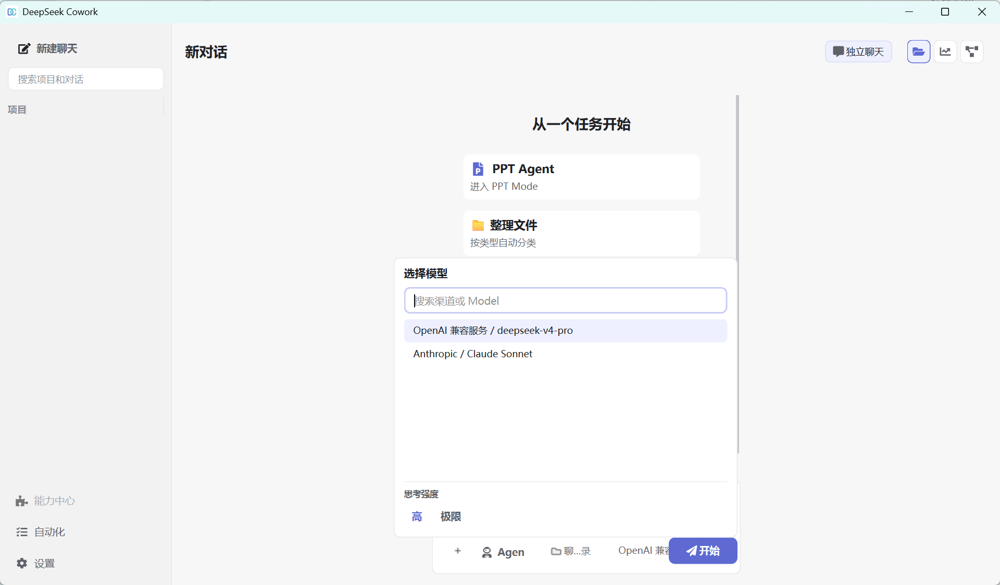

### 更新应用

进入 **设置 → 更新**，可以检查并安装 DeepSeek Cowork 的最新版本。

## 开始使用

DeepSeek Cowork 支持两种主要使用方式：

1. **独立聊天**：不连接项目，但会自动使用一个独立的聊天工作目录。
2. **项目聊天**：连接本地文件夹作为项目，让 AI 在授权的工作区内读取和处理文件。

### 独立聊天

未选择文件夹（项目）时，当前会话为独立聊天。应用会在 exe 运行目录下自动创建 `conversation_workspaces/<session_id>/`，AI 的文件读取、创建和修改会限制在这个聊天工作目录内，不会直接进入你的项目文件夹。

### 项目聊天

可以通过以下方式连接项目：

- 点击左侧项目区域的 **+**，选择一个本地文件夹；

  

- 在尚未发送消息的空对话中，点击输入栏下方的项目选择器，搜索并选择已经加入的项目。
- 在项目选择器中点击 **添加新项目**，选择一个本地文件夹。

项目选择器是主界面唯一的项目连接入口。已有消息或正在运行任务的对话不能切换项目，需要新建空对话后再选择。

已加入的项目可以从左侧项目区域的菜单中在资源管理器里打开，方便直接查看该项目文件夹。也可以在同一菜单中归档项目；归档后项目会从左侧栏和项目选择器中隐藏，可在 **设置 → 归档** 中恢复。单个对话归档后同样会从左侧栏隐藏，并可在该页面恢复。

项目展开后默认显示最近 5 个对话；如有更多历史，使用 **展开显示 / 收起全部**。项目、项目内对话和独立对话均可从更多菜单或右键菜单选择 **重命名**，也可以先聚焦对应行再按 `F2`。输入新名称后按 `Enter` 保存，按 `Esc` 取消。

项目和会话的操作按钮平时不占用标题宽度，只在鼠标悬停或键盘聚焦时显示；右键仍可直接打开菜单。单纯浏览或展开项目不会改变项目内会话的最近活动时间。

重新打开历史会话时，应用会恢复草稿、滚动位置、右侧抽屉和每段深度思考的展开状态，并把所有既有消息按当前统一轮次规则重新组织。没有补充引导时，同一轮的多段 **深度思考 · 用时**、工具、阶段回复和最终回答收纳在一个 AI 轮次容器中，并按真实顺序排列；阶段之间只有留白和细分隔线，不显示阶段编号。阶段回复不显示 **复制结果**、**生成办公稿** 等消息动作，只有正文非空的最终回答显示操作栏；任务停止、运行错误或没有最终正文时会显示明确状态，但不会把阶段回复当作最终结果。补充引导仍作为明确边界结束当前容器，并在引导后开启新的 AI 容器。编辑历史用户消息时，消息会原位变成编辑器；选择 **保存并重新生成** 会替换该消息之后的对话内容，但不会删除已经生成的工作区文件。

任务运行时仍可在输入区发送补充引导。引导作为独立轻量行显示在真实发送位置：普通处理中显示 **等待下一安全节点**；如果工具已经启动，则显示 **完成当前步骤后应用**，工具不会被取消或移动。到达安全节点后，同一条引导会原位变为 **已应用**。若 AI 已开始输出正文，引导前的文字会保留为独立阶段回复，后续深度思考和最终回答继续排列在引导之后。

AI 发起的内联选择、文本或确认卡在响应成功后会从对话中移除；若提交失败，原输入和选择会保留，并显示原因供重试。

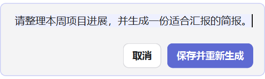

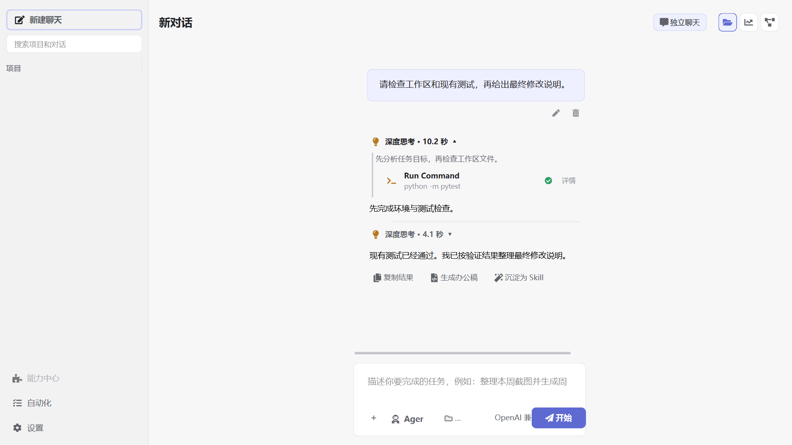

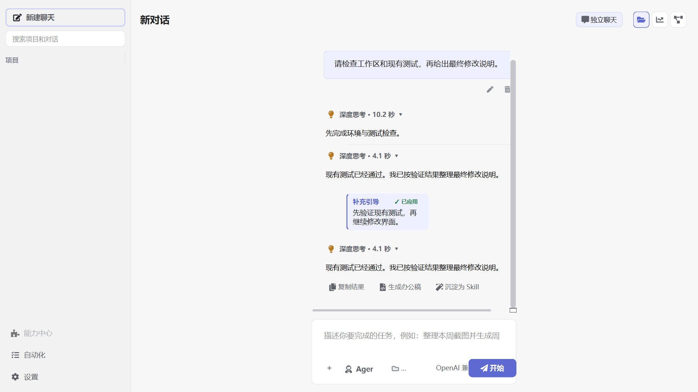

连接后，AI 会将该文件夹作为当前工作区，并在授权范围内读取、创建或修改文件。请在执行重要或批量操作前确认任务要求与目标路径。

### 粘贴图片到对话

在对话输入框中按 `Ctrl+V` 或使用右键“粘贴”，即可把剪贴板图片加入当前消息。图片会显示在输入框上方并可移除，发送后也会保留缩略图。当前模型必须在设置中启用“支持图片理解”；否则应用会保留文字和图片、阻止发送，并打开模型选择入口，避免图片被静默忽略。

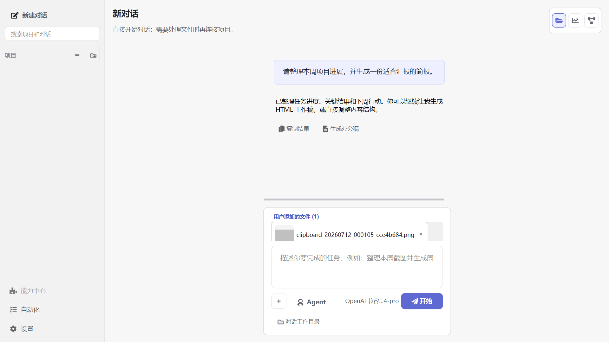

## 管理能力、自动化与记忆

左下角只保留 **能力、自动化、设置** 三个稳定入口。它们会在主内容区打开，不会用大型弹窗遮挡整个任务；点击返回或按 `Alt+Left` 后，会恢复原会话、输入焦点和右侧抽屉。

- **能力**：搜索、筛选和启停能力；选择能力后进入详情与配置，再返回原列表位置。

  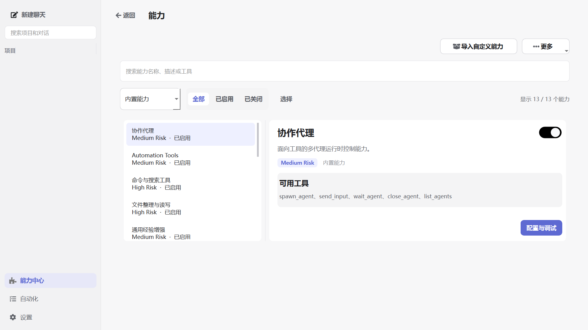

  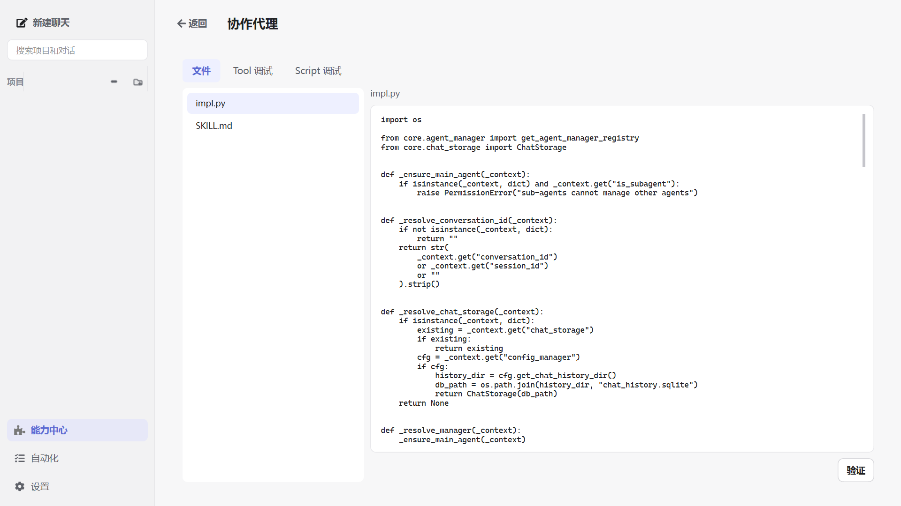

- **自动化**：查看已配置任务和执行历史。新建或编辑任务在同一主内容区完成，任务启停和保存独立生效。

  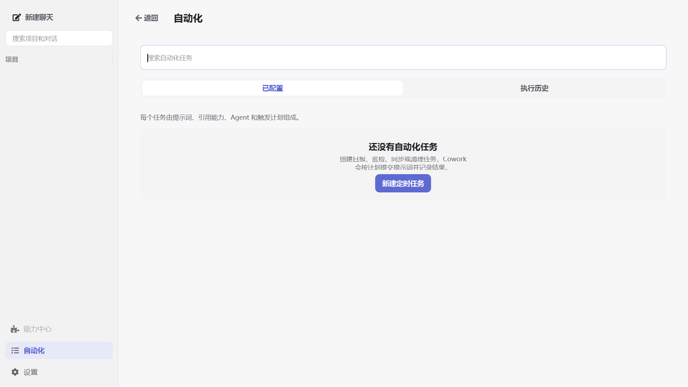

  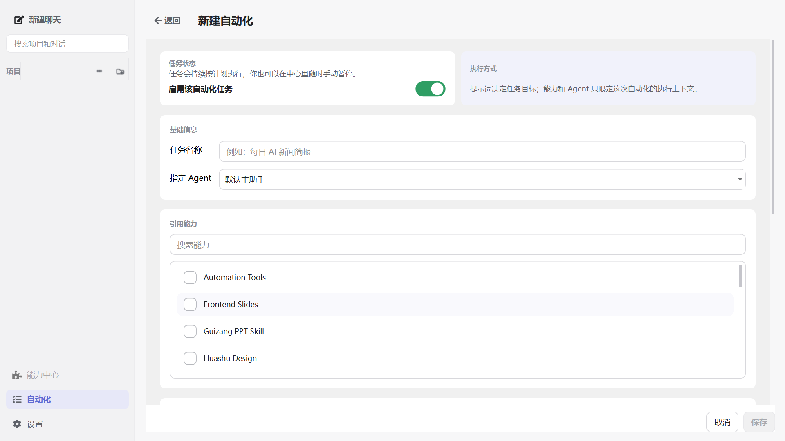

- **个性与记忆**：进入 **设置 → 个性与记忆**，维护回答个性、全局长期摘要和当前工作区摘要；从历史生成的草稿需要确认后才会应用。

  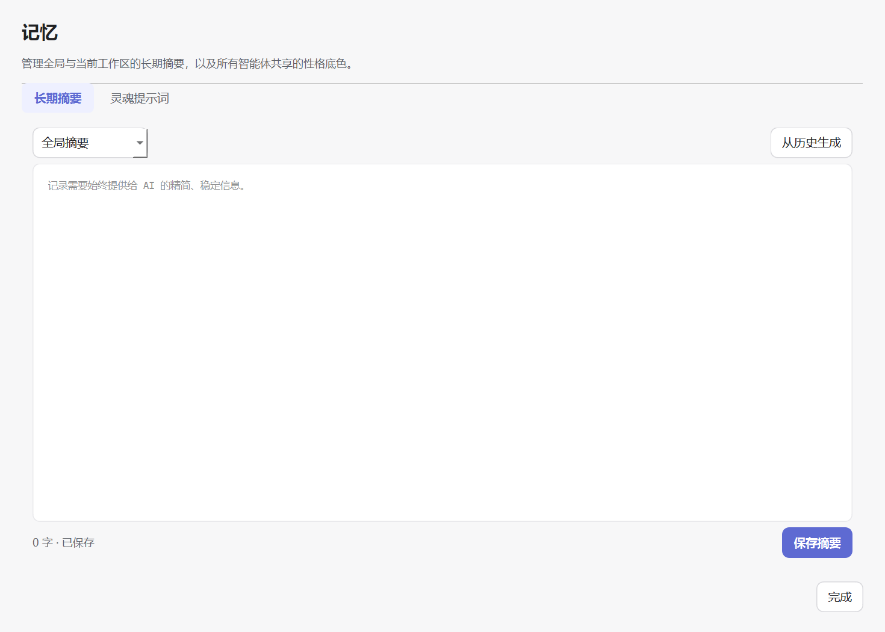

- **Agent、指定能力与 Skill 沉淀**：输入工具栏的 **Agent** 按钮用于把内置或自定义智能体加入当前输入。点击 `+` 可添加文件、搜索并多选当前会话优先能力，或选择 **沉淀为 Skill**；模型入口与 Agent、能力保持单一选择状态。Skill 两步向导会选择保存方式和会话片段，随后在后台生成草稿；完成后点击对话中的 **Skill 草稿待确认** 再查看并保存。
- **能力启停**：在能力中心启用或关闭能力后，后台会立即刷新，但不会在对话中插入提示。启用只表示 AI 可通过发现机制找到它，不会自动改变当前会话的“指定能力”；若后台刷新失败，界面会保留已保存配置并显示原始失败原因。
- **子 Agent 过程**：子 Agent 的状态、reasoning、Provider 日志和工具过程只在右侧“子 Agent/任务观测”区域展示，不在普通对话气泡中显示短 ID 或原始日志框；最终结果仍回到对话。
- **AI 创建能力**：AI 通过能力创建工具发布新 Skill 后，当前对话会显示“AI 已创建能力：X，现已可用”。同一回合的下一次模型请求即可发现并调用新工具；若首次调用需要依赖，任务过程会显示准备进度，失败时保留原始安装错误。

- **对话内交互可视化**：在能力中心启用默认关闭的 `visualize` 后，可要求 AI 生成交互图表、数据探索器、参数模拟器或 UI 预览。视图完全离线，不能加载 CDN 或远程图片；筛选和选择状态可随会话恢复。关闭插件后不会再生成新视图，已登记且完整的历史视图仍会以“只读”卡片显示。

  

  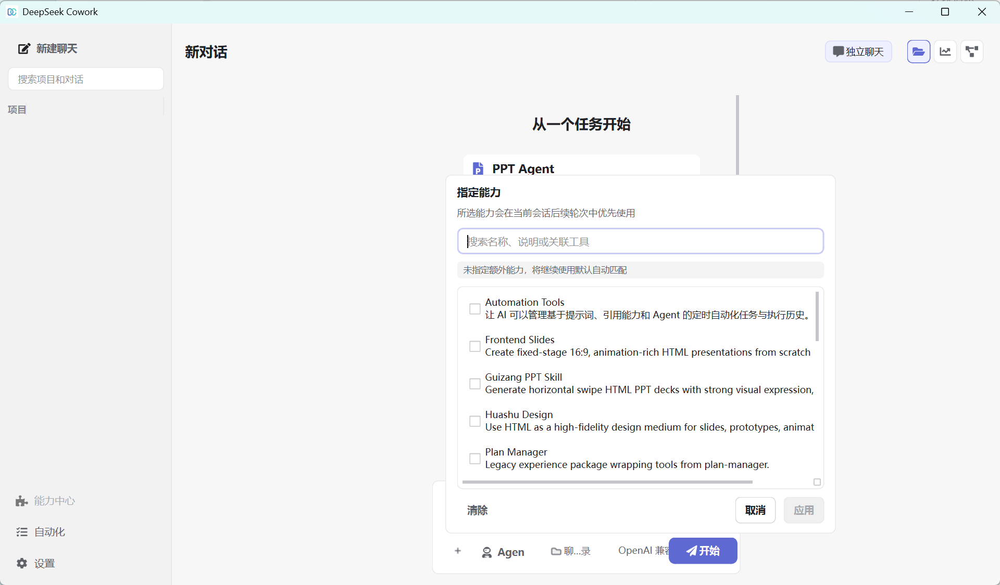

  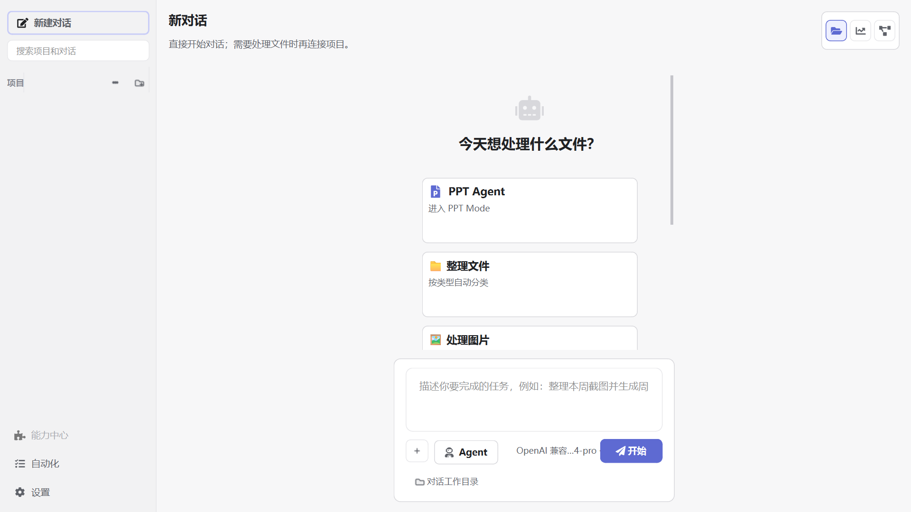

  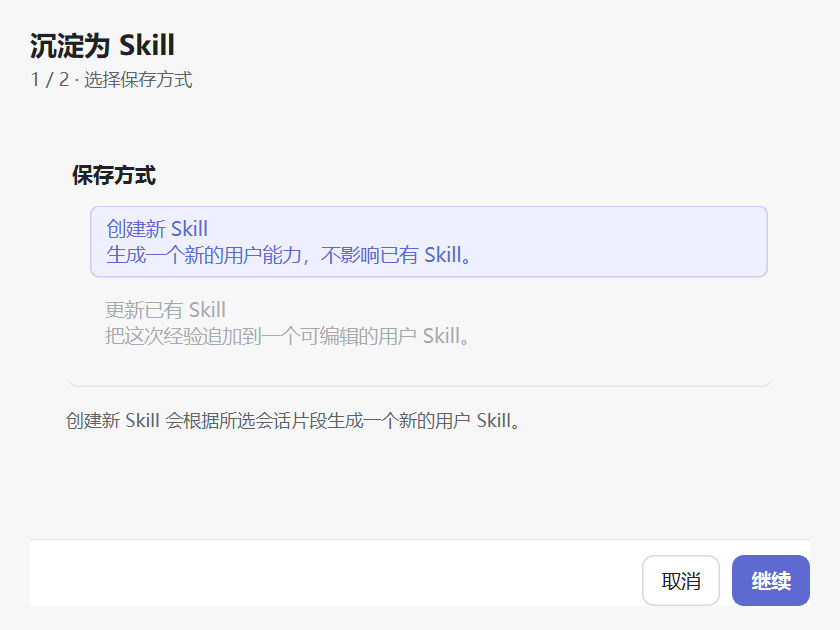

## 应用场景：生成可编辑的 PPTX

下面以“先对话形成内容，再从回复生成 PPT 工作稿并转换为 PPTX”为例，展示一个完整工作流。也可以直接从新会话首页的 **PPT Agent** 卡片，或输入工具栏 **Agent → PPT Agent** 打开内置 PPT Agent，填写需求、选择偏好，并附加资料或 PPTX 模板；PPT Agent 会先生成演示文稿形态 HTML 工作稿，再进入同一套预览和导出流程。

1. 选择一个文件夹作为当前项目。

   

2. 先让 AI 产出或整理一段适合做演示文稿的内容。确认这段回复可用后，在回复末尾点击 **生成办公稿**，类型选择 **PPT**。

   

3. AI 会基于这条回复在工作区中生成可预览工作稿。生成过程会默认折叠成任务卡；生成完成后，应用会把已识别到的真实交付物文件直接显示在任务卡下方，不需要展开过程也可以打开预览。办公交付流程会自动打开右侧 **文件与交付物** 抽屉，并直接进入最新交付物的专注预览。

   如果 AI 在回复中给出当前项目内的完整文件路径，也可以直接点击路径或消息末尾的文件卡片，系统会绕过列表直接打开预览；指向当前项目文件的 Markdown 链接同样支持。点击返回可回到原列表和原位置。普通工具后续生成文件时只会刷新列表并显示“新文件”提示，不会抢占当前预览；办公交付流程会打开自己的最新结果。同一个文件被修改后会保留当前内容并提示手动刷新。交付物支持 HTML、Markdown、图片、PDF、DOCX、PPTX 和 XLSX；DOCX/PPTX/XLSX 使用应用内结构化预览，不需要本机安装 Microsoft Office。旧版 DOC/PPT/XLS 暂不支持内置预览，可转换为新版格式后查看。

   

   

   交付物列表顶部的 **文件类型** 和 **排序** 是两个独立控件。类型后显示当前数量；排序支持最近/最早更新、名称正反序和文件大小正反序。筛选没有结果时可直接点击“清除筛选”。

4. 点击主界面的文件入口后，如果已有生成或标记的结果，会先看到紧凑的 **交付物** 列表，并可通过 **浏览工作区** 进入真实目录树；尚无交付物时会直接显示工作区。工作区文件可从右键菜单标记或取消标记为交付物。选择生成的 `.html` 文件后会下钻到预览与操作态，可在 **预览 / 源码** 间切换。预览区支持滚轮、触控板和可拖动的横纵滚动条。

   

   

5. 根据预览效果继续向 AI 提出修改要求，直到页面内容和视觉样式符合预期。

   > 选择 PPT 类型时，AI 会优先按幻灯片形态组织工作稿，例如 16:9 页面、按页拆分、标题层级和演示节奏。
   >
   > 使用 PPT Agent 时，系统会在默认 PPT Agent、Guizang PPT Skill、Frontend Slides、Huashu Design 这些 html-ppt 策略之间自动选择；无论选择哪一种，输出都会先作为 HTML 交付物预览，再继续生成 PPTX、DOCX 或 PDF。

6. 确认工作稿无误后，在底部“继续创作”栏点击 **生成文件…**，再选择 PPTX、DOCX 或 PDF。选择 PPTX 时使用 **选择模板 / 直接生成 / 取消** 三个唯一操作；生成任务会在原位显示目标格式、中文运行状态和取消入口，并阻止重复提交。

   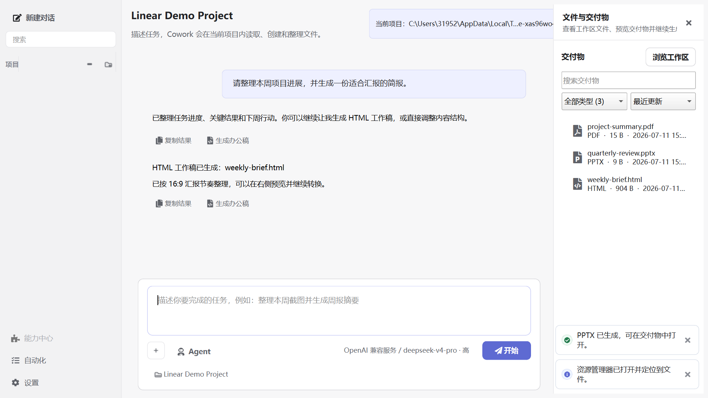

   

7. 在项目文件夹中找到生成的 `.pptx` 文件。

   

8. 使用 PowerPoint 或其他兼容软件打开文件，即可继续编辑文字、图表和页面布局。

   

完成以上步骤后，就可以继续探索文件处理、内容生成、自动化任务和其他工作流。
## 文字选择、技术详情与 Skill 草稿

在聊天消息、输入框或技术详情中拖动选择文字后，可以使用 `Ctrl+C`，或右键选择复制、复制全部和全选。输入框还支持撤销、重做、剪切与粘贴。

聊天记录右侧滚动条可直接按住滑块拖动。任务仍在输出时，手动拖动会暂停自动滚底；回到底部后自动跟随恢复。

打开“任务观测 → 技术详情”时，Python、Bash/Shell 代码会与其他参数分开显示。代码区域提供语言标识、行号、语法高亮和复制按钮；无法解析的参数会直接显示错误及原始内容。

沉淀会话为 Skill 后，草稿会留在原会话中。点击“查看并保存”可检查和编辑草稿；取消或保存失败不会丢失草稿。
