# DeepSeek Cowork 使用指南

本指南介绍 DeepSeek Cowork 的安装、模型配置、基础使用方式，以及如何从 AI 回复生成可编辑的 PPTX 文件。

> 当前界面截图基于 4.9.8 版本。后续版本的按钮位置或文案可能略有调整，请以实际界面为准。

## 目录

- [安装](#安装)
- [首次使用前的配置](#首次使用前的配置)
  - [配置大模型 API](#配置大模型-api)
  - [切换对话模型](#切换对话模型)
  - [更新应用](#更新应用)
- [开始使用](#开始使用)
  - [直接对话](#直接对话)
  - [基于文件夹对话](#基于文件夹对话)
- [应用场景：生成可编辑的 PPTX](#应用场景生成可编辑的-pptx)

## 安装

1. 打开项目的 [Releases 页面](https://github.com/chuancyzhang/deepseek-cowork/releases)。
2. 进入带有 **Latest** 标签的最新版本，下载 ZIP 压缩包。

   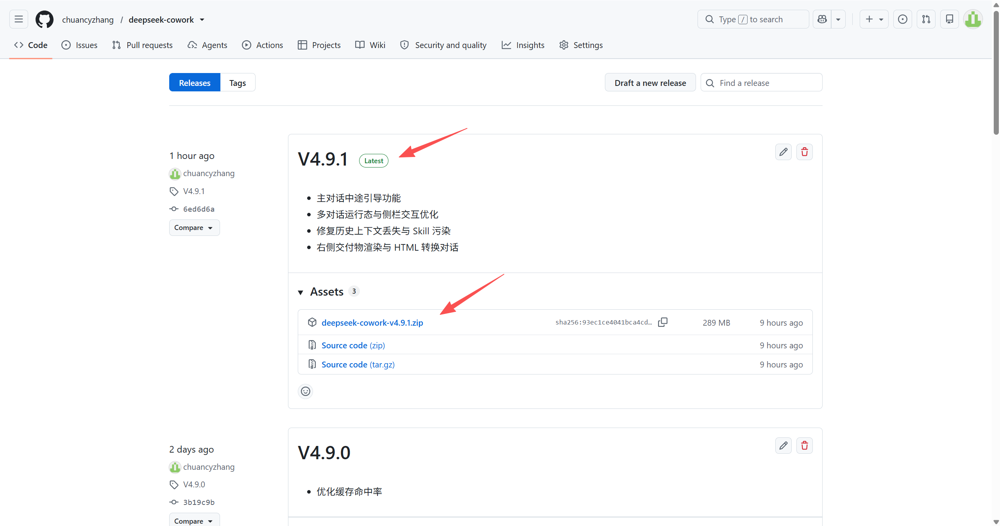

3. 将压缩包保存到合适的位置并解压，得到 `deepseek-cowork` 文件夹。

   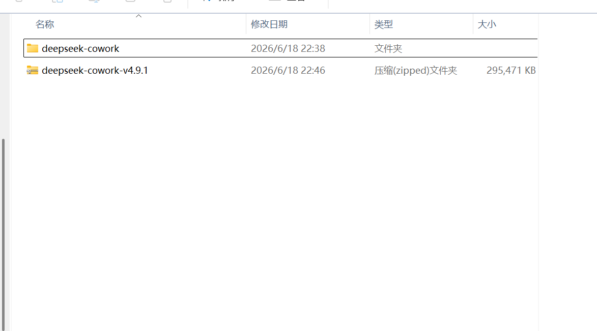

4. 打开文件夹，双击 `deepseek-cowork` 启动应用。

   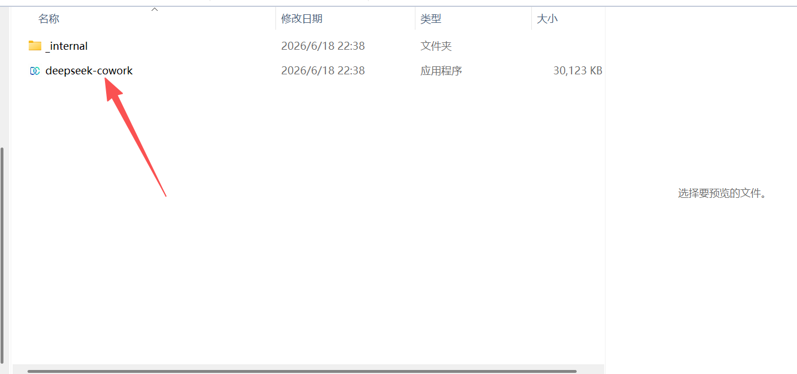

## 首次使用前的配置

启动后会进入 DeepSeek Cowork 主界面。

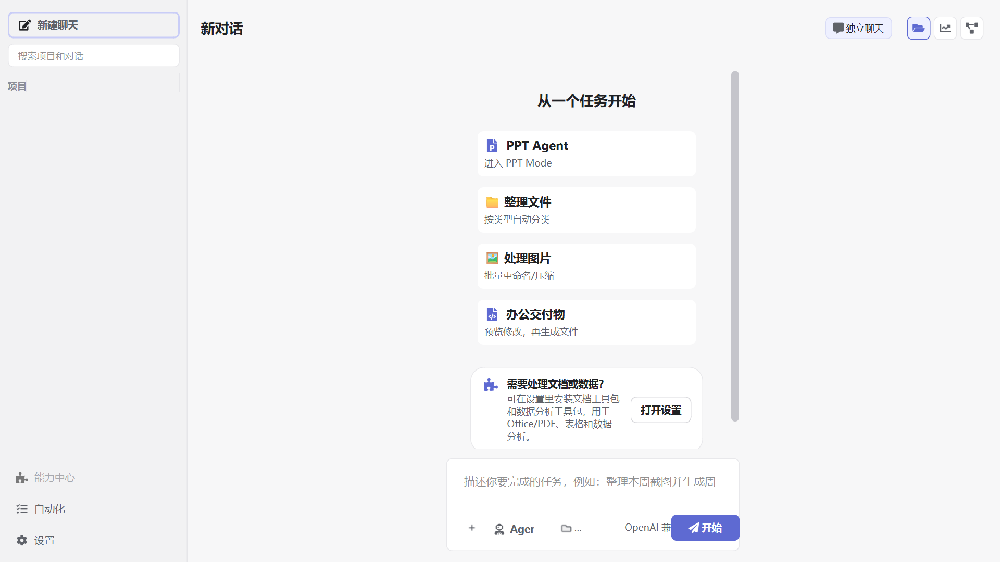

### 配置大模型 API

DeepSeek Cowork 需要配置可用的大模型 API 后才能正常执行任务。

1. 点击左下角的 **设置**。

   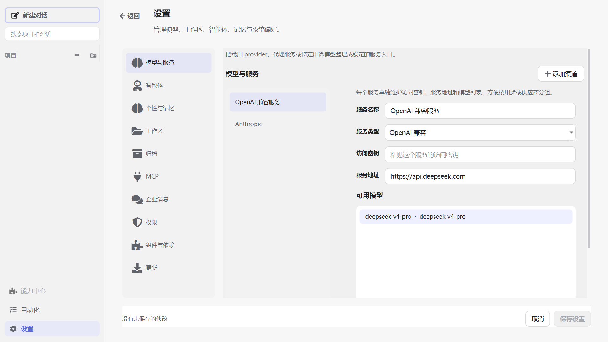

2. 进入 **模型与服务**，填写 API 服务地址与访问密钥。DeepSeek API 的访问密钥可前往 [DeepSeek 开放平台](https://platform.deepseek.com/) 获取。

   

3. 点击 **新增模型**。

   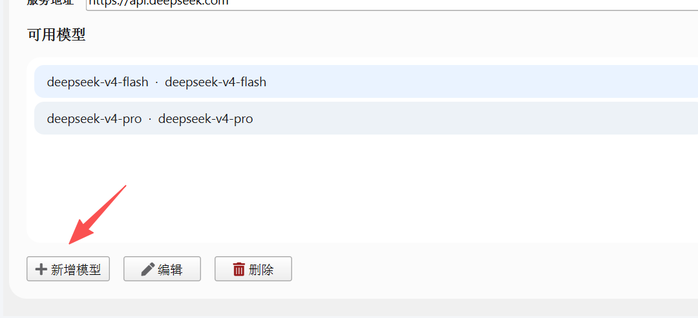

4. 填写模型配置并确认。示例中：

   - `deepseek-v4-flash` 对应快速模型；
   - `deepseek-v4-pro` 对应专家模式。

   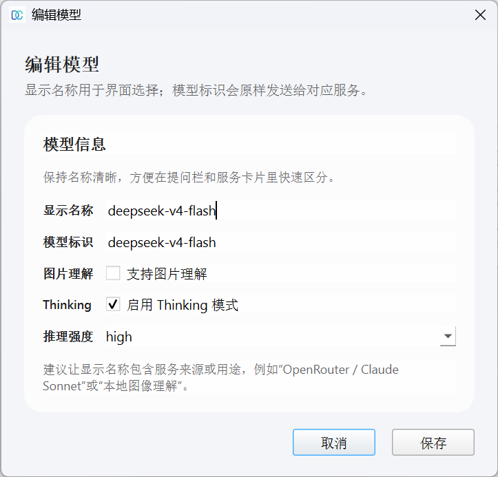

5. 配置完成后，点击 **保存**。

> 模型名称与可用能力可能随服务商调整。请以服务商当前提供的模型和项目内实际配置项为准。

### 切换对话模型

在主界面的对话输入区下方，可以选择并切换已经配置好的模型。模型选择按对话保存，含义是“当前对话下一轮使用的模型”：同一个对话运行完成后可以切换模型继续提问；如果任务正在运行，切换只影响下一轮，不会改变已经启动的模型流。

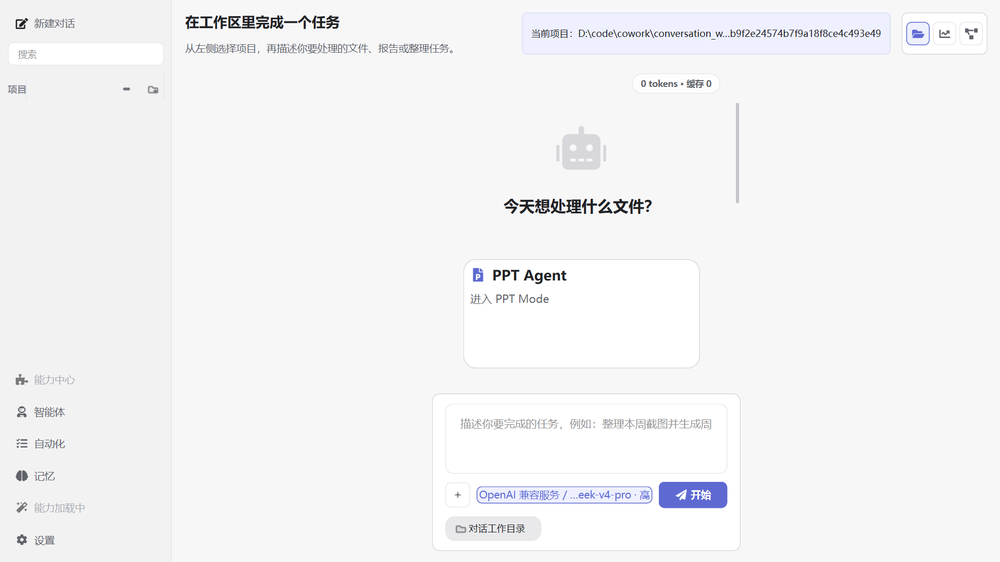

### 更新应用

进入 **设置 → 更新**，可以检查并安装 DeepSeek Cowork 的最新版本。

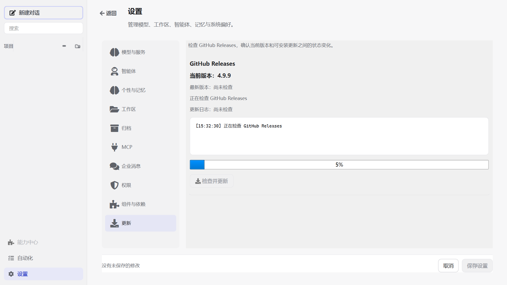

## 开始使用

DeepSeek Cowork 支持两种主要使用方式：

1. **直接对话**：不连接项目，但会自动使用一个独立的对话工作目录。
2. **基于文件夹对话**：连接本地文件夹作为项目，让 AI 在授权的工作区内读取和处理文件。

### 直接对话

未选择文件夹（项目）时，当前会话为直接对话。应用会在 exe 运行目录下自动创建 `conversation_workspaces/<session_id>/`，AI 的文件读取、创建和修改会限制在这个对话工作目录内，不会直接进入你的项目文件夹。

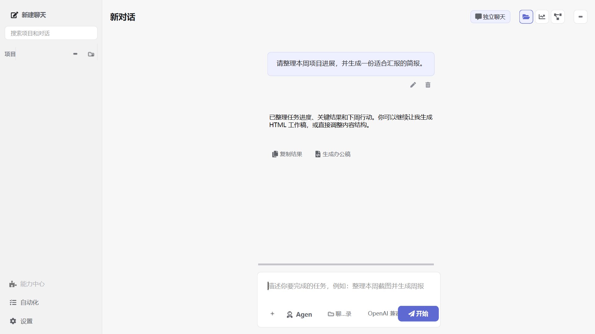

### 基于文件夹对话

可以通过以下方式连接项目：

- 点击左侧项目区域的 **+**，选择一个本地文件夹；

  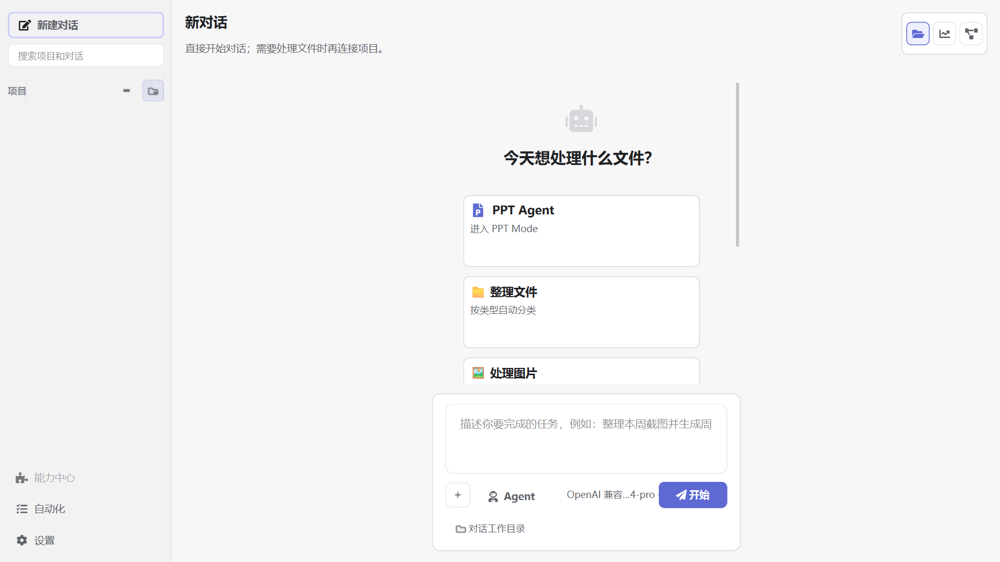

- 在尚未发送消息的空对话中，点击输入栏下方的项目选择器，搜索并选择已经加入的项目。
- 在项目选择器中点击 **添加新项目**，选择一个本地文件夹。

项目选择器是主界面唯一的项目连接入口。已有消息或正在运行任务的对话不能切换项目，需要新建空对话后再选择。

已加入的项目可以从左侧项目区域的菜单中在资源管理器里打开，方便直接查看该项目文件夹。也可以在同一菜单中归档项目；归档后项目会从左侧栏和项目选择器中隐藏，可在 **设置 → 归档** 中恢复。单个对话归档后同样会从左侧栏隐藏，并可在该页面恢复。

连接后，AI 会将该文件夹作为当前工作区，并在授权范围内读取、创建或修改文件。请在执行重要或批量操作前确认任务要求与目标路径。

## 应用场景：生成可编辑的 PPTX

下面以“先对话形成内容，再从回复生成 PPT 工作稿并转换为 PPTX”为例，展示一个完整工作流。也可以直接从新会话首页的 **PPT Agent** 卡片，或侧栏 **智能体 → PPT Agent** 打开内置 PPT Agent，填写需求、选择自动/网页演示/技术分享/高审美商业汇报/模板化办公 PPT 偏好，并附加资料或 PPTX 模板；PPT Agent 会先生成演示文稿形态 HTML 工作稿，再进入同一套预览和导出流程。

1. 选择一个文件夹作为当前项目。

   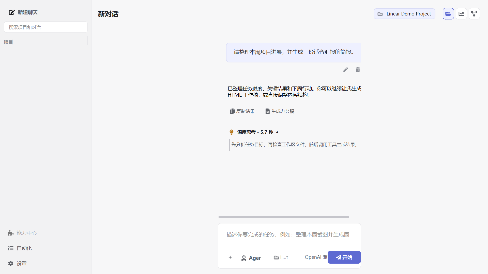

2. 先让 AI 产出或整理一段适合做演示文稿的内容。确认这段回复可用后，在回复末尾点击 **生成办公稿**，类型选择 **PPT**。

   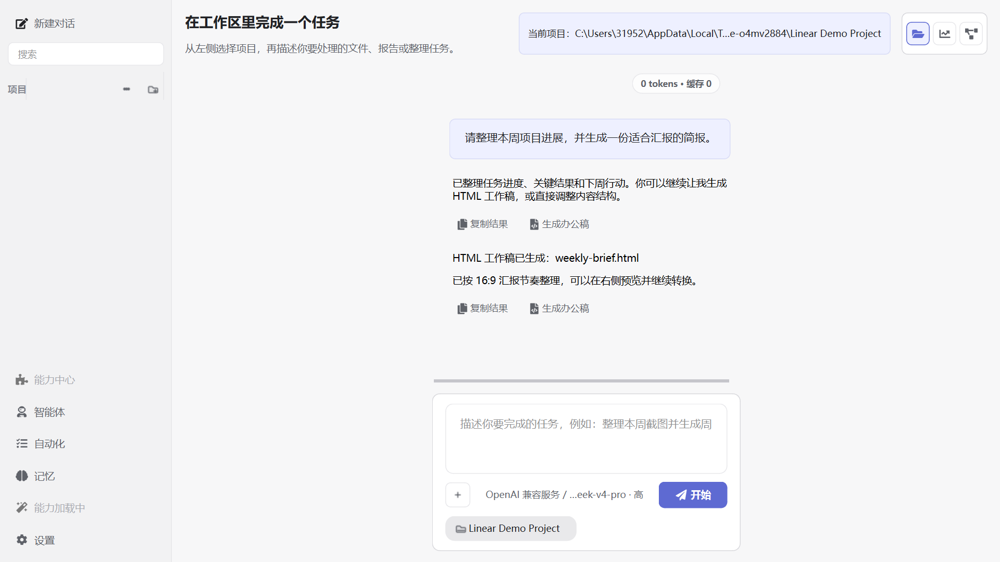

3. AI 会基于这条回复在工作区中生成可预览工作稿。生成过程会默认折叠成任务卡；生成完成后，应用会把已识别到的真实交付物文件直接显示在任务卡下方，不需要展开过程也可以打开预览。应用会自动打开右侧 **文件** 抽屉，并直接进入该交付物的专注预览。

   如果 AI 在回复中给出当前项目内的完整文件路径，也可以直接点击路径或消息末尾的文件卡片，系统会绕过列表直接打开预览；Markdown 链接格式也支持，例如 `[markDown1782479991213.pptx](</D:/项目/markDown1782479991213.pptx>)`。点击返回可回到交付物列表。保持交付物视图打开时，后续新生成的文件会自动切换预览，同一个文件被修改后则会提示手动刷新。交付物支持 HTML、Markdown、图片、PDF、DOCX、PPTX 和 XLSX；DOCX/PPTX/XLSX 使用应用内结构化预览，不需要本机安装 Microsoft Office。旧版 DOC/PPT/XLS 暂不支持内置预览，可转换为新版格式后查看。

   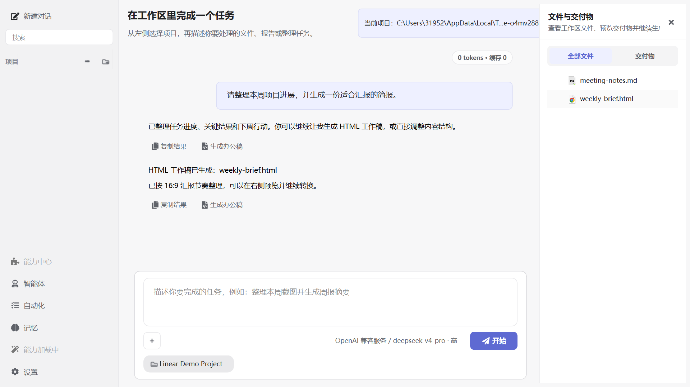

   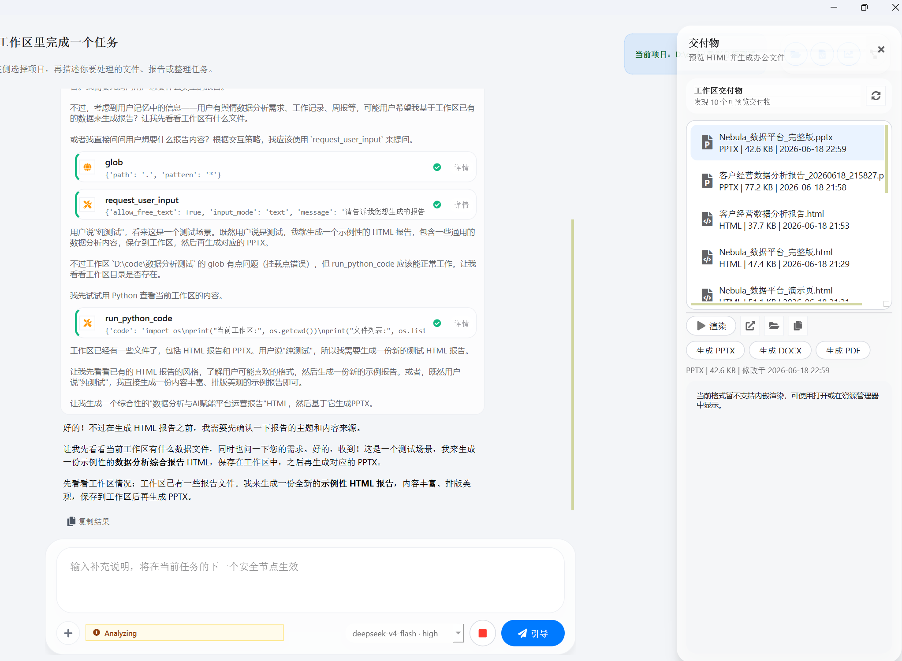

4. 在浏览态选择生成的 `.html` 文件后会下钻到预览与操作态。预览区支持滚轮、触控板和可拖动的横纵滚动条；响应式页面仅在内容确实超出当前宽度时显示横向滚动条。需要在独立浏览器中查看，或在资源管理器中定位该文件时，使用右上角更多菜单。

   

   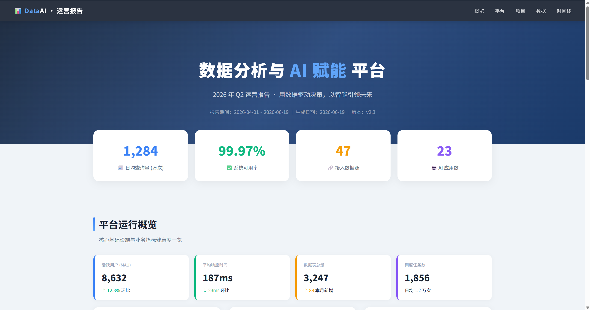

5. 根据预览效果继续向 AI 提出修改要求，直到页面内容和视觉样式符合预期。

   > 选择 PPT 类型时，AI 会优先按幻灯片形态组织工作稿，例如 16:9 页面、按页拆分、标题层级和演示节奏。
   >
   > 使用 PPT Agent 时，系统会在默认 PPT Agent、Guizang PPT Skill、Frontend Slides、Huashu Design 这些 html-ppt 策略之间自动选择；无论选择哪一种，输出都会先作为 HTML 交付物预览，再继续生成 PPTX、DOCX 或 PDF。

6. 确认工作稿无误后，在底部转化栏点击 **生成 PPTX**、**生成 DOCX** 或 **生成 PDF**。生成任务只会让对应按钮进入局部运行态，右侧抽屉仍可关闭或切换；完成后会通过 Toast 和交付物入口提示结果。如果已有公司或项目 PPT 模板，可点击 PPTX 旁边的模板按钮选择 `.pptx` 模板；AI 会以 HTML 为内容源，以模板为视觉结构源，尽量继承主题、母版、字号、色彩、版式节奏，以及模板顶部和底部的图片元素。

   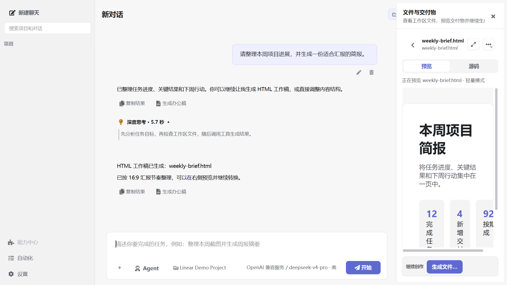

7. 在项目文件夹中找到生成的 `.pptx` 文件。

   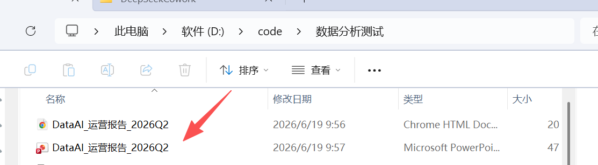

8. 使用 PowerPoint 或其他兼容软件打开文件，即可继续编辑文字、图表和页面布局。

   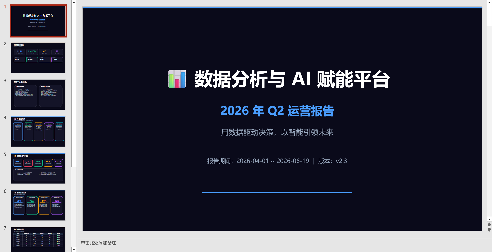

完成以上步骤后，就可以继续探索文件处理、内容生成、自动化任务和其他工作流。
