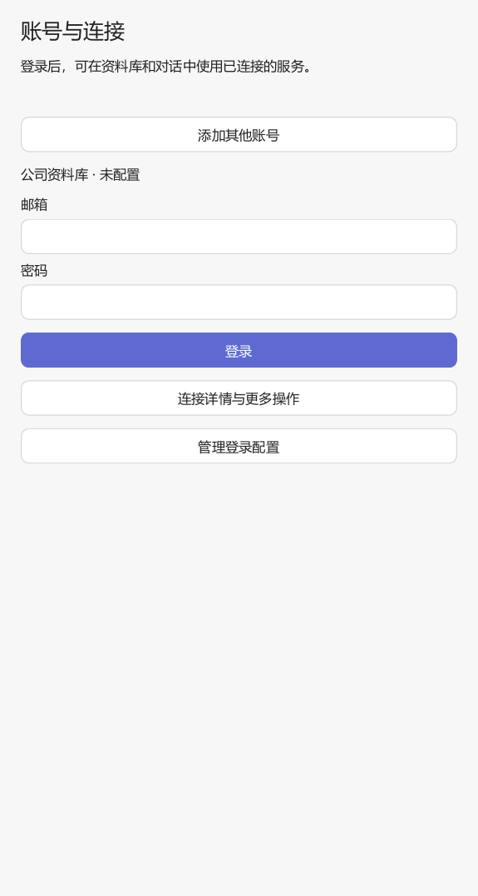
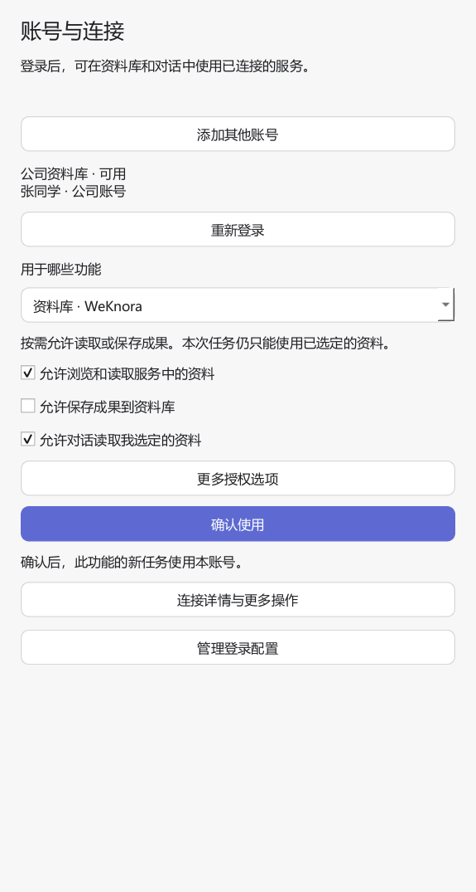

# 账号与连接

适用版本：**5.2.5**

账号与连接是可选功能。Cowork 不要求注册账号；未选择统一连接的模型、Skill、MCP、资料库和消息连接继续使用原配置。

## 普通用户

1. 打开“设置 → 账号与连接”，选择管理员预置的公司或服务，点击“添加账号”。
2. 完成服务要求的登录。公司统一登录会打开系统浏览器；密码、访问令牌及应用 Secret 在本机表单输入，不要发到对话中。
3. 查看账号是否“可用”。“已保存”表示凭据已保存，并不代表验证通过；服务地址、账号标识和检查时间在“连接详情与更多操作”中。
4. 登录成功后，选择用途并点击“确认使用”。资料库可同时允许对话读取选定资料，但每次任务仍受所选资料范围限制。
5. 回到原资料库或 MCP 入口工作。新任务使用已选择的连接，运行中的任务保留原连接。

登录前只显示所需登录输入。管理员配置、额外授权选项、断开和删除等操作按需展开。添加另一个账号使用“添加其他账号”；已登录账号点击“重新登录”才重新显示输入框。Tab 可依次进入账号、密码和登录按钮，填写后可按 Enter 登录。

资料库页面按原服务权限浏览；“更多授权选项”可用资料库 ID 进一步限定对话的读取范围。MCP 调用仍受 Cowork 执行权限及远端系统权限约束。操作授权不是对远端系统权限的扩充。

以下为隔离测试数据的界面示例，产品体验由用户验收：





只有已登录并验证的连接能被选用。通用 API Key 模板需要服务支持的验证地址；未填写验证地址时显示“已保存 · 尚未验证”。LDAP 目录登录只确认目录身份，不能直接作为业务 API 凭据。

## 原配置与统一连接

原配置不会自动迁移、删除或替换。选择统一连接失败时，原有使用模式保留。统一连接在运行中失败时，不会自动使用原密码、其他账号或其他服务。

“切回原有配置”只改变后续任务的默认模式。原配置仍需有效；已绑定统一连接的任务继续使用原绑定。Superset 选择统一连接后，无需在 Skill 配置中再次填写用户名密码；旧配置保持保存。

资料库提供“管理账号与连接”入口。若旧配置与新连接的来源、服务实例、用户及组织完全一致，可勾选“沿用原有资料引用”；该操作不移动文档或改写已选资料。否则需要重新选择资料。腾讯文档当前接口不能可靠确认两次授权属于同一账号，因此重新授权按新身份处理。

## 认证失效与恢复

支持刷新的连接会尝试一次认证恢复。需要人工认证时，任务显示“等待认证”，已经显示的消息及成果保留。到账号与连接重新认证，再返回对应任务选择“已完成认证，继续”；也可以取消。

认证等待最多保持 24 小时，不会在超时后自动选择继续。停止、取消、撤销授权和注销后，迟到的登录回调不能恢复已取消操作。后台进程仍在运行时可重新连接原任务；进程已退出时仅保留等待记录和历史，不自动重放操作。

权限拒绝不会反复要求登录。结果无法确认的写操作不会自动重试，应先在原服务核对结果。撤销某个能力的授权只阻止该能力后续访问；断开连接影响所有使用它的能力；退出关联账号会先列出受影响的本机连接。远端已完成的操作不会被撤回。

## 管理员预配置与分发

程序旁的 `connection_templates.json` 只保存公开配置。修改该文件后可直接分发，不需要把每个用户的登录配置写进 `config.json`。默认发行模板为空，不会在用户未选择服务时访问认证平台。

参考 [完整模板示例](examples/connection_templates.json)，替换示例域名、公司和公开客户端标识。不要分发示例中的占位地址作为可用服务。

模板字段：

| 字段 | 用途 |
| --- | --- |
| `id` / `version` | 稳定标识与递增整数版本 |
| `name` / `company` | 用户看到的服务及公司名称 |
| `service` | 与接入能力匹配的服务类型 |
| `base_url` | 获准业务目标地址，LDAP 目录模板不使用 |
| `adapter` / `parameters` | 受支持的认证方式和声明式参数 |
| `suggested_capabilities` | 建议关联能力，不等于已授权 |
| `locked` | 分发方锁定模板，禁止本机覆盖 |

安装后展开“管理登录配置”可导入、导出，或通过“高级：编辑登录参数”管理模板。用户模板保存在应用数据目录的 `connection_templates.local.json`。同 ID 更新必须明确确认且版本更高；分发与本机出现同版本不同内容时，该模板暂停加载，需移除冲突的本机配置或导入明确的新版本。企业锁定模板不能由本机模板覆盖，但用户可以退出登录。

现有连接保存创建时的模板快照。更新分发模板不会改变已登录账号、访问地址或运行任务；需要采用新目标时，添加新连接、验证并明确切换。导出只导出模板，不包含账号、凭据或能力授权。

### 认证方式

| adapter | 用户入口与接入条件 |
| --- | --- |
| `api_key` | 本机令牌表单；配置 `header`、`prefix`、`verify_url`，可指定顶层响应身份字段 `identity_field` 和组织字段 `tenant_field` |
| `weknora` | 邮箱密码登录，保存服务令牌及刷新令牌 |
| `superset` | 用户名密码；`provider` 支持 `db`、`ldap`；`mcp_url` 明确指定允许接收 Superset JWT 的 MCP 地址 |
| `oauth2` | 系统浏览器授权码 + PKCE；支持手工端点或发现、刷新、Device Authorization、Client Credentials |
| `ldap` | LDAPS/StartTLS；填写目录及查询参数，校验证书，账号密码留在本机表单，认证完成后不保存目录密码 |
| `wecom_member` | 企业受信后端提供的 OIDC 登录，后端完成企业微信成员扫码与机密交换 |
| `wecom_app` | CorpID / AgentID 预置，用户在本机输入自建应用 Secret；独立保存应用身份 |
| `tencent_docs` | 系统浏览器授权，完成后返回确认；使用现有腾讯文档协议 |
| `lexiang` | 预置企业代码，本机输入 Token，验证企业及用户一致性 |

OAuth 原生客户端使用公开 `client_id`，不分发 `client_secret`。`redirect_port: 0` 使用随机本机端口；平台只接受固定端口时配置其注册端口，回调路径固定为 `/callback`，监听地址为 `127.0.0.1`。网络认证端点使用 HTTPS，只有本机开发服务允许 HTTP。

Device Authorization 使用 `flow: "device_code"`，需提供或发现设备授权端点。应用身份使用 `flow: "client_credentials"`，Secret 由每个安装实例输入并加密保存。公开桌面应用不承担企业机密客户端职责。

### 企业微信成员登录的后端契约

`wecom_member` 对接企业自有、支持 Authorization Code + PKCE S256 的 OIDC 后端。后端应提供 issuer、授权/令牌/JWKS 端点，签名 ID Token 包含稳定成员 `sub`、客户端 `aud`、有效期、`nonce` 和可配置组织声明（默认 `tid`）。需要刷新时发放 Refresh Token。

企业后端负责企业微信官方回调、授权码交换、成员校验、Secret 和平台要求的域名/IP 配置。Cowork 校验后端签名身份；业务访问令牌必须面向模板声明的业务服务。企业微信应用令牌与成员身份不混用。

同一浏览器中的企业登录状态可供多个 OIDC 授权流程复用；每个服务分别取得其受众和 scope 的凭据。WeKnora、Superset 等独立账号不会因公司账号登录成功而自动连通。非标准凭据交换需要明确的服务适配器，不能用模板编排任意请求链。

## 能力接入

`connection_requirements` 是宿主元数据，不附加到模型提示词或工具参数。每项包含 `id`、`service`、`auth`（`none` / `optional` / `required`）、`operations`、可选 `resources` 和 `delivery`（`host` / `mcp_headers`）。声明不等于授权，未接入旧能力不受该字段影响。

宿主实现通过 `_context["connections"].request(requirement_id, operation, method, url, resources=...)` 发起请求。宿主按运行身份绑定连接，检查操作、资源和目标，注入认证并脱敏响应。实现不能把连接凭据放入普通工具参数，也不获得读取凭据库的接口。

操作标识由接入实现定义：资料库使用 `read` / `write`，MCP 使用 `discover` / `call`。管理员为其他能力配置授权时，应使用其声明中的需求 ID、操作及资源标识。

参见 [最小接入样例](../examples/connection-plugin/impl.py) 和 [能力声明](../examples/connection-plugin/skill.json)。样例默认不安装、不启用；适配时修改固定业务读取地址，并在管理页明确授权能力 ID `connection-example`。该契约可用于后续插件，不要求建立另一套账号库。

远程 MCP 使用选定连接认证 MCP 入口；不自动透传到其后端业务系统。本地任意脚本/stdio MCP 暂不交付原始凭据，需提供明确的宿主请求适配；原有环境变量配置保持可用。资料库保留已有的文档范围检查，通用资源授权使用显式资源 ID 集合，不声称能约束任意远端工具内部行为。

## 源码与发行包

账号连接库延迟加载。普通功能可在未安装认证依赖时启动；使用 OAuth/OIDC 或 LDAP 前安装可选依赖：

```powershell
.venv/Scripts/python.exe -m pip install -r requirements-connections.txt
```

构建完整认证发行包前也执行上述命令，再使用 README 中现有的 PyInstaller 和 `package_release.py` 流程。构建会把公开模板复制到可执行文件旁；发布审计拒绝无效/含凭据字段的模板，以及本机连接数据库和用户数据。

## 验证边界（账号连接实现阶段记录）

自动化验证包含本机 HTTP OAuth 授权码/PKCE/刷新、签名 OIDC 身份校验、跨进程刷新、任务隔离、取消恢复、凭据脱敏及原功能回归。LDAP 和企业微信协议分支使用受控测试。

当前没有企业认证平台、LDAP 目录及企业微信真实测试租户。企业单点登录、成员扫码、企业回调和跨业务系统凭据交换仍需管理员提供环境进行实网联调；本机测试不代替真实企业验收。

以下保留账号连接实现阶段的技术验证，不表示本次文档同步重新执行了这些测试：连接相关 68 项测试通过；现有资料库、运行授权、设置页及后台交互的针对性回归通过。旧配置默认模型名称的 3 项、Skill 执行授权上下文的 4 项和旧打包夹具的 2 项失败，已用 HEAD 对应实现复现，未作为本次新增功能通过项。完整构建检查按用户要求停止，未生成可交付发行包；产品体验由用户验收。
