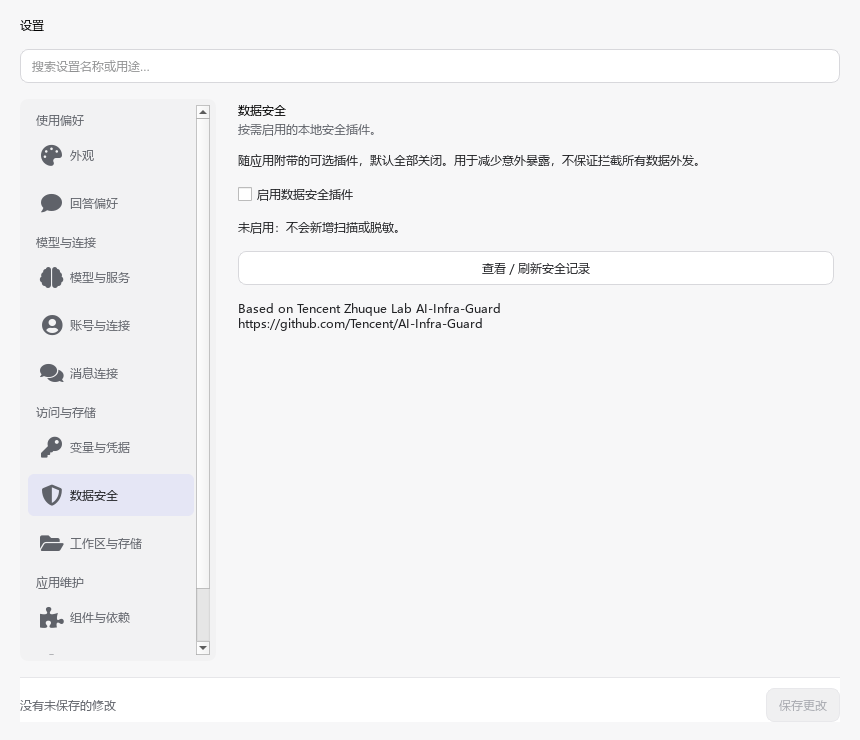
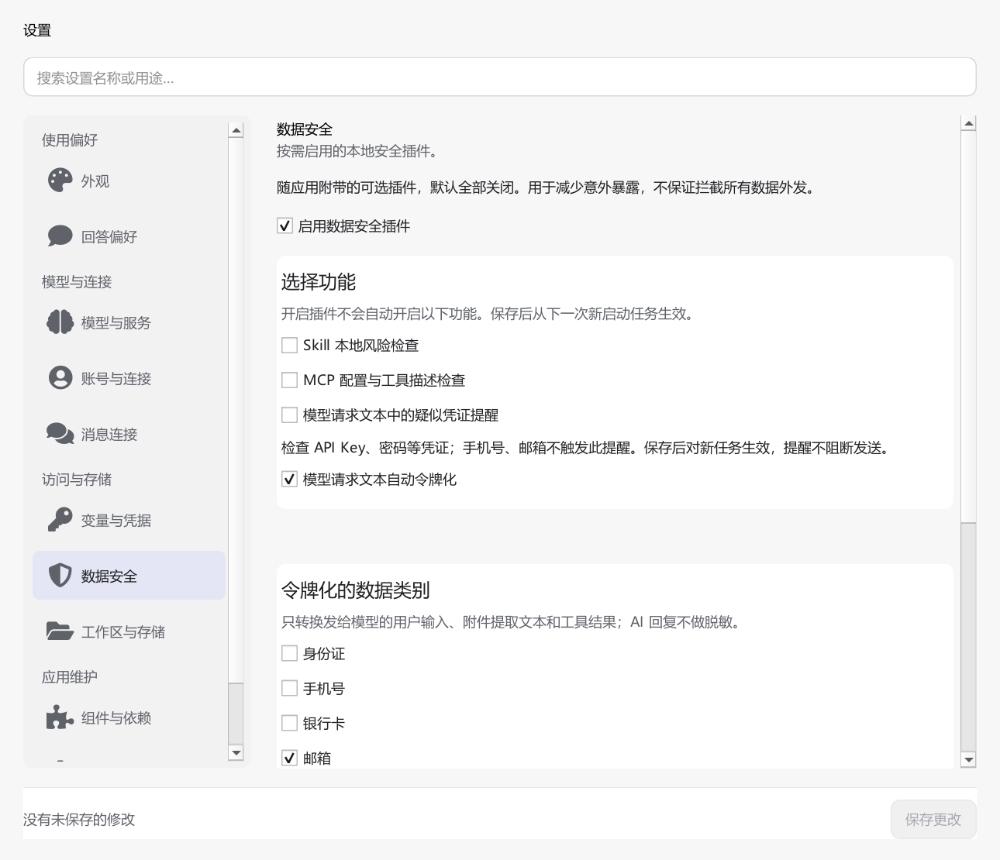

# 可选数据安全插件

适用版本：**5.2.5**

数据安全随应用附带，在“设置 → 数据安全”中按需启用。新装、升级和配置缺失时，插件、四项功能和八类数据开关全部关闭。目标是减少意外暴露，不承诺完全防泄漏。

## 开启与保存

1. 打开“设置 → 数据安全”，勾选“启用数据安全插件”。此时不会自动开启其他功能。
2. 只勾选需要的功能。启用自动令牌化时，至少主动选择一种数据类别，否则页面提示并保留输入。
3. 点击设置页统一的“保存更改”。保存失败保留草稿；离开未保存设置沿用统一确认。

配置在每次任务启动时冻结，修改影响后续任务；正在运行的任务及其子 Agent 继续使用原策略。关闭插件停止新任务的安全处理，保留已有映射和事件。

未选择类别时，保存会定位到醒目的类别提示。凭证提醒针对 API Key、密码等，不因手机号或邮箱触发；命中后在对话中显示提示，不覆盖消息保存错误。

[未选择类别时的提示截图](images/data-security/validation.png)

## 选择功能

| 功能 | 行为 |
| --- | --- |
| Skill 本地风险检查 | 安装、更新后后台只读检查文本；不执行代码、不额外安装依赖、不改变启用权限 |
| MCP 配置与工具描述检查 | 保存配置或正常连接取得描述后检查；不额外启动服务或调用工具 |
| 疑似凭证提醒 | 异步检查模型请求的用户和工具文本，只提醒；提醒到达时请求可能已经发送 |
| 模型请求文本自动令牌化 | 将选中类别的候选值替换为会话内稳定的占位符，再发送请求副本 |

可选类别包括身份证、手机号、银行卡、邮箱、固定电话、护照号、统一社会信用代码、IP。识别采用格式、适用校验位和必要上下文；固定电话、护照号需要对应文字提示。识别可能漏报或误报，凭证不进入普通个人信息令牌化。

“检查中”“未发现明显风险”“发现风险线索”“检查未完成”表示检查状态，不是安全认证。网络和命令执行本身不代表恶意。能力详情就近展示最近检查状态；完整范围、文件行号与错误类型在“查看／刷新安全记录”中。可取消后台检查，或按已保存配置重新检查本次应用运行中最近的能力。应用启动时不全盘扫描。

## 哪些内容会发送给模型

| 内容 | 启用令牌化且选中相关类别后的处理 |
| --- | --- |
| 手输、粘贴、追加、编辑重发及历史用户消息 | 转换发送副本，本地原文保留 |
| 附件实际提取并发送的文本 | 在原有附件展开后转换；不额外解析整份 Office/PDF |
| 工具返回给模型的文本 | 转换发送副本，不修改原文件和本地工具结果 |
| AI 回复及历史助手消息 | 不识别、不脱敏；只在显示时还原本会话已有令牌 |
| 系统指令、工具定义及顺序、鉴权、图片、协议原生回放 | 保持原样 |

接入应用自有对话、记忆整理和 Skill 生成的文本请求。第三方脚本、MCP、HTTP、浏览器和子进程内部自行发起的外发不受此插件全面控制。

## 工具执行与失败恢复

受支持的应用内置工具只在明确允许的结构化路径、URL 字段中还原已知令牌，再经过原有授权和执行记录检查。不会在 Shell、代码、SQL、补丁或第三方工具参数中盲目替换。

如果工具参数需要原文，该批工具先完整记录为“未执行”，并向模型提供本会话已知令牌对应的原值参考，然后从原始上下文重新生成，最多切换一次，本轮后续保持原文。此前已经完成的操作不重放。再次出现无法还原的占位符时不会执行这些参数，解释性结果会保存，界面说明原因并保留消息和成果。未知或其他会话的令牌不猜测还原。

插件加载、映射保存或文本转换失败时，丢弃未完成的请求转换，提示“本次未脱敏，已按设置使用原文”。检查失败不会修改能力权限。日志写入失败不影响任务。正常鉴权始终保持原样。

## 本地保存与性能边界

- 映射按会话隔离，采用 Windows DPAPI 加密保存于应用数据目录的 `data_security/mappings.sqlite3`；子 Agent 明确继承所属会话。重试、重新打开会话复用映射，删除会话时清理；映射数据库不会随聊天导出携带。
- 保存模型原始回复及显示副本，关闭插件后历史仍可阅读。聊天原文本来就保存在本地，导出不是匿名化导出；请按原有聊天记录的敏感程度处理。
- 未启用或没有选中任何功能时，不加载检测引擎、不启动扫描线程、不计算内容摘要、不创建安全数据库。已有令牌兼容还原独立于识别引擎。
- Skill 单文件读取上限 512 KiB、单任务 8 MiB、时间预算 2 秒；MCP 元数据总文本上限 512 KiB。超限、二进制、无法解码、无法读取和取消的部分都标记为未完成。每次最多保留 200 条风险线索。
- 后台检查并发为 1，队列有上限；内容与规则版本缓存只复用检查结果，不在启动时遍历能力目录。请求转换缓存限制为 8 MiB / 512 项。
- 单次请求新增待转换文本上限 2 MiB、单会话映射上限 10,000 个值。达到限制时使用可见的原文继续机制，避免无限工作或破坏正常任务。
- 安全事件异步保存，仅记录状态、类别计数、对象及文件位置、错误类型；不记录扫描片段、映射、密钥或 URL 查询参数。事件日志约 512 KiB 滚动，保留一个历史文件，队列最多 128 条。
- 固定系统前缀、工具顺序与缓存键不变。开启或改变令牌化策略会改变用户/工具文本的历史前缀，可能影响模型缓存；稳定策略下复用令牌与转换结果。

实测性能与源码回归见[验证记录](data-security-validation.md)。这些本地基准不代表所有数据分布和机器的耗时，也不保证启用匿名化后所有分析任务语义等价。

操作总览见[用户指南](user-guide.md#23-调整外观和常用设置)；执行许可仍由[上帝模式与按次授权](GOD_MODE.md)控制，账号认证见[账号与连接](account-connections.md)。

## 规则来源

风险分类及候选模式参考 Tencent Zhuque Lab 的 [AI-Infra-Guard](https://github.com/Tencent/AI-Infra-Guard)，本地参考提交 `30f421257c3d1f0ce0a50b32e8f75dc0a3180773`。保留随包来源声明及 Apache-2.0 许可证；未引入完整审计包、Docker、常驻服务或多轮模型扫描。
