# AI 主题与 Visualize：普通用户指南

适用版本：**5.2.0**

这两项能力解决不同问题：AI 主题改变 Cowork 的工作界面，Visualize 把适合探索
的回答变成可操作视图。它们可以单独使用，也可以搭配使用。

| 能力 | 改变什么 | 不改变什么 |
| --- | --- | --- |
| AI 主题 | 应用字体、颜色、密度、工作区背景、受控组件和白名单文案 | 按钮动作、文件内容、交付物语义和系统窗口行为 |
| Visualize | 当前回答的筛选、比较、参数尝试和细节浏览方式 | 原始文件、应用主题和未授权的外部操作 |

## 1. AI 主题：先预览，再决定是否保存

### 1.1 主题能调整什么

一款主题可以统一调整字体比例、文字层级、强调色、圆角、留白、滚动条、左右栏、
聊天区、输入区和新对话首页。工作区背景可以是纯色、静态图片、GIF、动态 WebP，
或受控的条纹、网格、点阵和噪点。

进入“设置 → 外观”即可查看主题。Cowork 自带的默认浅色主题是只读安全基线，
不能覆盖或删除。

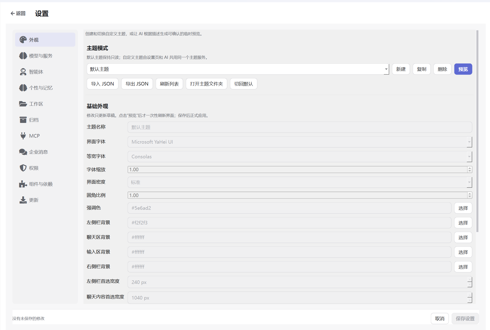

*设置 → 外观：主题选择与编辑入口*

### 1.2 手动调整的正确顺序

1. 从默认主题新建，或复制已有自定义主题。
2. 修改字体、字号、密度、圆角、强调色和主要区域材质。
3. 需要图片时导入本地 PNG、JPEG、GIF 或 WebP。GIF 和动态 WebP 仅能作为统一工作区背景；不接受 SVG、APNG、网络地址或可执行内容。
4. 点击“预览”，一次性检查整套草稿。
5. 满意后点击设置中心统一“保存”；放弃则恢复进入设置前的主题。

选择主题或编辑字段只改变草稿，不会频繁刷新整个界面。

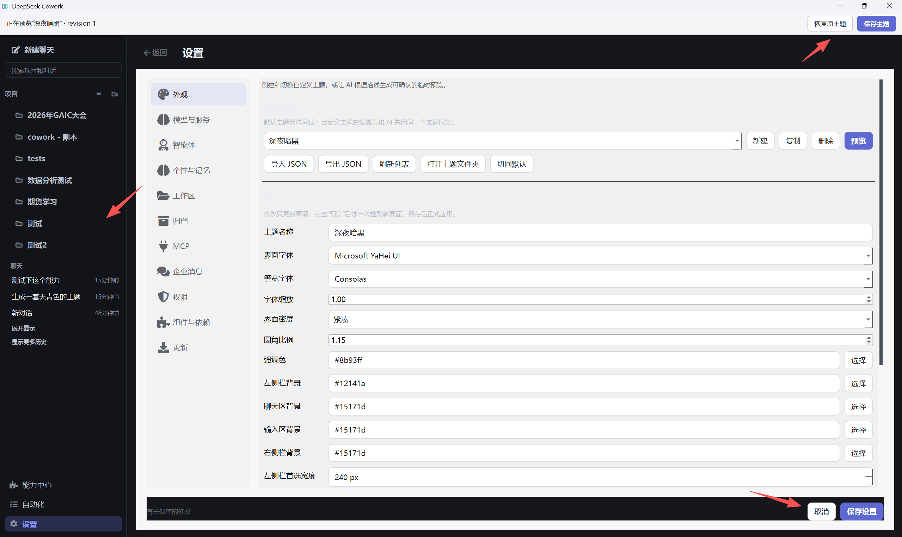

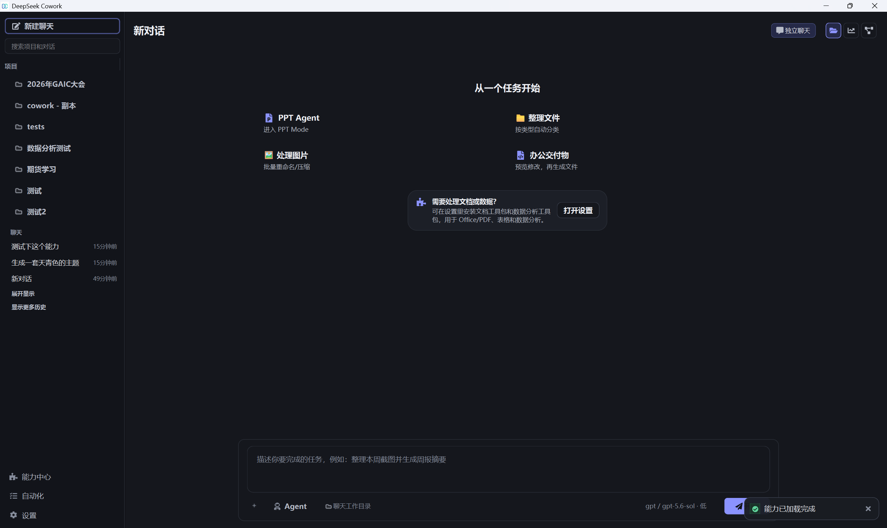

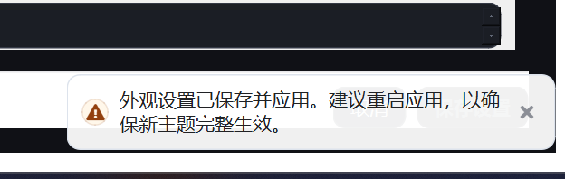

*手动主题流程：编辑草稿、预览、保存或放弃*

保存后若应用提示重启，按提示重启一次，以便所有页面重新载入当前主题。

### 1.3 让 AI 设计主题

在输入区点击“+ → 指定能力”，搜索并选择 Theme Customizer，然后用日常语言
说明使用环境、明暗偏好、字体大小、密度、背景和最在意的区域。
也可以在空白新会话首页点击“用 AI 设计主题”：Cowork 会在首次发送前选中
Theme Customizer 并填入一段安全的主题需求草稿，但不会替你发送或保存主题。

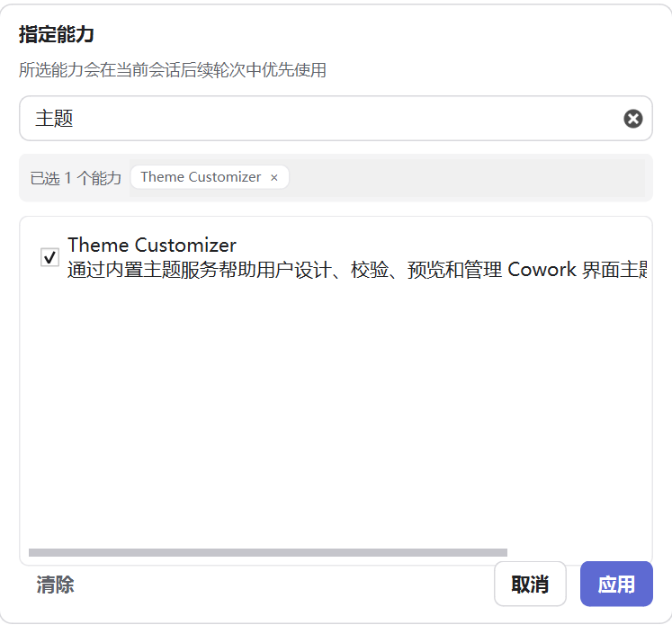

可以直接这样说：

> 生成一套天青色主题。聊天区使用细网格，正文比默认大一级，整体紧凑；新对话
> 首页更像专注工作台，隐藏数据分析卡片，但保留其他入口。先预览，不要直接保存。

AI 会读取可配置边界、生成草稿、校验内容并创建临时预览。之后可以继续说
“强调色更克制”“输入区和聊天区区分更明显”。每次补丁都会产生新 revision，
只有你实际看过并确认的版本能够保存。

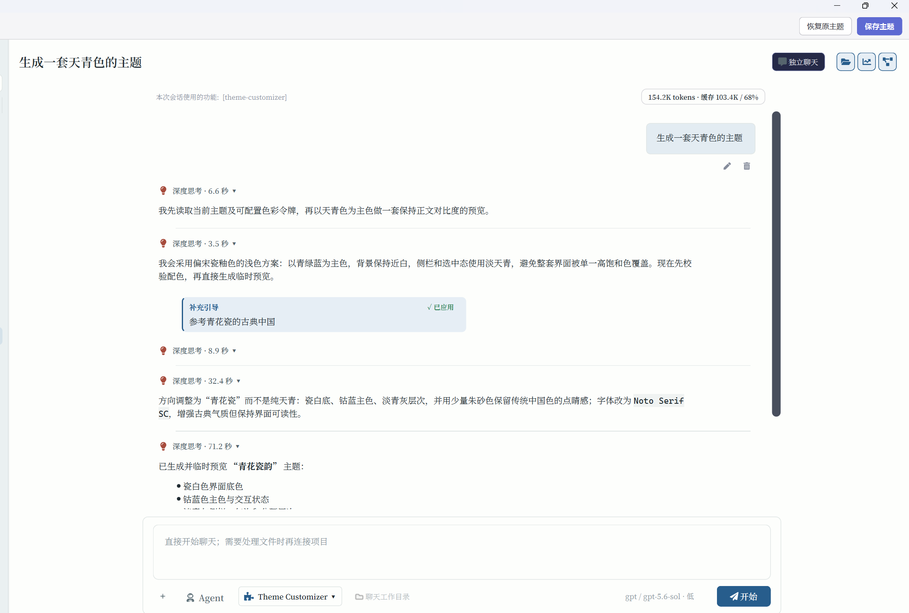

*在对话中生成并迭代隔离主题预览*

### 1.4 安全边界

主题可以在原区域内调整或隐藏非关键展示组件，但不能：

- 改变按钮含义、路由、信号或 Tool 权限；
- 跨越左/中/右区域重排组件树；
- 隐藏窗口控制、新建聊天、设置、输入框、主要提交按钮或安全恢复条；
- 注入任意 QSS、脚本动画、SVG、网络资源或可执行内容；
- 把 GIF 或动态 WebP 用作组件图标，或导入 APNG；
- 修改 PDF、Office、HTML、图片等交付物内容。

首页卡片可以改变展示文案、图标、样式、位置或可见性，但预填提示词、PPT 助手模式、
金融/数据/浏览器能力的加载条件和“打开设置”行为由代码固定。

AI 预览期间，窗口顶部保留不受主题影响的安全恢复条。预览使用
`preview_id + revision`；未保存预览不会跨应用重启，取消或应用失败都会恢复
已保存主题。

> 图片边界：主题流程不会调用图片模型。需要写实背景时，请先提供现有本地图片；
> 没有可用资产会明确报错。

## 2. Visualize：把答案变成可探索视图

### 2.1 什么时候值得使用

Visualize 适合需要反复切换条件、比较候选、拖动参数或逐层查看细节的问题：

- 按预算、时间和偏好比较方案；
- 把表格变成可筛选图表与详情面板；
- 调整输入，观察成本、收益或结果变化；
- 用可点击步骤解释流程；
- 快速预览页面、工具或交互方案。

短结论、一次性说明和简单列表继续使用普通文本更高效。

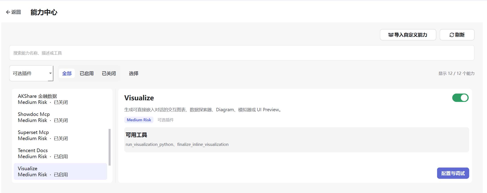

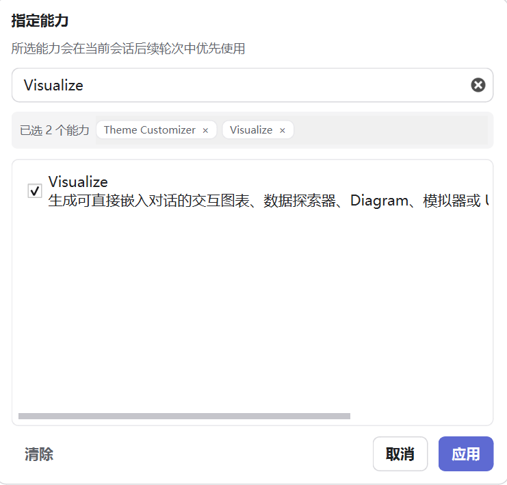

*在 AI 能力商城中找到并开启 Visualize*

### 2.2 开始使用

1. 在 AI 能力商城开启 Visualize。
2. 说明要探索的目标、允许调整的条件和最重要的结果。
3. 在生成的卡片中点击、筛选或拖动参数。
4. 像修改普通回答一样继续要求 AI 调整信息量、筛选项或视觉层级。

示例：

> 输出一份新疆家庭旅行方案，并做成交互对比器。可按预算、天数和是否带孩子
> 筛选；左侧显示符合条件的方案，右侧显示费用构成、行程节奏和注意事项。

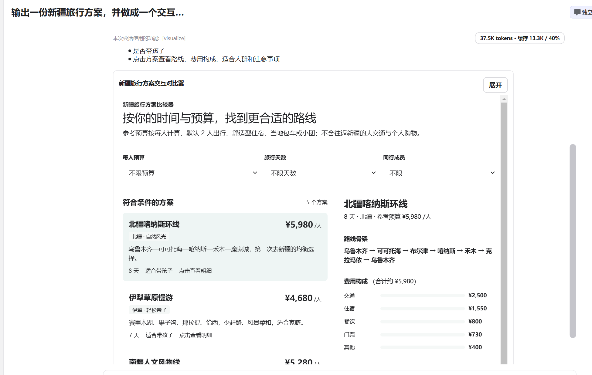

*Visualize 结果直接嵌入当前对话*

### 2.3 一个简单判断方法

如果你会继续追问“换一个条件会怎样”“只看这一类可以吗”“能点开看详情吗”，
通常适合 Visualize。例如家庭预算、商品比较、项目计划、学习工具和分层数据浏览。

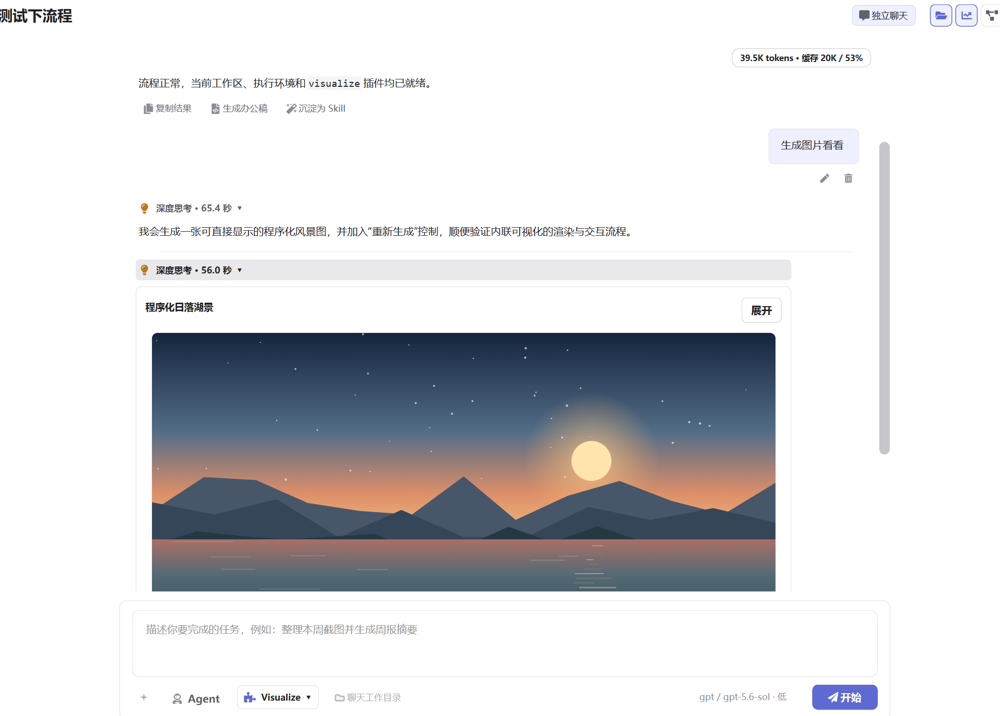

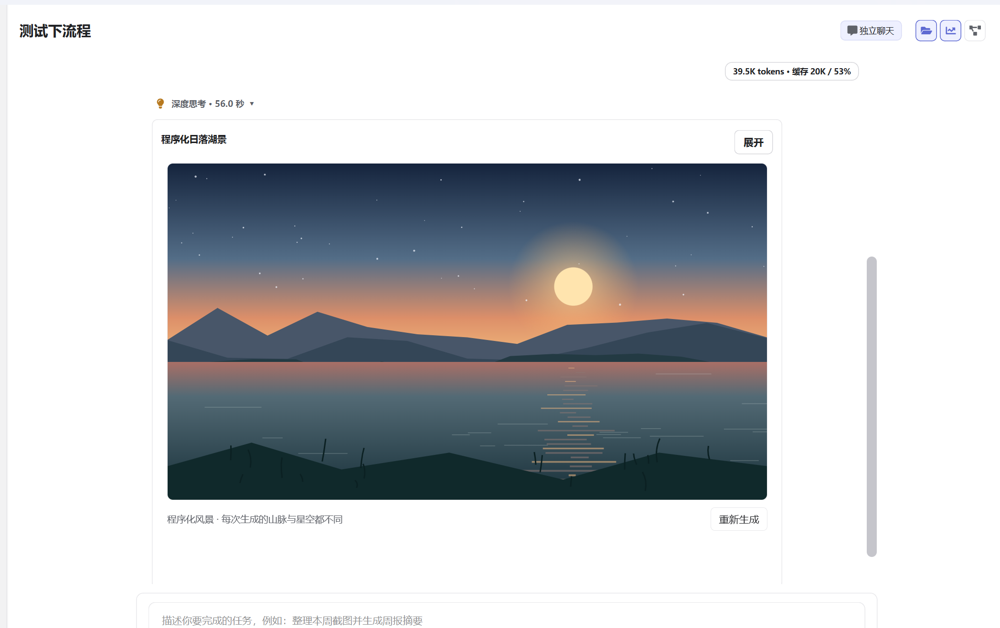

*通过筛选和参数变化探索不同结果*

### 2.4 运行边界

Visualize 在受限制的区域中运行，不能任意跳转页面或在后台自由访问网络。需要
常用图表脚本、样式或字体时，只能使用 Cowork 允许的可信静态来源；资源失败会
显示原因并停止不完整输出。

关闭 Visualize 后，AI 不再创建新的交互视图；已经保存且校验通过的历史视图仍可
按需只读查看。Visualize 本身只负责展示和交互，是否修改文件取决于另外授权的
任务和 Tool。

## 3. 两项能力如何配合

自定义主题控制 Visualize 卡片外部的标题、工具栏、加载、错误和预览外壳，不
改写图表本身。这样深色主题不会意外改变数据颜色含义或品牌配色。

最稳妥的使用方式是：

- 主题任务说明使用环境和阅读偏好，先预览再确认；
- Visualize 任务说明要探索的问题、可调条件和重要输出；
- 不把“看见交互卡片”误认为原始文件或外部系统已经被修改。

## 4. 常见问题

### AI 会不会直接保存主题？

不会。AI 可以生成和修改预览，但保存、启用和删除都需要确认；revision 改变后，
旧确认不能用于新内容。

### 选择主题会立即刷新吗？

不会。选择与编辑只改变草稿；点击“预览”或正式保存时才统一刷新。

### Visualize 能代替所有回答吗？

不能。只有比较、筛选、情景尝试和分层浏览明显优于短文本时才值得使用。

### 深色主题会自动把图表改成深色吗？

不一定。应用外壳与可视化内容有意分离，图表样式由内容目的决定。
