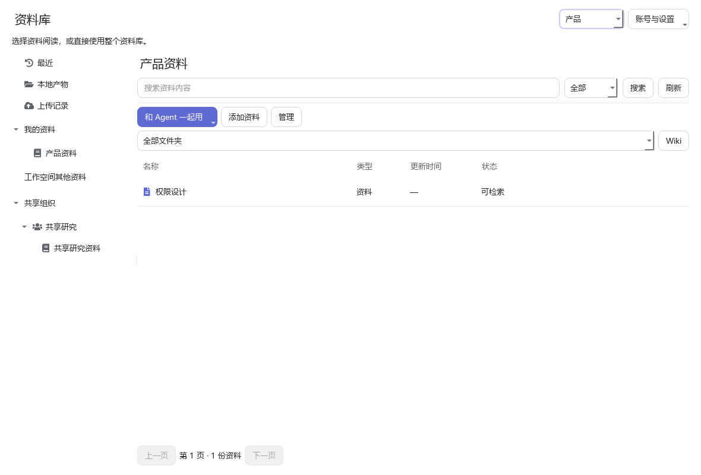
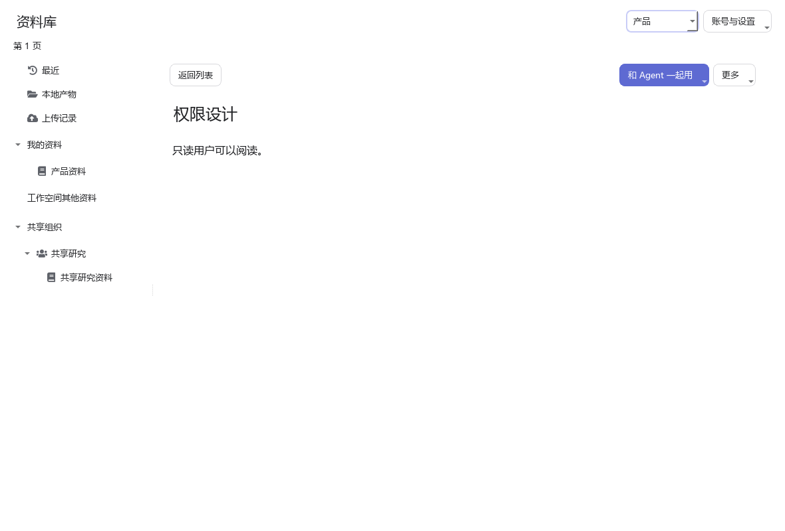
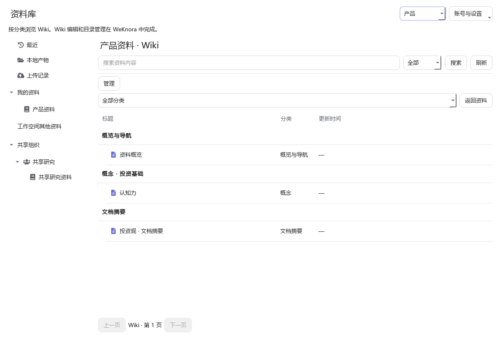
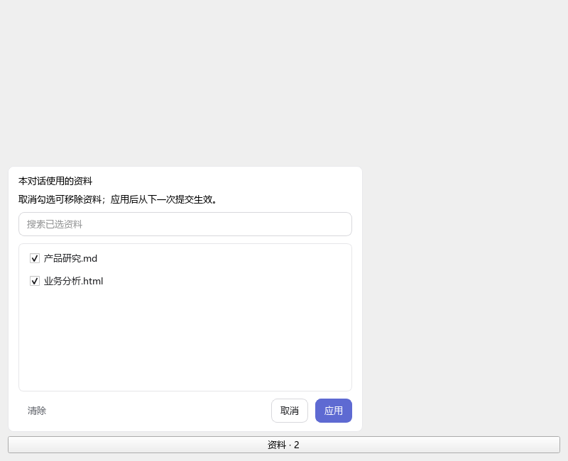

# 在 Cowork 中使用资料库

资料库把已有知识带入工作，也让本次产物成为下次工作的资料。打开左侧“资料库”，使用 WeKnora 邮箱与密码登录。默认连接本机 `http://localhost`；远程地址支持 HTTP 和 HTTPS。密码不会保存，登录令牌使用 Windows DPAPI 加密保存。

## 找到并阅读资料

- “最近”保留访问入口；“我的资料”与工作空间其他资料分别展示，共享组织保留独立来源。
- 打开资料库后，可以切换文件夹、翻页或查看 Wiki；搜索查找后端已索引的内容。
- 点击资料进入阅读页，返回列表会保留浏览位置。阅读页显示排版后的正文，管理入口在“更多”中。
- 顶部切换工作空间只影响后续操作。成员、共享、内容与文件夹编辑在 WeKnora 中完成。

## 和 Agent 一起用

点击“和 Agent 一起用”，选择新建对话、当前对话或项目。添加资料不会自动发送消息；在输入区的资料入口可移除引用。项目默认资料只应用于之后创建的对话，也可在资料入口的项目子菜单中移除。

资料选择从下一次提交生效，正在运行的任务继续使用提交时的账号、工作空间和范围。仅选择一份文档时，Agent 不能扩大检索到整个资料库。失效引用不会变成全库搜索，请重新登录或移除后重新选择。

Agent 通过 Knowledge Skill 的 `list/search/read` 读取资料并综合回答，不创建 WeKnora 远端对话。正文及工具结果作为当前对话事实保存；不会在 Cowork 建立可脱离服务端权限检索的知识副本。

## 保存本地产物

打开“本地产物”，按项目筛选、选择文件，再点击“保存到资料库”。选择目标资料库和文件夹后点击上传。也可以在资料库列表中“添加资料”。

上传记录区分正在上传、等待解析、解析中、可检索、解析失败和结果待核对。点击记录核对远端状态。网络超时不等于失败或成功，Cowork 不会盲目重复上传；未确认的记录需要在 WeKnora 中核对。

## 实施验证范围（2026-09-05）

已使用本机真实登录态验证当前用户、工作空间、资料列表、单文档搜索与分块阅读、Wiki 目录及正文、宿主 Skill 调用。当前实际账号为可写账号；没有为了验收修改现有知识或上传测试内容。

自动化覆盖令牌刷新、DPAPI、权限拒绝、身份变更、单文档硬范围、失效引用、并发上下文、上传未知结果与重复提交、取消、工具 schema 和系统提示词稳定、原生 UI 阅读/返回/主题恢复。真实只读账号、权限撤销和上传闭环仍需具备相应测试账号及测试资料后验收；模型端缓存命中指标尚未测量，当前验证的是输入前缀与 schema 不变。

验证命令：

```powershell
.venv/Scripts/python.exe -m pytest test/test_knowledge_library.py test/test_knowledge_library_ui.py test/test_knowledge_library_integration.py -q
.venv/Scripts/python.exe scripts/verify_knowledge_library.py --screenshots .tmp/knowledge_library_qa
```

诊断事件包含请求关联 ID、操作、重试次数、耗时和上传任务 ID，不记录令牌、密码或知识正文。发布前应确认实际日志采集覆盖提交、启动、运行、完成及错误路径。

## 界面示例

以下为测试资料截图，不包含真实账号资料。






2026-09-05 交互更新：远程连接支持 HTTP 与 HTTPS。Wiki 按服务端页面类型与分类路径分组，可按分类筛选；保留分页与返回资料入口。最近访问区分资料阅读和 Wiki 阅读，不修改远端标题或内容。




## 预览、状态同步与引用选择（2026-09-05）

本地产物无需上传完成即可预览：Markdown、UTF-8 文本/代码/CSV、图片、PDF，以及 DOCX/PPTX/XLSX 的结构化内容均可在资料库内打开。HTML 本地预览直接读取源文件，远程预览单独请求 WeKnora `/knowledge/{id}/preview`，不依赖索引完成。HTML 预览不执行脚本和外部资源；旧版 DOC/PPT/XLS、过大的文件或损坏文件会明确说明原因，可通过“更多 → 用本机应用打开”处理。

上传记录进入时核对远端，停留时每 5 秒刷新解析中的任务；状态与核对时间写回本机回执。未知结果仍只核对，不重新上传。已用本机真实接口将两条旧 pending 回执核对为 completed。

输入区“资料”采用与指定能力一致的上方浮层：搜索、勾选、清除、取消、应用。应用后影响下一次提交；取消和点击外部不保存。项目选择支持搜索并排除归档/隐藏项目。资料上下文通过统一账本入口创建 ID、序号及轮次信息，已验证实际 Worker 返回的消息能重复安全合并，不改写历史消息。



