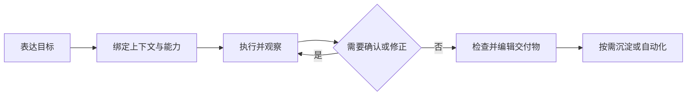

# DeepSeek Cowork 产品文档

当前应用版本：**5.1.0**

DeepSeek Cowork 是一个 Windows 桌面 Agent 工作台。它服务的不是“多聊几轮”，
而是一个完整任务：理解目标、读取资料、调用工具、等待确认、修改文件、交付结果，
并让过程在切换会话或应用重启后仍可追溯。

本项目为个人探索，与 DeepSeek 官方无隶属关系。

## 1. 产品承诺

Cowork 优先解决三类问题：

1. **完成真实工作**：Agent 在明确工作区内读取资料、执行 Tool，并产出可检查、可继续编辑的文件。
2. **控制长过程**：用户能看到进度和错误，在安全节点补充要求、响应确认、停止任务或稍后恢复。
3. **积累可复用能力**：Tool、Skill、MCP、记忆和经验可以扩展，但始终服从同一执行与安全边界。

判断一项功能是否应该进入 Cowork，不看它是否“像 AI”，而看它是否让这条链路
更短、更可靠：

## 2. 产品层级

Cowork 把界面和能力分为“任务主路径”与“按需管理”，避免把技术对象都堆到
用户面前。

| 层级 | 用户首先看到什么 | 何时深入 |
| --- | --- | --- |
| 当前任务 | 对话、输入、运行状态、最终回答 | 每次使用 |
| 任务上下文 | 项目、附件、文件、交付物、任务观测 | 任务需要资料、输出或核对时 |
| 能力入口 | 新对话首页、AI 能力商城、Agent、自动化 | 需要专业流程或重复任务时 |
| 系统管理 | 模型、主题、记忆、企业消息、组件、高级能力管理 | 首次配置、连接或排错时 |

5.1.0 的主界面因此围绕四个高频起点组织：PPT、金融分析、数据分析和浏览器
自动化。它们只准备提示词和必要能力，不会自动发送、安装组件或执行外部写操作。

## 3. 三条核心理念

### 3.1 Everything is Tool

“Everything is Tool”指的是：

> 所有模型可执行动作，都通过统一 Tool 接口进入运行时。

这里的“一切”只指执行动作，不是把所有概念都改名为 Tool。

| 概念 | 职责 |
| --- | --- |
| Tool | 直接执行读取、命令、补丁、交互、MCP 或外部服务调用 |
| Skill | 提供一类任务的指导、边界、经验、工具引用与资源 |
| Agent | 提供角色、目标、模型和运行上下文 |
| 自动化 | 在计划时间把提示词和上下文交给同一 Agent Loop |
| 记忆与经验 | 影响判断和方法，不建立第二套执行协议 |

统一执行面带来五个产品结果：

- **可用**：符合当前上下文的核心内置 Tool 首轮直接可见；显式选择的可选能力同步进入本轮，其他已启用扩展再通过 `tool_search` 按需发现。
- **可控**：运行时区分只读、写入、破坏性和必须交互的动作。
- **可见**：Tool 的来源、参数、状态、结果和错误进入同一任务观测。
- **可扩展**：内置实现、Skill Tool、脚本与 MCP 共享调用协议。
- **可恢复**：真实 Tool 结果回填标准消息，历史可以继续进入模型请求。

普通文本工具进一步收敛为“完整读取 + 标准补丁”：读取产生内容哈希凭据，
补丁在预检、路径边界和删除确认通过后提交。这既提高本地写入安全，也提供稳定、
明确的函数 Schema，便于模型后训练对齐同一工具契约。

### 3.2 AI 设计 UI

Cowork 允许 AI 参与界面设计，但不允许 AI 接管应用代码。

AI 可以配置：

- 语义颜色、字体比例、密度和圆角；
- 唯一工作区场景及静态图片或受控程序纹理；
- Surface 材质、受控 Component 样式、布局、图标和白名单文案。

代码始终控制：

- 组件树、区域归属、信号、路由和按钮动作；
- 新建聊天、设置、输入、主要提交和恢复控件；
- 文件选择器、交付物内容和 Windows 原生窗口行为。

`.cowork-theme` 主题包先经过 Schema 与资产校验，再创建隔离预览。每次预览都
绑定 `preview_id + revision`；预览后的任何修改都会递增 revision，旧确认不能
保存新内容。取消或失败时恢复已保存主题，预览不会污染持久化配置。

这套边界的重点不是“能换多少颜色”，而是让 AI 的创造力通过可验证、可预览、
可取消的声明进入产品。

### 3.3 经验系统

Cowork 把一次运行的证据和长期资产分开：

| 概念 | 保存什么 | 用途 |
| --- | --- | --- |
| 历史 | 原始会话、Tool 消息和执行顺序 | 恢复、搜索与证据追溯 |
| 记忆 | 用户偏好、长期事实、全局或工作区摘要 | 保持长期上下文一致 |
| 经验 | 已验证的工具技巧、失败模式和恢复方法 | 提高相似任务可靠性 |
| Skill | 指导、经验、工具、脚本和参考资料 | 组织一类可复用能力 |

经验系统是本地、显式、可查看、可编辑的运行知识层；它**不是模型微调**，也不
涉及模型权重调整。

有明确能力归属的经验进入对应 Skill，跨任务的通用经验进入
`general-experience`。完整条目不会无条件加入每次请求，只在任务命中时按需
披露，避免 Prompt 随时间无限增长。

“沉淀为 Skill”使用两阶段确认：先从指定会话范围提取脱敏且带消息证据的复用
规律，再基于用户确认的证据编译草稿。创建、合并指导或追加经验都需要最终确认；
猜测、临时项目状态和未经验证的做法不应持久化。

## 4. 当前产品结构

### 4.1 对话与工作区

- 独立聊天拥有专属目录；项目聊天绑定用户明确选择的文件夹。
- reasoning、Tool、阶段回复和最终回答在同一轮按真实顺序展示。
- 运行中的任务可以引导、停止和跨会话观察；历史按项目/聊天分组分页。
- 首次有效提交先进入恢复日志，再由后台保存队列写入 SQLite。
- 两条以上顶层用户提问会显示历史提问细轨；标记随滚动更新，悬停显示本轮答复摘要，并可跨未渲染历史分页定位。

### 4.2 文件与交付物

- 文件管理器中的文件可以直接粘贴为附件；剪贴板位图进入会话托管附件。
- “文件与交付物”使用单一工作台：同一文件导航在窄窗口作为浮层，在放大且宽度充足时可固定在内容左侧。
- 文件范围和搜索常驻；类型筛选与排序收进渐进式菜单。当前文件即使被筛除也会单独保留定位入口。
- Markdown、HTML、图片、PDF、DOCX、PPTX 和 XLSX 可在应用内预览。
- DOCX、HTML、XLSX、CSV/TSV、常见文本、代码和配置文件在兼容预检后可安全编辑。
- 预览与编辑通过工具栏中的铅笔/眼睛按钮切换，只读格式明确标记且不显示编辑入口。
- 保存使用冲突检测、临时文件验证、唯一上一版备份和原子替换。
- HTML 工作稿可以继续生成 PPTX、DOCX 或 PDF。

### 4.3 能力、Agent 与自动化

- AI 能力商城按任务场景展示可选能力，把 Tool、MCP、依赖和文件级调试放入高级管理。
- 当前会话可以显式指定可选能力或一个/多个 Agent；核心内置 Tool 不在选择器重复出现。
- 浏览器自动化内置固定校验的 CLI 与离线扩展，保留 Chrome Web Store 次入口，并把浏览器选择、人工加载、连接检查和启用放在一个流程中。
- 自动化保存提示词、计划、引用能力和可选 Agent，触发后仍进入同一 Agent Loop。

### 4.4 模型与外部连接

- 支持 OpenAI-compatible Chat Completions、Responses 与 Anthropic 协议。
- 官方 DeepSeek Responses 保留推理、函数调用、函数结果和服务端搜索的协议顺序。
- 企业消息支持飞书、钉钉、企业微信、QQ 和微信；同一时间只运行一个渠道，切换不会删除其他渠道凭据。
- 飞书可原生发布本地文件、图片和链接；钉钉/企业微信只发送可访问 URL；QQ/微信不提供附件发布 Tool。

## 5. 安全与失败原则

Cowork 不用隐藏失败换取“看起来能继续”。当前产品遵循以下边界：

- 工作区未绑定时，文件 Tool 仍保持可发现，但实际调用会明确返回未选择工作区；不会伪装成能力不存在。
- 删除、发布、外部提交和其他高影响动作必须服从用户授权与 Tool 风险属性。
- 文件、配置和主题保存失败时保留用户输入与 dirty 状态，并显示根因和恢复路径。
- 可选组件或 Skill 依赖缺失时明确报错，不静默切换实现或安装未知依赖。
- PDF、PPTX、图片、旧版 Office 及高风险复杂 Office 文件保持只读，不降级为不受保护的写入。
- 主题与 Visualize 运行在声明式或受限边界内，不能借界面内容突破文件、网络或操作权限。

## 6. 明确不做什么

Cowork 当前不是：

- 通用远程运维平台；
- 任意脚本驱动的 UI 生成器；
- 完整 Office 替代品；
- 自动把所有对话写入知识库的系统；
- 用 Skill 替代 Tool 的第二套执行语言；
- 无需人工核验即可执行购买、发布、交易或高风险文件变更的自动驾驶系统。

产品优先级始终是：明确工作区、过程可见、失败可解释、结果可检查、关键动作由
用户控制。
