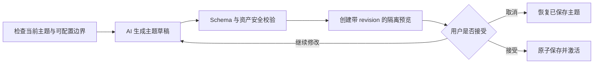
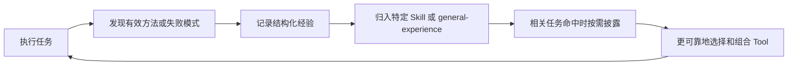

# DeepSeek Cowork 产品文档

当前应用版本：**5.0.8**

DeepSeek Cowork 是一个 Windows 桌面 Agent 工作台。它把对话、项目文件、
工具执行、能力扩展、自动化、长期信息和交付物预览放在同一个可观察、
可干预的工作流中。

它是个人探索项目，与 DeepSeek 官方无隶属关系。产品面向需要连续读取资料、
调用工具、修改文件、等待确认并交付结果的任务，让整个过程保持可控。

## 1. 产品目标

Cowork 面向三类常见任务：

- **完成真实工作**：让 Agent 在明确工作区内读取文件、调用工具并产出可继续编辑的结果。
- **管理长期过程**：运行中的任务可以观察、补充要求、切换会话和恢复，不必把所有上下文塞进一个输入框。
- **积累可复用能力**：工具、Skill、经验和记忆可以持续扩展，但仍共享同一套执行和安全边界。

产品不追求把每个功能都做成新的协议。它更关心一条完整链路是否简单：
用户表达目标，Agent 选择能力，执行过程可见，关键动作可确认，最终结果
可以被打开、检查和继续修改。

## 2. 三条核心理念

### 2.1 Everything is Tool

“Everything is Tool”在 Cowork 中的准确含义是：

> 所有模型可执行的动作，都通过统一 Tool 接口进入运行时。

这里的“一切”专指可执行动作。Skill、Agent、记忆和经验仍保留各自职责。

- Tool 是直接执行面：读取文件、运行命令、查询历史、请求用户输入、调用 MCP、配置主题或触发外部服务。
- Skill 是经验与工作流指导：告诉模型什么时候、为什么以及怎样组合 Tool。
- Agent 是角色、目标和运行上下文：它仍然使用同一套 Tool。
- 自动化是触发方式：到达计划时间后，仍然把提示词和上下文交给同一个 Agent Loop。
- 记忆和经验是上下文：它们影响判断，但不会另建一套执行协议。

每个 Tool 都可以携带名称、描述、JSON Schema、只读属性、危险性和用户交互
要求。统一执行面由此带来五个产品收益：

1. **可发现**：基础 Tool 常驻，其他能力可通过 `tool_search` 按需出现。
2. **可治理**：运行时能区分只读、写入、危险操作和必须交互的动作。
3. **可观察**：工具参数、状态、结果和错误可以投影到同一任务观测界面。
4. **可扩展**：内置实现、脚本型 Skill 和 MCP Tool 都能进入同一循环。
5. **可恢复**：工具结果以标准消息回填，模型可以基于真实结果继续推理。

因此 Cowork 不需要为 Skill、自动化、MCP 或子 Agent 各造一套“执行语言”。
新的能力只需接入统一 Tool 边界，核心 Agent Loop 就可以继续复用。

### 2.2 AI 设计 UI

Cowork 希望让 AI 参与软件界面设计，但不让 AI 接管应用代码。

传统“AI 换肤”容易走向两个极端：只能换几种颜色，或者允许模型生成任意
样式和脚本。前者表达力不足，后者会破坏交互、可访问性和安全边界。Cowork
选择声明式中间层：

- AI 可以调整语义颜色、字体、密度和圆角。
- AI 可以设计唯一的工作区背景场景，包括底色、静态图片和受控程序纹理。
- AI 可以配置区域材质、组件样式、受控布局、图标和白名单展示文案。
- 应用代码保留组件树、信号、动作、路由、区域归属和无障碍名称。

主题包使用 `.cowork-theme` 格式。稳定的 Surface/Component ID 把“AI 想
设计什么”映射到“应用允许修改什么”；统一主题运行时负责把声明应用到
现有 Qt 控件，组件树和应用代码保持稳定。

#### 从想法到生效

预览拥有 `preview_id + revision`。用户确认的必须是刚刚看到的精确版本；
预览之后发生的补丁会递增 revision，旧确认不能保存新内容。

#### 不可被主题越过的边界

- 新建聊天、设置入口、输入框、主要提交按钮和预览恢复条不能隐藏。
- 左、中、右区域归属和组件树不能被跨区重排。
- 不允许任意 QSS、脚本、动画、SVG、网络资源或可执行内容。
- 原生标题栏、文件选择器和交付物内容不属于主题控制范围。
- 应用失败时恢复上一份令牌、场景、布局和组件状态。

这套机制表达了 Cowork 对 AI 原生软件的一种判断：AI 可以参与产品本身的
个性化设计，但创造力必须通过可验证、可预览、可取消的边界进入应用。

### 2.3 经验系统

Cowork 把“任务完成”看作一次运行的终点，并把任务中发现的可靠方法、失败
模式和恢复路径沉淀为长期资产。

#### 历史、记忆、经验与 Skill

| 概念 | 保存什么 | 主要用途 |
|---|---|---|
| 历史 | 原始会话、工具消息和执行记录 | 回看、恢复、搜索和证据追溯 |
| 记忆 | 用户偏好、长期事实、全局或工作区摘要 | 让回答持续符合用户和项目背景 |
| 经验 | 工具技巧、失败模式、恢复方法和操作规律 | 提高相似任务的执行可靠性 |
| Skill | 指导、经验、工具引用、脚本和参考资料 | 把一类任务组织成可复用能力 |

经验是本地、显式、可查看、可编辑的运行知识层，不涉及模型权重调整。

#### 经验飞轮

Agent 可以通过 `update_experience` 记录经验。经验有明确能力归属时写入
对应 Skill；跨任务的通用教训进入 `general-experience`。结构化条目可以
包含 Tool 名、任务类型、错误模式和标签，并以 `experience/entries.jsonl`
保存。高价值内容同时进入简短摘要，便于发现。

经验不会无条件全部进入每次请求。Skill Manager 默认只提供少量摘要；只有
任务命中相应能力时，才进一步披露完整指导、经验条目或参考资料。这样可以
让知识持续积累，又不让 Prompt 随时间无限增长。

#### 从一次会话沉淀为长期能力

“沉淀为 Skill”采用两阶段流程：

1. 用户选择当前问答、最近几轮、全部或自定义会话范围。
2. 第一阶段提取脱敏、带消息 ID 引用和置信度的复用证据。
3. 用户检查目标、缺失证据和资源候选。
4. 第二阶段只基于确认后的证据编译草稿。
5. 用户选择创建新 Skill、合并增强指导或仅追加结构化经验。
6. 草稿通过来源引用、敏感内容、路径、资源和代码静态校验后才保存。

这三条理念构成同一条产品逻辑：Tool 负责行动，经验让行动持续变得可靠，
AI UI 则把“受控生成、验证、确认、沉淀”的方法扩展到了软件界面本身。

## 3. 产品结构

- **对话工作台**：消息、思考、工具、运行中引导和最终回答形成连续任务流。
- **项目与工作区**：独立聊天使用专属目录，项目聊天绑定明确项目边界。
- **上下文抽屉**：浏览文件、交付物、任务观测和子 Agent 状态。
- **能力中心**：发现、启用、配置和调试 Skill 与 MCP 能力。
- **自动化中心**：管理提示词任务、计划、引用能力、Agent 绑定和运行历史。
- **设置中心**：管理模型、Agent、主题、记忆、工作区、企业消息和组件。

## 4. 关键用户流程

1. 配置一个模型渠道并选择模型。
2. 新建独立聊天，或从项目中创建绑定工作区的会话。
3. 描述目标并附加必要文件。
4. 在任务观测和工具卡中查看执行过程；必要时补充要求或响应确认。
5. 在右侧抽屉预览产物，继续生成 PPTX、DOCX 或 PDF。
6. 把长期偏好写入记忆，把可复用方法记录为经验或沉淀为 Skill。

## 5. 产品边界

Cowork 当前产品范围不包括：

- 通用远程运维平台；
- 任意代码驱动的 UI 生成器；
- 自动把所有对话永久写入知识库的系统；
- 用 Skill 替代 Tool 的第二套执行协议；
- 必须依赖外部 IDE 才能工作的开发工具。

它优先保证桌面端任务的工作区边界、过程可见性、失败可解释性和用户控制权。
