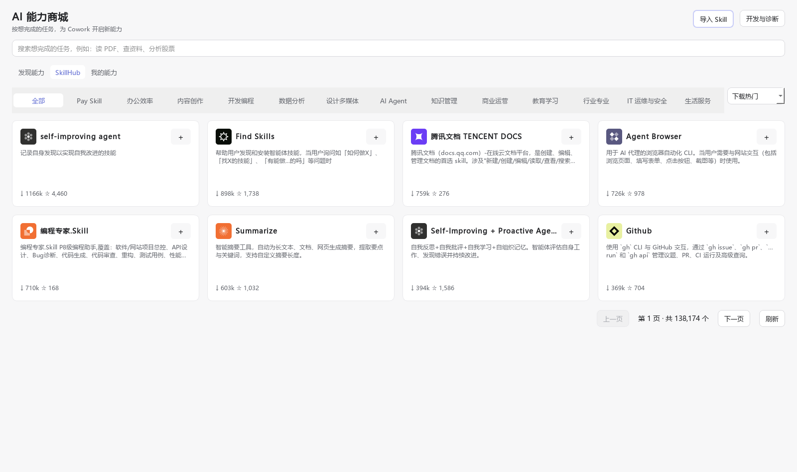
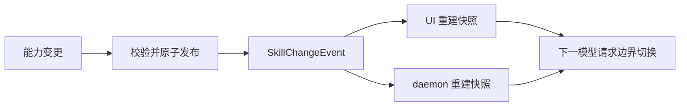

# DeepSeek Cowork Skill 系统

当前应用版本：**5.2.0**

## SkillHub 专区

在「AI 能力商城 → SkillHub」中按推荐、下载热门或最近更新浏览。分类在横向选项栏中，窄窗口可水平滚动；关键词搜索和分页保持独立状态。

列表和详情按查询条件保存在应用数据目录的 `cache/skillhub` 中，缓存有效期 60 天，最多保存 32 份结果，重启后继续复用。点击列表「刷新」或详情「检查更新」直接获取最新数据；请求失败不会缓存为成功结果。缓存读取异常会明确提示，点击「重试」重新下载并替换对应缓存。

卡片根据可用宽度排列为 1–4 列。点击卡片查看完整介绍，点击右上角「＋」直接安装卡片标明的版本。图标异步加载，并按图标 URL 在 `cache/skillhub/icons` 独立缓存 60 天（最多 128 个，每个不超过 512 KB），重启后继续复用；过期后重新下载，只有成功解码的图标才写入缓存。列表“刷新”会同时重新获取当前列表的图标。无法加载时显示提示，可刷新重试，不影响查看和安装。简介最多显示两行，详情提供完整内容、版本说明和可展开的质量参考。

专区直接使用公开 API，无需团队 Key 或登录。以官方 ZIP 为唯一安装内容来源，不再跨接口比较文件 SHA256：上游同一版本的 ZIP 和单文件接口可能返回不同的内容。仍检查 ZIP 完整性、路径安全、解压规模、Skill 格式及下载元数据中声明的 slug/version。

安装默认关闭，不执行包内代码或准备依赖；成功后可点击「查看我的能力」手动开启、配置和删除。失败提示只出现在对应技能，详情可展开并复制诊断信息后重试。切页不终止安装。

未启用的技能保留在已安装目录中，不进入运行时能力目录。管理页的「返回」回到进入前的商城、能力详情或开发与诊断页面，并保留商城筛选状态。

已安装技能可在详情中检查更新、选择版本并确认。更新保留配置和启用状态；本地文件哈希仅用于保护用户修改，不再与远程文件清单比对。有任务运行时需结束后再更新，更新期间发送操作保留输入并提示稍后重试。此版本不提供技能发布。

来源与本地安装基线保存在 `.skillhub.json`，不会作为参考资料进入模型上下文，也不会随普通 Skill 导出。

以下截图使用真实公开目录数据；榜单和下载量会随时间变化：



[单列](../images/user-guide/skillhub-store-one.png) · [双列](../images/user-guide/skillhub-store-small.png) · [三列](../images/user-guide/skillhub-store-three.png) · [详情](../images/user-guide/skillhub-detail.png) · [小窗口详情](../images/user-guide/skillhub-detail-small.png) · [125%](../images/user-guide/skillhub-store-1.25.png) · [150% 详情](../images/user-guide/skillhub-detail-1.5.png)

Skill 系统解决一个明确问题：怎样在不扩大核心执行协议的前提下，让 Agent 获得
可发现、可配置、可组合、可积累的专业能力。

## 1. 先建立正确模型

**Tool 是执行面，Skill 是经验包，MCP 是外部 Tool 的连接方式。**

| 概念 | 运行时职责 | 模型如何使用 |
| --- | --- | --- |
| Tool | 执行动作并返回结构化结果 | 直接函数调用 |
| Skill | 组织指导、边界、经验、Tool 引用和资源 | 读取上下文后选择 Tool |
| MCP | 把外部服务映射为本地 Tool | 仍通过 Tool Registry 调用 |
| Agent | 绑定角色、模型、允许能力和运行上下文 | 进入同一 Agent Loop |

模型不会“调用 Skill”。它先获得相关指导，再调用 Tool：


## 2. Skill 包结构

一个完整 Skill 可以包含：

```text
<skill>/
  SKILL.md
  skill.json
  impl.py
  experience/
    entries.jsonl
  references/
  scripts/
  assets/
```

| 文件或目录 | 职责 | 是否必需 |
| --- | --- | --- |
| `SKILL.md` | 面向 Agent 和人的权威工作流与边界 | 是 |
| `skill.json` | 发现、展示、配置、Tool 和运行元数据 | Cowork 原生能力需要 |
| `impl.py` | 延迟导入的 Python Tool 实现 | 可选 |
| `experience/entries.jsonl` | 结构化经验条目 | 可选 |
| `references/` | 按需读取的长资料 | 可选 |
| `scripts/` | 由声明入口执行的脚本 | 可选 |
| `assets/` | 静态模板与资源 | 可选 |

符合 Agent Skills 约定、根目录带 `SKILL.md` 的能力也可以安装。Cowork 保留上游
指导，只补充本地索引元数据，不要求上游改写为第二种格式。

## 3. 来源与身份

能力来源在注册根目录时显式确定：

| 来源 | `source_kind` | 默认行为 |
| --- | --- | --- |
| 应用随包 `skills/` | `core_builtin` | 始终加载，符合上下文的 Tool 首轮直接可见 |
| 应用随包 `ai_skills/` | `optional` | 会话指定时直出，否则在启用后按需发现 |
| 用户能力目录 | `user_extension` | 受启用、指定和发现规则约束 |
| MCP Server | `mcp` | 连接成功后合成为 Tool Provider |

来源不根据文件夹末级名称猜测。核心根优先，用户目录中的同名 Skill 不能覆盖或
冒充核心内置能力。

`SkillCatalogService` 把目录编译为进程级不可变快照。UI 与 daemon 各自持有
快照；提交消息时只创建轻量运行视图，不重新扫描目录、导入实现或安装依赖。

### 聚合能力示例

`wind-aifinmarket` 在商城中只显示一个“万得金融能力”，内部子 Skill 通过
`search_wind_subskills` 和 `load_wind_subskill` 渐进加载，不把大量子目录注册成
重复卡片。每个数据源保留自己的配置与错误语义，失败时不静默换源；交易类能力
只输出研究分析与计划，不执行真实账户操作。

## 4. 发现、指定与披露

Tool Schema 和 Skill 长文使用不同策略。

### Tool 可见性

- `core_builtin` Tool 在运行模式、渠道和权限允许时直接进入首轮 Schema，不经过 `tool_search`。
- 当前会话显式选择的可选能力，其 Tool 和指导直接进入本轮。
- 已启用但未选择的可选能力、用户扩展和 MCP 可以由 `tool_search` 按需发现。
- 禁用能力不可搜索；已经直出的核心 Tool 不进入搜索结果。
- 工作区是否已经绑定不决定文件/命令 Tool 的 Schema 可见性；实际调用时若没有工作区，Handler 明确返回 `workspace_not_selected`。

### 指导披露

Skill 内容分四级：

1. 任务无关：不披露。
2. 候选能力：只给名称、用途、标签和推荐 Tool。
3. 明确命中：加载完整 `SKILL.md`。
4. 执行确有需要：再加载参考资料和经验条目。

自动命中的 Skill 指导只参与当前运行，不写入正常会话历史。内容哈希避免同一轮
重复注入，也保持后续 Prompt 前缀稳定。

## 5. Tool 注册与统一文本契约

所有 Tool 最终进入 `ToolRegistry`，记录：

- `name`、`description` 和 JSON Schema；
- `read_only`、`destructive`、`requires_user_interaction`；
- 所属 Skill、Tool 类型、搜索提示与 `source_kind`；
- 延迟 Handler、脚本入口或 MCP 映射；
- 当前运行模式、能力范围和渠道下是否可调用。

`core_builtin` 的有效 `should_defer` 固定为 `false`；可选来源保留渐进发现策略。
声明式 Skill 可以用 `impl.py:function` 绑定 Handler，直到首次调用才导入。脚本
通过 `script_entries` 声明后统一由 `run_skill_script` 执行，模型不需要猜目录和命令。

### 文件与命令工具的职责

| Tool | 只负责什么 |
| --- | --- |
| `glob` | 按模式发现路径 |
| `grep` | 定位文本匹配及上下文行 |
| `text_file_read` | 严格解码并完整、有序读取普通文本，建立内容哈希审计 |
| `apply_patch` | 创建、更新、移动或删除普通文本文件 |
| `workspace_rename_path` | 目录级重命名 |
| `workspace_delete_path` | 目录级删除与确认 |

`text_file_read` 只有在完整读取时才建立 SHA-256、编码、BOM 和换行风格凭据；
`apply_patch` 只接受精确上下文补丁，先完成全量解析、路径与读取凭据预检，再聚合
删除确认并按顺序提交。Office/PDF 不走这条普通文本路径。

Skill 的 `allowed-tools`、稳定系统提示与 Tool Registry 必须使用同一组正式名称，
防止已撤下接口从缓存提示或 Skill 正文重新泄露。

> 模型适配意图：核心 Tool 直出、稳定函数 Schema、完整读取凭据和标准
> `apply_patch` 共同形成更确定的动作空间。这是为 DeepSeek V4 Flash 正式版及
> 后续 V4 Pro 正式版的后训练调用偏好和 Responses 协议兼容做准备；具体模型
> 可用性仍由模型服务决定。

## 6. 配置与依赖

### 运行配置

`skill.json.config_fields` 支持：

- `text`、`secret`、`select`；
- `required`、`default`、`options`；
- `config_requirements[].when` 条件必填规则；
- 执行时注入的 `env`；
- `help`、`placeholder`；
- 不含凭据的 HTTPS `action_url` 与按钮文案。

配置保存在本地 `skill_configs`。运行时只注入字段声明的环境变量；必填项缺失
直接返回根因，不从其他目录猜测密钥，也不静默切换 Provider。

### 依赖准备

Python 和 Node 依赖不会在应用启动或 Skill 启用时批量安装。

`DependencyCoordinator` 在 Tool 首次调用前按“Skill + 依赖哈希”准备环境：

- 相同哈希的并发请求共享 single-flight；
- 成功与失败状态都持久化；
- 失败不会在新会话静默重试；
- 用户显式重试或依赖声明变化才会再次准备。

系统上下文区分应用 Python、沙盒 Python、用户环境 Node.js 与 Bash。Node.js
不随应用分发；Tool Schema 可见不代表外部运行时已经安装，缺失时必须明确报告。

## 7. 托管 MCP

Skill 可以在 `mcp_server_presets` 中声明 `stdio` 或 Streamable HTTP Server。
保存配置时，Cowork 会：

1. 解析 `{{ENV_NAME}}` 配置引用；
2. 创建或更新带 `source_skill` 的 MCP 条目；
3. 启用由该 Skill 管理的 Server；
4. 保留独立的连接测试与诊断入口。

`runtime: skill_python` 的 stdio Server 使用所属 Skill 的隔离 Python 环境。认证
配置只保存引用，短期 access/refresh token 留在内存。远端工具最终仍映射成本地
Tool，经统一权限、观测和结果协议执行。

## 8. 能力商城与安装

AI 能力商城负责普通用户的发现和最小状态操作：

- “发现能力”按查找资料、处理文档、分析数据、制作内容和金融研究分类；
- “我的能力”展示用户创建、导入或 AI 生成的 Skill；
- 卡片使用“开启 / 设置后开启 / 已开启 / 关闭”，不要求用户理解 Tool 或 MCP；
- 商城页头直接导入 ZIP，“我的能力”直接管理、导出或删除单个用户 Skill；单项导出使用实际 Skill 名，多项导出继续使用集合包名；
- “开发与诊断”集中来源、文件、依赖、批量操作和调试；
- 浏览器自动化把本地准备、扩展安装、真实连接探测和启用收敛为一个流程。
- 企业微信办公套件通过受信任授权 Provider 在能力详情内扫码；联网身份验证通过后才开启，关闭能力不删除授权。

随包可选能力通过 `skill.json.presentation` 声明分类、短名称、摘要、示例和访问
边界。元数据缺失时显示明确错误，不由运行时猜测。用户 Skill 不强制进入官方分类。

需要账号授权的随包能力可声明：

```json
{"authorization": {"provider": "wecom_cli", "required": true}}
```

该字段只能引用内核注册的 Provider ID，不能携带或执行 manifest 自定义命令。授权凭据与普通 Skill 配置隔离；本地凭据存在和服务端连接有效必须分别建模。

### 本地与远程安装

- 文件夹与 ZIP 导入先在临时目录检查路径穿越和结构，再原子发布；同名目标不覆盖。
- 标准 Agent Skill 保留上游指导，只增加本地索引。
- 远程入口由专用安装 Agent 读取受限 Markdown 和仓库证据，主 Agent 不执行入口中的 Shell、Git 或 `npx` 命令。
- 内核负责 HTTPS/SSRF 校验、浅克隆、固定 commit、文件摘要、配置字段校验和发布。
- 第一次调用只生成 30 分钟有效的安装预览；确认后使用同一 continuation，不重新联网或换快照。
- 入口过期、摘要变化、同名冲突或风险校验失败都明确停止。

语音转文字组件不走上述 Skill 依赖下载链。发布人员把已下载且校验通过的模型与 Node ZIP
放入仓库 `.runtime_downloads`，然后运行
`python scripts/package_speech_to_text_component.py --offline`。脚本会自动复用 Cowork 已安装的
语音 Node 依赖；缺少缓存时直接失败，不会悄悄联网。去掉 `--offline` 才允许发行构建机补齐缺失素材。
脚本生成并自校验
`dist/deepseek-cowork-speech-to-text-v1-win-x64.zip`，再把该文件作为独立 GitHub
Release 附件上传。客户端只接收这个本地 ZIP，并在原子部署前验证 manifest、平台、
固定模型与 Node.js 哈希以及全部文件清单；验包和健康检查期间不会访问网络或运行 npm。

## 9. 经验与会话沉淀

结构化经验保存在：

```text
experience/entries.jsonl
```

条目可包含经验正文、Tool、任务类型、错误模式、标签、来源和时间。未指定 Skill
时，`update_experience` 写入 `general-experience`；有明确能力归属时写入对应包。

只有经过验证、可跨任务复用、非敏感且价值明确的方法才应进入经验。例行成功、
猜测和临时项目状态不保存。创建、修改或安装 Skill，以及写入长期记忆，都需要
用户明确提出。

“沉淀为 Skill”采用两阶段流程：

1. 从用户选择的会话范围提取并脱敏证据，保留消息 ID、置信度和缺失项。
2. 用户可以直接编辑复用分析全文，并选择创建、合并指导或追加经验；稍后处理和失败恢复都会保留修改。
3. 第二阶段以用户确认文本为内容意图，使用原始规范化证据继续执行来源、置信度和隐私约束。
4. 草稿通过 Schema、引用、敏感内容、路径、Python AST 和目标 revision 校验。
5. 用户最终确认后原子保存；失败时草稿仍留在来源会话。

会话中执行过的原始代码不会直接复制进 Skill；选中的脚本候选会按用途重新生成
参数化实现并再次校验。

## 10. 变更发布与运行一致性

创建、更新、启停或删除能力后，系统发布 `SkillChangeEvent`，包含事件 ID、动作、
Skill、来源、会话和 revision。



事件按 ID 幂等，旧 revision 不覆盖新快照。已经运行的 Tool 不被中断；Worker
只在下一次模型请求边界应用新目录。文件监听只修复外部编辑，不承担业务强一致。

## 11. 设计不变量

- Tool 保持直接、统一、可观察。
- Skill 只组织指导、经验和资源，不建立第二套执行协议。
- 核心动作首轮可用，长指导和扩展能力按需披露。
- 配置、连接和依赖失败必须显示根因。
- 重依赖保持可选和延迟准备。
- 用户明确控制哪些对话内容进入长期记忆、经验或 Skill。
- 源码态与冻结发行包必须注册同一组核心 Tool；动态 `impl.py` 依赖缺失时构建直接失败。
