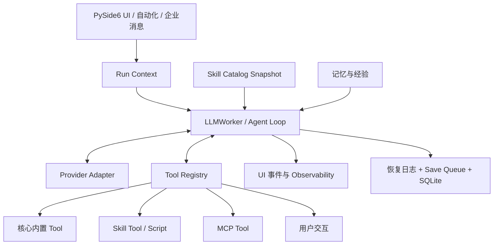

# DeepSeek Cowork 技术设计

当前应用版本：**5.1.0**

本文描述当前源码中长期成立的运行模型。发布流水账放在
[5.1.0 发布说明](releases/5.1.0.md)，Skill 包格式和安装流程放在
[Skill 系统](skill-system.md)。

## 1. 架构目标与不变量

Cowork 的技术设计围绕五个不变量：

1. **单一循环**：本地对话、daemon、自动化、子 Agent 和企业消息最终都创建同一种 `LLMWorker`。
2. **单一执行面**：所有模型动作通过 Tool Registry 注册、校验、执行并回填。
3. **明确上下文**：模型、工作区、能力、记忆和运行模式在提交时形成不可混淆的 run context。
4. **先记录再投影**：协议消息、恢复日志和 SQLite 是事实；聊天卡片、观测和文件抽屉是 UI 投影。
5. **失败外显**：工作区、依赖、协议、保存或构建失败显示根因，不用隐藏能力或静默降级掩盖问题。



## 2. Agent Loop 与协议消息

### 2.1 最小循环

一个可调用 Tool 的最小循环是：

```python
messages = [user_message]

while True:
    response = model.generate(messages, tools)
    messages.append(response)
    if not response.tool_calls:
        return response.content

    for call in response.tool_calls:
        result = execute_tool(call.name, call.arguments)
        messages.append(tool_result(call.id, result))
```

关键约束不是循环形式，而是 Tool 的真实结果必须进入消息序列。模型只能基于已
发生的结果继续判断，历史也只有保留这条关系才能恢复。

### 2.2 流式、多 Tool 与 `tool_call_id`

Provider 流式返回正文、reasoning、Tool 名、分段 JSON 参数、用量和错误。
`LLMWorker` 聚合完整调用后，保持标准顺序：

```text
assistant(tool_calls)
tool(tool_call_id=A)
tool(tool_call_id=B)
assistant(next response)
```

`tool_call_id` 同时承担三项职责：把结果配对到调用、更新同一张 UI Tool 卡、让
恢复后的协议消息仍能跨 Provider 适配。

同一轮若连续三次生成完全相同的 Tool 签名，循环停止并要求模型检查现有结果，
避免空转。

## 3. Provider、Responses 与请求上下文

### 3.1 Provider 边界

当前模型层支持：

- OpenAI-compatible Chat Completions；
- OpenAI-compatible Responses；
- Anthropic。

Provider Adapter 只负责协议转换：把 Cowork 消息、Tool 和上下文映射为服务端
请求，再把 reasoning、正文、函数调用、用量和错误投影回统一事件。Agent Loop
不为某个 Provider 复制一套执行逻辑。

### 3.2 DeepSeek Responses 兼容

官方 DeepSeek Responses 按无状态协议处理。流结束后，Provider 从完整 response
提取 `reasoning`、`message`、`function_call` 和 `web_search_call`，按原顺序写入
assistant 消息的协议元数据；下一次请求优先原样回放这些 Items。

兼容层同时处理：

- 旧历史中的 `reasoning_content` 转换为标准 reasoning 内容块；
- Tool 轮缺少可恢复推理或函数结果时明确报错，不裁剪历史继续；
- 自动提供并去重服务端 `web_search` / `web_search_2025_08_26`；
- 服务端搜索状态与失败原因进入任务观测，不进入本地函数执行器；
- 官方 DeepSeek Responses 不发送 `prompt_cache_key`，标准 OpenAI Responses 保持原行为。

该分支只由官方 DeepSeek 服务地址与 Responses 协议共同触发，避免对其他兼容
服务误用 DeepSeek 回放规则。

### 3.3 后训练调用偏好与 Responses 协议兼容准备

5.1.0 将“核心 Tool 首轮直出、可选 Tool 按需发现、稳定函数 Schema、完整文本
读取凭据、标准 `apply_patch`”收敛为一个确定动作空间，并补齐 DeepSeek Responses
的 reasoning、函数调用和服务端搜索回放。这是为 DeepSeek V4 Flash 正式版及
后续 V4 Pro 正式版的**后训练调用偏好和 Responses 协议兼容**做准备；具体模型
是否可用、何时上线仍由模型服务决定。

### 3.4 稳定前缀与动态上下文

系统提示分两层：

- **稳定前缀**：安全策略、Tool 规则、交互约束和 Worker 创建时冻结的长期记忆摘要。
- **动态上下文**：工作区、运行模式、日期、模型、当前 Tool、显式 Skill、仅在拷问模式出现的周期/轮次和一次性运行时快照。

每个 Worker 只探测一次应用 Python、沙盒 Python、用户 Node.js 与 Bash 的可用性、
版本和路径。系统不生成全局 Python 包清单；Skill 依赖在真正调用时验证，避免
全局静态状态与隔离环境漂移。

## 4. Tool Registry、Skill 与能力暴露

### 4.1 统一注册记录

`core/tool_registry.py` 为每个 Tool 保存：

- 名称、描述和参数 Schema；
- `read_only`、`destructive`、`requires_user_interaction`；
- Skill、实现类型、搜索提示和来源类别；
- 延迟 Handler 或 MCP 映射；
- 当前运行模式、渠道、工作区和 Agent 能力范围下的可见性。

来源类别为 `core_builtin`、`optional`、`user_extension` 或 `mcp`。来源由注册
根目录决定，用户同名目录不能冒充核心能力。

### 4.2 直接暴露与 `tool_search`

- 随包 `skills/` 中符合当前上下文的核心 Tool 首轮直接进入 Schema。
- 当前会话显式选择的可选能力也在首轮进入。
- 其他已启用可选能力、用户扩展和 MCP 由 `tool_search` 延迟发现。
- 禁用能力不可搜索；核心 Tool 已经可见，因此不进入搜索结果。

工作区是否绑定不参与文件/命令 Tool 的 Schema 可见性判断。未绑定时调用由
Handler 返回 `workspace_not_selected`，而不是预先隐藏 Tool 制造“模型不会”的
假象。

Skill 指导、经验和参考资料仍按相关性渐进披露，只参与当前运行，不写入正常
历史。`disclosed_skills` 通过内容哈希避免重复注入。

### 4.3 只读并行与依赖

`parallel_tools` 只接收已经可见、彼此独立且标记为只读的 Tool。写文件、命令、
审批、用户输入、经验更新和子 Agent 管理都不能进入这条并行路径。

`DependencyCoordinator` 在 Tool 首次调用前按 Skill 与依赖哈希准备隔离环境。
相同哈希共享 single-flight；成功和失败都持久化；失败后只能由用户重试或新依赖
哈希触发，不在新会话静默重装。

### 4.4 拷问模式的运行时边界

输入区的一次性状态为 `disabled / armed / active`。提交时，`armed` 转为
`RUN_MODE_GRILLING`；普通任务仍使用 `RUN_MODE_EXECUTION`，不再保存或限制普通澄清
轮次。旧 `clarify_round_count` 元数据直接忽略。

拷问策略只写入动态上下文，稳定提示前缀只保留普通任务的必要澄清原则。拷问阶段按
决策树持续重算“决策前沿”，同一问卷询问全部相互独立且前置条件已确定的高影响问题。
每个周期最多 10 轮；`purpose="grill_checkpoint"` 不计轮次，也不允许超时自动选择。

Tool Registry 在 `grilling` 中只暴露只读 Tool、`tool_search`、只读
`parallel_tools` 和交互 Tool。命令、脚本、文本写入、发布与 Agent 管理即使被模型
构造调用也会由运行时拒绝；桌面端对回答内 Python 代码块的旧自动执行路径同样检查
该只读状态。

Checkpoint 必须是当前 Tool 轮的唯一调用，并固定提供 `execute` 与 `continue`。
`execute` 在同一 Worker 内切换为 execution 并刷新完整 Tool Schema；`continue` 或
自定义内容增加周期数并把轮次归零。取消或超时立即结束 Worker，不进入下一次模型
请求。会话保存一次性状态及周期/轮次；重启时发现 `active` 一律恢复为已停止，绝不
自动执行。

诊断事件覆盖模式开关、提交冲突、周期与轮次开始/完成、总结、继续、执行确认、结束
和错误，只记录状态与计数，不记录问题正文或用户自定义答案。

## 5. 工作区与普通文本写入

### 5.1 工作区边界

每个会话拥有明确 `workspace_dir`：独立聊天使用会话目录，项目聊天绑定项目
路径。文件 Tool、Skill 脚本与交付物扫描都从当前会话上下文取边界。

路径解析同时检查词法路径和 `realpath`。普通模式拒绝工作区外路径、UNC 和通过
符号链接或目录联接逃逸；所有写路径拒绝经过重解析点。扩展权限模式可以授权
工作区外路径，但不放宽重解析点与 UNC 禁令。

### 5.2 完整读取审计

普通文本内容接口收敛为 `text_file_read`：

- 单文件上限 10 MiB；
- 根据 Unicode BOM 或 UTF-8 严格解码，其他编码必须显式指定；
- 只有从首行开始且不分页的完整读取才建立审计；
- 审计记录 SHA-256、字节数、`mtime_ns`、编码、BOM 和换行风格；
- 修改授权以内容哈希为准，不用时间戳推测内容未变。

`glob` 只发现路径，`grep` 只定位匹配行。二者剪枝重解析点，并用 `warnings` 和
`skipped_count` 外显无法读取或严格解码的文件，不能替代完整读取。

### 5.3 `apply_patch` 预检与提交

`apply_patch(patch: string)` 在 OpenAI-compatible、DeepSeek 和 Anthropic 中使用
同一个标准函数 Schema。补丁支持 Add、Update、Delete 与 Move：

- 输入上限 12 MiB，单次最多 100 个文件；
- 新文件固定为 UTF-8/LF；
- 已有文件必须先取得完整读取凭据；
- hunk 只做唯一、逐字符精确匹配，不模糊归一化；
- Office/PDF 在预检阶段直接拒绝；
- 纯移动保持重命名语义，带修改的移动仍需读取审计。

执行分三阶段：完整解析与预检、聚合删除确认、按补丁顺序提交。预检失败或删除
拒绝/超时保证零修改。已有文件通过同目录临时文件加 `os.replace` 原子替换；
新增文件使用拒绝覆盖的原子提交。

跨文件写入不伪装成事务。运行期 I/O 失败返回 `partial_apply`，分别列出已完成、
失败和待处理项。诊断只记录 `start/preflight/confirm/commit/finish/error` 与计数，
不记录文件内容或补丁正文。

## 6. 干预、观测与 UI 事件

`LLMWorker` 提供暂停、继续、停止和运行中引导。引导先进入待处理队列，在下一个
安全节点作为新用户消息应用，不中断已经启动的 Tool。UI 因此区分“等待下一安全
节点”“完成当前步骤后应用”和“已应用”。

待应用引导可以按 `turn_id + message_id` 原子更新或删除。修改与安全节点取队列
共用同一把锁，只替换尚未进入追加式消息账本的队列项；安全节点取走后立即拒绝
修改。编辑保留消息 ID、附件和 FIFO 位置，删除不产生 provider 消息。该过程不
改写既有 provider 输入前缀、稳定系统提示或 `prompt_cache_key`，因此不会破坏
多轮请求的缓存前缀命中。

Worker 输出 step、thinking、message、tool、usage 和 observability 事件。
Observability 与协议历史分离：稳定提示、动态上下文、Skill 披露和 Tool 执行可
进入观测，但 UI 专用字段不会发送给模型。

首轮及 Tool 集合变化时，Worker 发送 `tool_exposure` 事件，按核心直出、会话指定、
`tool_search` 发现和其他直出分组。集合不变时不重复刷屏。

应用内轻量反馈使用主内容区右上方的主题化 Toast，最多三条；Windows 系统通知
使用稳定 AppUserModelID，不把版本或设备编号暴露为来源名。

## 7. 持久化、历史与恢复

### 7.1 两套数据结构

- **协议消息**：保持 `user`、`assistant`、`tool` 角色与 Tool 往返，可重新进入模型请求。
- **UI 时间线**：`ui_timeline_v1` 保存 thinking、Tool、阶段正文和引导的展示顺序；`ui_*` 字段进入 Worker 前全部剥离。

`core/message_persistence.py` 为 UI 保存队列与 daemon 最终保存提供同一过滤规则。
自动匹配、Tool 搜索和会话选择注入的运行时 Skill 上下文不进入长期历史；诊断
记录输入、过滤和落库数量，避免两条保存路径分叉。

### 7.2 可靠保存

1. 首次有效提交写入带 revision 与校验和的恢复日志快照。
2. 内存会话和侧栏立即更新。
3. `ChatSaveWorker` 合并同会话待保存版本。
4. SQLite 在同一事务中写入摘要与消息。
5. 写入确认后，恢复日志才被 acknowledge。
6. 异常退出后按消息 ID 对账，未完成运行标记为中断。

### 7.3 历史投影

历史在线程中读取并预分组。消息迁移与规范化完成后，主线程基于同一消息列表
重新计算 render spans 并校验边界。最终回答优先物化；thinking、Tool 参数和结果
只在展开后按时间预算创建。

左侧历史按项目和独立聊天分别分页；正在运行或等待输入的会话始终保留。修改
历史消息时复用目标之前的 Widget 与阅读位置，提交失败则恢复原投影，不全量
回放掩盖错误。

`QuestionNavigatorRail` 从同一消息列表派生顶层用户提问，不写回消息协议。每个
标记绑定持久化 `message_id`；当前项由滚动视口和已物化 render node 计算。跳转到
未物化提问时，按目标 span 到当前已渲染起点组成加载队列，沿用历史分页的滚动
锚点，加载完成后定位并关闭自动滚底。加载和定位记录 `start / finish / error`，
同轮补充引导、隐藏运行上下文和自动 Skill 上下文不进入细轨。

### 7.4 附件投影

输入框按“本地文件 URL → 剪贴板位图 → 普通文本”解释 MIME。本地文件进入统一
附件管线；文件夹与失效路径明确拒绝。没有本地文件 URL 的剪贴板位图保存为
会话托管 PNG。待发送区、历史消息与补充引导共用 `FileChip`，图片可打开受控
缩放预览。

## 8. 文件与交付物安全编辑

`core/deliverable_editing.py` 是与 Qt 解耦的编辑内核，定义格式注册、兼容预检、
编辑会话、快照转换、冲突检测、备份和保存结果。UI 只投影状态并调度 Worker。

文件 UI 只有一个 `FileWorkbench`。同一 `FileNavigatorPanel` 在窄宽度覆盖内容，
在放大且宽度足够时固定到左侧；缩窄只改变有效布局，不清除固定偏好。导航常驻
范围和搜索，类型/排序由菜单动作保存。旧浏览页、详情页、分割器布局状态和对应
配置键不再读取或写入。内容工具栏用单一铅笔/眼睛按钮切换编辑与预览，只读格式
不投影编辑动作。

### 8.1 格式边界

| 类型 | 当前行为 |
| --- | --- |
| DOCX | 编辑正文；普通单节、无关系资源的页眉页脚冻结后原样接回 |
| XLSX | 编辑值、公式、常用格式、合并和行列结构 |
| HTML | 隔离编辑 body，原始 head 保持权威，脚本不执行 |
| CSV/TSV | 使用表格快照，限制为单表并保留引号语义 |
| Markdown/JSON/XML/YAML/文本 | 文本编辑；结构化格式保存前严格解析 |
| PDF/PPTX/图片/旧版 Office | 只读 |

修订、内容控件、域、嵌入对象、复杂页眉页脚、图表、数据透视表、外部链接等会
阻止 Office 编辑。DOCX/XLSX 上限 25 MiB，HTML/文本/CSV/TSV 上限 10 MiB，
并限制图片、工作表和有效单元格规模。

### 8.2 状态与保存

状态机覆盖 `loading → ready/dirty → saving`，以及 `conflict`、`blocked`、
`failed` 和 `restoring`。切换文件、项目、会话、退出编辑和关闭应用共用同一
未保存守卫。

保存顺序：

1. 在源文件同目录写临时文件并重新解析验证。
2. 把当前源文件复制为应用数据目录中的唯一上一版备份。
3. 写备份元数据，以 `os.replace` 原子替换源文件。
4. 任一步失败都保留编辑会话、用户内容与原文件。

保存前重新计算 SHA-256；外部内容变化时禁止覆盖，只允许重新载入或另存为。

### 8.3 离线编辑器

富编辑器复用一个延迟创建的 `QWebEngineView`，通过 `QWebChannel` 与 Python
通信。Canvas Editor、DOCX 插件与 Univer 构建为离线 bundle，运行时不依赖 Node
或 CDN。页面使用严格 CSP，禁止远程访问和剪贴板脚本；主题只经受控 CSS 变量
进入编辑器外壳，预览仍可隔离和取消。

## 9. 后台运行时与外部连接

### 9.1 daemon、自动化与子 Agent

daemon 负责后台连接、流式事件与跨页面存活，任务仍创建同一种 `LLMWorker`。

```text
计划触发
  → prompt + skill_names + agent_profile
  → run context
  → Agent Loop
  → 运行历史
```

`SessionAgentManager` 为子任务维护独立 run context 与事件流，底层复用同一 Tool、
模型和持久化协议。主会话只接收需要汇总的结果，完整过程留在观测与诊断中。

### 9.2 企业消息

`core/im_gateway_registry.py` 的 `ProviderSpec` 是渠道单一注册源，声明名称、接入
方式、字段、配置判定、事件类型、运行适配器、启动入口和交付模式。配置最多只
激活飞书、钉钉、企业微信、QQ、微信中的一个渠道；切换不删除其他凭据。

飞书、QQ、微信共用扫码状态机；钉钉和企业微信使用注册表生成的分步表单。
二维码令牌和敏感字段不写日志，提交、启动、运行、重连、停止、完成和错误统一
脱敏记录。

交付能力按渠道注册：飞书为 `native`，钉钉/企业微信为 `link`，QQ/微信为
`none`。Agent 只在企业消息上下文且渠道支持时看到 `publish_artifacts`。

### 9.3 外部组件进程隔离

BrowserSkill CLI 0.1.8 与 Chrome/Edge 扩展 0.1.4 作为固定 SHA-256 的原始 ZIP
进入只读资源目录。运行时不访问 GitHub：CLI 经哈希校验、安全解压、版本探测和
原子替换安装到应用数据目录；扩展只在用户选择离线入口后解压到跨 Cowork 更新
保持不变的稳定路径。扩展加载仍由用户在 Chrome/Edge 扩展页确认，不使用 CRX、
注册表策略或 `--load-extension` 静默安装。

BrowserSkill CLI 属于外部程序。Windows 冻结态通过
`popen_external_program()` 在创建进程时清除 PyInstaller DLL 搜索影响，并从
子进程 `PATH` 移除 `_internal` 路径；创建完成后立即恢复主进程环境。这样浏览器
守护进程不会错误加载发行目录运行库，也不会在退出后占用旧发布目录。

`bsk doctor` 按固定检查名解析 CLI/daemon、扩展连接和浏览器协议状态；只有协议
检查通过后才执行真实 Agent 标签页探测。扩展未连接、协议不兼容、本地服务故障
和执行探测失败分别投影为独立状态，避免用一条笼统错误掩盖恢复路径。

随包 helper 继续使用普通启动路径，不套用外部程序隔离规则。

## 10. 主题与设置事务

主题包通过 Schema、资产白名单、稳定 Surface/Component ID 和
`preview_id + revision` 控制。预览与已保存配置隔离；接受时原子保存，取消或
应用失败恢复上一状态。关键组件、区域归属和动作由代码保护。

主题图片按文件内容校验。静态 PNG、JPEG、WebP 使用像素缓存；GIF 和动态 WebP
只允许进入唯一工作区背景画布，并受帧数、累计解码像素和最短帧时长限制。动画在
工作区隐藏或窗口最小化时暂停，主题切换与预览恢复会销毁旧解码器。

设置中心以打开页面时的快照为基线，把保存拆成配置、记忆和外观三个变更分区：

- 配置通过一次 `batch_save` 落盘；
- 记忆只写内容变化的作用域；
- 外观只有草稿、活动主题或预览变化时才提交并刷新运行时。

分区失败只回滚已经触及的部分，用户输入和 dirty 状态保留；无关分区不执行 IO、
备份或界面刷新。

## 11. 冻结构建与发行门禁

开发态资源从项目根目录读取；PyInstaller onedir 冻结态从 `sys._MEIPASS`
（发行目录 `_internal`）读取随包只读资源，EXE 同级目录不作为资源根。

Skill `impl.py` 是动态数据文件，不进入静态 import graph。构建 spec 扫描
`skills/` 与 `ai_skills/` 的直接 `core.*` 导入，加入 `Analysis.hiddenimports`；
读取、解析或核心工作区模块缺失时直接中止构建，防止“源码可用、冻结包 Tool
消失”。

发行审计检查固定运行时、BrowserSkill 两个 ZIP 的清单/哈希/MIT 许可证、WebEngine、
离线编辑器、远程资源、源码映射、`node_modules` 和体积预算。缺失或篡改任一
BrowserSkill 制品都会中止构建或审计。WebEngine 冒烟在独立进程验证三类编辑器离线加载与
往返协议，代表性截图覆盖 Windows 100%、125% 和 150% 缩放。

## 12. 当前完整循环

```python
state = load_session_and_run_context()
runtime = clone_skill_catalog_snapshot()
messages = restore_protocol_messages(state)

while not stopped:
    wait_if_paused()
    append_guidance_at_safe_point(messages)
    runtime.apply_latest_snapshot_at_request_boundary()

    tools = runtime.visible_tool_schemas()
    response = stream_model(build_context(state, runtime), messages, tools)
    assistant = rebuild_assistant_message(response)
    messages.append(assistant)
    emit_ui_and_observability_events(response)

    if not assistant.tool_calls:
        persist_and_finish(messages)
        break

    stop_if_same_calls_repeat_three_times(assistant.tool_calls)
    for call in assistant.tool_calls:
        validate_visibility_permission_and_dependencies(call)
        result = execute_through_tool_registry(call)
        messages.append(tool_message(call.id, result))
        if call.name == "tool_search":
            disclose_matches_for_next_request(result)

    checkpoint_session(messages)
```

## 13. 主要源码入口

| 入口 | 职责 |
| --- | --- |
| `core/agent.py` | Agent Loop、上下文、Tool 调度和运行事件 |
| `core/llm/` | Provider 协议、Responses Items 与流式转换 |
| `core/tool_registry.py` | Tool 元数据、可见性与风险属性 |
| `core/skill_manager.py` | Skill 目录、经验、脚本、MCP 与披露 |
| `core/filesystem_ops.py`、`core/apply_patch.py` | 文本读取审计、路径边界与补丁提交 |
| `core/daemon.py` | 后台请求、流式事件和 Worker 托管 |
| `core/message_persistence.py` | UI 与 daemon 共用的持久化过滤 |
| `core/chat_storage.py`、`core/chat_save_queue.py` | SQLite 与版本化异步保存 |
| `core/chat_recovery_journal.py` | 异常退出恢复 |
| `core/deliverable_editing.py` | 交付物预检、转换、冲突与事务保存 |
| `core/im_gateway_registry.py`、`core/im_gateway/` | 企业消息注册与运行适配 |
| `core/theme_package.py`、`core/theme_service.py` | 声明式主题与预览事务 |
| `core/process_utils.py` | 外部程序进程环境隔离 |
| `web/editors/` | 固定版本离线编辑器与许可证 |
| `main.py` | 桌面 UI、会话状态与协议到界面的投影 |
