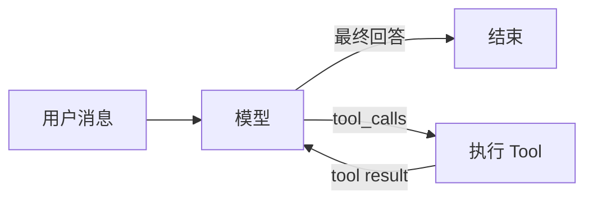
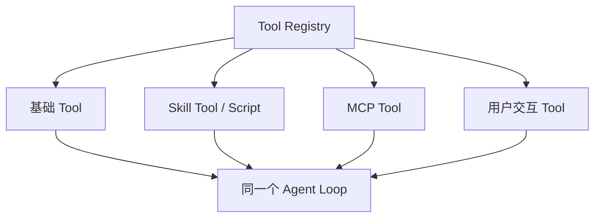
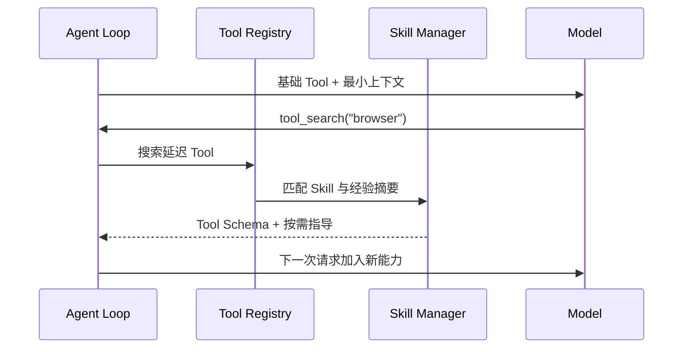
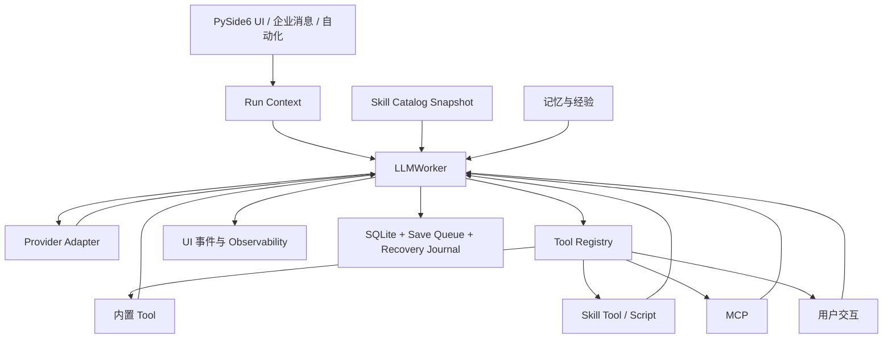

# DeepSeek Cowork 技术设计：从 Agent Loop 到桌面运行时

当前应用版本：**5.1.0**

这份文档不先罗列模块，而从一个最小 Agent Loop 开始。每一节只增加当前
实现中真实存在的一层能力，最后得到 Cowork 的完整运行模型。

## 1. 第一层：最小循环

一个能调用工具的 Agent，底层可以简化为：

```python
messages = [user_message]

while True:
    response = model.generate(messages, tools)
    messages.append(response)

    if not response.tool_calls:
        return response.content

    for call in response.tool_calls:
        result = execute_tool(call.name, call.arguments)
        messages.append(tool_result(call.id, result))
```

循环只有一个关键约束：Tool 的真实结果必须回到消息序列，模型才能基于
结果继续推理。Tool 的调用与结果回填属于对话协议本身。



在 Cowork 中，这个循环的核心位于 `core/agent.py` 的 `LLMWorker`。后续
能力都围绕它扩展，没有替换这个基本结构。

## 2. 第二层：流式响应、多工具与标准消息

真实模型不会总是一次返回完整对象。Cowork 需要在流式事件中分别累积：

- 正文增量；
- reasoning 增量；
- Tool 名称；
- 分段到达的 JSON 参数；
- token 用量和 Provider 错误。

参数收集完成后，运行时重建标准 Tool Call。一次响应可以包含多个调用，
消息顺序必须保持：

```text
assistant(tool_calls)
tool(tool_call_id=A)
tool(tool_call_id=B)
assistant(next response)
```

`tool_call_id` 让 UI 可以把“开始执行”和“收到结果”更新到同一张工具卡，
也让 Provider 能确认每个结果对应哪个调用。历史恢复时，投影层也依赖这套
标准顺序重建同一轮中的思考、阶段回复、工具和最终回答。

## 3. 第三层：统一 Tool Registry

仅有 `execute_tool(name, args)` 无法支持权限、发现和调试。Cowork 使用
`core/tool_registry.py` 为 Tool 建立统一记录：

- 名称、描述和参数 Schema；
- 是否只读；
- 是否具有破坏性；
- 是否需要用户交互；
- 所属 Skill、实现类型和搜索提示；
- 当前是否可直接调用。



常驻 Tool 只保留循环必需的最小集合，例如 `tool_search`、
`run_python_code`、用户交互和记忆入口。其他能力延迟发现，避免一次把所有
Schema 放进 Prompt。

这就是技术层面的 Everything is Tool：可执行动作共享注册、调用、权限、
日志和结果协议。

## 4. 第四层：Tool Search、Skill 与经验

Skill 不构成第二套执行协议。`core/skill_manager.py` 把 Skill 解释为围绕
Tool 的结构化经验包：

- `SKILL.md` 提供工作流和边界；
- `skill.json` 提供发现、配置和运行元数据；
- `tool_refs` 指向可调用 Tool；
- `script_entries` 通过 `run_skill_script` 进入统一执行面；
- `experience/entries.jsonl` 保存结构化经验；
- `references/` 提供按需加载的长资料。

模型需要额外能力时先调用 `tool_search`。搜索结果可以让延迟 Tool 在下一轮
可见，也可以命中相关 Skill。Agent 随后把相应指导作为新的系统上下文追加
到下一次模型请求；用户可见历史保持不变。



经验默认只提供摘要。只有 Skill 明确命中或被用户选择时，运行时才物化完整
指导、经验条目或参考资料。`disclosed_skills` 使用内容哈希避免同一轮重复
注入。

## 5. 第五层：执行安全与依赖

基础循环现在能找到很多 Tool，但仍需控制“能否执行”。

### 工作区边界

每个会话都有明确 `workspace_dir`。独立聊天使用会话专属目录，项目聊天
绑定项目路径。文件 Tool、脚本和交付物扫描都以当前会话工作区为边界。

### 用户交互

- `request_user_input` 收集文本、单选、多选或问卷。
- `request_user_approval` 承担需要明确授权的动作。
- UI 把请求呈现在来源会话内，成功后通过 resolver 或 daemon 响应通道返回。
- 提交失败时输入保留，不能把失败当成用户已同意。

### 并行只读

`parallel_tools` 只接受已经可见、彼此独立且标记为只读的 Tool。写文件、
命令、审批、用户输入、经验更新和子 Agent 管理不会进入这条并行路径。

### Skill 依赖

`DependencyCoordinator` 在 Tool 首次实际调用前准备 Skill 声明的 Python
或 Node 依赖。相同依赖哈希共享 single-flight；成功和失败都会持久化。
失败不会在后续会话静默重试，必须由用户显式重试或依赖声明变化触发。

### 防止空转

同一轮如果连续三次出现完全相同的 Tool 签名，循环停止并提示模型检查已有
结果，避免 Tool 已经返回但模型继续重复调用。

## 6. 第六层：可干预、可停止、可观察

桌面 Agent 不能是一个不可中断的后台函数。`LLMWorker` 增加了：

- 暂停与继续；
- 显式停止；
- 运行中补充引导；
- Provider、参数和 Tool 错误外显；
- step、thinking、message、tool、usage 和 observability 事件。

运行中引导不会强行中断正在执行的 Tool。它先进入待处理队列，在下一个安全
节点追加为新的用户消息，并关闭前一 AI 轮次容器。UI 因而能准确显示
“完成当前步骤后应用”和“已应用”。

Observability 与消息历史分离。稳定系统提示、动态上下文、Skill 披露、
Tool 调用和运行状态可以进入任务观测，但 UI 专用字段不会发送给模型。

应用内轻量反馈统一投影为主内容区右上角下方的主题化 Toast，最多显示三条并
向下堆叠，避开 Windows 原生窗口按钮。系统托盘通知属于独立的 Windows
通知链路，使用稳定的 `deepseek.cowork` AppUserModelID，不把版本号或设备
编号暴露为通知来源名称。

## 7. 第七层：模型协议与请求上下文

当前会话保存“下一轮使用什么模型”，提交时把完整模型配置快照写入
`run_context`。运行中切换模型只影响下一轮，不改变已经启动的 Worker。

模型层支持：

- OpenAI-compatible Chat Completions；
- OpenAI-compatible Responses；
- Anthropic。

Responses Provider 把消息、函数调用和函数结果转换为 typed Items，再把
reasoning、正文、Tool 参数、用量和错误投影回统一事件。Chat Completions
保持传统消息协议。

系统提示分为两部分：

- **稳定前缀**：长期安全策略、Tool 使用规则和交互约束；
- **动态上下文**：工作区、运行模式、模型、记忆、临时 Skill 和本次工作流。

Responses 请求使用稳定的会话级 `prompt_cache_key`。自动命中的 Skill
上下文只参与当前轮，不持久化到历史，减少后续请求前缀漂移。

## 8. 第八层：daemon、自动化与子 Agent

本地 Worker 和 daemon 使用同一运行语义。daemon 负责后台连接、流式事件和
跨界面存活，但实际任务仍创建同一种 `LLMWorker`。

自动化保存提示词、计划、引用 Skill 和可选 Agent：

```text
计划触发
  → 组装 prompt + skill_names + agent_profile
  → 创建会话运行上下文
  → 进入同一个 Agent Loop
  → 记录运行历史
```

`SessionAgentManager` 为子任务创建独立运行记录、上下文和事件流，底层
继续复用 Tool、Agent Loop 和模型协议。主对话只接收需要
回传的结果；完整过程留在观测界面和诊断日志。

## 9. 第九层：持久化与 UI 投影

模型协议消息与界面状态采用两套数据结构。

### 协议消息

持久化保持 OpenAI-compatible 的角色顺序：`user`、`assistant`、`tool`。
这保证历史能够重新进入模型请求，也能跨 Provider 适配。

### UI 时间线

会话元数据中的 `ui_timeline_v1` 保存 thinking、Tool、正文阶段和运行中引导
的展示顺序。`group_id`、`stage_id` 和 `reply_kind` 用来构建
`AssistantTurnGroup`。进入 Worker 前，所有 `ui_*` 字段都会被剥离。

### 可靠保存

1. 首次有效提交先写带 revision 和校验和的恢复快照。
2. 内存会话与侧栏立即更新。
3. `ChatSaveWorker` 合并同会话待保存版本。
4. SQLite 在同一事务中写入会话摘要与消息。
5. 写入确认后，恢复日志才被 acknowledge。
6. 异常退出后按消息 ID 对账，未完成运行标记为中断。

### 设置保存的副作用边界

设置中心以打开页面时的结构化快照为基线，将待保存状态拆成配置、记忆和
外观三个变更分区。配置只通过一次 `batch_save` 落盘；记忆只写入内容变化
的作用域，聊天记录目录变化时才迁移全部记忆；外观只有在草稿、活动主题或
预览状态变化时才提交主题仓库并刷新 Qt 运行时。

本地主题提交在运行时刷新前登记当前仓库时间戳，轮询器不会把自身写入再次
识别为外部修改。任何分区失败时只回滚本次已经触及的配置和记忆，用户输入
与 dirty 状态继续保留，未参与保存的分区不执行 IO、备份或界面刷新。

### 延迟渲染

历史加载在线程中读取和分组。首屏优先物化最终回答；思考、Tool 参数和结果
在用户展开后按时间预算分批创建，避免长历史阻塞 Qt 主线程。

## 10. 当前完整循环

把前面的层次合并后，当前实现可以概括为：

```python
state = load_session_and_run_context()
runtime = clone_skill_catalog_snapshot()
messages = restore_protocol_messages(state)
disclosed_skills = set()

while not stopped:
    wait_if_paused()
    append_guidance_at_safe_point(messages)
    runtime.apply_latest_snapshot_at_request_boundary()

    stable_prompt = build_stable_system_prompt()
    dynamic_prompt = build_runtime_context(
        workspace=state.workspace,
        memory=state.memory,
        workflow=state.workflow,
        disclosed_skills=disclosed_skills,
    )
    tools = runtime.visible_tool_schemas()

    response = stream_model(stable_prompt, dynamic_prompt, messages, tools)
    assistant_message = rebuild_assistant_message(response)
    messages.append(assistant_message)
    emit_ui_and_observability_events(response)

    if not assistant_message.tool_calls:
        persist_and_finish(messages)
        break

    stop_if_same_calls_repeat_three_times(assistant_message.tool_calls)

    for call in assistant_message.tool_calls:
        validate_visibility_schema_permission_and_dependencies(call)
        result = execute_through_tool_registry(call)
        messages.append(tool_message(call.id, result))
        emit_tool_result(call.id, result)

        if call.name == "tool_search":
            disclose_matched_skills_for_next_request(result, disclosed_skills)

    checkpoint_session(messages)
```



## 11. 主要源码入口

- `core/agent.py`：核心循环、提示上下文、Tool 调度与运行事件
- `core/tool_registry.py`：Tool 元数据、可见性和只读/危险属性
- `core/skill_manager.py`：Skill、经验、脚本、MCP 与渐进披露
- `core/daemon.py`：后台请求、流式事件和 Worker 托管
- `core/agent_manager.py`：子 Agent 生命周期和事件
- `core/chat_storage.py`：SQLite 会话与交付物索引
- `core/chat_save_queue.py`：版本化异步保存
- `core/chat_recovery_journal.py`：异常退出恢复
- `core/theme_package.py`、`core/theme_service.py`：声明式 AI 主题与事务边界
- `main.py`：桌面 UI、会话状态和协议消息到界面的投影
