# DeepSeek Cowork 用户指南

从第一次打开，到让 AI 帮你完成真实工作。

适用版本：**5.0.9**

本手册面向第一次使用桌面 Agent 的普通用户。

## 先看这一页：你只需要记住三件事

| 要点 | 用最简单的话理解 | 第一次使用时怎么做 |
| --- | --- | --- |
| 模型 | 就是负责思考和回答的 AI。 | 先在“设置 → 模型与服务”配置一个可用模型。 |
| 工作区 | 就是允许 AI 读写文件的文件夹。 | 普通聊天先用默认目录；要处理自己的文件时再连接项目。 |
| 交付物 | 就是 AI 最后生成的文件。 | 从右侧“文件与交付物”里预览、打开或继续转换。 |

> 第一次成功的标准 能够选择一个模型，在聊天框里发送“请用三句话介绍你能帮我做什么”，并收到完整回答，就说明最基础的配置已经完成。

### 本手册怎么读

- 如果你还没安装：从第 1 章开始。

- 如果已经能打开应用但不能聊天：直接看第 2 章。

- 如果想让 AI 处理本地文件：看第 5 章。

- 如果想生成 PPT、DOCX 或 PDF：看第 9～10 章。

- 如果遇到报错或不知道下一步：看第 16 章。

### 目录

- 1. 下载、解压和启动

- 2. 第一次配置模型

- 3. 看懂主界面

- 4. 完成第一次对话

- 5. 独立聊天、项目与文件安全

- 6. 添加文件和图片

- 7. 把要求说清楚

- 8. 看懂执行过程并中途调整

- 9. 查看文件与交付物

- 10. 生成 PPT、DOCX 和 PDF

- 11. 能力、Agent 与 Skill

- 12. 自动化任务

- 13. 记忆、归档、更新与组件

- 14. 浏览器自动化与企业消息

- 15. 常用任务照着说

- 16. 常见问题与安全建议

- 附录：快捷操作、名词解释和截图清单

## 1. 下载、解压和启动

这一章只讲普通 Windows 用户需要做的事情，不需要安装 Python，也不需要输入命令。

### 1.1 下载应用

- 打开 DeepSeek Cowork 的 GitHub Releases 页面：https://github.com/chuancyzhang/deepseek-cowork/releases。

- 找到带有“Latest”标记的最新版。

- 在下载区域选择 Windows ZIP 压缩包并保存到电脑。

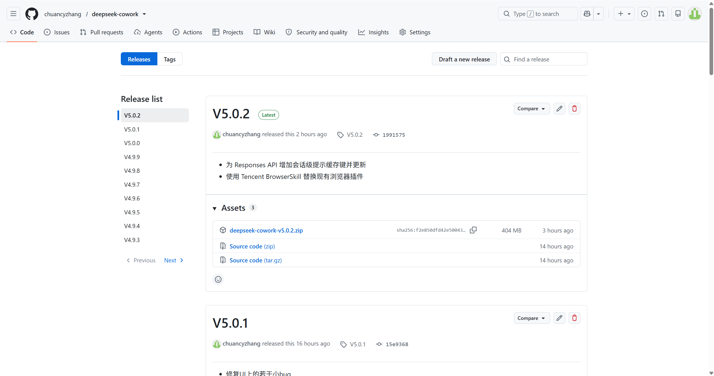

*截图 S01 在 Releases 页面下载最新版*

> 安全提醒 只从项目正式 Releases 页面下载安装包。不要从不认识的网盘、聊天群或第三方下载站获取。

### 1.2 解压并启动

- 在下载文件夹中找到 ZIP 压缩包。

- 右键选择“全部解压”，或使用你熟悉的解压软件。

- 打开解压后的文件夹，双击 deepseek-cowork.exe。

- 如果 Windows 显示安全提醒，先核对文件来源和版本，再决定是否继续。

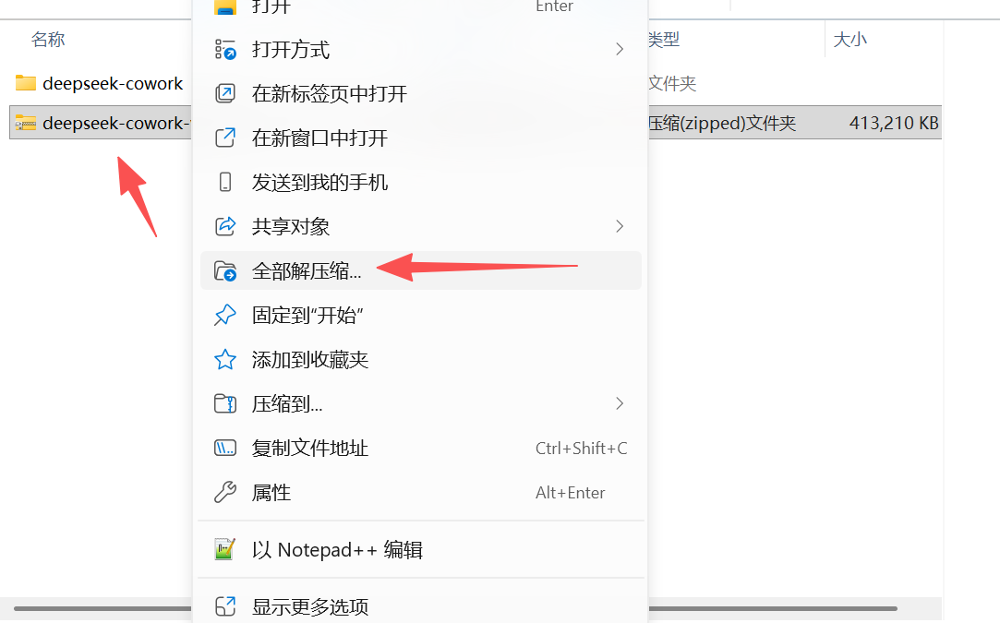

*截图 S02 解压下载的 ZIP*

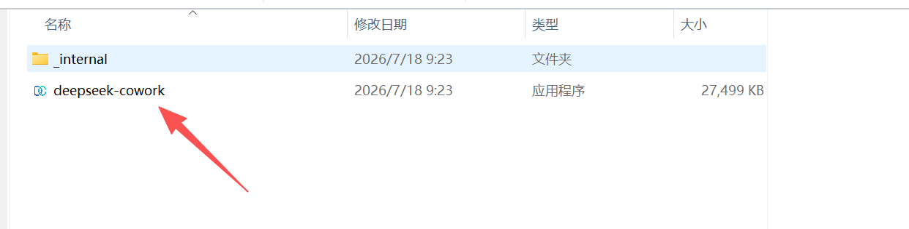

*截图 S03 启动 DeepSeek Cowork*

> 不要这样做 不要直接在 ZIP 压缩包内部双击运行程序。请先完整解压，否则更新、运行组件或保存数据时可能出现问题。

## 2. 第一次配置模型

Cowork 是工作台，真正负责回答问题的是你配置的模型服务。没有可用模型时，应用能打开，但不能正常对话。

### 2.1 先准备好什么

- 一个你有权使用的 AI 模型服务。

- 该服务提供的 API 地址和 API Key（访问密钥）。

- 一个可用的模型名称。

> 什么是 API Key？ 可以把它理解成模型服务的“专用密码”。它通常与计费账户关联。不要把它发到群里、放进截图或复制给不可信的人。

### 2.2 打开模型设置

- 点击左下角“设置”。

- 在设置页面左侧选择“模型与服务”。

- 添加一个模型服务渠道，填写服务地址和 API Key。

- 点击“新增模型”，填写模型名称和必要选项。

- 点击页面底部固定的“保存设置”。

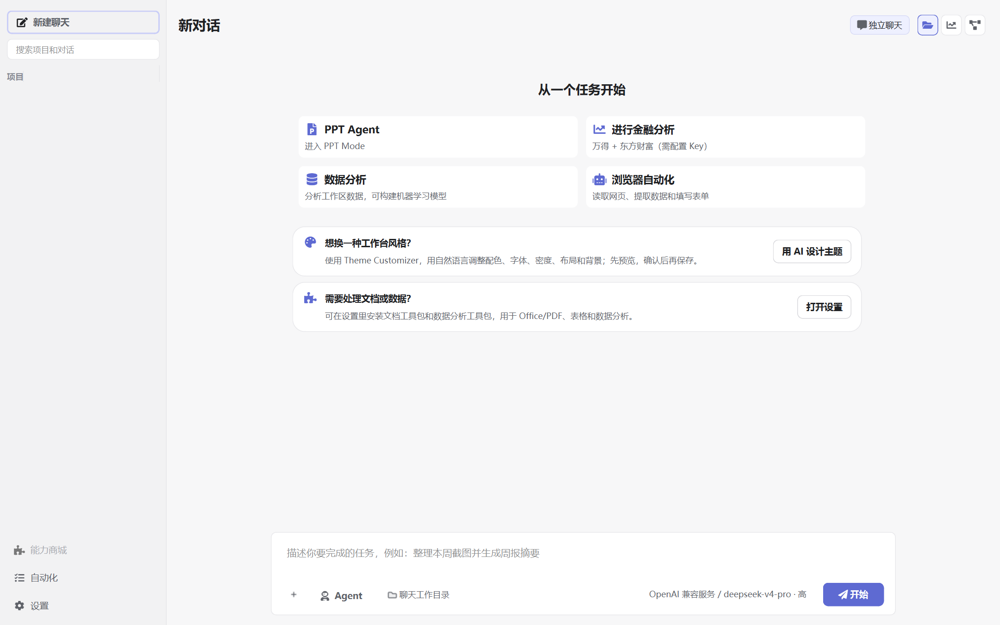

*截图 S04 主界面和设置入口*

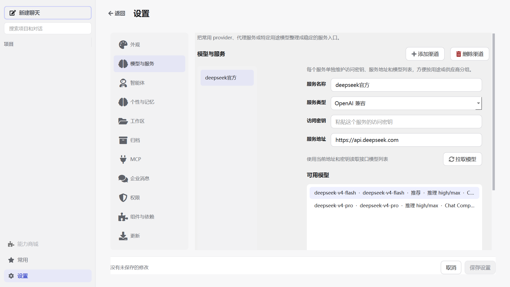

*截图 S05 模型与服务页面*

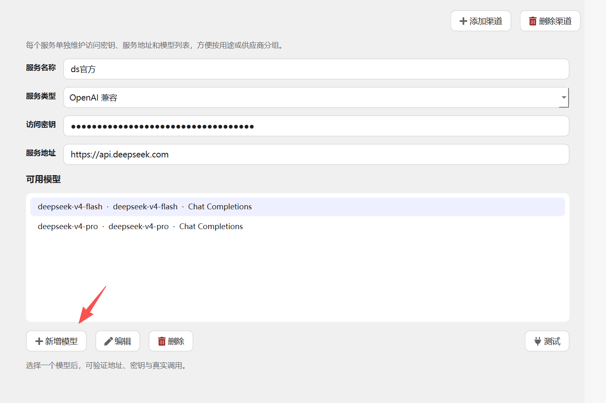

*截图 S06 新增模型*

### 2.3 不懂参数时怎么选

| 设置项 | 普通用户怎么理解 | 建议 |
| --- | --- | --- |
| 模型名称 | 服务商给出的模型标识。 | 照服务商控制台或管理员给你的名称填写。 |
| 协议 | 应用和模型服务说话的方式。 | 不确定时使用渠道或项目已有的推荐值；GPT‑5.6 新建项默认 Responses。 |
| 思考强度 | AI 在回答前投入多少推理。 | 普通任务从“中”开始；越高通常越慢、用量也可能更大。 |
| 支持图片理解 | 模型能否看懂你粘贴的图片。 | 只有服务商明确支持图片时才打开。 |

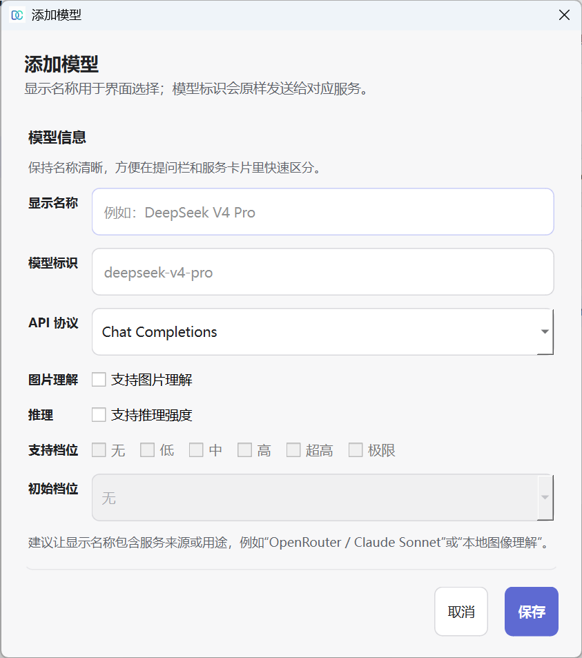

*截图 S07 填写模型配置*

### 2.4 验证配置是否成功

- 返回聊天页面。

- 点击输入框下方的模型按钮，选择刚配置的渠道和模型。

- 发送：“请用三句话介绍你能帮我做什么。”

- 能收到完整回答，说明基础配置成功。

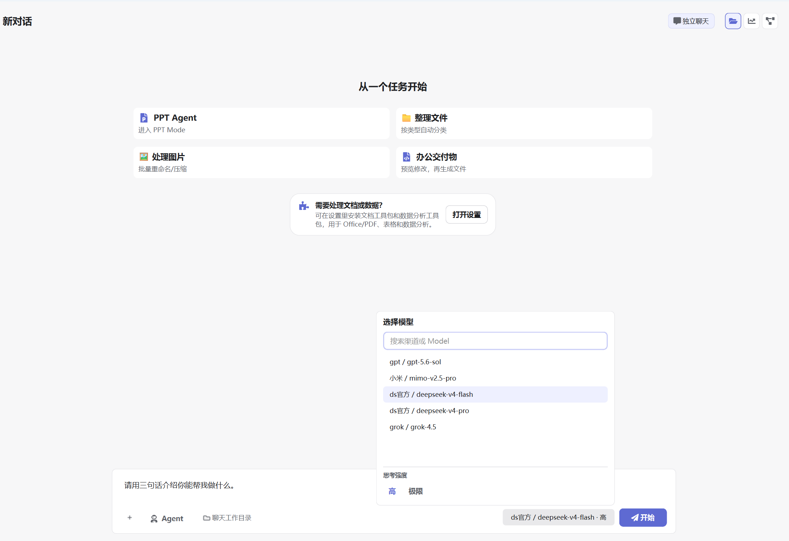

*截图 S08 切换模型并设置思考强度*

> 如果仍显示“未配置模型” 回到“设置 → 模型与服务”，确认渠道和模型都已经添加，并且最后点击了“保存设置”。

## 3. 看懂主界面

主界面可以理解成四个区域：左边找任务，中间聊天，下面输入，右边看文件和过程。

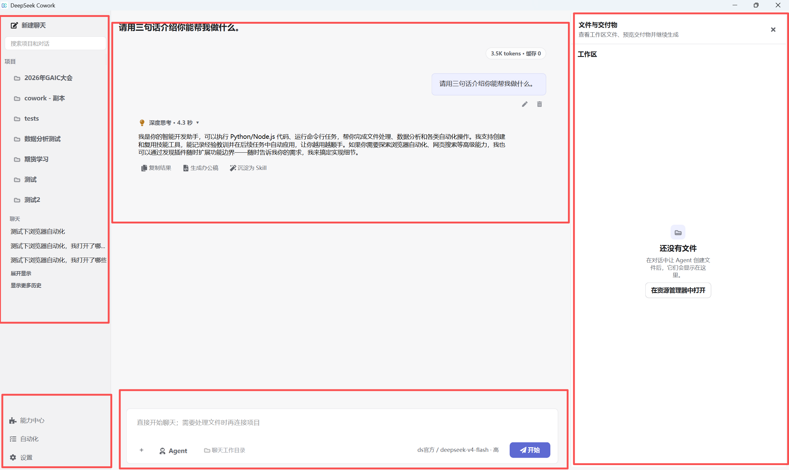

*截图 S09 主界面区域总览*

| 区域 | 主要用途 | 最常用操作 |
| --- | --- | --- |
| 左侧导航 | 管理项目、对话和主要功能入口。 | 新建对话、切换历史、打开能力/自动化/设置。 |
| 中央对话区 | 查看你的要求、AI 的过程和最终回答。 | 复制结果、生成办公稿、编辑历史消息。 |
| 底部输入区 | 输入任务和添加上下文。 | 输入文字、粘贴图片、添加文件、选模型或 Agent。 |
| 右侧抽屉 | 查看文件、交付物、任务观测和子 Agent。 | 预览文件、查看工具过程、打开生成结果。 |

> 窗口较小时 优先保证中间对话和输入区可用。右侧抽屉可以关闭，需要时再打开；界面内容可通过滚动查看。

## 4. 完成第一次对话

第一次不要从复杂任务开始。先用一个没有文件、不会改动电脑内容的小任务熟悉流程。

### 4.1 新建独立聊天

独立聊天不需要先选择项目。系统会为这个对话自动准备一个单独的聊天工作目录，AI 生成的文件会放在那里。

- 新建一个对话。

- 确认输入区下方已经选中可用模型。

- 在输入框里写清楚任务。

- 按 Enter 或点击发送。

- 等待最终回答出现。

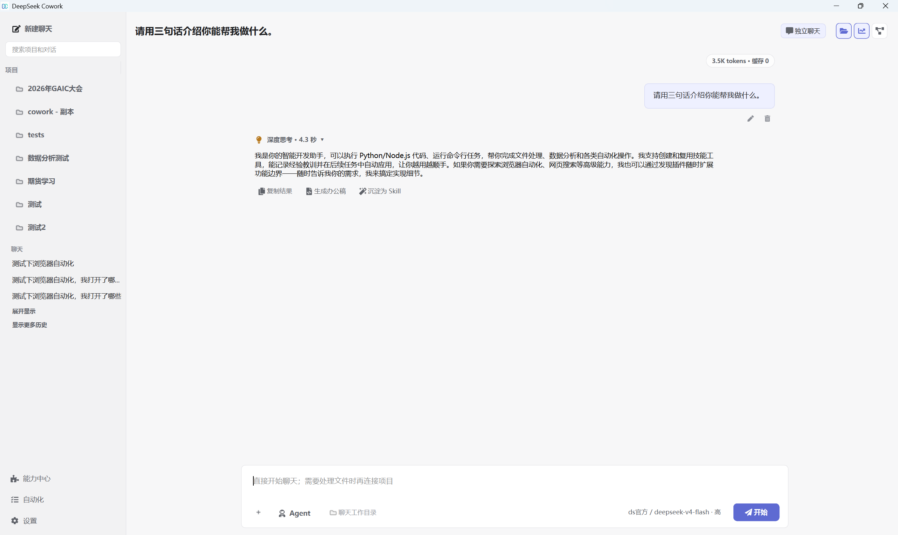

*截图 S10 独立聊天界面*

### 4.2 第一个任务示例

> 可以直接复制 请帮我写一封请假邮件。对象是部门负责人，原因是明天下午去医院复查，语气礼貌、简短，控制在 150 字以内。先给出邮件主题，再给出正文。

这个例子之所以好，是因为它交代了对象、原因、语气、长度和输出格式。AI 不需要猜测，就更容易一次给出可用结果。

### 4.3 收到回答后能做什么

- 继续追问：例如“语气再自然一点”。

- 复制：选中文字后按 Ctrl+C，或使用消息上的复制操作。

- 生成办公稿：把最终回答继续整理成可预览的文档或演示工作稿。

- 沉淀为 Skill：把反复使用的做法保存成可复用能力；新手可先跳过。

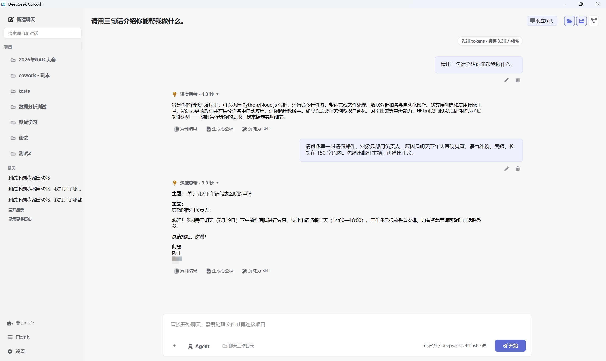

*截图 S11 一轮完整对话*

## 5. 独立聊天、项目与文件安全

只聊天时用独立聊天；要让 AI 读取或修改你已有的文件时，再连接项目。

### 5.1 两种聊天有什么区别

| 类型 | 适合什么情况 | 文件在哪里 |
| --- | --- | --- |
| 独立聊天 | 写文案、想点子、临时分析、生成全新文件。 | 自动创建的聊天工作目录。 |
| 项目聊天 | 处理某个真实文件夹中的文档、代码、资料或交付物。 | 你明确选择的项目文件夹。 |

> 最重要的安全边界 连接项目后，AI 可以在授权范围内读取、创建或修改该文件夹中的内容。不要把整个磁盘、系统目录或含大量无关隐私的目录直接当成项目。

### 5.2 添加项目

- 先在电脑上准备一个专门的文件夹，放入本次任务真正需要的文件。

- 点击左侧项目区域的“+”，或在空白对话的项目选择器中点击“添加新项目”。

- 选择准备好的文件夹。

- 在新的空白对话中选择该项目。

- 告诉 AI 要处理哪个文件、要得到什么结果，以及哪些内容不能改。

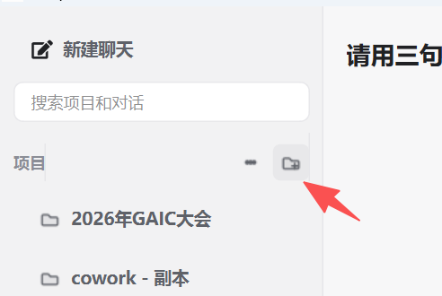

*截图 S12 添加新项目*

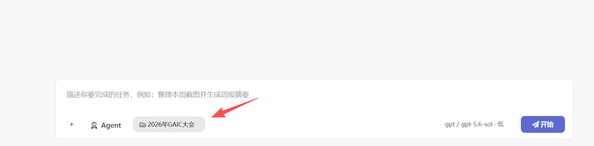

*截图 S13 项目选择器*

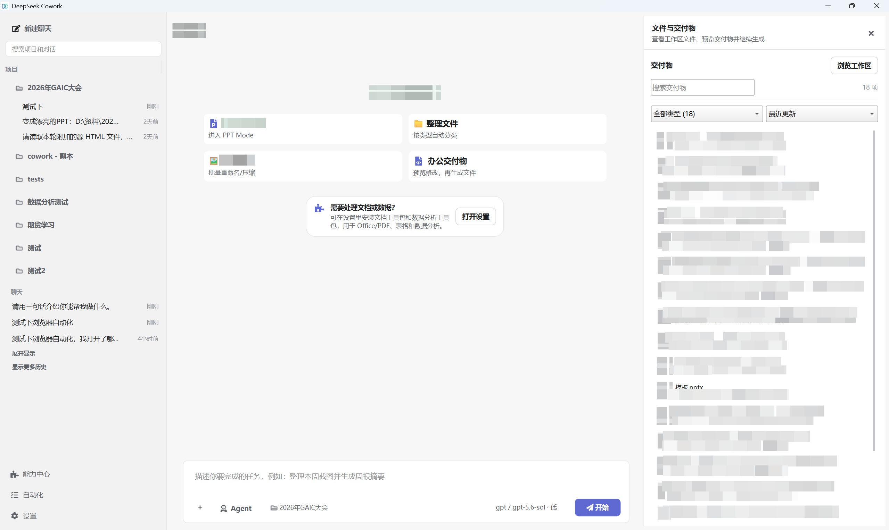

*截图 S14 已连接项目的工作区*

### 5.3 项目使用规则

- 只有空白、尚未发送消息的对话可以切换项目。

- 已有消息或正在运行任务的对话不能改绑项目；请新建空白对话。

- 归档项目只是让它从日常列表中隐藏，不会删除电脑里的项目文件夹。

- 项目展开默认显示最近 5 个对话；正在运行或等待输入的对话始终保留在展开列表中。

- 项目收起后不会自动展开，但项目行会继续显示内部运行状态。切换到其他对话不会中断任务，原会话行的运行圆环会持续显示。

- 空白聊天不会出现在历史中；第一次成功发送后会立即显示在左侧栏。消息会先写入本地恢复记录，再由后台保存到 SQLite；若应用异常退出，下次启动会自动恢复尚未完成保存的内容。

- 项目和对话都可以重命名；聚焦对应行后按 F2 也可以开始重命名。

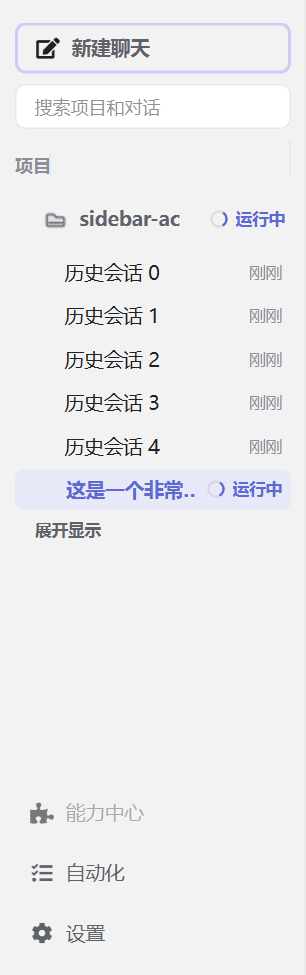

*长标题和最小侧栏宽度下，项目及会话的运行状态仍保持可见*

### 5.4 让 AI 修改文件前

- 对重要文件先保留备份。

- 先让 AI 说明将修改哪些文件，再确认执行。

- 批量改名、删除、覆盖或移动文件时，把允许操作的范围写清楚。

- 需要保留原文件时，明确要求“另存为新文件，不要覆盖原文件”。

## 6. 添加文件和图片

文件用于给 AI 提供资料，图片可以直接从剪贴板粘贴。是否能看懂图片，取决于当前模型能力。

### 6.1 添加文件

- 点击输入工具栏中的“+”。

- 选择添加文件。

- 选择本次任务需要的文件。

- 在文字要求里说明每个文件的用途，例如“以 A 为模板，以 B 为内容来源”。

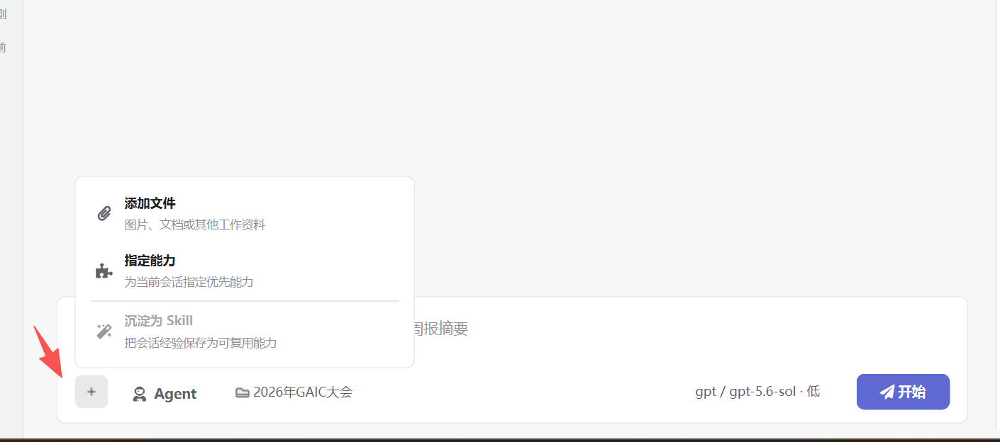

*截图 S15 输入区“+”菜单*

> 文件太大时 AI 可能不会把整个文件直接放进一次请求，而会通过工作区工具按需读取。请保留文件在当前工作区，并把文件名和目标说清楚。

### 6.2 粘贴图片

- 先把图片复制到剪贴板。

- 点击对话输入框。

- 按 Ctrl+V，或右键选择“粘贴”。

- 确认输入框上方出现图片缩略图。

- 输入你希望 AI 对图片做什么，再发送。

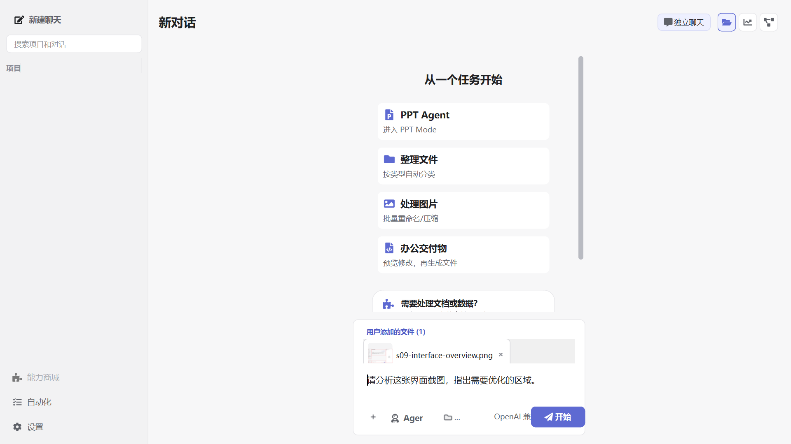

*截图 S16 粘贴图片后的输入区*

> 无法发送图片 如果当前模型没有启用图片理解，应用会保留图片并阻止发送。请切换到支持图片的模型，或在模型配置中核对能力。

## 7. 把要求说清楚

AI 完成任务的质量取决于模型能力，也取决于你给出的上下文、目标和边界。

### 7.1 万用任务公式

> 任务公式 请帮我【做什么】，依据【哪些资料】，面向【谁】，要求【语气/长度/格式/风格】，把结果保存为【文件名或格式】，不要【禁止事项】，完成后请【验收方式】。

| 部分 | 例子 |
| --- | --- |
| 做什么 | 整理会议纪要并提取待办事项。 |
| 依据什么 | 依据项目文件夹中的“会议录音转写.txt”。 |
| 面向谁 | 给未参加会议的部门负责人阅读。 |
| 具体要求 | 先写结论，再写决定事项、负责人和截止时间。 |
| 输出形式 | 另存为“会议纪要_确认版.docx”。 |
| 禁止事项 | 不要修改原始转写，不要猜测未确认的负责人。 |
| 验收方式 | 完成后列出生成文件路径和仍需人工确认的内容。 |

### 7.2 不清楚时也可以这样说

> 可以直接复制 我不熟悉这个任务。请先根据我的目标提出一份简单方案；如果有会明显改变结果的关键信息，再问我。不要一次问很多问题。

### 7.3 修改结果时，指出差异

- 不要只说“再好一点”，可以说“开头更直接，删掉套话，保留事实”。

- 不要只说“做得高级”，可以说“浅色、简洁、少装饰，重点突出结论”。

- 引用具体位置，例如“第二段太长，拆成 3 个要点”。

- 明确哪些内容已经满意，例如“标题和结构保留，只改正文语气”。

## 8. 看懂执行过程并中途调整

有些任务只需要回答，有些任务会读取文件、运行工具或生成交付物。Cowork 会把这些过程组织在同一轮对话中。

### 8.1 深度思考和工具

“深度思考 · 用时”表示模型在分析任务。工具行表示应用正在读取文件、运行命令、生成文件或调用某项能力。一般情况下，你只需要看最终回答；需要核对时再展开过程。

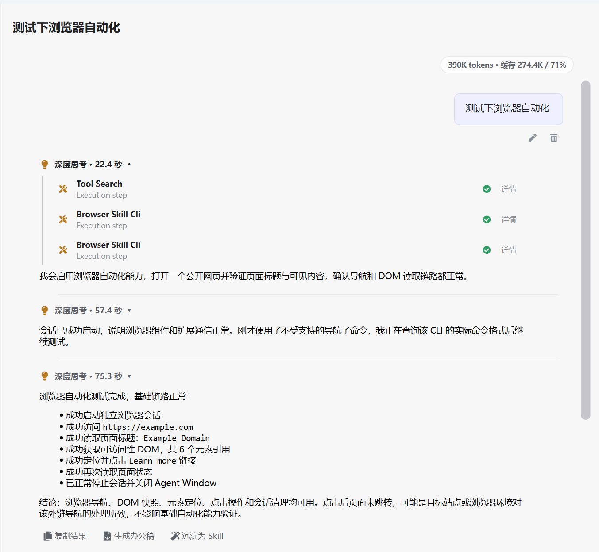

*截图 S17 展开深度思考和工具*

### 8.2 任务运行中补充要求

任务运行时仍可以发送补充引导。系统会在安全节点应用，不会突然取消已经启动的工具。

| 状态 | 表示什么 |
| --- | --- |
| 等待下一安全节点 | AI 正在处理，稍后会把补充要求加入后续步骤。 |
| 完成当前步骤后应用 | 某个工具已经启动，当前步骤结束后再应用。 |
| 已应用 | 补充要求已经进入后续处理。 |

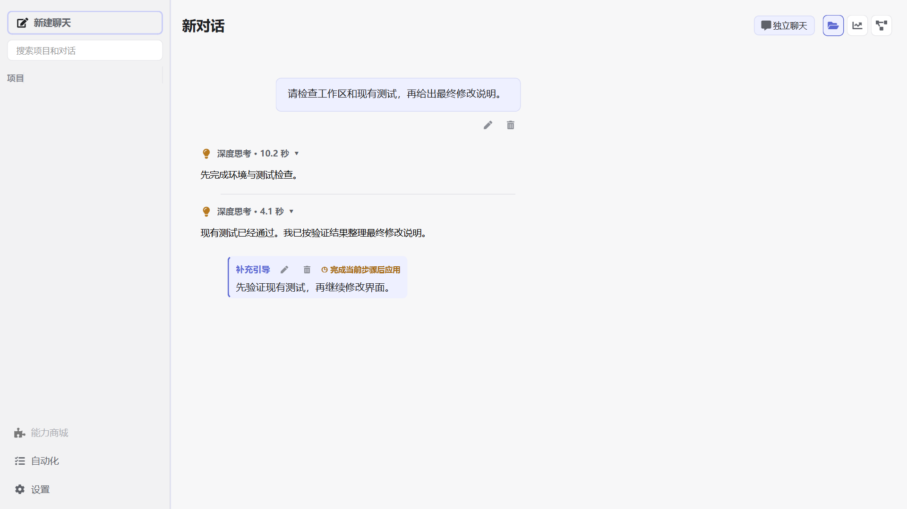

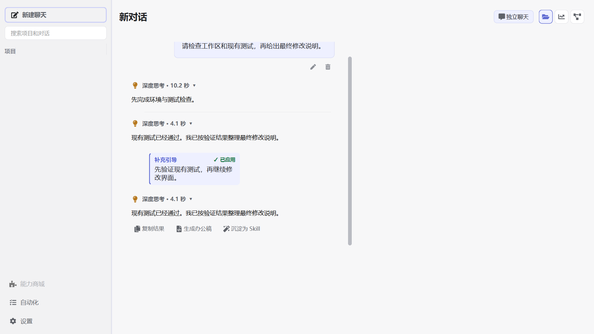

*截图 S18 运行中补充引导*

### 8.3 编辑历史消息并重新生成

如果早先的要求写错了，可以把那条用户消息原位改成编辑器，选择“保存并重新生成”。这会替换该消息之后的对话内容，但不会删除已经生成的工作区文件。

编辑确认后，界面只替换这条消息及其后续分支；目标之前已经显示的消息、展开状态和阅读位置会保持不变，不会从会话开头重新回放。若界面无法可靠定位这条历史消息，应用会阻止替换并提示重新打开会话，不会用全量重载掩盖问题。

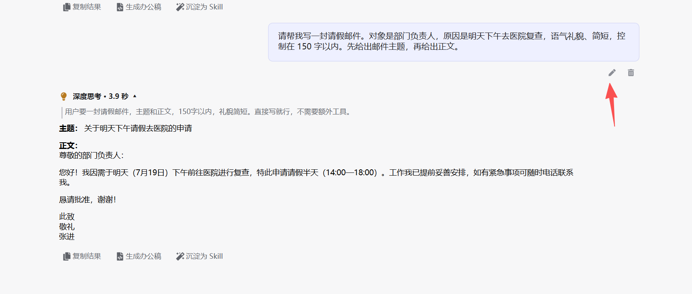

*截图 S19 编辑历史用户消息*

> 注意 重新生成只改变对话历史。已经写到磁盘上的文件仍然存在，需要你单独检查、保留或删除。

### 8.4 打开长历史与执行详情

打开长会话时，Cowork 会先在后台读取记录，再逐条呈现最近 12 个对话摘要。历史 AI 轮次优先显示最终答复；只有该轮包含思考、阶段回复或工具调用时，才会出现“执行过程”入口。展开后完整过程会按原顺序分批恢复，折叠不会销毁已经加载的内容。

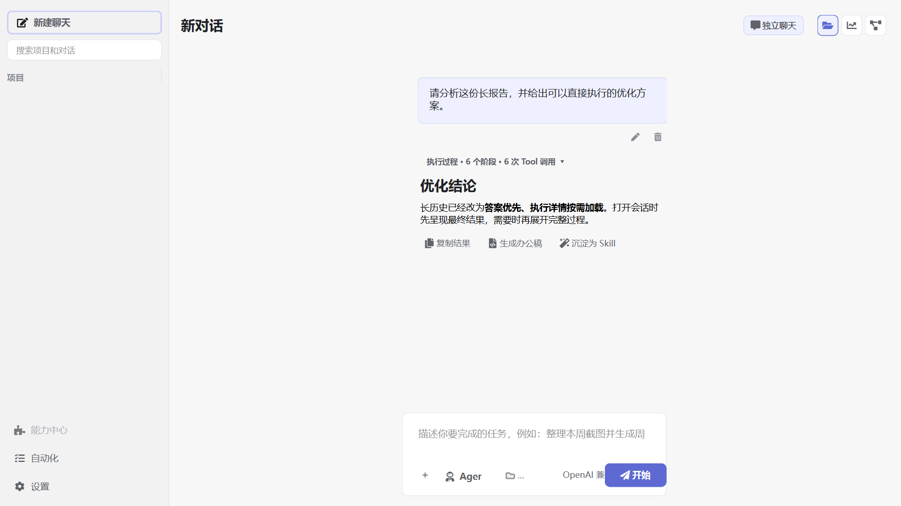

*截图 S37 长历史答案优先与执行详情按需加载*

### 8.5 查看任务观测

需要了解 AI 调用了什么工具时，打开右侧“任务观测”。“调用记录”适合普通核对；“技术详情”主要给排错人员使用，包含参数、代码、输出和错误。

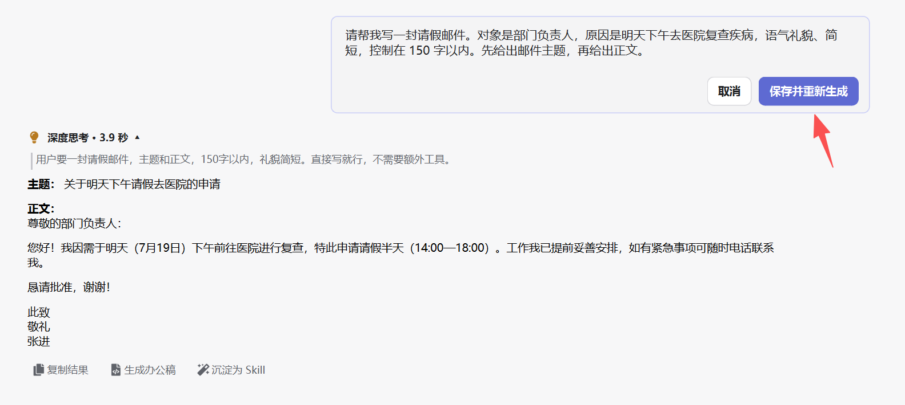

*截图 S20 任务观测*

## 9. 查看文件与交付物

AI 生成文件后，不必先去资源管理器里找。右侧“文件与交付物”可以直接预览和继续操作。

会话顶部的项目名/“独立聊天”按钮和旁边的“文件与交付物”按钮都会打开当前会话的实际工作区。即使刚刚从左侧浏览过其他项目，也不会继续显示上一次目录；当前目录已被移动、删除或无法访问时，界面会直接说明原因。

### 9.1 文件和交付物的区别

| 名称 | 含义 | 例子 |
| --- | --- | --- |
| 工作区文件 | 当前聊天目录或项目目录中的普通文件。 | 原始资料、附件、临时文件。 |
| 交付物 | 系统识别或你手动标记为结果的文件。 | 报告、HTML 工作稿、PPTX、DOCX、PDF。 |

### 9.2 打开和预览

- 打开右侧“文件与交付物”。

- 如果已有结果，先在“交付物”列表中找；需要看全部文件时点击“浏览工作区”。

- 点击文件进入详情。

- 根据文件类型使用“预览”或“源码”。

- 需要在 Windows 中处理时，选择在资源管理器中打开。

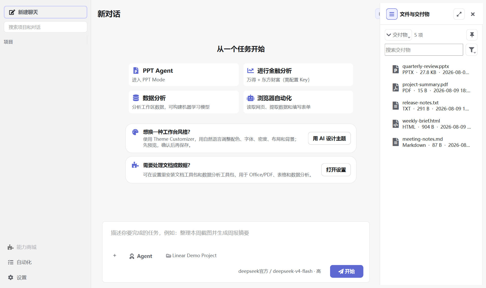

*截图 S21 交付物列表*

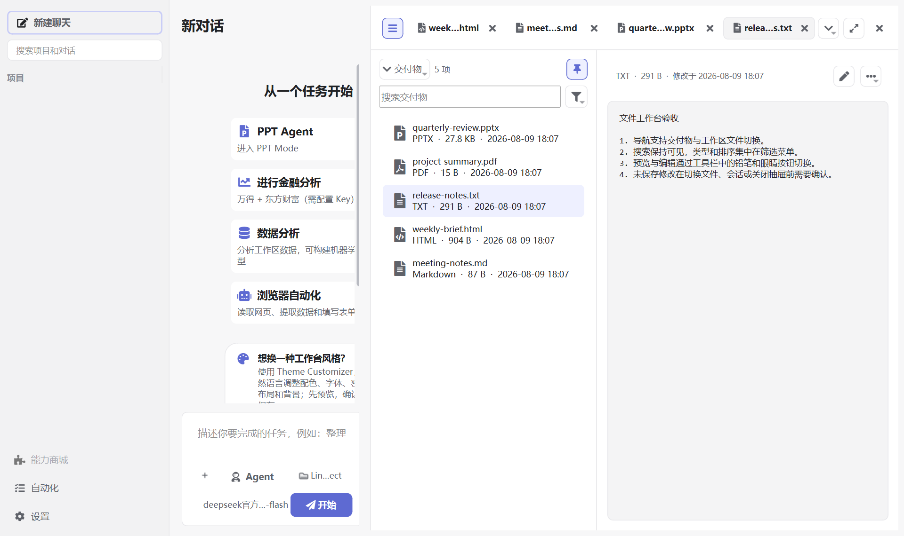

*截图 S22 交付物预览*

当前可内嵌预览 Markdown、HTML、图片、PDF、DOCX、PPTX 和 XLSX。旧版 DOC、PPT、XLS 需要先转换为新版格式。

> 预览没有自动刷新 如果同一个文件在后台被修改，应用会保留你正在看的内容并提示手动刷新，避免阅读位置突然跳动。

### 9.3 找不到生成文件

- 先看对话最后的回答是否给出了完整文件路径。

- 查看生成任务卡下方是否有文件卡片。

- 在“文件与交付物”中清除筛选并切换排序。

- 点击“浏览工作区”查看真实目录树。

- 仍找不到时，让 AI 明确回复：“请告诉我刚才生成文件的完整路径，不要重新生成。”

## 10. 生成 PPT、DOCX 和 PDF

推荐先生成可预览的 HTML 工作稿，确认内容和样式，再转换成最终办公文件。

### 10.1 从一条 AI 回答生成办公稿

- 先通过对话得到内容完整的最终回答。

- 在回答末尾点击“生成办公稿”。

- 选择自由、PPT、设计稿或 DOCX 类型。

- 等待任务卡显示真实交付物文件。

- 在右侧预览工作稿，并继续提出修改要求。

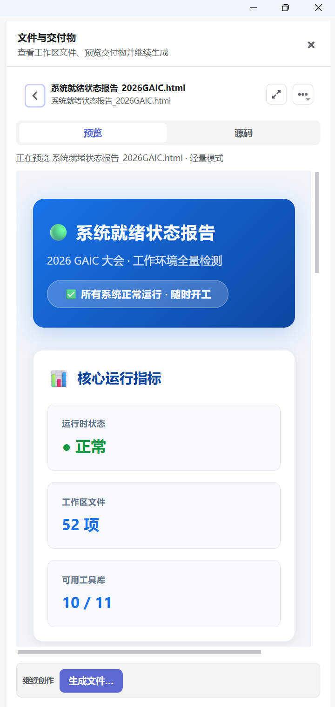

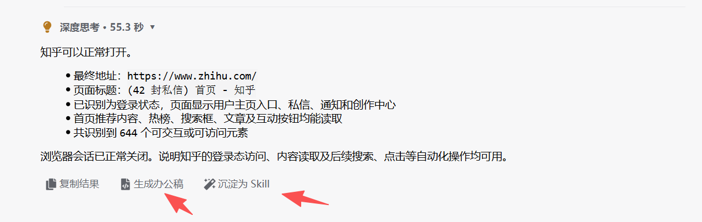

*截图 S23 生成办公稿*

### 10.2 使用 PPT Agent

如果目标本来就是演示文稿，可以从新会话首页的“PPT Agent”卡片，或输入工具栏“Agent → PPT Agent”进入。填写主题、受众、页数、风格和资料，可按需附加 PPTX 模板。

- 打开 PPT Agent。

- 说明演示目的、受众、预计页数和必须包含的内容。

- 选择自动策略或你需要的演示偏好。

- 按需添加参考资料或 PPTX 模板。

- 提交后先检查 HTML 演示工作稿。

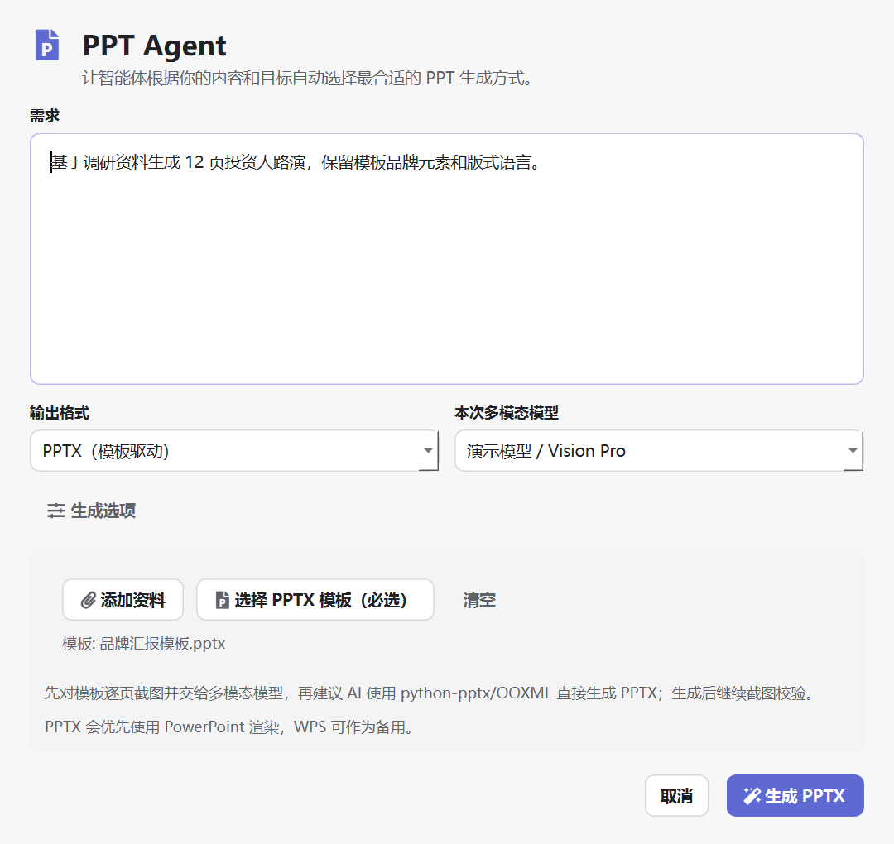

*截图 S24 PPT Agent*

> 模板的作用 选择 PPTX 模板后，后续转换会尽量继承模板的主题、母版、字体、配色、版式节奏和顶部/底部装饰。模板只控制视觉与结构，正文内容仍以工作稿为准。

### 10.3 从 HTML 生成最终文件

- 在交付物预览中打开 HTML 工作稿。

- 确认每一页的内容、顺序和视觉效果。

- 点击底部“生成文件…”。

- 选择 PPTX、DOCX 或 PDF。

- 生成 PPTX 时，选择“选择模板”或“直接生成”。

- 等待完成通知，再从交付物列表打开最终文件。

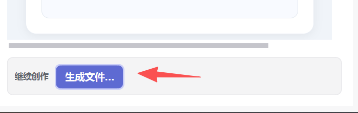

*截图 S25 从 HTML 生成文件*

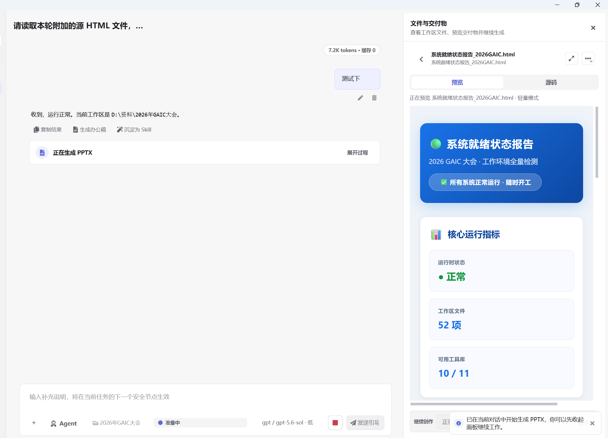

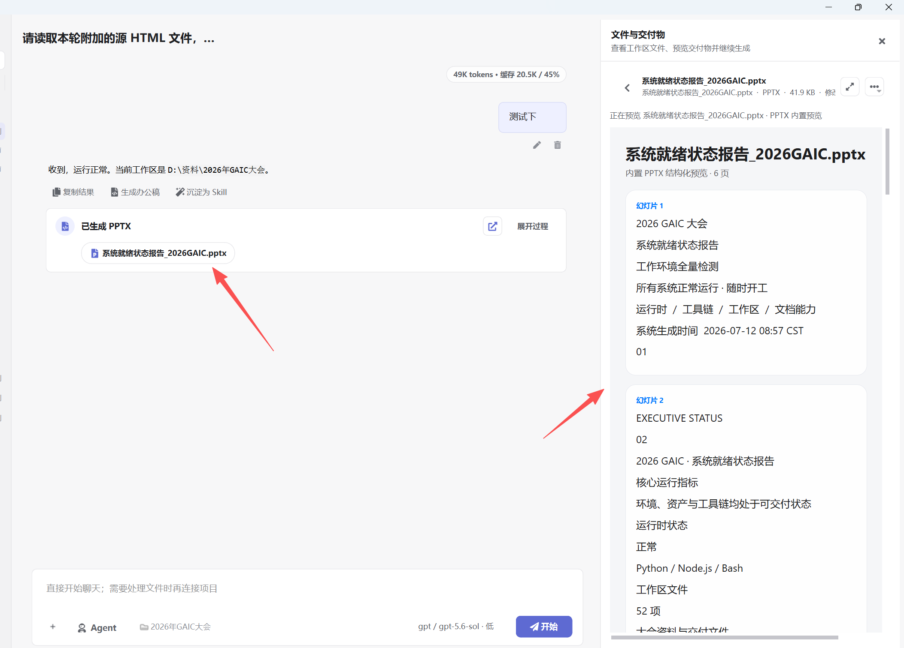

*截图 S26 生成完成后的文件*

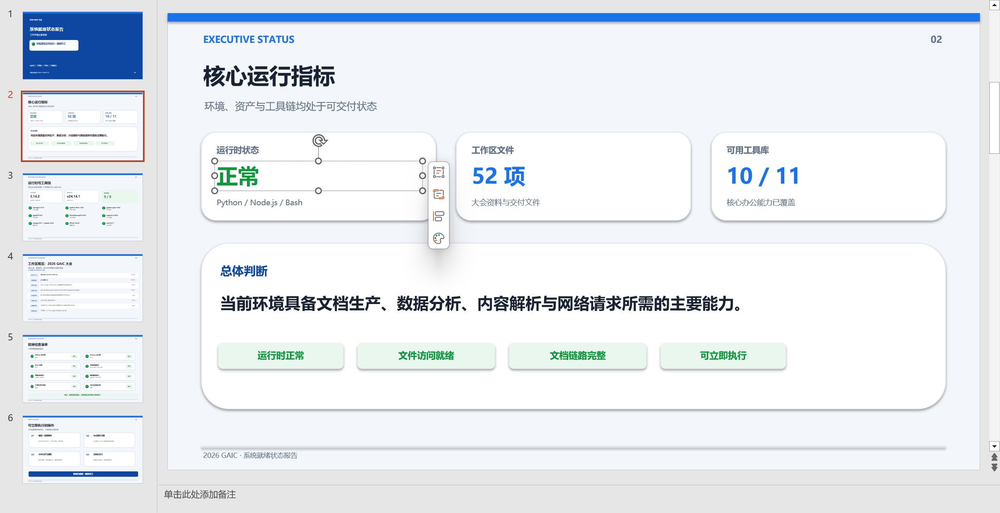

*截图 S27 在 PowerPoint 中继续编辑*

### 10.4 PPT 任务写法示例

> 可以直接复制 请制作一份 10 页以内的项目汇报，面向不熟悉项目的管理层。先讲结论，再讲进展、问题、风险和下周行动。整体使用浅色、简洁、低装饰风格，每页只表达一个重点。先生成可预览的 HTML 演示工作稿，不要直接生成 PPTX。

## 11. 能力、Agent 与 Skill

这三个词容易混淆。简单说：能力是工具，Agent 是带特定工作方式的助手，Skill 是可复用的经验包。

| 名称 | 普通用户怎么理解 | 什么时候用 |
| --- | --- | --- |
| 能力 | 给 AI 增加一种工具或连接。 | 需要搜索网页、处理文档、访问 MCP 服务等。 |
| Agent | 预先设定角色、规则和能力范围的助手。 | 长期重复做同一类任务，或使用 PPT Agent。 |
| Skill | 告诉 AI 某类任务应该怎样做的经验包。 | 把成熟流程沉淀下来，或安装别人提供的标准能力包。 |

### 11.1 AI 能力商城

- 点击左下角“能力商城”。

- 在“发现能力”中选择“查找资料、处理文档、分析数据、制作内容、金融研究”等任务场景。

- 每张能力卡片直接说明“能帮你做什么”和两个典型任务，不需要理解插件、Tool 或 MCP。

- “我的能力”单独展示由你创建、AI 生成或手动导入的能力，不会被强行归入官方场景。

- 未开启的能力显示“开启”；需要账号或密钥时显示“设置后开启”。

- 已开启的能力显示“✓ 已开启”，并在同一张卡片中直接提供“关闭”；有运行设置时同时提供“设置”。

- “浏览器自动化”会把所需文件准备、浏览器扩展安装、连接检查和最终开启放在同一个能力详情中。只有浏览器真正连接后才显示“✓ 已开启”，不需要前往设置页理解组件或依赖。

- 设置保存失败会保留输入并显示原因，不会在失败后开启能力。

- Tool、Script、MCP、文件编辑、导入导出和调试收进右上角“高级管理”，不会干扰普通浏览。

- 能力创建、更新、启停、删除或依赖准备完成后，结果显示在主界面右上角下方的系统 Toast 中；提示会避开 Windows 顶部窗口按钮，不会作为 AI 回复插入主聊天。

#### 通过链接安装远程 Skill

可以直接告诉 AI：“阅读 `https://example.com/skill.md` 安装这个能力”。AI 会把任务交给远程 Skill 安装专用 Agent：

- 第一步只读取入口、检查仓库并生成固定安装预览，不会执行入口里的 `npx`、Git 或 Shell 命令。
- 仓库目录和固定提交由安装器自动核验，无需反复选择镜像、安装范围或手工提供 commit。
- 预览会列出来源、commit、准备安装的 Skill、脚本风险和 API Key 等配置项。确认前不会写入能力目录。
- 只有你明确同意后，Cowork 才安装刚才预览的同一份快照；预览 30 分钟后过期，也不能跨会话复用。
- 已有同名 Skill 时安装会停止，不会覆盖或静默更新。
- 安装后需要 Key 的能力会显示“待设置”。填写后点击“保存并开启”即可；密钥不会写入上游 `.env` 或脚本，只在运行时临时注入。
- 如果入口确实无法确定必需 Skill，系统只询问一次必要信息，不会通过浏览器补证或反复改写请求校对。

远程入口和仓库内容都按不可信数据处理。专用 Agent 没有 Shell、文件写入或密钥访问能力；入口文档即使要求忽略规则、打开浏览器或覆盖配置，也不会因此获得额外权限。

#### 配置网页搜索

开启“网页搜索”后，点击“设置”：

- “默认搜索服务”可以选择 AnySearch 或 Tavily，AI 也可以在单次搜索中显式指定另一服务。
- AnySearch API Key 和 Tavily API Key 都是选填项；不填写时使用供应商官方的匿名/Keyless 模式，速率和额度较低。
- 点击“获取 API Key”可打开 AnySearch 控制台；点击“前往 Tavily 注册”会打开 <https://www.tavily.com/>。
- 搜索服务失败时，AI 会先告诉你真实原因。只有你同意后，AI 才会显式改用另一个服务。
- 如果让 AI 使用邮箱注册 AnySearch，AI 必须先说明邮箱会成为外部账户用户名，并取得“创建账户且在本机保存 Key”的明确同意。完整 Key 不会显示在聊天或诊断日志中；注册成功后请检查收件箱和垃圾邮件。

#### 配置东方财富妙想

开启“东方财富妙想”后，点击“设置”：

- 在“妙想 API Key”中保存从东方财富妙想 Skills 页面获取的密钥；6 个金融子能力共享这一份配置。
- “妙想 API 地址”通常保留默认值。密钥只保存在 Cowork 本地能力配置中，不需要修改系统环境变量或 `.env`。
- 第一次执行任一妙想脚本时，Cowork 会自动准备该能力包声明的 Python 依赖；准备完成后会继续本次调用，无需再次发送问题。
- 查询文本、发文和互动内容会发送到东方财富妙想 API；生成文件默认位于当前会话工作区的 `mx_data/output`。
- 金融数据、资讯和选股查询不会修改账户。添加/删除自选股、模拟买卖或撤单、发文、点赞和评论只会在你明确提出对应动作后执行。
- 发文成功不会自动点赞或评论；如需互动，请单独说明目标和内容。

#### 配置万得金融能力

开启“万得金融能力”后，点击“设置”：

- 按实际使用的数据源填写 `WIND_API_KEY`、`WIND_ALICE_API_URL`、`TUSHARE_TOKEN`、`FINVIZ_MODE`、`FINVIZ_API_KEY` 或 `FMP_API_KEY`。
- 这些字段均为可选项。Wind、Alice、Tushare、FINVIZ/FMP 等入口会在真正执行时分别检查自身所需配置，因此未配置 Wind Key 不会阻塞估值、仓位计算、市场环境判断等本地能力。
- 一个聚合能力包含固定快照内的 78 个金融 Skill；AI 会按需检索和加载，能力中心不会显示 78 个重复条目。
- 每个子能力保留原有数据源语义。选定来源失败时会直接给出认证、额度、网络、超时或空结果等根因，不会静默切换数据源。
- 插件不会运行上游安装或在线更新命令，也不会扫描用户目录中的 Key。凭据仅由能力中心在任务执行期间注入。
- 生成文件统一写入当前工作区的 `wind-aifinmarket/` 目录，Alice 下载内容写入其中的 `alice-downloads/` 子目录；工作区缺失、不可写或下载失败时会明确报错。
- 交易、止损、止盈和提醒类子能力只生成研究分析与执行计划，不会真实下单或修改账户。输出仅用于信息与研究参考，不构成投资建议；使用者应独立核验数据、假设、时效性及适用法规。

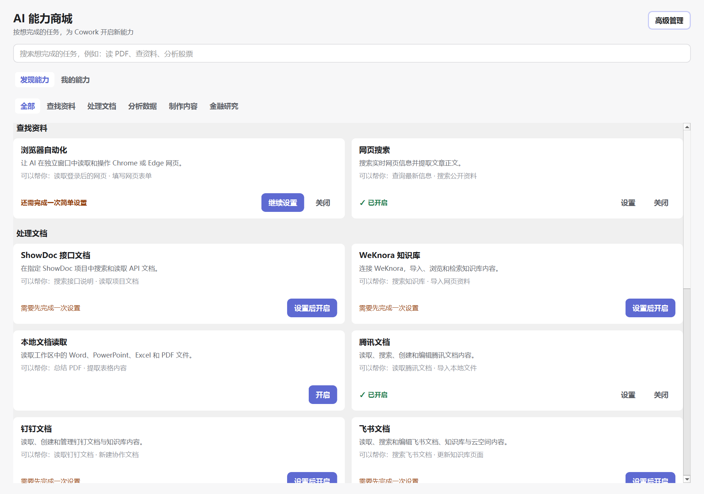

*截图 S28 任务驱动的 AI 能力商城*

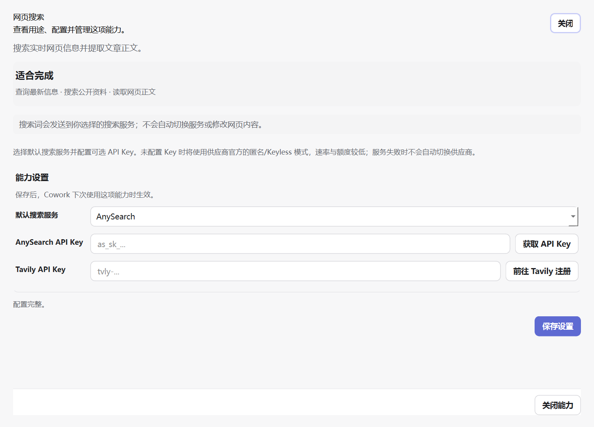

*截图 S29 浏览器自动化的一体化开启流程；技术调试位于高级管理*

> 启用不等于强制使用 启用后，AI 可以在合适任务中发现该能力；它不会自动加入当前会话的“指定能力”。如果本轮必须使用，可在输入区“+ → 指定能力”中明确选择。旧版本曾写入历史的能力状态提示会在回放时隐藏，但不会修改原始会话数据。

### 11.2 指定能力和选择 Agent

点击输入工具栏的“+”可以指定本会话优先能力；点击“Agent”可以加入内置或自定义智能体。当前选择会显示在输入区附近，任务结束后可以调整。

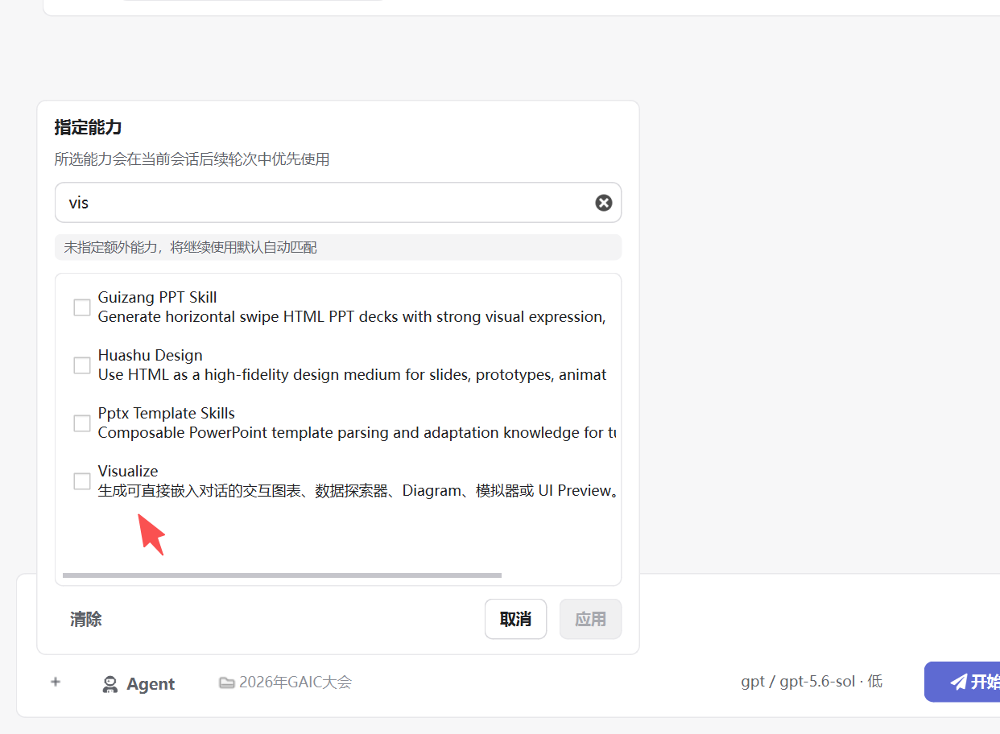

*截图 S30 为当前会话指定能力*

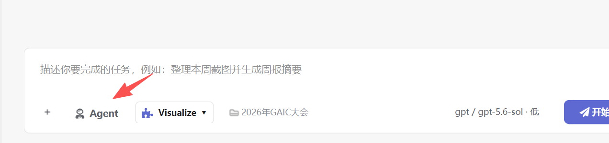

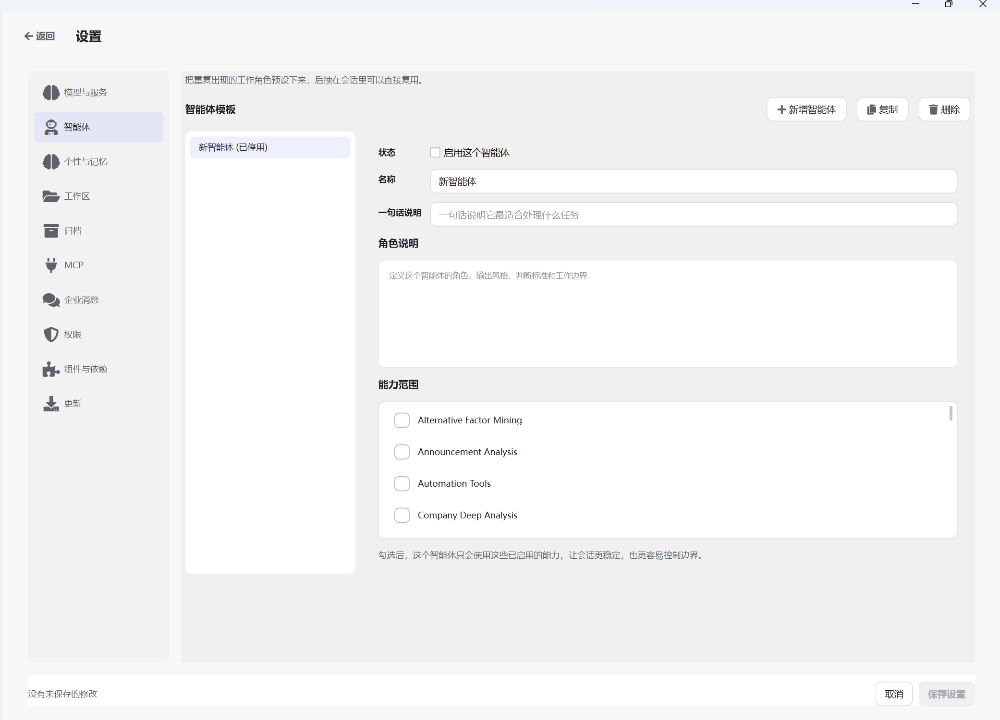

*截图 S31 Agent 选择器*

### 11.3 沉淀为 Skill

- 先在真实任务中形成一套效果稳定的做法。

- 点击“+ → 沉淀为 Skill”，或使用最终回答末尾的同名操作。

- 选择当前问答、最近三轮、全部或自定义会话片段。消息级入口会默认带上该回答对应的完整用户任务链。

- 点击“开始复用分析”。按钮会短暂显示“正在转入后台…”，来源会话随即出现“正在分析复用价值 · 已转到后台，可继续对话”的任务行；生成期间仍可继续聊天或切换会话。

- 点击“复用分析待确认”，检查目标、可复用规律、缺失证据和隐私处理结果，再选择创建新 Skill、合并增强已有 Skill 或仅追加结构化经验。脚本、引用和工具候选默认不保存；勾选脚本后 AI 会按候选用途重新生成参数化实现，不会原样保存会话中执行过的代码。

- 点击“后台编译 Skill 草稿”后，来源会话显示相同的后台状态。第二阶段完成后点击“Skill 草稿已生成 · 待确认保存”，按“概览、指导、资源、变更与校验”检查内容。低置信草稿必须确认已了解缺失项；静态错误需要修复，或取消选择有问题的资源。

- 分析和草稿会按会话保存。左侧会话栏使用独立图标显示运行、待确认或失败；点击图标可返回来源会话。只有阶段完成时正在查看其他会话，主界面右上角下方才会显示一次完成 Toast。同会话完成、开始、进度和失败不会弹出额外 Toast。

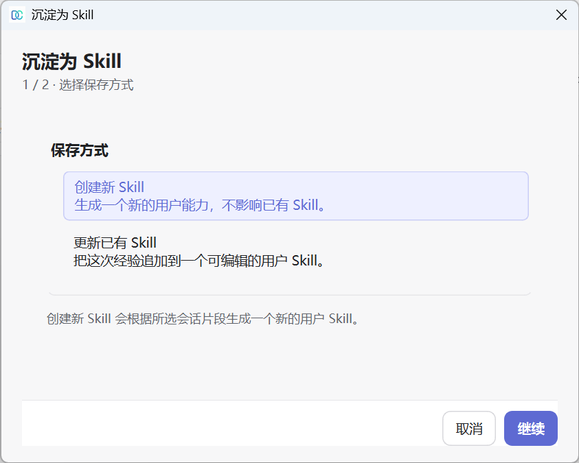

*截图 S32 Skill 复用分析确认*

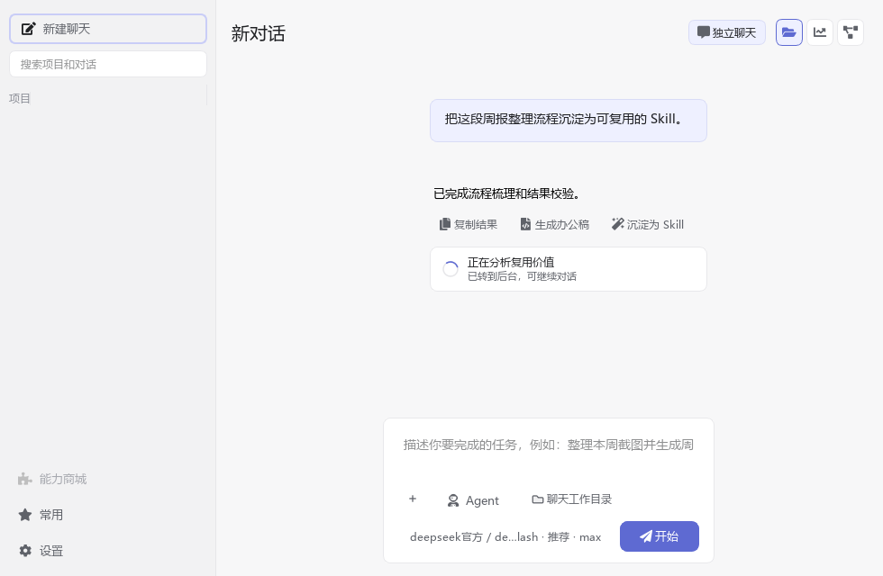

*截图 S33 Skill 后台分析状态*

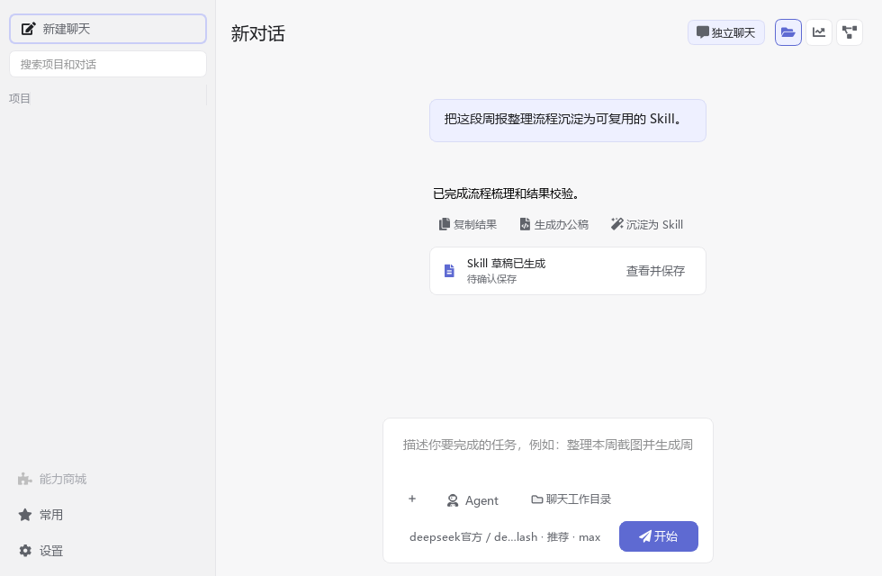

*截图 S34 Skill 草稿待确认状态*

> 不会自动保存 生成的复用分析和 Skill 草稿都留在原会话中。取消查看或保存失败不会丢失状态，可以稍后继续。

## 12. 自动化任务

自动化适合按时间重复提交清晰任务，例如每天整理简报、每周生成检查清单。

### 12.1 新建自动化

- 点击左下角“自动化”。

- 选择新建任务。

- 填写任务名称。

- 在提示词中写清楚每次触发时的输入来源、目标、输出格式和验收要求。

- 按需选择引用能力和指定 Agent。

- 设置执行计划，并决定是否启用。

- 保存任务。

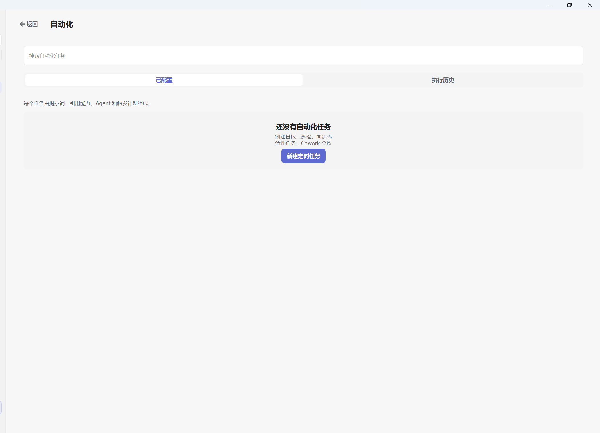

*截图 S33 自动化中心*

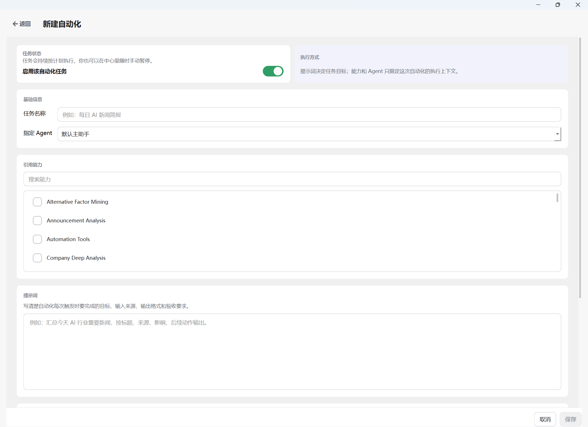

*截图 S34 自动化任务编辑器*

> 新手建议 先把自动化保存为停用状态，手动触发一次，确认输入、权限和输出位置都正确，再正式启用定时计划。

### 12.2 一条好用的自动化提示词

> 示例 每周一上午整理当前项目的“周报素材”文件夹。读取上周新增的 Markdown 和 Excel 文件，生成一份“周报_YYYY-MM-DD.docx”。结构为：本周结论、完成事项、风险、下周计划。缺少负责人或日期时标记“待确认”，不要自行猜测。完成后回复生成文件的完整路径。

## 13. 外观、记忆、归档、更新与组件

这些功能集中在设置中。日常只需偶尔维护，不必每次对话都调整。

### 13.1 外观与主题

“设置 → 外观”用于管理用户自己的皮肤。Cowork 只保留一套只读的默认浅色主题，不额外提供官方亮色预设。

- 点击“新建”或“复制”后，可调整字体、字号比例、紧凑度、圆角、强调色和主要宽度；“统一工作区场景”集中编辑唯一背景及各区域材质，完整语义令牌仍在折叠的高级 JSON 中编辑。结构摘要和资产清单用于查看 AI 配置的组件与图片。

- 每款皮肤单独保存为应用数据目录 `themes/<id>.cowork-theme`。它是包含 `manifest.json` 和静态图片资产的单文件主题包，可以在外观页导入或导出；复制主题会同时复制资产。旧版 v1 JSON 仍可导入和加载，下一次显式保存时才转换成 v2 包。

- 选择主题或修改控件只更新草稿，不会刷新界面。点击“预览”后才一次性应用；预览后继续修改会显示“当前预览不是最新”，再次点击“预览”才更新。只有点击设置中心统一“保存”才会正式写入并启用，放弃修改会恢复原主题。保存了外观修改后，Cowork 会建议重启应用，以确保所有界面完整载入新主题；AI 保存并启用主题后也遵循同一提示。

- 对比度偏低时页面会提示，但不会替你改色或阻止保存。JSON 无效、令牌未知或字体不可用时会显示具体原因。

- 也可以直接告诉 AI 想要的风格。图片、条纹、网格、点阵和噪点统一放在 `workspace_scene`，从窗口工作区左上角只绘制一次；左侧栏、应用内顶栏、聊天区、输入区、右侧栏和新对话首页只使用透明、半透明着色或不透明材质。聊天滚动或首页/对话切换时，背景不会跟随滚动、重复缩放或重新开始网格。`brand.title` 可以修改 Windows 原生标题栏文字，但标题栏外观和系统按钮不能由主题修改。

主题包中的 `manifest.json` 采用以下 v2 结构；图片只能通过资产 ID 引用，不能填写网络 URL 或绝对路径：

```json
{
  "format": "cowork-theme",
  "schema_version": 2,
  "id": "my-theme",
  "name": "我的主题",
  "overrides": {
    "font_scale": 1.05,
    "density": "compact",
    "tokens": {
      "primary": "#5e6ad2"
    }
  },
  "assets": {},
  "workspace_scene": {
    "attachment": "fixed",
    "layers": [
      {"type": "solid", "color": "#f4f1e8"},
      {
        "type": "grid",
        "color": "rgba(166,116,24,0.10)",
        "spacing": 32,
        "line_width": 1,
        "major_every": 4,
        "major_color": "rgba(200,63,104,0.12)",
        "major_line_width": 1
      }
    ]
  },
  "surfaces": {
    "conversation.timeline": {
      "material": {"kind": "transparent"}
    },
    "conversation.composer": {
      "material": {"kind": "tint", "color": "#ffffff", "opacity": 0.92}
    }
  },
  "components": {
    "home.card.images": {"visible": false}
  },
  "content": {
    "brand.title": "我的 Cowork",
    "home.title": "今天想完成什么？"
  }
}
```

工作区只能有一个 `workspace_scene`。若把图片或程序纹理挂到 `home.hero`、`conversation.timeline` 等嵌套区域，校验会直接拒绝预览；不会自动覆盖或静默修正。左/中/右三栏归属和所有点击动作固定不变；最小化/最大化/关闭由 Windows 管理，主题不能隐藏或改写。新建聊天、设置、输入框、发送/开始按钮和预览恢复条等受保护控件也不能隐藏。首页四卡片可以换展示文案、图标、样式、位置或隐藏，但点击后的预填提示词、PPT Mode 和“打开设置”等行为不会改变。

> 图片边界 Cowork 不在主题流程中调用图片模型。需要写实背景时，请先提供已有本地图片；没有图片来源会明确报错。主题包不接受 SVG、动画、字体、网络资源或可执行内容。

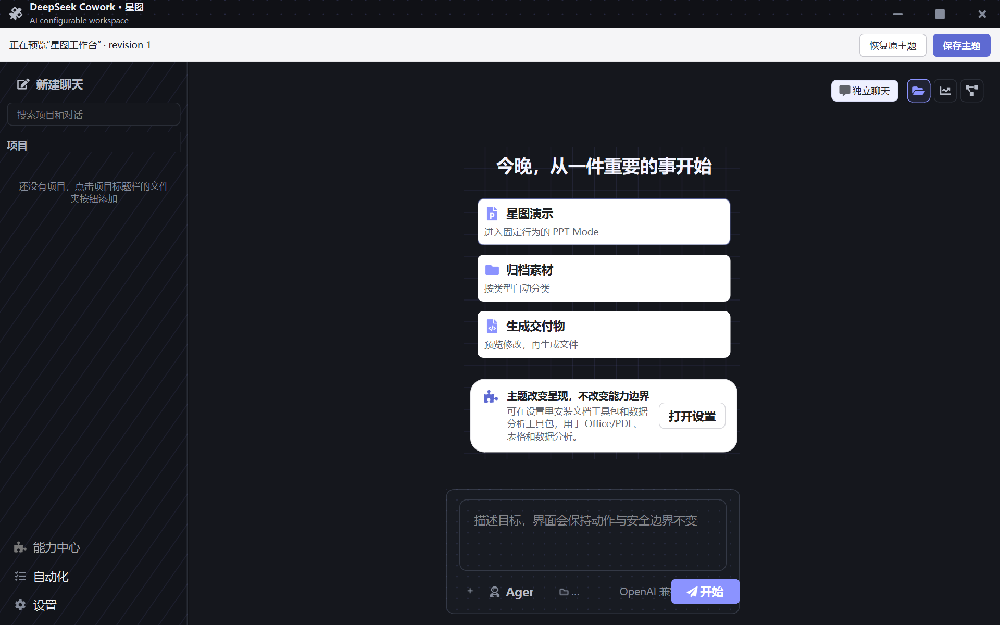

*截图 S39 声明式背景、首页文案、卡片布局与原生窗口品牌文字共同预览；系统窗口行为保持不变*

> 建议 让 AI 先生成一款主题并预览，再根据“强调色更克制、正文更大、密度更紧凑”等具体反馈迭代。不要让 AI 直接修改应用 QSS。

### 13.2 个性与记忆

“个性与记忆”用于保存长期稳定的信息，例如你喜欢的回答风格、固定称呼、公司背景或当前项目长期约定。一次性任务细节不要放进长期记忆。

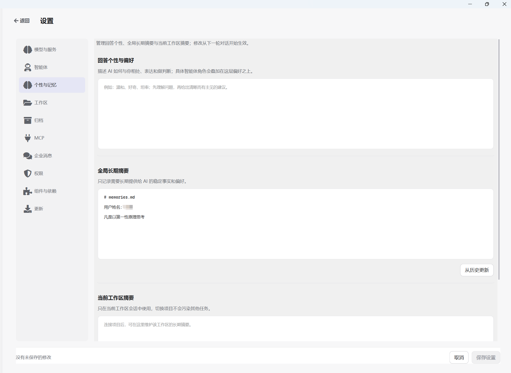

*截图 S35 个性与记忆*

- 全局长期摘要：适用于所有工作区的稳定偏好和背景。

- 当前工作区摘要：只用于当前项目或工作区，避免不同项目互相污染。

- 从历史生成的内容会先成为草稿，需要你确认后才应用。

### 13.3 工作区与归档

“工作区”可以修改后续新独立聊天使用的根目录。已有会话继续使用原目录，不会被静默移动。“归档”可以恢复被隐藏的项目和对话。归档不等于删除文件。

### 13.4 更新应用

- 进入“设置 → 更新”。

- 检查是否有新版本。

- 阅读版本说明和兼容性提示。

- 重要项目先备份，再按页面提示下载或安装。

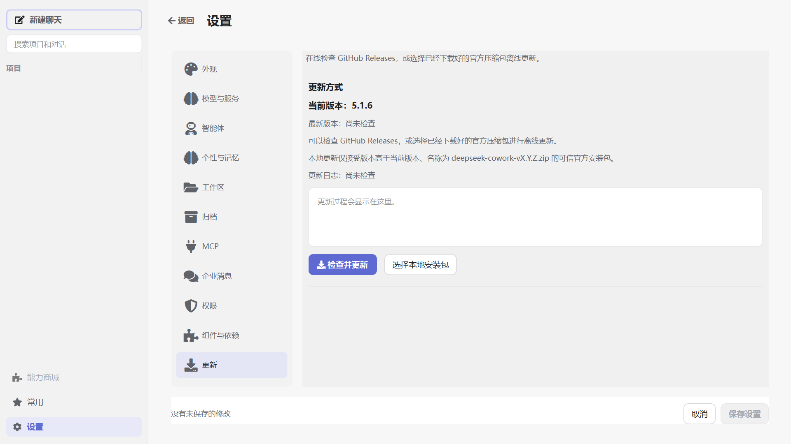

*截图 S36 更新页面*

### 13.5 组件与依赖

文档工具包、数据分析工具包和 Node.js 等运行组件，可以在“设置 → 组件与依赖”按需安装。组件任务会按加入顺序处理，关闭设置后仍会继续。浏览器自动化不在这里维护，它的完整开启流程位于“AI 能力商城 → 浏览器自动化”。

打开设置页不会自动扫描目录或检查版本。页面只显示“上次记录”；没有记录时显示“尚未检测”。只有点击单项“检测状态”、“手动刷新状态”，或执行安装、更新、修复、卸载后，相关状态才会更新。执行变更前应用会重新核对目标组件；如果真实状态与上次记录冲突，本次操作会停止并要求重新确认。

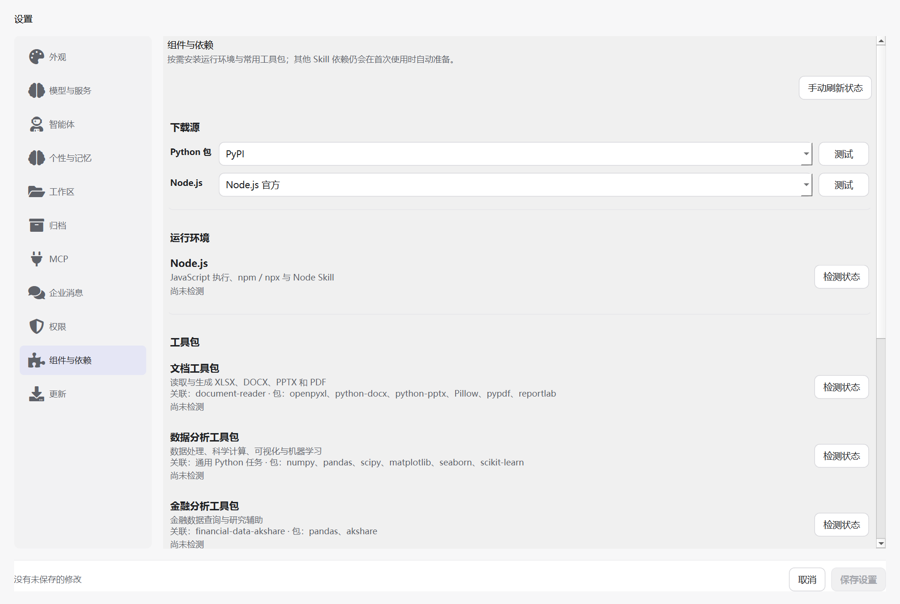

*截图 S38 组件状态使用上次记录*

> 什么时候安装 只有当任务明确需要某个组件，或应用提示缺少依赖时再安装。安装失败会显示原因，不会静默换成质量更低的方案。

## 14. 浏览器自动化与企业消息

这两类功能都属于进阶连接。没有明确需求时，可以先不配置。

### 14.1 浏览器自动化

浏览器自动化可以让 AI 在独立 Agent 窗口中读取带登录状态的网页、提取数据或填写表单。该能力默认关闭，首次开启时会在能力详情中引导完成一次简单设置。

- 打开“AI 能力商城”，在“查找资料”中点击“浏览器自动化 → 开启”。

- 点击“开始设置”，Cowork 会自动下载并校验所需文件。

- 点击“安装浏览器扩展”，在 Chrome 或 Edge 中添加并启用扩展。

- 回到同一个页面，点击“检查并开启”。

- 检查成功后能力会自动开启，商城卡片显示“✓ 已开启”；失败时页面会保留当前步骤并显示具体原因。

> 重要操作仍需确认 提交、发送、购买、删除、发布等会造成真实外部影响的操作，应在执行前逐项核对。不要因为是 AI 操作就跳过确认。

### 14.2 企业消息

“设置 → 企业消息”可以在飞书、钉钉和企业微信中选择一种接入方式。系统一次只运行一个渠道，切换渠道会保留旧渠道凭据但将其停用；企业消息始终由默认主助手处理，并沿用 Cowork 的默认工作区与权限边界。

- **飞书**：点击“扫码接入飞书”，使用飞书或 Lark 扫描二维码并确认。Cowork 会自动创建应用；已有应用会通过重新扫码更新，无需手动填写 App ID、Secret、Verification Token 或 Encrypt Key。
- **企业微信**：在企业微信智能机器人后台取得 Bot ID 和 Secret，填写后点击“保存并立即接入企业微信”。系统使用官方 WebSocket 长连接地址自动认证、保活和重连。
- **钉钉**：保留现有机器人凭据、Webhook 与 Stream / WS 配置，填写必要参数后执行接入。

接入成功后，页面会显示当前运行渠道。若显示“配置已保存，接入失败”，请先阅读页面给出的错误原因，再点击“打开日志”查看完整诊断。停止接入不会删除各渠道已经保存的凭据。

若企业微信已经显示“认证成功”并能收到消息，但回复提示本地连接被拒绝，请完全退出并重新启动 Cowork，使桌面端、daemon 和企业消息网关载入同一版本。正常情况下 daemon 关闭后会释放端口与单例锁，应用会自动重新启动后台服务。

> 凭据保护 企业应用密钥、Webhook、Token 和模型 API Key 都不应出现在公开截图、演示文件或聊天群中。

## 15. 常用任务照着说

下面的模板可以直接复制，再把方括号里的内容换成你的实际情况。

### 15.1 整理文档

> 模板 请阅读项目中的【文件名】，整理成一份面向【读者】的摘要。先写 5 条关键结论，再按主题分组说明。所有数字必须保留来源位置；无法确认的内容标记“待核实”。结果另存为【文件名.docx】，不要覆盖原文件。

### 15.2 对比多个方案

> 模板 请比较【方案 A】和【方案 B】，从成本、时间、风险、使用难度和后续维护五个方面分析。先给结论，再给比较表，最后说明结论成立的前提。不要替我做最终决定。

### 15.3 整理会议纪要

> 模板 请根据【会议资料】，生成会议纪要。结构为：会议结论、决定事项、待办、负责人、截止时间、待确认问题。不要把讨论过程误写成最终决定；没有明确负责人或日期时写“待确认”。

### 15.4 批量整理文件

> 模板 请先扫描【文件夹名称】，只统计文件类型、数量和命名问题，不要修改。给出拟采用的分类和重命名规则，等待我确认后再执行。执行时不要删除文件，保留一份变更清单。

### 15.5 生成 PPT

> 模板 请把【资料】整理成一份【页数】页以内的演示文稿，面向【受众】，目标是【目的】。先讲结论，再讲证据和行动。使用【风格】视觉，每页一个重点。先生成 HTML 工作稿供我预览，确认后再生成 PPTX。

## 16. 常见问题与安全建议

遇到问题时，先看页面上的原始错误，不要连续重复点击。下面按常见现象给出处理顺序。

### 16.1 常见问题速查

| 现象 | 先检查什么 | 建议处理 |
| --- | --- | --- |
| 不能发送消息 | 是否显示“未配置模型”。 | 到“模型与服务”添加并保存渠道和模型。 |
| 模型报认证错误 | API Key、服务地址、账户状态。 | 重新复制密钥；不要在公开位置展示错误详情中的凭据。 |
| 粘贴图片后不能发送 | 当前模型是否支持图片理解。 | 切换视觉模型或核对模型配置。 |
| 不能切换项目 | 当前对话是否已有消息或任务在运行。 | 新建空白对话后再选择项目。 |
| 找不到文件 | 交付物筛选、排序和工作区。 | 清除筛选，浏览工作区，核对 AI 回复中的完整路径。 |
| 预览不是最新 | 文件是否刚被后台修改。 | 使用手动刷新，避免打断当前阅读。 |
| 能力不可用 | 是否启用、是否缺配置或依赖。 | 进入能力详情查看原始错误并完成配置。 |
| 自动化没有运行 | 任务是否启用、计划是否有效。 | 先手动触发并查看执行历史。 |

### 16.2 报错时如何向别人求助

- 记录当前应用版本。

- 说明你在哪个页面、点击了什么。

- 复制完整错误文字，不要只说“不能用”。

- 说明问题是否每次都发生，以及你已经尝试过什么。

- 截图前遮住 API Key、Token、账号、项目路径中的隐私信息。

### 16.3 安全使用清单

- 重要文件先备份，尤其是批量修改前。

- 只把任务需要的文件放进项目目录。

- 删除、覆盖、移动、发送、购买和发布前逐项确认。

- 不向不可信人员泄露 API Key、企业凭据或内部文件。

- 扩展权限模式会突破工作区限制，只有完全理解风险时才开启。

- AI 给出的数字、日期、引用和外部结论，在正式使用前人工核对。

> 最稳妥的工作方式 先让 AI 阅读和提出方案，再让它小范围执行，最后人工检查结果。对高风险任务，把“不要删除、不要覆盖、先列清单等待确认”写进要求。

## 附录 A：常用快捷操作

| 操作 | 快捷键或方法 |
| --- | --- |
| 发送消息 | 输入完成后按 Enter；以界面实际提示为准。 |
| 粘贴图片 | 在输入框按 Ctrl+V。 |
| 复制选中文字 | Ctrl+C。 |
| 撤销/重做输入 | Ctrl+Z / Ctrl+Y。 |
| 重命名项目或对话 | 聚焦对应行后按 F2。 |
| 保存重命名 | Enter。 |
| 取消重命名或编辑 | Esc。 |
| 从管理页面返回会话 | 点击返回，或按 Alt+Left。 |

## 附录 B：名词解释

| 名词 | 简单解释 |
| --- | --- |
| API | 应用与模型服务通信的接口。 |
| API Key | 访问模型服务的专用密钥，必须保密。 |
| 模型 | 负责理解、推理和生成内容的 AI。 |
| 渠道 | 一组模型服务地址、密钥和模型配置。 |
| 工作区 | AI 被允许处理文件的目录范围。 |
| 项目 | 你明确加入 Cowork 的本地文件夹。 |
| 交付物 | 任务最终生成并可预览或继续转换的文件。 |
| 能力 | AI 可以发现和调用的工具或连接。 |
| Agent | 带有特定角色、规则和能力范围的助手。 |
| Skill | 某类任务的可复用经验包，也可以携带工具。 |
| MCP | 把外部工具或服务接入 AI 的协议。 |
| HTML 工作稿 | 可在应用内预览、修改，并继续生成办公文件的中间稿。 |
| 自动化 | 按照计划重复提交提示词的任务。 |
