# DeepSeek Cowork 用户指南

从第一次打开，到让 AI 帮你完成真实工作。

适用版本：**5.1.0**

本手册面向第一次使用桌面 Agent 的普通用户。

## 先看这里：十分钟完成第一次任务

第一次使用只需要理解三个对象：

| 对象 | 最简单的理解 | 第一次怎么做 |
| --- | --- | --- |
| 模型 | 负责理解、推理和回答的 AI 服务 | 在“设置 → 模型与服务”配置并测试一个模型 |
| 工作区 | Agent 被允许处理文件的目录 | 先用独立聊天；处理已有资料时再绑定项目 |
| 交付物 | Agent 生成、可预览或继续编辑的结果文件 | 从右侧“文件与交付物”检查 |

最短路径是：完整解压应用 → 配置模型 → 新建独立聊天 → 发送“请用三句话介绍你
能帮我做什么”。收到完整回答后，再学习项目、文件编辑和能力扩展。

> 第一次成功的标准：能够选中模型、发送消息并收到完整回答。不要一开始就配置
> 所有能力、企业消息或可选组件。

### 按目标阅读

| 现在要做什么 | 阅读范围 |
| --- | --- |
| 安装并开始聊天 | 第 1～4 章 |
| 让 Agent 处理已有文件 | 第 5～9 章 |
| 生成 PPT、DOCX 或 PDF | 第 10 章 |
| 启用专业能力、Agent 或保存常用模式 | 第 11～12 章 |
| 管理主题、记忆、更新和外部连接 | 第 13～14 章 |
| 直接复制任务模板或排错 | 第 15～16 章 |

## 1. 下载、解压和启动

这一章只讲普通 Windows 用户需要做的事情，不需要安装 Python，也不需要输入命令。

### 1.1 下载应用

- 打开 DeepSeek Cowork 的 GitHub Releases 页面：https://github.com/chuancyzhang/deepseek-cowork/releases。

- 找到带有“Latest”标记的最新版。

- 在下载区域选择 Windows ZIP 压缩包并保存到电脑。

*截图 S01 在 Releases 页面下载最新版*

> 安全提醒 只从项目正式 Releases 页面下载安装包。不要从不认识的网盘、聊天群或第三方下载站获取。

### 1.2 解压并启动

- 在下载文件夹中找到 ZIP 压缩包。

- 右键选择“全部解压”，或使用你熟悉的解压软件。

- 打开解压后的文件夹，双击 deepseek-cowork.exe。

- 如果 Windows 显示安全提醒，先核对文件来源和版本，再决定是否继续。

*截图 S02 解压下载的 ZIP*

*截图 S03 启动 DeepSeek Cowork*

> 不要这样做 不要直接在 ZIP 压缩包内部双击运行程序。请先完整解压，否则更新、运行组件或保存数据时可能出现问题。

## 2. 第一次配置模型

Cowork 是工作台，真正负责回答问题的是你配置的模型服务。没有可用模型时，应用能打开，但不能正常对话。

### 2.1 先准备好什么

- 一个你有权使用的 AI 模型服务。

- 该服务提供的 API 地址和 API Key（访问密钥）。

- 一个可用的模型名称。

> 什么是 API Key？ 可以把它理解成模型服务的“专用密码”。它通常与计费账户关联。不要把它发到群里、放进截图或复制给不可信的人。

### 2.2 打开模型设置

- 如果应用检测不到任何可用的模型配置，启动后会显示“快速启用 DeepSeek”。填写 DeepSeek API Key 并完成验证后，应用会自动同步官方模型，优先选择带“推荐”标识的 `deepseek-v4-flash`。新同步的官方模型默认使用 Responses，支持 `high/max` 推理档位并以 `max` 开始。

- 不想立即配置时可以选择“稍后配置”；只要仍没有可用模型，下次启动会继续提示。

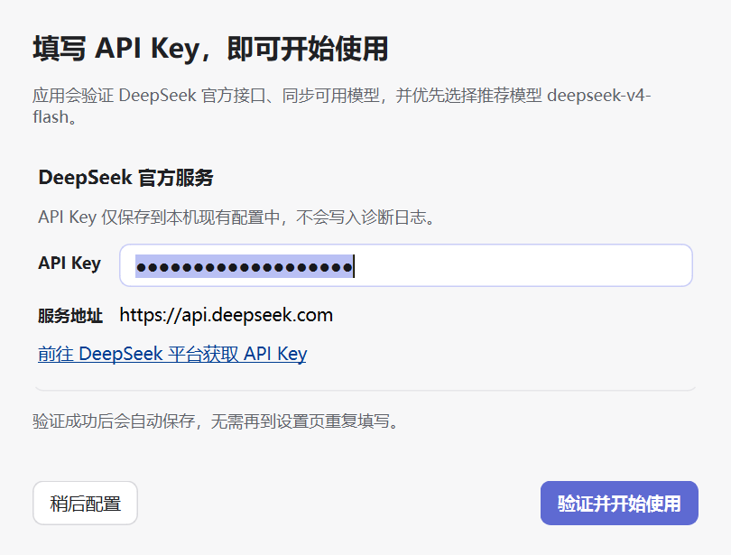

*截图 S03B DeepSeek 快速启用*

- 点击左下角“设置”。

- 在设置页面左侧选择“模型与服务”。

- 添加一个模型服务渠道，填写服务地址和 API Key。已有 DeepSeek 官方服务会持续标出当前产品推荐模型，但不会强制替换你的选择。

- 点击“拉取模型”查看接口实际返回的模型，勾选一个或多个模型后导入。已添加的同名模型会显示为带勾的禁用项，不会被重复导入。

- DeepSeek 官方服务中新导入或手工新增的 `deepseek-v4-flash-vision-exp` 默认支持图片理解；`deepseek-v4-flash`、`deepseek-v4-pro` 和其他官方模型默认关闭图片理解。已有模型配置不会被自动重置。

- 选中一个模型可以完整编辑；同时选中多个模型可以批量设置图片理解、图片生成、API 协议和推理档位。“不修改”会保留各模型原来的值。

- 点击页面底部固定的“保存设置”。

*截图 S04 主界面和设置入口*

*截图 S05 模型与服务页面*

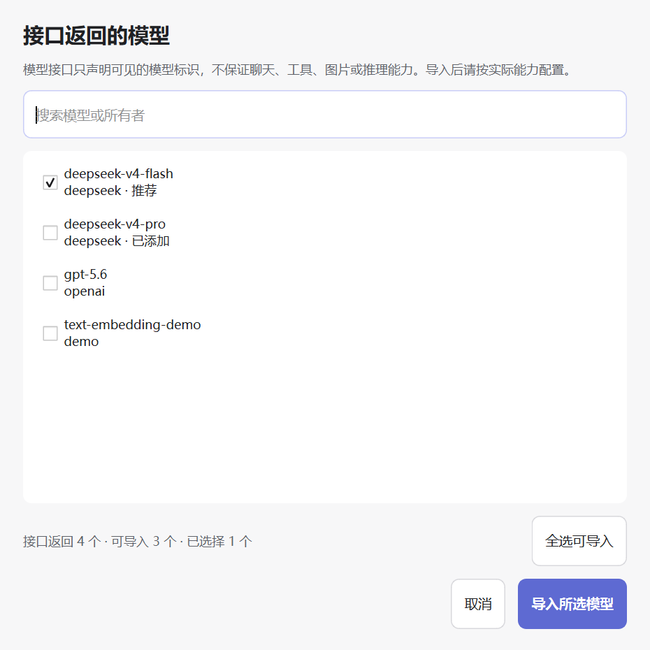

*截图 S05B 拉取并选择接口模型*

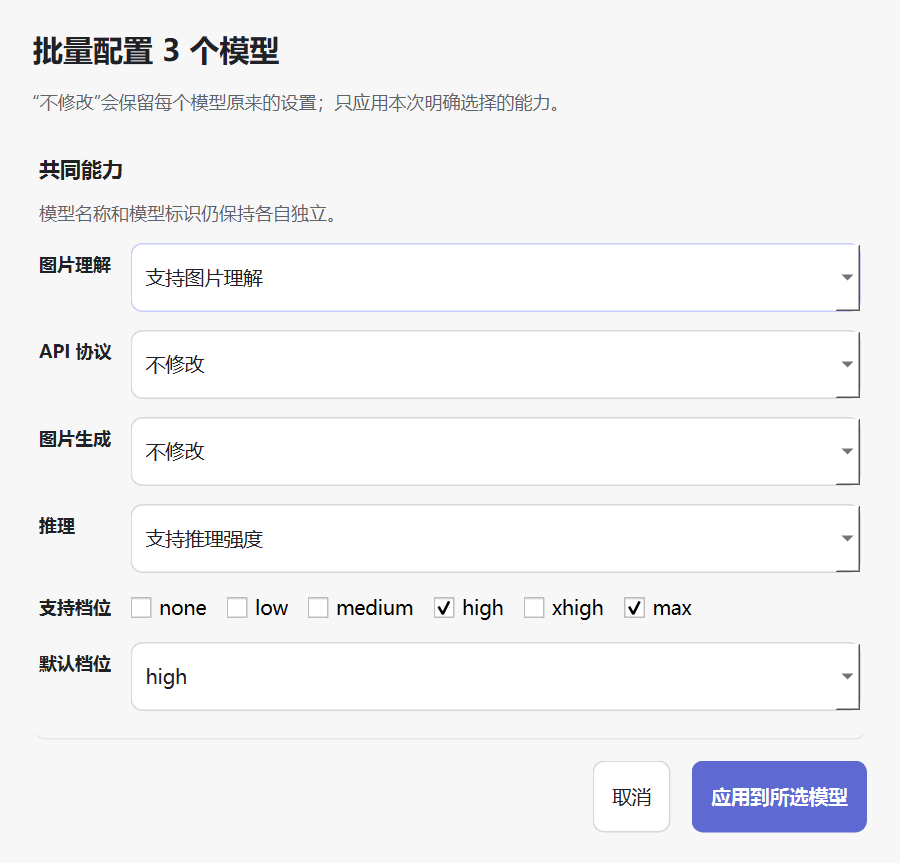

*截图 S05C 批量配置模型能力*

*截图 S05D 后台拉取模型*

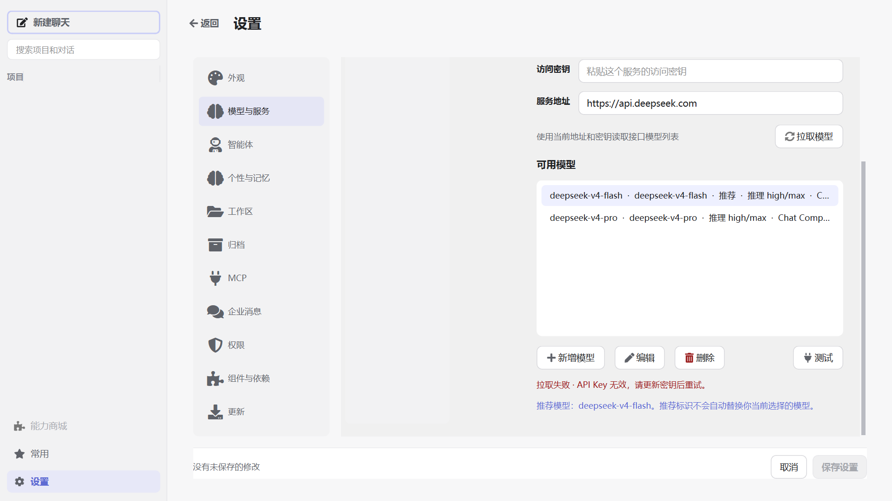

*截图 S05E 拉取失败与恢复提示*

*截图 S06 新增模型*

### 2.3 不懂参数时怎么选

| 设置项 | 普通用户怎么理解 | 建议 |
| --- | --- | --- |
| 模型名称 | 服务商给出的模型标识。 | 照服务商控制台或管理员给你的名称填写。 |
| 协议 | 应用和模型服务说话的方式。 | DeepSeek 官方新模型和 GPT‑5.6 新建项默认 Responses；其他服务按实际接口选择。 |
| 思考强度 | AI 在回答前投入多少推理。 | DeepSeek 官方新模型支持 `high/max` 并默认 `max`；越高通常越慢、用量也可能更大。 |
| 支持图片理解 | 模型能否看懂你粘贴的图片。 | 只有服务商明确支持图片时才打开。 |
| 支持图片生成 | 模型能否在当前对话中返回图片。 | 仅在服务商明确支持 OpenAI Responses `image_generation` 时打开，并将协议设为 Responses。 |

> 模型枚举接口通常只返回模型标识和所有者，不能单独证明模型能力。应用只为 DeepSeek 官方服务应用上述明确的产品默认值；第三方服务不会因为模型名称相似而自动套用这些能力。

当服务地址是官方 DeepSeek 且协议选择 Responses 时，应用会自动保留服务返回的
推理、函数调用和服务端搜索记录，并在后续请求中按原顺序回传。应用也会自动向
模型提供服务端 `web_search`；搜索由模型服务完成，不需要启用本地“网页搜索”
能力或配置第三方搜索密钥。标准 OpenAI Responses 继续使用原有协议行为。

启用“支持图片生成”后，应用会把 `image_generation` 作为稳定的 Responses 工具
提供给模型。生成结果保存在当前会话的附件目录并直接显示在助手消息中；历史只
保存本地文件路径和服务端调用 ID，不保存体积较大的 base64 数据。图片文件缺失
或损坏时会明确显示错误。删除会话时，对应的生成图片会随会话附件一并删除。

*截图 S07 填写模型配置*

### 2.4 验证配置是否成功

- 在“模型与服务”顶部选择“默认模型”（按“渠道 / 模型”展示），点击“保存设置”。以后每次新建对话都会自动使用它，不再沿用当前对话临时选择的模型。

- 已有对话保留各自的模型，正在运行的回答不会被切换。删除默认模型或所属渠道后，需要重新选择才能保存；删除全部模型后可以保存，但需要重新配置模型才能对话。

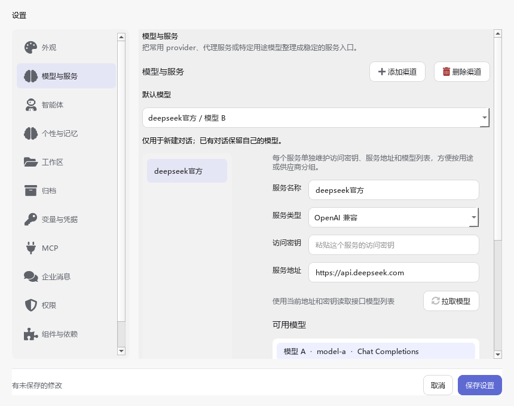

- 返回聊天页面。

- 点击输入框下方的模型按钮，选择刚配置的渠道和模型。

- 发送：“请用三句话介绍你能帮我做什么。”

- 能收到完整回答，说明基础配置成功。

*截图 S08 切换模型并设置思考强度*

> 如果仍显示“未配置模型” 回到“设置 → 模型与服务”，确认渠道和模型都已经添加，并且最后点击了“保存设置”。

## 3. 看懂主界面

主界面可以理解成四个区域：左边找任务，中间聊天，下面输入，右边看文件和过程。

*截图 S09 主界面区域总览*

| 区域 | 主要用途 | 最常用操作 |
| --- | --- | --- |
| 左侧导航 | 管理项目、对话和主要功能入口。 | 新建对话、切换历史、打开能力/常用/设置。 |
| 中央对话区 | 查看你的要求、AI 的过程和最终回答。 | 复制结果、生成办公稿、编辑历史消息。 |
| 底部输入区 | 输入任务和添加上下文。 | 输入文字、粘贴图片、添加文件、选模型或 Agent。 |
| 右侧抽屉 | 查看文件、交付物、任务观测和子 Agent。 | 预览文件、查看工具过程、打开生成结果。 |

> 窗口较小时 优先保证中间对话和输入区可用。右侧抽屉可以关闭，需要时再打开；界面内容可通过滚动查看。

### 3.1 新对话首页的四个入口

| 入口 | 会准备什么 | 未就绪时 |
| --- | --- | --- |
| PPT 助手 | 专用 PPT 助手模式 | 仍可进入并按页面提示补充资料 |
| 进行金融分析 | 万得与东方财富妙想能力 | 保留任务文字并列出需开启或配置的项目 |
| 数据分析 | 当前工作区的数据分析任务 | 提示按需安装数据分析工具包 |
| 浏览器自动化 | 已启用且扩展已连接的浏览器能力 | 引导到能力商城完成设置 |

首页入口只准备提示词与必要能力，不会自动发送、安装组件或修改外部数据。

## 4. 完成第一次对话

第一次不要从复杂任务开始。先用一个没有文件、不会改动电脑内容的小任务熟悉流程。

### 4.1 新建独立聊天

独立聊天不需要先选择项目。系统会为这个对话自动准备一个单独的聊天工作目录，AI 生成的文件会放在那里。

- 新建一个对话。

- 确认输入区下方已经选中可用模型。

- 在输入框里写清楚任务。

- 按 Enter 或点击发送。

- 等待最终回答出现。

*截图 S10 独立聊天界面*

### 4.2 第一个任务示例

> 可以直接复制 请帮我写一封请假邮件。对象是部门负责人，原因是明天下午去医院复查，语气礼貌、简短，控制在 150 字以内。先给出邮件主题，再给出正文。

这个例子之所以好，是因为它交代了对象、原因、语气、长度和输出格式。AI 不需要猜测，就更容易一次给出可用结果。

### 4.3 收到回答后能做什么

- 继续追问：例如“语气再自然一点”。

- 复制：选中文字后按 Ctrl+C，或使用消息上的复制操作。

- 生成办公稿：把最终回答继续整理成可预览的文档或演示工作稿。

- 沉淀为 Skill：把反复使用的做法保存成可复用能力；新手可先跳过。

*截图 S11 一轮完整对话*

## 5. 独立聊天、项目与文件安全

只聊天时用独立聊天；要让 AI 读取或修改你已有的文件时，再连接项目。

### 5.1 两种聊天有什么区别

| 类型 | 适合什么情况 | 文件在哪里 |
| --- | --- | --- |
| 独立聊天 | 写文案、想点子、临时分析、生成全新文件。 | 自动创建的聊天工作目录。 |
| 项目聊天 | 处理某个真实文件夹中的文档、代码、资料或交付物。 | 你明确选择的项目文件夹。 |

> 最重要的安全边界 连接项目后，AI 可以在授权范围内读取、创建或修改该文件夹中的内容。不要把整个磁盘、系统目录或含大量无关隐私的目录直接当成项目。

### 5.2 添加项目

- 先在电脑上准备一个专门的文件夹，放入本次任务真正需要的文件。

- 点击左侧项目区域的“+”，或在空白对话的项目选择器中点击“添加新项目”。

- 选择准备好的文件夹。

- 在新的空白对话中选择该项目。

- 告诉 AI 要处理哪个文件、要得到什么结果，以及哪些内容不能改。

*截图 S12 添加新项目*

*截图 S13 项目选择器*

*截图 S14 已连接项目的工作区*

### 5.3 项目使用规则

- **工作区归属不会中途变化**：只有尚未发送消息的空白对话可以选择项目；已有消息或正在运行的会话请保留原项目，并新建对话。
- 如果工作区根目录存在非空的 `AGENTS.md`，Cowork 会把全文作为该工作区的系统约定；只读取根目录文件，不扫描子目录。修改内容后从下一轮对话生效，读取失败时会显示原因并停止该轮请求。
- **归档不删除文件**：归档只隐藏项目或会话；可从“设置 → 归档”恢复。删除的会话不会因为分页再次出现。
- **历史在各自分组内展开**：项目默认显示最近 5 个会话并按 5 个继续展开；独立聊天默认显示 3 个并按 3 个展开。没有“展开显示”即表示该分组没有更多未归档会话。
- **运行状态优先保留**：正在运行或等待输入的会话始终显示且不占分页批次。切换会话不会中断后台任务，项目收起后仍在项目行显示状态。
- **首次提交即进入恢复链路**：空白聊天不进历史；第一次有效发送后立即出现，消息先写恢复记录，再由后台保存到 SQLite。
- **名称可以就地修改**：项目和会话均支持重命名；聚焦对应行后也可按 `F2`。

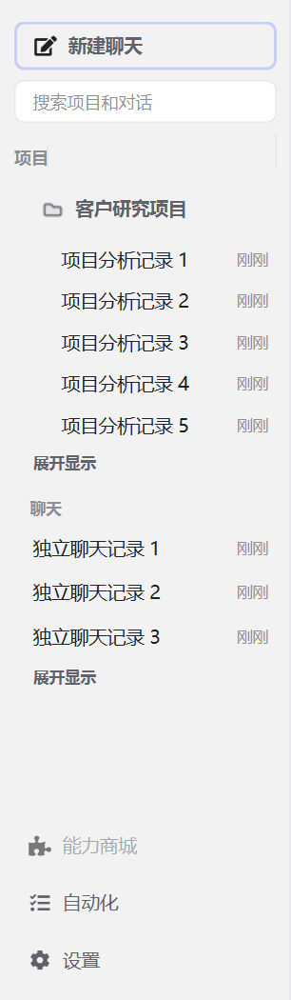

*截图：项目和独立聊天分别显示自己的“展开显示”入口*

*长标题和最小侧栏宽度下，项目及会话的运行状态仍保持可见*

### 5.4 让 AI 修改文件前

- 对重要文件先保留备份。

- 先让 AI 说明将修改哪些文件，再确认执行。

- 批量改名、删除、覆盖或移动文件时，把允许操作的范围写清楚。

- 需要保留原文件时，明确要求“另存为新文件，不要覆盖原文件”。

## 6. 添加文件和图片

文件用于给 AI 提供资料。普通文件和图片文件都可以通过“添加文件”选择，也可以从文件管理器复制后直接粘贴；剪贴板中的截图同样可以直接粘贴。是否能看懂图片，取决于当前模型能力。

### 6.1 添加或粘贴文件

- 方法一：点击输入工具栏中的“+”，选择“添加文件”，再选择本次任务需要的一个或多个文件。

- 方法二：在 Windows 文件管理器中复制一个或多个文件，点击对话输入框后按 `Ctrl+V`，或右键选择“粘贴”。

- 确认输入框上方出现文件名或图片缩略图，而不是 `file:///...` 路径文本。

- 在文字要求里说明每个文件的用途，例如“以 A 为模板，以 B 为内容来源”。

*截图 S15 输入区“+”菜单*

> 文件太大时 AI 可能不会把整个文件直接放进一次请求，而会通过工作区工具按需读取。请保留文件在当前工作区，并把文件名和目标说清楚。

> 文件夹不能作为聊天附件粘贴。复制内容包含文件夹或已移动的路径时，应用会保留可用文件并明确提示未添加的项目。

已添加及历史消息中的附件卡片可以直接点击：图片在 Cowork 中预览，文档、演示文稿、PDF 等文件使用系统默认应用打开。文件已移动或系统没有可用应用时会明确提示原因。

### 6.2 粘贴图片

- 先把图片复制到剪贴板。

- 点击对话输入框。

- 按 Ctrl+V，或右键选择“粘贴”。

- 确认输入框上方出现图片缩略图。

- 点击缩略图可打开应用内大图预览。使用“适应窗口”或“100%”快速切换，也可以点击 `+`、`−` 或按住 `Ctrl` 滚动鼠标滚轮，在 25%–400% 之间缩放。

- 大图可通过滚动条查看，按 `Esc` 或点击“关闭”返回对话。

- 输入你希望 AI 对图片做什么，再发送。

*截图 S16 粘贴图片后的输入区*

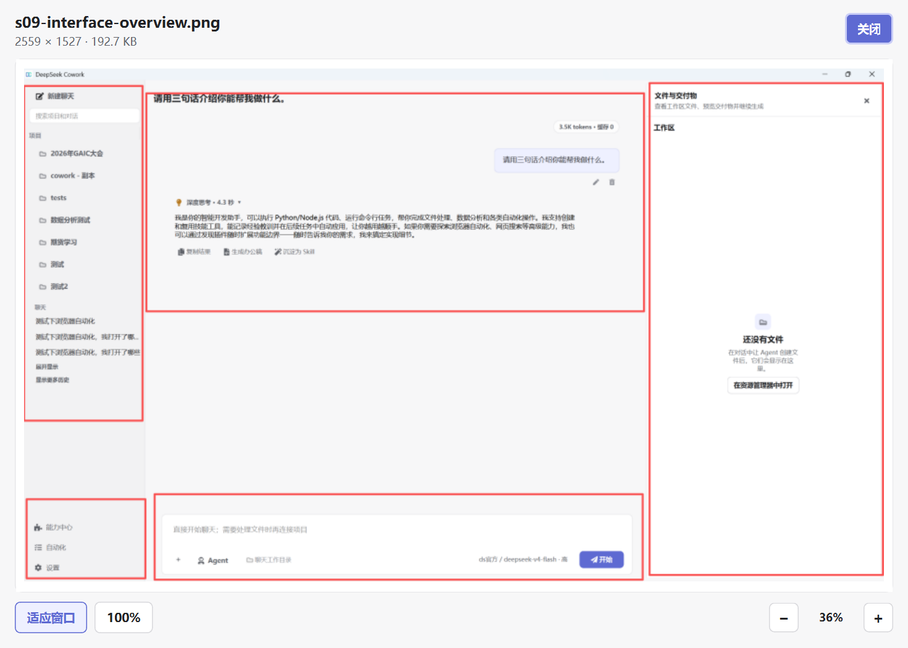

*截图 S16A 应用内图片放大预览*

> 无法发送图片 如果当前模型没有启用图片理解，应用会保留图片并阻止发送。请切换到支持图片的模型，或在模型配置中核对能力。

### 6.3 语音转文字附件

选择内置“语音转文字”能力后，可在能力设置中选择“本地语音组件”或“OpenAI 兼容接口”，并附加 WAV、MP3、M4A、AAC、FLAC、OGG、Opus、MP4 或 WebM。音频不会进入当前对话模型的请求；当前模型只知道有一个语音转文字专用附件，不会收到文件名、路径、大小或音频内容。未选择该能力时，附件继续沿用原有处理方式。

本地模式使用 SenseVoice，并默认进行说话人分离和时间戳对齐；首次使用时仍需在“设置 → 组件与依赖”安装语音转文字组件。远程模式不需要该组件，会把原始音频发送到已配置的完整 `audio/transcriptions` 地址，并通过 Bearer API Key 提交 `file`、`model` 和可选的 `language` 字段。远程模式采用接口响应中的 `text`，不运行本地说话人分离或时间戳对齐，接口失败时也不会切换到本地模型。

远程接口地址支持 HTTP 和 HTTPS。使用 HTTP 时，设置页会警告音频与 API Key 通过未加密连接传输；建议仅在受信任的内网环境中使用。远程服务自身的文件大小、时长和格式限制由服务端决定。

转录前 AI 会询问是否润色。选择“不润色”时，转录正文直接写入工作区且不会返回当前对话模型；选择“AI 润色”时，转录文字会再提供给当前模型。润色开始前会先保存原文最终稿，润色失败或中断时仍可直接使用该原文。

## 7. 把要求说清楚

AI 完成任务的质量取决于模型能力，也取决于你给出的上下文、目标和边界。

### 7.1 万用任务公式

> 任务公式 请帮我【做什么】，依据【哪些资料】，面向【谁】，要求【语气/长度/格式/风格】，把结果保存为【文件名或格式】，不要【禁止事项】，完成后请【验收方式】。

| 部分 | 例子 |
| --- | --- |
| 做什么 | 整理会议纪要并提取待办事项。 |
| 依据什么 | 依据项目文件夹中的“会议录音转写.txt”。 |
| 面向谁 | 给未参加会议的部门负责人阅读。 |
| 具体要求 | 先写结论，再写决定事项、负责人和截止时间。 |
| 输出形式 | 另存为“会议纪要_确认版.docx”。 |
| 禁止事项 | 不要修改原始转写，不要猜测未确认的负责人。 |
| 验收方式 | 完成后列出生成文件路径和仍需人工确认的内容。 |

### 7.2 用拷问模式先做决策

任务目标还比较模糊、关键取舍较多，或你希望在真正执行前先做压力测试时，点击输入区的“+”，选择“拷问模式”。输入区会显示“拷问模式”标记，主按钮变为“开始拷问”；它只作用于下一项任务。

- AI 会先读取已有上下文并用只读工具查明事实，再以问卷卡片集中询问当前能够确定的高影响问题。推荐项排在第一位，但不会自动替你选择。
- 每个拷问周期最多 10 轮。信息充分或达到上限后，AI 会总结目标、成功标准、范围、约束、关键决策、未决项、风险、假设和执行步骤。
- 总结后的决策卡可选择“确认并执行”“继续拷问”或“自定义”。继续或自定义会开启新的最多 10 轮周期；可由你主动续开任意多个周期。
- 取消、停止、等待超时或发生错误都不会执行原任务。选择“确认并执行”后，才会在同一项任务中恢复完整工具；既有的高风险审批和权限边界仍然有效。
- 附件和“指定能力”可以一起使用。拷问模式不能与 PPT/办公稿专用流程或显式 `@Agent` 同时提交；发生冲突时输入和附件会保留，请先取消其中一种。

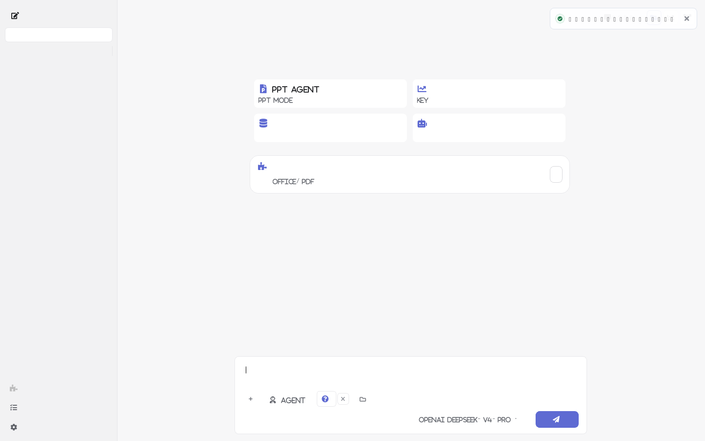

*截图 S15A 已开启拷问模式的输入区*

### 7.3 不清楚时也可以这样说

> 可以直接复制 我不熟悉这个任务。请先根据我的目标提出一份简单方案；如果有会明显改变结果的关键信息，再问我。不要一次问很多问题。

### 7.4 修改结果时，指出差异

- 不要只说“再好一点”，可以说“开头更直接，删掉套话，保留事实”。

- 不要只说“做得高级”，可以说“浅色、简洁、少装饰，重点突出结论”。

- 引用具体位置，例如“第二段太长，拆成 3 个要点”。

- 明确哪些内容已经满意，例如“标题和结构保留，只改正文语气”。

## 8. 看懂执行过程并中途调整

有些任务只需要回答，有些任务会读取文件、运行工具或生成交付物。Cowork 会把这些过程组织在同一轮对话中。

### 8.1 深度思考和工具

“深度思考 · 用时”表示模型在分析任务。工具行表示应用正在读取文件、运行命令、生成文件或调用某项能力。一般情况下，你只需要看最终回答；需要核对时再展开过程。

*截图 S17 展开深度思考和工具*

### 8.2 任务运行中补充要求

任务运行时仍可以发送补充引导。系统会在安全节点应用，不会突然取消已经启动的工具。

| 状态 | 表示什么 |
| --- | --- |
| 等待下一安全节点 | AI 正在处理，稍后会把补充要求加入后续步骤。 |
| 完成当前步骤后应用 | 某个工具已经启动，当前步骤结束后再应用。 |
| 已应用 | 补充要求已经进入后续处理。 |

在“等待下一安全节点”和“完成当前步骤后应用”期间，可以直接在引导卡片中编辑正文，也可以删除引导。编辑不会改变附件和排队顺序；删除会撤回尚未应用的引导，并把正文与附件恢复到当前会话输入框。引导一旦显示“已应用”，编辑和删除入口会自动隐藏。

*截图 S18 运行中补充引导*

### 8.3 编辑历史消息并重新生成

如果早先的要求写错了，可以把那条用户消息原位改成编辑器，选择“保存并重新生成”。这会替换该消息之后的对话内容，但不会删除已经生成的工作区文件。

编辑确认后，界面只替换这条消息及其后续分支；目标之前已经显示的消息、展开状态和阅读位置会保持不变，不会从会话开头重新回放。若界面无法可靠定位这条历史消息，应用会阻止替换并提示重新打开会话，不会用全量重载掩盖问题。

*截图 S19 编辑历史用户消息*

> 注意 重新生成只改变对话历史。已经写到磁盘上的文件仍然存在，需要你单独检查、保留或删除。

### 8.4 使用历史提问导航

同一会话有至少两次顶层提问时，左侧栏旁会以小间距出现一条细轨，不再依附于居中的正文列。较长、较深的线条表示当前阅读的提问；悬停可预览该提问首行和本轮最终答复摘要，点击即可跳转。即使目标提问尚未显示，Cowork 也会按历史顺序加载到目标位置再完成定位；跳转后不会被运行中的新回复自动拉回底部。同一轮运行中的补充引导和隐藏运行上下文不会占用标记。

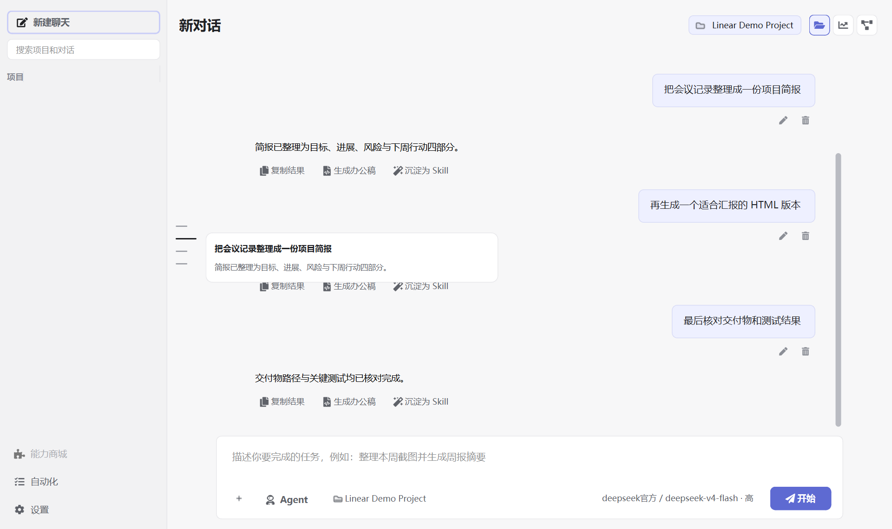

*截图 S19A 历史提问细轨与答复摘要*

### 8.5 打开长历史与执行详情

打开长会话时，Cowork 会先在后台读取记录，再逐条呈现最近 12 个对话摘要。历史 AI 轮次优先显示最终答复；只有该轮包含思考、阶段回复或工具调用时，才会出现“执行过程”入口。展开后完整过程会按原顺序分批恢复，折叠不会销毁已经加载的内容。

*截图 S37 长历史答案优先与执行详情按需加载*

### 8.6 查看任务观测

需要了解 AI 调用了什么工具时，打开右侧“任务观测”。“调用记录”适合普通核对；“技术详情”主要给排错人员使用，包含参数、代码、输出和错误。首轮及 Tool 集合变化时还会记录当前 Tool 的暴露来源，可区分核心内置直出、当前会话指定以及按需搜索发现，未变化时不会重复刷屏。

*截图 S20 任务观测*

## 9. 查看文件与交付物

AI 生成文件后，不必先去资源管理器里找。右侧“文件与交付物”可以直接预览和继续操作。

会话顶部的项目名/“独立聊天”按钮和旁边的“文件与交付物”按钮都会打开当前会话的实际工作区。即使刚刚从左侧浏览过其他项目，也不会继续显示上一次目录；当前目录已被移动、删除或无法访问时，界面会直接说明原因。

### 9.1 文件和交付物的区别

| 名称 | 含义 | 例子 |
| --- | --- | --- |
| 工作区文件 | 当前聊天目录或项目目录中的普通文件。 | 原始资料、附件、临时文件。 |
| 交付物 | 系统识别或你手动标记为结果的文件。 | 报告、HTML 工作稿、PPTX、DOCX、PDF。 |

### 9.2 打开、预览和编辑

- 打开右侧“文件与交付物”。

- 使用导航顶部的“交付物 / 工作区文件”切换范围。搜索框始终可用；文件类型与排序集中在筛选按钮中。

- 点击文件后会在命令栏新增标签；可以同时保留多个文件标签，点击切换，关闭当前标签后会自动选择相邻文件。标签过多时可横向滚动或从末端菜单选择。

- 未固定的文件导航紧贴工作台左边缘并与左上导航按钮对齐，不再显示成独立浮卡。点击图钉会先放大工作台，再把导航固定为左列并让内容右移；极窄窗口会明确说明暂时只能使用浮层，放宽后自动恢复固定。

- 可编辑文件使用工具栏中的铅笔按钮进入编辑，再用眼睛按钮返回预览。只读格式会明确显示“只读预览”，不会出现无效编辑入口。进入编辑前，应用会先检查文件大小、结构和兼容性。

- 文件名只在顶部标签中显示；内容工具栏仅保留类型、大小和修改时间。正常预览不再重复显示“正在预览”，加载、保存、冲突或失败时才出现额外状态。

- “更多操作”保留打开、在资源管理器中显示、复制路径、刷新、另存为和恢复上一版；HTML 工作稿还可继续生成本地文件。

*截图 S21 交付物列表*

*截图 S22 交付物预览*

当前可内嵌预览 Markdown、HTML、TXT、JSON、XML、YAML、日志、常用代码/配置文件、CSV/TSV、图片、PDF、DOCX、PPTX 和 XLSX。旧版 DOC、PPT、XLS 需要先转换为新版格式。

> 预览没有自动刷新 如果同一个文件在后台被修改，应用会保留你正在看的内容并提示手动刷新，避免阅读位置突然跳动。

### 9.3 安全编辑和保存

可以直接编辑 DOCX、HTML、XLSX、CSV/TSV、Markdown、JSON、XML、YAML、常见文本，以及 Python、JavaScript/TypeScript、CSS、SQL、Shell、PowerShell、TOML、INI、Java、Go、Rust、C/C++ 等常用代码和配置文件。PDF、PPTX、图片和旧版 DOC/PPT/XLS 保持只读。

兼容预检通过后，文件工作台会临时放大并隐藏文件导航，为编辑器保留更多空间；退出编辑后恢复原有宽度及导航固定状态。保存失败或检测到外部修改时，工作台保持编辑状态，方便继续处理。

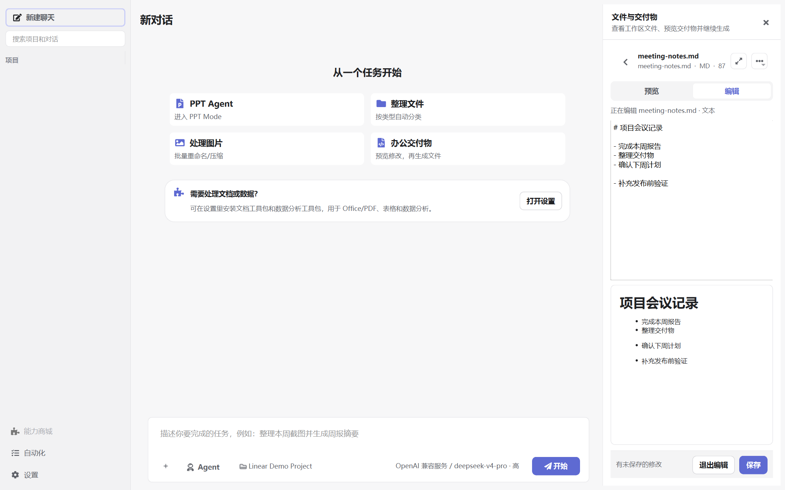

*截图 S22A Markdown 文本与预览联动；窄侧栏会自动上下排列*

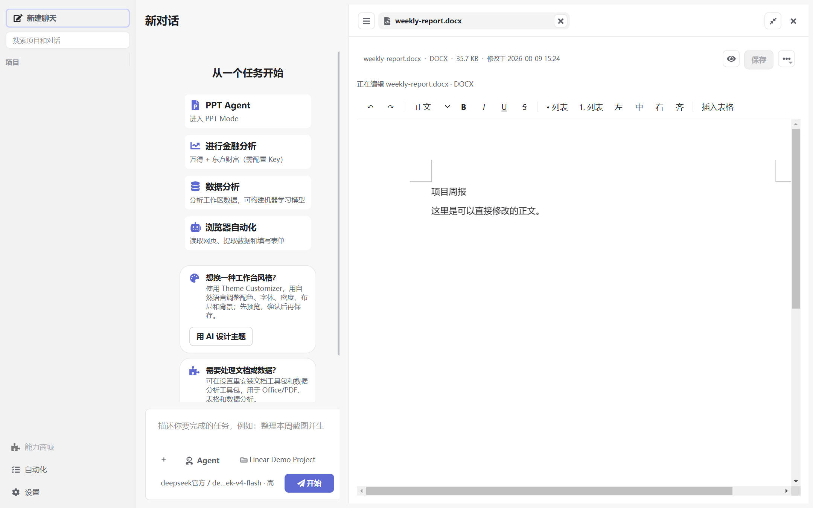

*截图 S22B DOCX 正文编辑；页眉页脚在保存时原样保留*

- DOCX 适合普通段落、标题、列表、表格、图片和常用格式。单节且不含图片或外链的普通页眉页脚会原样保留，但只能编辑正文；多节、首页/奇偶页专用、带关联资源的复杂页眉页脚，以及修订、复杂域、内容控件或嵌入对象会阻止编辑。
- DOCX 编辑器生成的空批注/脚注基础部件不会阻止保存；文档中存在真实批注、脚注或尾注时仍会明确阻止编辑，避免内容在往返过程中丢失。
- XLSX 支持多工作表、值、公式、常用格式、合并单元格和行列操作；图表、数据透视表、外部链接和嵌入对象会阻止编辑。
- HTML 在隔离页面中修改静态内容、链接、图片和基础样式。脚本不会执行，动态或受保护节点必须完整保留；保存时只把编辑后的 body DOM 补丁应用到原文档，原始 head 继续保持权威。
- JSON、XML 和 YAML 在保存前严格校验；无法可靠识别编码的文本会要求你明确选择编码。
- DOCX/XLSX 上限为 25 MiB，HTML、文本、CSV/TSV 上限为 10 MiB。图片、工作表和有效单元格规模也有安全预算，超限会明确阻止编辑。

“保存”会覆盖原文件，但先在应用数据目录保留唯一的上一版备份。保存流程是“临时文件验证 → 更新上一版备份 → 原子替换”；失败时编辑内容和原文件都会保留。若文件在外部被修改，应用会禁止直接覆盖，只允许重新载入或“另存为”。从更多菜单可以恢复上一版。

切换文件、项目、会话、退出编辑或关闭应用时，如果仍有未保存修改，都会走同一确认流程。

### 9.4 运行环境与加载方式

- 基准环境为 4 核 CPU、8 GB 内存和 SSD；推荐 16 GB 内存，不要求独立显卡。
- 编辑器按格式延迟加载。没有进入编辑时，不初始化 Canvas Editor、Univer 或 Office 文档模型。
- 富编辑器资源随发行包离线提供，不需要 Node、`node_modules` 或 CDN；实际包体以当前 Release 的构建审计为准。

### 9.5 找不到生成文件

- 先看对话最后的回答是否给出了完整文件路径。

- 查看生成任务卡下方是否有文件卡片。

- 在“文件与交付物”中清除筛选并切换排序。

- 把导航范围切换为“工作区文件”，查看真实目录树。

- 仍找不到时，让 AI 明确回复：“请告诉我刚才生成文件的完整路径，不要重新生成。”

## 10. 生成 PPT、DOCX 和 PDF

推荐先生成可预览的 HTML 工作稿，确认内容和样式，再转换成最终办公文件。

### 10.1 从一条 AI 回答生成办公稿

- 先通过对话得到内容完整的最终回答。

- 在回答末尾点击“生成办公稿”。

- 选择自由、PPT、设计稿或 DOCX 类型。

- 等待任务卡显示真实交付物文件。

- 在右侧预览工作稿，并继续提出修改要求。

*截图 S23 生成办公稿*

### 10.2 使用 PPT 助手

如果目标本来就是演示文稿，可以从新会话首页的“PPT 助手”卡片，或输入工具栏“Agent → PPT 助手”进入。PPT 助手默认直接生成 PPTX，也可以改为生成单个 16:9 分页 HTML。“更多设置”中只显示已配置且支持图片理解的模型；这里的模型选择仅对本次任务生效，不会改变当前会话模型。

- 打开 PPT 助手。

- 说明演示目的、受众、预计页数和必须包含的内容。

- 保持默认 PPTX，或切换为“16:9 演示型 HTML”。

- PPTX 必须添加模板原文件；HTML 不读取 PPTX 模板。两种格式都可以添加参考资料。

- 已添加的资料和模板会逐项显示；可以移除单个文件、更换模板，或一次清空全部文件。

- PPTX 会先用 PowerPoint（优先）或 WPS 将模板逐页导出为截图，再把模板、截图和资料交给所选多模态模型。模型会被建议使用 `python-pptx` 和 OOXML 读取、克隆并改写模板，直接输出新的 PPTX。

- 生成后，系统再次逐页截图，并交给同一个模型复核；发现错位、图片缺失、字体替换或文字溢出时，最多自动修复两轮。

*截图 S24 PPT 助手*

> 运行依赖 直接生成 PPTX 需要 `python-pptx`。缺少时，PPT 助手会引导你到“设置 → 组件与依赖”安装文档工具包。应用只内置 PowerPoint/WPS 自动化适配器，不能内置或代替 Office/WPS 本体；如果两者都不可用，你可以明确确认继续生成，但结果会标记为“未视觉校验”。

### 10.3 从 HTML 生成最终文件

- 在交付物预览中打开 HTML 工作稿。

- 确认每一页的内容、顺序和视觉效果。

- 点击底部“生成文件…”。

- 选择 PPTX、DOCX 或 PDF。

- 生成 PPTX 时，选择“选择模板”或“直接生成”。

- 等待完成通知，再从交付物列表打开最终文件。

*截图 S25 从 HTML 生成文件*

*截图 S26 生成完成后的文件*

*截图 S27 在 PowerPoint 中继续编辑*

### 10.4 PPT 任务写法示例

> 可以直接复制 请制作一份 10 页以内的项目汇报，面向不熟悉项目的管理层。先讲结论，再讲进展、问题、风险和下周行动。整体使用浅色、简洁、低装饰风格，每页只表达一个重点。先生成可预览的 HTML 演示工作稿，不要直接生成 PPTX。

## 11. 能力、Agent 与 Skill

这三个词容易混淆。简单说：能力是工具，Agent 是带特定工作方式的助手，Skill 是可复用的经验包。

| 名称 | 普通用户怎么理解 | 什么时候用 |
| --- | --- | --- |
| 能力 | 给 AI 增加一种工具或连接。 | 需要搜索网页、处理文档、访问 MCP 服务等。 |
| Agent | 预先设定角色、规则和能力范围的助手。 | 长期重复做同一类任务，或使用 PPT 助手。 |
| Skill | 告诉 AI 某类任务应该怎样做的经验包。 | 把成熟流程沉淀下来，或安装别人提供的标准能力包。 |

### 11.1 AI 能力商城

普通使用只需要完成三步：按任务场景找到能力，阅读访问边界，按卡片提示开启或
设置。Tool、MCP、依赖和文件级调试只在排错或开发能力时进入“开发与诊断”。

- 点击左下角“能力商城”。

- 在“发现能力”中选择“查找资料、处理文档、分析数据、制作内容、金融研究”等任务场景。

- “发现能力”“SkillHub”和“我的能力”统一使用随窗口宽度调整的 1–4 列卡片；标题和摘要省略的内容可悬停查看，开启操作位于卡片右上角，状态与设置／管理位于底部。窄窗口的任务分类栏可横向滚动。

- 每张能力卡片直接说明“能帮你做什么”和两个典型任务，不需要理解插件、Tool 或 MCP。

- 右上角“导入 Skill”可以直接选择 ZIP；“我的能力”单独展示由你创建、AI 生成或手动导入的能力，提供“管理”入口，“更多（···）”菜单中可导出和删除。单项导出文件名使用 Skill 的实际名称，批量导出仍使用 `cowork-skills.zip`。

- 未开启的能力显示“开启”；需要账号或密钥时显示“设置后开启”。

- 已开启的能力显示“✓ 已开启”，并在同一张卡片中直接提供“关闭”；有运行设置时同时提供“设置”。

- “浏览器自动化”会把随包 CLI 安装、离线扩展准备、浏览器扩展安装、连接检查和最终开启放在同一个能力详情中。只有浏览器真正连接后才显示“✓ 已开启”，不需要前往设置页理解组件或依赖。

- “企业微信办公套件”与“企业消息 → 企业微信”是两项独立功能。首次点击“连接并开启”后，使用企业微信扫描能力详情中的二维码；Cowork 会先检查本机凭据，再执行只读身份请求验证真实连接，成功后才自动开启。关闭能力只停止发现和调用，不删除授权。

- 企业微信连接状态会区分“未授权”“本机已授权但未验证”“已连接”“需要重新授权”和“CLI 不可用”。本机已有凭据不代表服务端权限仍有效；遇到后两种状态时，在能力详情中点击“检测连接”或“重新授权”。

- 企业微信凭据保存在 Cowork AppData 的独立能力目录，不会读取、同步或覆盖企业消息渠道的 Bot ID/Secret，也不会写入 `config.json`、Skill 文件或诊断日志。

- 设置保存失败会保留输入并显示原因，不会在失败后开启能力。

- Tool、Script、MCP、文件编辑、文件夹导入、批量操作和调试收进右上角“开发与诊断”，不会干扰普通浏览。

- 能力创建、更新、启停、删除或依赖准备完成后，结果显示在主界面右上角下方的系统 Toast 中；提示会避开 Windows 顶部窗口按钮，不会作为 AI 回复插入主聊天。

按需展开：远程 Skill 与搜索、东方财富、万得配置

#### 通过链接安装远程 Skill

可以直接告诉 AI：“阅读 `https://example.com/skill.md` 安装这个能力”。AI 会把任务交给远程 Skill 安装专用 Agent：

- 第一步只读取入口、检查仓库并生成固定安装预览，不会执行入口里的 `npx`、Git 或 Shell 命令。
- 仓库目录和固定提交由安装器自动核验，无需反复选择镜像、安装范围或手工提供 commit。
- 预览会列出来源、commit、准备安装的 Skill、脚本风险和 API Key 等配置项。确认前不会写入能力目录。
- 只有你明确同意后，Cowork 才安装刚才预览的同一份快照；预览 30 分钟后过期，也不能跨会话复用。
- 已有同名 Skill 时安装会停止，不会覆盖或静默更新。
- 安装后需要 Key 的能力会显示“待设置”。填写后点击“保存并开启”即可；密钥不会写入上游 `.env` 或脚本，只在运行时临时注入。
- 如果入口确实无法确定必需 Skill，系统只询问一次必要信息，不会通过浏览器补证或反复改写请求校对。

远程入口和仓库内容都按不可信数据处理。专用 Agent 没有 Shell、文件写入或密钥访问能力；入口文档即使要求忽略规则、打开浏览器或覆盖配置，也不会因此获得额外权限。

#### 配置网页搜索

开启“网页搜索”后，点击“设置”：

- “默认搜索服务”可以选择 AnySearch 或 Tavily，AI 也可以在单次搜索中显式指定另一服务。
- AnySearch API Key 和 Tavily API Key 都是选填项；不填写时使用供应商官方的匿名/Keyless 模式，速率和额度较低。
- 点击“获取 API Key”可打开 AnySearch 控制台；点击“前往 Tavily 注册”会打开 <https://www.tavily.com/>。
- 搜索服务失败时，AI 会先告诉你真实原因。只有你同意后，AI 才会显式改用另一个服务。
- 如果让 AI 使用邮箱注册 AnySearch，AI 必须先说明邮箱会成为外部账户用户名，并取得“创建账户且在本机保存 Key”的明确同意。完整 Key 不会显示在聊天或诊断日志中；注册成功后请检查收件箱和垃圾邮件。

#### 配置东方财富妙想

开启“东方财富妙想”后，点击“设置”：

- 在“妙想 API Key”中保存从东方财富妙想 Skills 页面获取的密钥；6 个金融子能力共享这一份配置。
- “妙想 API 地址”通常保留默认值。密钥只保存在 Cowork 本地能力配置中，不需要修改系统环境变量或 `.env`。
- 第一次执行任一妙想脚本时，Cowork 会自动准备该能力包声明的 Python 依赖；准备完成后会继续本次调用，无需再次发送问题。
- 查询文本、发文和互动内容会发送到东方财富妙想 API；生成文件默认位于当前会话工作区的 `mx_data/output`。
- 金融数据、资讯和选股查询不会修改账户。添加/删除自选股、模拟买卖或撤单、发文、点赞和评论只会在你明确提出对应动作后执行。
- 发文成功不会自动点赞或评论；如需互动，请单独说明目标和内容。

#### 配置万得金融能力

开启“万得金融能力”后，点击“设置”：

- 按实际使用的数据源填写 `WIND_API_KEY`、`WIND_ALICE_API_URL`、`TUSHARE_TOKEN`、`FINVIZ_MODE`、`FINVIZ_API_KEY` 或 `FMP_API_KEY`。
- 这些字段均为可选项。Wind、Alice、Tushare、FINVIZ/FMP 等入口会在真正执行时分别检查自身所需配置，因此未配置 Wind Key 不会阻塞估值、仓位计算、市场环境判断等本地能力。
- 一个聚合能力包含固定快照内的 78 个金融 Skill；AI 会按需检索和加载，能力中心不会显示 78 个重复条目。
- 每个子能力保留原有数据源语义。选定来源失败时会直接给出认证、额度、网络、超时或空结果等根因，不会静默切换数据源。
- 插件不会运行上游安装或在线更新命令，也不会扫描用户目录中的 Key。凭据仅由能力中心在任务执行期间注入。
- 生成文件统一写入当前工作区的 `wind-aifinmarket/` 目录，Alice 下载内容写入其中的 `alice-downloads/` 子目录；工作区缺失、不可写或下载失败时会明确报错。
- 交易、止损、止盈和提醒类子能力只生成研究分析与执行计划，不会真实下单或修改账户。输出仅用于信息与研究参考，不构成投资建议；使用者应独立核验数据、假设、时效性及适用法规。

*截图 S28 任务驱动的 AI 能力商城*

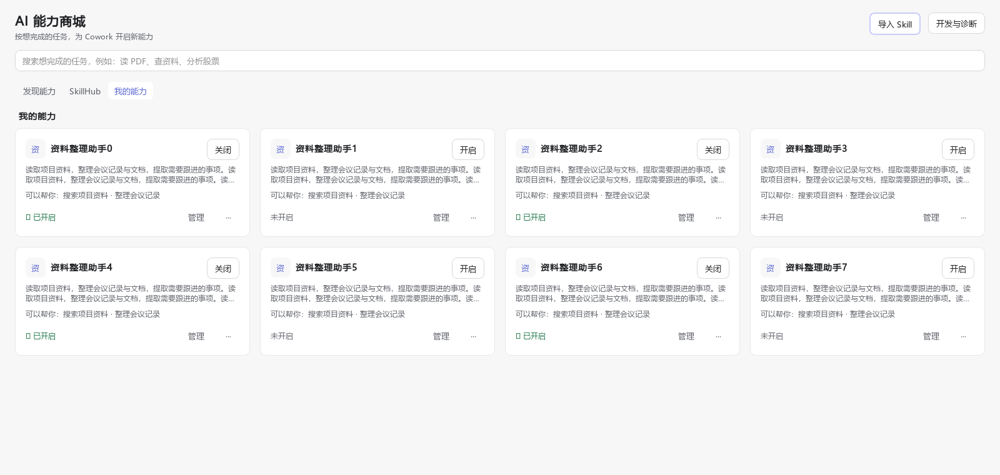

*发现能力和我的能力采用与 SkillHub 一致的卡片网格。*

*截图 S29 浏览器自动化的一体化开启流程；技术调试位于开发与诊断*

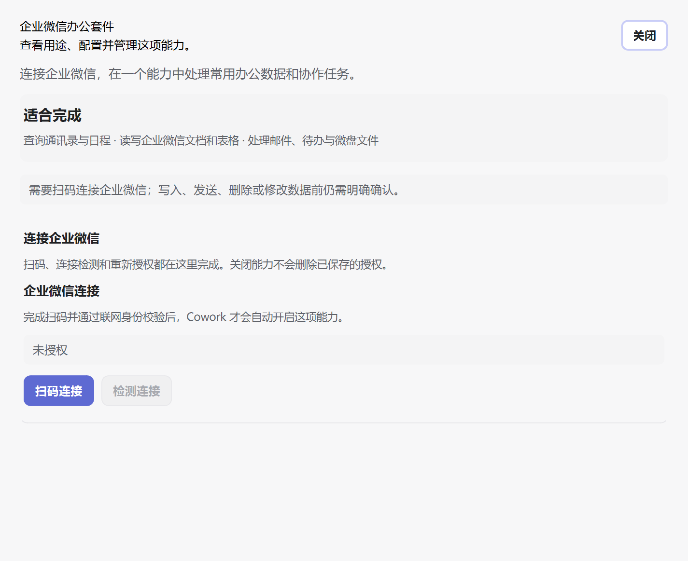

*截图 S29B 企业微信办公套件的扫码、检测连接和授权状态入口*

企业微信办公套件连接后，可让 AI 查询通讯录，处理企业微信文档、在线表格、智能表格、邮件、日程、会议、待办、微盘和消息。上传、下载或生成本地文件时必须先打开有效工作区；发送、写入、修改或删除前仍会按能力规则取得确认并复核结果。

> 启用不等于强制使用 启用后，AI 可以在合适任务中发现该能力；它通常不会自动加入当前会话的“指定能力”。如果本轮必须使用，可在输入区“+ → 指定能力”中明确选择。新对话首页的金融分析、数据分析和浏览器自动化卡片属于显式任务快捷方式：只有依赖与 Key 就绪时才会加入对应能力，否则会保留提示词并显示准备提醒。旧版本曾写入历史的能力状态提示会在回放时隐藏，但不会修改原始会话数据。

### 11.2 指定能力和选择 Agent

点击输入工具栏的“+”可以指定本会话优先能力；选择器只展示已启用的可选能力、
MCP 和自定义能力。核心内置 Tool 始终按当前上下文提供，不在选择器重复出现。
明确指定的可选能力会直接进入本轮；其他已启用能力仍可由 AI 按任务发现。

点击“Agent”可以加入内置或自定义智能体。当前选择显示在输入区附近，任务结束后
可以调整。旧会话若保存过已经不需要指定的内置能力，重新应用选择后会自动清理。

*截图 S30 为当前会话指定能力*

*截图 S31 Agent 选择器*

### 11.3 沉淀为 Skill

- 先在真实任务中形成一套效果稳定的做法。

- 点击“+ → 沉淀为 Skill”，或使用最终回答末尾的同名操作。

- 选择当前问答、最近三轮、全部或自定义会话片段。消息级入口会默认带上该回答对应的完整用户任务链。

- 点击“开始复用分析”。按钮会短暂显示“正在转入后台…”，来源会话随即出现“正在分析复用价值 · 已转到后台，可继续对话”的任务行；生成期间仍可继续聊天或切换会话。

- 点击“复用分析待确认”，直接修改目标、可复用规律、失败边界等分析全文，再选择创建新 Skill、合并增强已有 Skill 或仅追加结构化经验。Skill 草稿会以修改后的全文为内容意图；原始证据继续用于来源和隐私校验。脚本、引用和工具候选默认不保存；勾选脚本后 AI 会按候选用途重新生成参数化实现，不会原样保存会话中执行过的代码。

- 点击“后台编译 Skill 草稿”后，来源会话显示相同的后台状态。第二阶段完成后点击“Skill 草稿已生成 · 待确认保存”，按“概览、指导、资源、变更与校验”检查内容。低置信草稿必须确认已了解缺失项；静态错误需要修复，或取消选择有问题的资源。

- 分析和草稿会按会话保存。左侧会话栏使用独立图标显示运行、待确认或失败；点击图标可返回来源会话。只有阶段完成时正在查看其他会话，主界面右上角下方才会显示一次完成 Toast。同会话完成、开始、进度和失败不会弹出额外 Toast。

*截图 S32 Skill 复用分析确认*

*截图 S33 Skill 后台分析状态*

*截图 S34 Skill 草稿待确认状态*

> 不会自动保存 生成的复用分析和 Skill 草稿都留在原会话中。取消查看或保存失败不会丢失状态，可以稍后继续。

## 12. 常用工作模式

“常用”是你的快捷任务库，用来保存经常重复的任务，也可以预先选择完成任务需要的能力。点击常用项后，Cowork 会新建一个主智能体任务：有任务内容时直接开始，只有能力时加载能力并等待输入。定时运行只是常用项上的可选附加能力。

### 12.1 保存和开始常用项

- 点击左下角“常用”，再选择“新建常用”；也可以在聊天输入区点击“+ → 存为常用”，直接带入尚未发送的提示词与已选能力，原输入不会被清空。

- 填写任务名称和要完成的任务，再按需补充说明或添加能力；能力通过“添加能力”搜索选择，主页面只显示已选摘要。不保存模型、附件或自定义 Agent。

- 日常设置默认只显示任务与已选能力。“运行环境与自动化”中可以改为“在项目中运行”或添加定时计划；没有这些需要时可以保持收起。

- “独立聊天”不会携带、显示或预选任何项目；“在项目中运行”必须选择一个存在的项目，启动时会把它带到新任务。

- 点击“开始”会直接提交保存的任务内容；只选择能力、没有任务内容时，会在新任务中等待你继续输入。

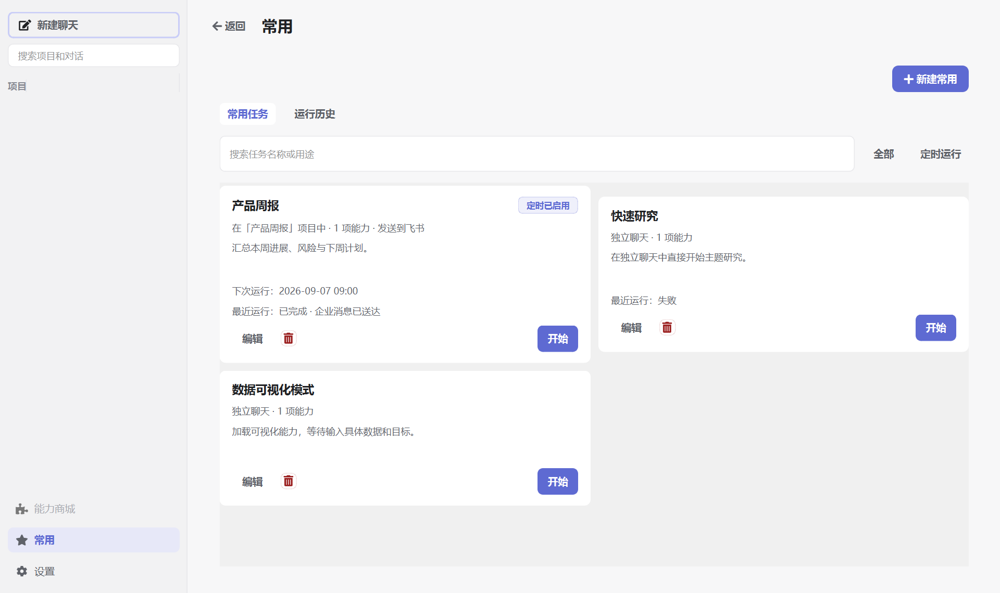

*截图 S40 常用库以紧凑卡片展示任务用途、运行位置、能力数量、定时状态和最近结果*

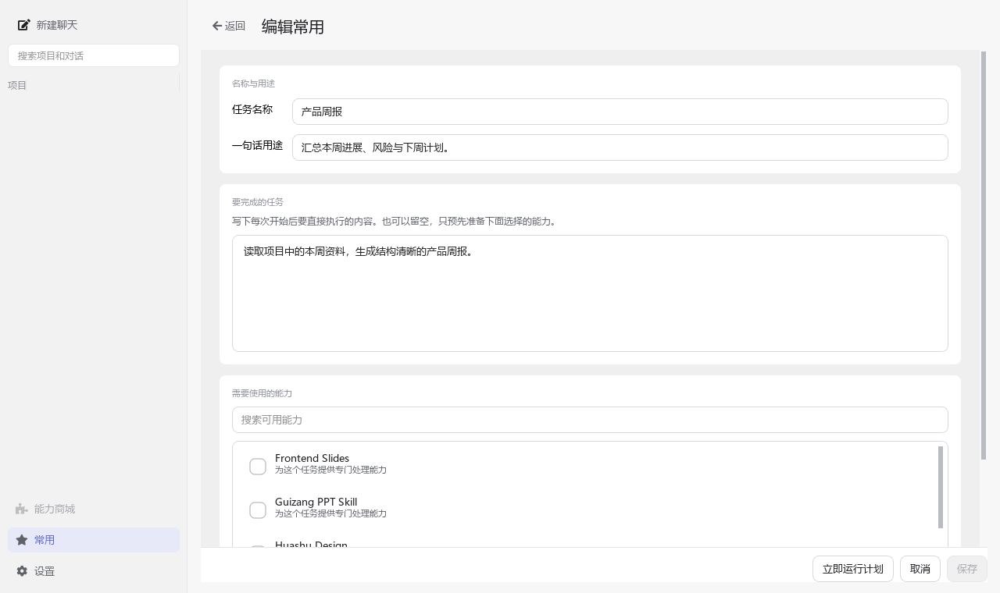

*截图 S41 常用项编辑器优先展示任务名称、用途、任务内容和需要的能力*

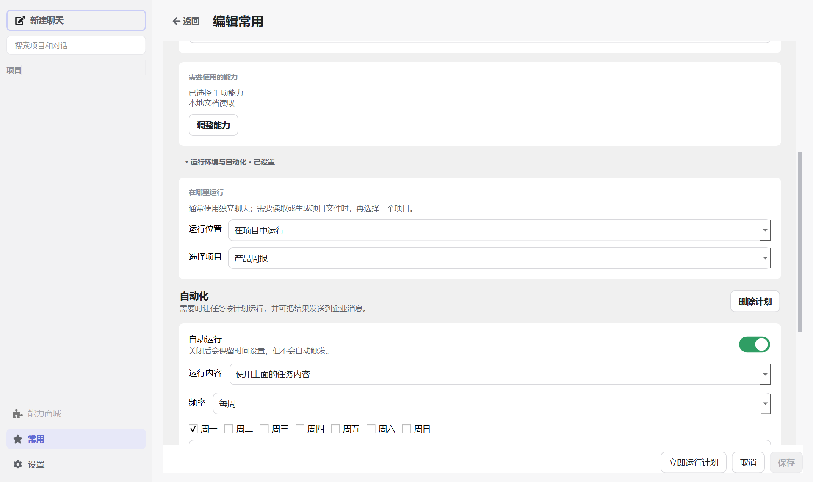

*截图 S42 项目位置与定时运行位于可展开的“运行环境与自动化”中*

### 12.2 让 AI 配置常用库

可以直接对 AI 说“把这段提示词和数据可视化能力保存为常用”“把产品周报改到这个项目执行”或“运行我的快速研究”。AI 会通过 `tool_search` 发现常用库管理 Skill，再读取、创建、修改或启动对应常用项。启动和删除仍会要求确认。

### 12.3 附加定时运行

- 每个常用项最多附加一个计划，可选择单次、每天、每周、每月、间隔或 Cron。
- 计划继承常用项选择的能力和运行位置。运行内容可以使用上面的任务内容，也可以为定时运行单独填写。
- 只有能力、没有任务内容的常用项，启用计划前必须为定时运行单独填写任务内容。
- 计划依赖桌面应用正在运行；关闭期间错过的触发会记录为“已错过”并跳过，不会集中补跑。
- 建议先保存并点击“立即运行计划”，确认输入、权限和输出位置，再正式启用。
- 计划创建的对话与普通对话使用同一消息流，标题下会标明“由定时任务启动”或“手动运行计划”；打开后可以看到实际任务内容、运行过程和最终结果。

> 示例 每周一上午整理指定项目的“周报素材”文件夹。读取上周新增的 Markdown 和 Excel 文件，生成“周报_YYYY-MM-DD.docx”。结构为本周结论、完成事项、风险和下周计划；缺少负责人或日期时标记“待确认”，不要猜测。完成后回复生成文件的完整路径。

### 12.4 把定时结果发送到企业消息

- 第一次使用前先进入“设置 → 企业消息”，完成并启用飞书、企业微信或钉钉渠道；钉钉还必须配置固定 HTTPS Webhook。常用编辑器会检查渠道状态，配置不完整时提供“去设置企业消息”，返回后不会丢失尚未保存的常用内容。
- 在常用项的定时设置中打开“发送到企业消息”，点击“生成绑定码”。绑定消息有效期为 10 分钟，只能使用一次。
- 在需要接收结果的飞书、企业微信或钉钉会话中发送界面显示的完整消息，例如“绑定常用 123456”。请点击“复制完整消息”，不要只发送六位数字；裸数字可能是普通聊天内容，不会触发绑定。
- 飞书会发送最终正文，并上传最终答复明确引用的本地产物；图片最大 10MB，其他文件最大 30MB。钉钉和企业微信只发送最终正文，不发送本地产物。
- 自动触发和“立即运行计划”都会投递；普通“开始”不会投递。任务失败或停止时，接收位置会收到对应状态和原因。
- Cowork 同时只运行一个企业消息渠道。绑定渠道不是当前渠道时，任务仍正常完成，但投递会显示“待切换渠道”；切换后可在最近运行中点击“重新发送”。
- 投递失败不会把已完成的任务改成失败。运行历史会分别显示任务状态和企业消息状态；发送结果不确定时不会自动重试，以免产生重复消息。

### 12.5 查看运行历史

- 常用首页可在“常用任务”和“运行历史”之间切换。任务卡片显示下一次运行和最近一次结果；历史视图按时间倒序展示所有计划运行。
- 历史中的任务状态与企业消息状态彼此独立。可以按“运行中”“失败或中断”“投递异常”筛选，并按任务名称搜索。
- 明确发送失败或部分送达时可以“重新发送未成功项”；状态未知意味着消息可能已经送达，手动重发前会再次确认。编辑已有常用时，底部只显示最近三条记录，并可跳转到当前任务的全部历史。

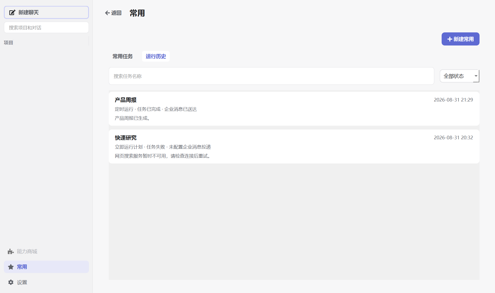

*截图 S40B 运行历史分别展示任务状态和企业消息投递状态*

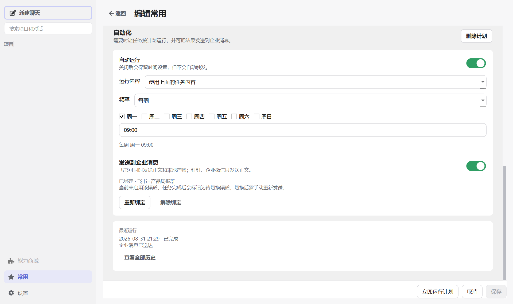

*截图 S43 定时计划可以绑定一个企业消息接收位置，并明确显示渠道与产物限制*

## 13. 外观、记忆、归档、更新与组件

这些功能集中在设置中。日常只需偶尔维护，不必每次对话都调整。

### 13.1 外观与主题

“设置 → 外观”用于管理 `.cowork-theme` 主题。默认浅色主题是只读安全基线；
自定义主题按“新建或复制 → 编辑草稿 → 预览 → 保存或放弃”生效。

- 可以调整字体比例、密度、圆角、强调色、主要宽度、统一工作区场景和受控组件。
- 选择或编辑只改变草稿；点击“预览”才刷新界面，继续修改后必须重新预览。
- 主题包可以导入、导出和携带 PNG、JPEG、GIF、WebP；GIF 和动态 WebP 只能作为统一工作区背景，不接受 SVG、APNG、字体、网络资源或可执行内容。
- AI 可以设计主题草稿，但保存、启用和删除都需要确认；revision 变化后旧确认失效。
- 左/中/右区域、按钮动作、Windows 窗口控制、输入与主要提交、预览恢复条均由代码保护。

首页卡片可以修改展示文案、图标、样式、位置或可见性，但点击后的预填提示词、
PPT 助手模式、能力加载条件和“打开设置”行为不会改变。需要写实背景时请先提供本地
图片；主题流程不会自动调用图片模型。

完整操作、安全边界与 Visualize 配合方式见
[AI 主题与 Visualize 专题指南](guides/ai-theme-and-visualize.md)。

*截图 S39 声明式背景、首页文案、卡片布局与原生窗口品牌文字共同预览；系统窗口行为保持不变*

> 建议 让 AI 先生成一款主题并预览，再根据“强调色更克制、正文更大、密度更紧凑”等具体反馈迭代。不要让 AI 直接修改应用 QSS。

空白新会话首页会显示“用 AI 设计主题”提醒。点击后会在首次发送前选中
Theme Customizer 并填入主题需求草稿，不会自动发送、保存或启用主题。主题本身
可以隐藏这条提醒；需要重新显示时，可让 AI 把 `home.theme_reminder` 的
`visible` 恢复为 `true`。

### 13.2 个性与记忆

“个性与记忆”用于保存长期稳定的信息，例如你喜欢的回答风格、固定称呼、公司背景或当前项目长期约定。一次性任务细节不要放进长期记忆。

*截图 S35 个性与记忆*

- 全局长期摘要：适用于所有工作区的稳定偏好和背景。

- 当前工作区摘要：只用于当前项目或工作区，避免不同项目互相污染。

- 从历史生成的内容会先成为草稿，需要你确认后才应用。

### 13.3 工作区与归档

“工作区”可以修改后续新独立聊天使用的根目录。已有会话继续使用原目录，不会被静默移动。“归档”可以恢复被隐藏的项目和对话。归档不等于删除文件。

### 13.4 更新应用

- 进入“设置 → 更新”。

- 网络可用时，点击“检查并更新”从 GitHub Releases 检查、下载并安装新版本。

- GitHub 无法访问但已经下载了官方安装包时，点击“选择本地安装包”，选择名称为 `deepseek-cowork-vX.Y.Z.zip` 的 ZIP 文件。验证完成后可以选择前台或后台安装并重启。

- 本地更新只接受版本高于当前版本的 Windows 打包版，不支持同版本重装或降级；源码运行模式不能自动替换安装目录。

- 本地包不携带在线更新日志。只使用从项目正式 Releases 页面下载且未修改的安装包，不要选择来源不明的压缩包。

- 重要项目先备份，再按页面提示安装。验证失败时页面会保留明确原因，不会改用其他更新方式。

*截图 S36 更新页面*

### 13.5 组件与依赖

文档工具包已随应用安装，不需要联网准备，也不能单独卸载；可以在“设置 → 组件与依赖”检测完整性。数据分析工具包、Node.js 和“语音转文字组件”等其他运行组件仍可按需安装。组件任务会按加入顺序处理，关闭设置后仍会继续。浏览器自动化不在这里维护，它的完整开启流程位于“AI 能力商城 → 浏览器自动化”。

“语音转文字组件”作为独立的 Windows x64 GitHub Release ZIP 分发。下载后点击“选择安装包”，应用会离线校验平台、版本、完整文件清单、固定大小和 SHA-256，再一次部署 Node.js、`sherpa-onnx-node`、FFmpeg、SenseVoice 和两套说话人分离模型。校验或健康检查失败会恢复原安装，不会联网补文件、运行 npm 或切换来源。

打开设置页不会自动扫描目录或检查版本。页面只显示“上次记录”；没有记录时显示“尚未检测”。只有点击单项“检测状态”、“手动刷新状态”，或执行安装、更新、修复、卸载后，相关状态才会更新。执行变更前应用会重新核对目标组件；如果真实状态与上次记录冲突，本次操作会停止并要求重新确认。

*截图 S38 组件状态使用上次记录*

> 什么时候安装 文档工具包无需安装；其他组件只有在任务明确需要或应用提示缺少依赖时再安装。安装失败会显示原因，不会静默换成质量更低的方案。

### 13.6 变量与凭据

在“设置 → 变量与凭据”中可以直接添加并管理两类全局值：

- 普通变量：可以从输入框“+ → 插入变量”直接插入当前光标位置；发送前能看到最终文本。AI 也可以在本地普通会话中按准确名称查询，查询结果会进入当前会话历史。
- 敏感凭据：使用当前 Windows 用户的 DPAPI 加密，默认不允许 AI 读取，也不会在列表中显示值。

如果确实需要 AI 使用某个 AK、token 或 key，可以为该凭据显式开启“允许 AI 按准确名称读取”。加密只保护本机落盘；一旦读取，明文会发送给当前模型并进入当前会话历史。Agent、企业消息、子 Agent 和受限任务不能读取这些变量。

## 14. 浏览器自动化与企业消息

这两类功能都属于进阶连接。没有明确需求时，可以先不配置。

### 14.1 浏览器自动化

浏览器自动化可以让 AI 在独立 Agent 窗口中读取带登录状态的网页、提取数据或填写表单。该能力默认关闭，首次开启时会在能力详情中引导完成一次简单设置。

- 打开“AI 能力商城”，在“查找资料”中点击“浏览器自动化 → 开启”。

- 点击“开始设置”，Cowork 会校验并安装随应用提供的 BrowserSkill CLI 0.1.8；运行时不需要访问 GitHub。

- 明确选择 Chrome 或 Edge，然后点击“离线安装扩展”。Cowork 会校验并解压随包扩展 0.1.4，打开对应的扩展管理页和稳定扩展目录。

- 在浏览器中依次“启用开发者模式 → 加载已解压的扩展程序 → 选择 Cowork 显示的目录”。可使用“复制路径”再次取得目录。

- 也可以点击“Chrome Web Store”走在线商店入口。不要在同一浏览器配置中同时启用商店版与离线版。

- 回到同一个页面，点击“检查并开启”。

- 检查成功后能力会自动开启，商城卡片显示“✓ 已开启”；失败时页面会保留当前步骤并显示具体原因。

商城卡片只显示“✓ 已开启 / 关闭”时，表示 Cowork 已校验 BrowserSkill CLI、结构化连接检查与一次真实标签页执行探测都已通过；随包不等于不经检查直接启用。Chrome/Edge 扩展仍必须由你亲自确认加载或安装，Cowork 不会通过 CRX、注册表或启动参数静默安装。Chrome 启动失败时页面会提示改选 Edge，不会自行切换；两者都不存在时需先安装受支持浏览器。

> 重要操作仍需确认 提交、发送、购买、删除、发布等会造成真实外部影响的操作，应在执行前逐项核对。不要因为是 AI 操作就跳过确认。

### 14.2 企业消息

“设置 → 企业消息”会按聊天软件列出飞书、钉钉、企业微信、QQ 和微信。当前连接会排在最前面；每一行只保留一个下一步操作。系统一次只运行一个渠道，切换后会停用旧渠道但保留它的连接信息。企业消息始终由默认主助手处理，并沿用 Cowork 的默认工作区与权限边界。

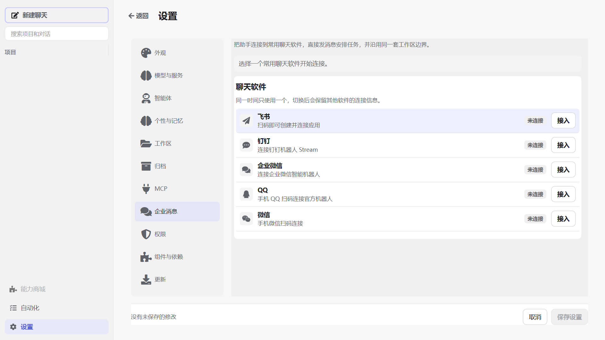

*截图 S40 企业消息聊天软件列表*

- **飞书、QQ、微信**：点击扫码按钮，在统一窗口中使用对应手机应用扫码并确认。二维码在本机生成；过期或失败后可直接重新生成。微信要求配对码时，在同一窗口输入即可。
- **钉钉、企业微信**：跟随页面步骤填写必要信息。钉钉的 Stream / WS URL、Webhook 和签名信息收在“高级设置”中；企业微信只需先准备 Bot ID 和 Secret。
- **QQ**：首版支持私聊和群聊中 @ 机器人，处理文字与链接。
- **微信**：首版支持私聊，处理文字与链接。图片、语音、文件或视频会收到“当前仅支持文字和链接”的明确提示，不会被静默忽略。
- **交付能力**：飞书可通过任务 Tool 原生发送本地文件、图片和链接；钉钉、企业微信只发送可访问 URL，不能上传本地路径；QQ、微信不提供附件发布 Tool。任务观测会保留交付调用和结果，只有明确成功的项目才会显示为已发送。

*截图 S41 微信扫码与手机确认状态*

接入成功后，页面会显示当前运行渠道。若显示“配置已保存，接入失败”，请先阅读页面给出的错误原因，再点击“打开日志”查看完整诊断。停止接入不会删除各渠道已经保存的凭据。

若企业微信已经显示“认证成功”并能收到消息，但回复提示本地连接被拒绝，请完全退出并重新启动 Cowork，使桌面端、daemon 和企业消息网关载入同一版本。正常情况下 daemon 关闭后会释放端口与单例锁，应用会自动重新启动后台服务。

> 凭据保护 企业应用密钥、Webhook、Bot Token、OpenID、二维码内容和模型 API Key 都不应出现在公开截图、演示文件或聊天群中。Cowork 的界面日志会隐藏这些值，但仍不应主动复制或分享原始凭据。

## 15. 常用任务照着说

下面的模板可以直接复制，再把方括号里的内容换成你的实际情况。

### 15.1 整理文档

> 模板 请阅读项目中的【文件名】，整理成一份面向【读者】的摘要。先写 5 条关键结论，再按主题分组说明。所有数字必须保留来源位置；无法确认的内容标记“待核实”。结果另存为【文件名.docx】，不要覆盖原文件。

### 15.2 对比多个方案

> 模板 请比较【方案 A】和【方案 B】，从成本、时间、风险、使用难度和后续维护五个方面分析。先给结论，再给比较表，最后说明结论成立的前提。不要替我做最终决定。

### 15.3 整理会议纪要

> 模板 请根据【会议资料】，生成会议纪要。结构为：会议结论、决定事项、待办、负责人、截止时间、待确认问题。不要把讨论过程误写成最终决定；没有明确负责人或日期时写“待确认”。

### 15.4 批量整理文件

> 模板 请先扫描【文件夹名称】，只统计文件类型、数量和命名问题，不要修改。给出拟采用的分类和重命名规则，等待我确认后再执行。执行时不要删除文件，保留一份变更清单。

### 15.5 生成 PPT

> 模板 请把【资料】整理成一份【页数】页以内的演示文稿，面向【受众】，目标是【目的】。先讲结论，再讲证据和行动。使用【风格】视觉，每页一个重点。先生成 HTML 工作稿供我预览，确认后再生成 PPTX。

## 16. 常见问题与安全建议

遇到问题时，先看页面上的原始错误，不要连续重复点击。下面按常见现象给出处理顺序。

### 16.1 常见问题速查

| 现象 | 先检查什么 | 建议处理 |
| --- | --- | --- |
| 不能发送消息 | 是否显示“未配置模型”。 | 使用启动时的 DeepSeek 快速配置，或到“模型与服务”拉取并保存渠道和模型。 |
| 拉取模型失败 | 页面显示的认证、地址、网络或响应错误。 | 按原始错误修正 Key 或 URL；失败时应用不会使用静态模型列表冒充成功。 |
| 模型报认证错误 | API Key、服务地址、账户状态。 | 重新复制密钥；不要在公开位置展示错误详情中的凭据。 |
| 粘贴图片后不能发送 | 当前模型是否支持图片理解。 | 切换视觉模型或核对模型配置。 |
| 不能切换项目 | 当前对话是否已有消息或任务在运行。 | 新建空白对话后再选择项目。 |
| 找不到文件 | 交付物筛选、排序和工作区。 | 清除筛选，浏览工作区，核对 AI 回复中的完整路径。 |
| 预览不是最新 | 文件是否刚被后台修改。 | 使用手动刷新，避免打断当前阅读。 |
| 能力不可用 | 是否启用、是否缺配置或依赖。 | 进入能力详情查看原始错误并完成配置。 |
| 常用计划没有运行 | 常用项的计划是否启用、提示词与执行位置是否有效、触发时应用是否运行。 | 先“立即运行计划”，再查看常用项内的运行历史。 |

### 16.2 报错时如何向别人求助

- 记录当前应用版本。

- 说明你在哪个页面、点击了什么。

- 复制完整错误文字，不要只说“不能用”。

- 说明问题是否每次都发生，以及你已经尝试过什么。

- 截图前遮住 API Key、Token、账号、项目路径中的隐私信息。

### 16.3 安全使用清单

- 重要文件先备份，尤其是批量修改前。

- 只把任务需要的文件放进项目目录。

- 删除、覆盖、移动、发送、购买和发布前逐项确认。

- 不向不可信人员泄露 API Key、企业凭据或内部文件。

- 扩展权限模式会突破工作区限制，只有完全理解风险时才开启。

- AI 给出的数字、日期、引用和外部结论，在正式使用前人工核对。

> 最稳妥的工作方式 先让 AI 阅读和提出方案，再让它小范围执行，最后人工检查结果。对高风险任务，把“不要删除、不要覆盖、先列清单等待确认”写进要求。

## 附录 A：常用快捷操作

| 操作 | 快捷键或方法 |
| --- | --- |
| 发送消息 | 输入完成后按 Enter；以界面实际提示为准。 |
| 粘贴文件或图片 | 在文件管理器或截图工具中复制内容，再在输入框按 Ctrl+V。 |
| 复制选中文字 | Ctrl+C。 |
| 撤销/重做输入 | Ctrl+Z / Ctrl+Y。 |
| 重命名项目或对话 | 聚焦对应行后按 F2。 |
| 保存重命名 | Enter。 |
| 取消重命名或编辑 | Esc。 |
| 从管理页面返回会话 | 点击返回，或按 Alt+Left。 |

## 附录 B：名词解释

| 名词 | 简单解释 |
| --- | --- |
| API | 应用与模型服务通信的接口。 |
| API Key | 访问模型服务的专用密钥，必须保密。 |
| 模型 | 负责理解、推理和生成内容的 AI。 |
| 渠道 | 一组模型服务地址、密钥和模型配置。 |
| 工作区 | AI 被允许处理文件的目录范围。 |
| 项目 | 你明确加入 Cowork 的本地文件夹。 |
| 交付物 | 任务最终生成并可预览或继续转换的文件。 |
| 能力 | AI 可以发现和调用的工具或连接。 |
| Agent | 带有特定角色、规则和能力范围的助手。 |
| Skill | 某类任务的可复用经验包，也可以携带工具。 |
| MCP | 把外部工具或服务接入 AI 的协议。 |
| HTML 工作稿 | 可在应用内预览、修改，并继续生成办公文件的中间稿。 |
| 常用 | 保存的提示词、能力组合与执行位置；可以按需附加一个定时计划。 |
