# DeepSeek Cowork 初学者用户使用指南

从第一次对话到完成真实工作。

- 应用版本：**5.2.3**
- 更新日期：2026 年 9 月 19 日

## 这份指南帮助你完成什么

从安装、配置模型和首次对话开始，逐步学会处理文件、生成办公成果、引用云端资料和复用日常任务。你不需要先理解编程、协议或工具调用，按当前任务选读即可。

**第一次使用的最短路线：**完整解压应用 → 配置模型 → 新建独立聊天 → 发送一个简单要求 → 收到完整回答。完成这五步后，再学习项目、附件和交付物。

## 阅读导航

第 1 至 5 节适合首次使用；第 6 至 13 节解决日常工作；第 14 至 25 节按需选读。

1. [下载并打开应用](#1-下载并打开应用)
2. [配置第一个模型](#2-配置第一个模型)
3. [认识界面并发送第一条要求](#3-认识界面并发送第一条要求)
4. [选择项目并保护原文件](#4-选择项目并保护原文件)
5. [添加文件和图片](#5-添加文件和图片)
6. [把任务说清楚](#6-把任务说清楚)
7. [理解执行授权](#7-理解执行授权)
8. [运行中补充要求和停止](#8-运行中补充要求和停止)
9. [查看用量和上下文组成](#9-查看用量和上下文组成)
10. [查找生成文件并预览](#10-查找生成文件并预览)
11. [编辑文件并保存](#11-编辑文件并保存)
12. [生成 Word 文档和 PDF](#12-生成-word-文档和-pdf)
13. [使用 PPT 助手](#13-使用-ppt-助手)
14. [连接资料库](#14-连接资料库)
15. [阅读资料并加入对话](#15-阅读资料并加入对话)
16. [把成果保存回资料库](#16-把成果保存回资料库)
17. [开启能力和安装 SkillHub 技能](#17-开启能力和安装-skillhub-技能)
18. [选择助手并保存成熟做法](#18-选择助手并保存成熟做法)
19. [保存常用任务并设置计划](#19-保存常用任务并设置计划)
20. [连接聊天软件并投递计划结果](#20-连接聊天软件并投递计划结果)
21. [启用浏览器自动化](#21-启用浏览器自动化)
22. [将录音转成文字](#22-将录音转成文字)
23. [调整外观和常用设置](#23-调整外观和常用设置)
24. [按需选择极简启动](#24-按需选择极简启动)
25. [更新应用和下载日志](#25-更新应用和下载日志)

## 1. 下载并打开应用

首次使用只需 Windows 电脑和可用的模型服务，不需要自己安装 Python 或输入命令。

### 操作步骤

1. 打开项目下载页：<https://github.com/chuancyzhang/deepseek-cowork/releases>，选择 Windows ZIP 安装包。
2. 下载后右键压缩包，选择“全部解压”，把整个压缩包解压到固定文件夹。
3. 打开解压后的目录，双击 `deepseek-cowork.exe`。不要直接在压缩包内启动程序。
4. 出现 Windows 提示时，核对下载来源，再按系统提示处理。

**完成标志：**能看到 Cowork 主界面或“快速启用 DeepSeek”窗口。先把基础对话跑通，再添加可选组件。

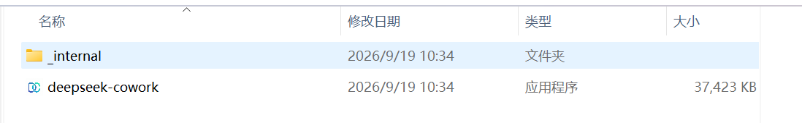

## 2. 配置第一个模型

模型负责理解问题和生成回答。API Key 是访问模型服务的密钥，请提前从服务商或管理员处取得。

### 操作步骤

1. 首次启动若出现“快速启用 DeepSeek”，填写 API Key，完成验证和模型同步。可以稍后配置，但配置前不能正常聊天。
2. 手动配置时进入“设置 → 模型与服务”，添加渠道，填写服务地址和 API Key。
3. 点击“拉取模型”，勾选接口返回的模型并导入。当前产品对 DeepSeek 官方服务推荐 `deepseek-flash`。
4. 选择“默认模型”，点击“保存设置”。新建对话会使用默认模型；已有对话保留各自选择。
5. 回到聊天页面，核对输入区的模型，发送“请用三句话介绍你能帮我做什么”。

**完成标志：**收到完整回答。若拉取失败，按界面错误检查地址、密钥和网络；不要把密钥放入截图。

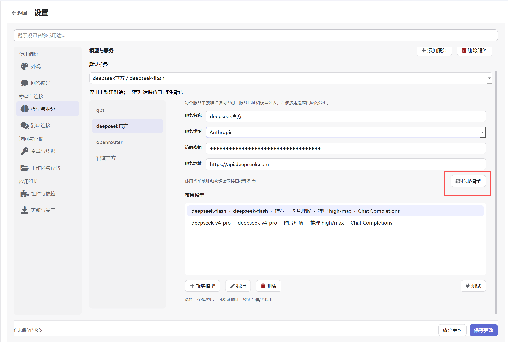

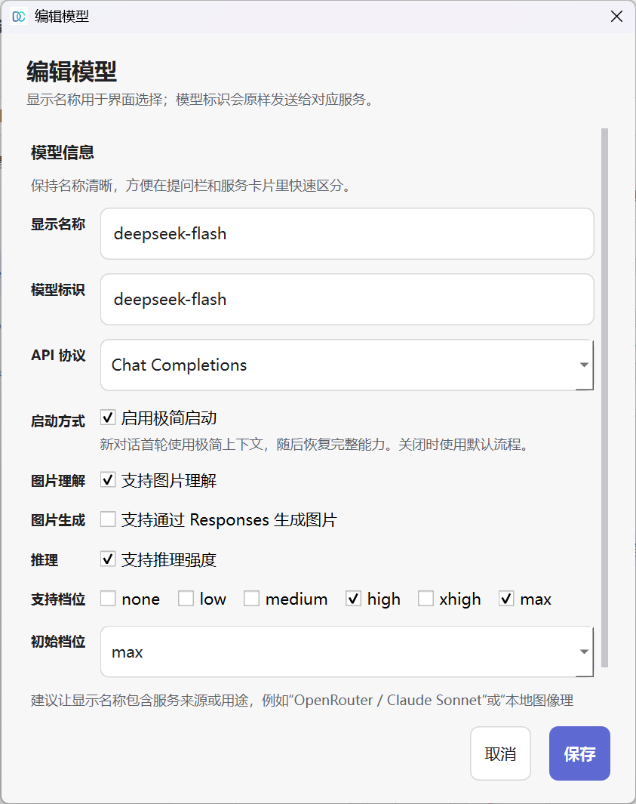

## 3. 认识界面并发送第一条要求

左边找项目和历史，中间看对话，下方输入要求，右侧查看文件和执行过程。窗口小时可关闭右侧区域。

### 操作步骤

1. 新建独立聊天，不必先选择项目。应用会给这段聊天准备独立的文件目录。
2. 在输入框写明任务，再点击发送或按界面提示使用 Enter。
3. 等待最终回答。可继续说“再简短一些”“保留结构，只改语气”，逐步调整。
4. 需要复制时，选中文字按 `Ctrl+C`。要继续做成文档，可使用回答末尾的“生成办公稿”。

**练习：**请帮我写一封 150 字以内的会议邀请，面向项目组成员，主题是下周计划讨论，先写主题再写正文。时间和地点不确定时写“待确认”。

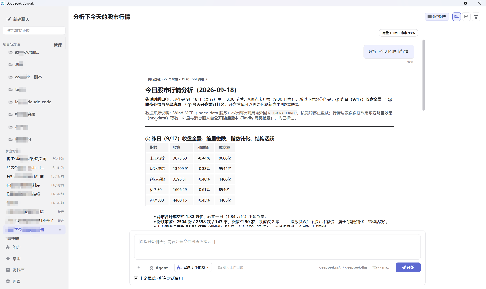

## 4. 选择项目并保护原文件

临时写作可以用独立聊天；处理已有资料时，使用项目聊天，把本次需要的文件集中到一个文件夹。

### 操作步骤

1. 先准备专用项目文件夹，把待处理资料复制进去；重要原件另行备份。
2. 点击项目区域的“+”或空白对话中的“添加新项目”，选择该文件夹。
3. 在尚未发送消息的新对话中选择项目，再说明目标文件和输出要求。
4. 已有消息的对话不能中途换项目；要处理另一个项目，请新建对话。
5. 项目或对话可重命名，聚焦对应行后按 `F2`。切换对话不会停止后台任务。

**可直接说：**请阅读“会议记录.txt”，另存为“会议纪要.docx”，不要覆盖原文件。先给结论，再列待办、负责人和日期；缺失内容写“待确认”。

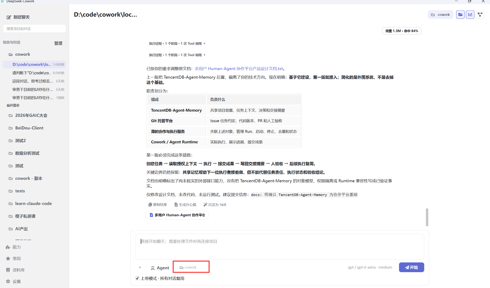

## 5. 添加文件和图片

附件用于提供资料，发送前先确认文件卡片或图片缩略图已出现。添加附件后，还需要写清楚希望 AI 做什么。

### 操作步骤

1. 点击输入区“+ → 添加文件”，选择文件；也可在资源管理器复制文件后，在输入框按 `Ctrl+V`。文件夹不能作为附件粘贴。
2. 截图后点击输入框并粘贴，确认出现缩略图。点击缩略图可放大，按 `Esc` 返回。
3. 图片预览支持适应窗口、100% 和缩放；使用“复制图片”可以复制图片本身，再粘贴到其他应用。
4. 同时提供多个文件时说明关系，例如“以 A.docx 为结构，以 B.xlsx 为数据来源”。
5. 图片无法发送时，核对模型是否支持图片理解。当前官方 DeepSeek 新增模型默认开启图片理解；已有配置不会自动重置，第三方服务需单独核对。

**完成标志：**附件卡片与文字要求一起出现在已发送消息中。不要仅粘贴一个文件路径就认为文件已经添加。

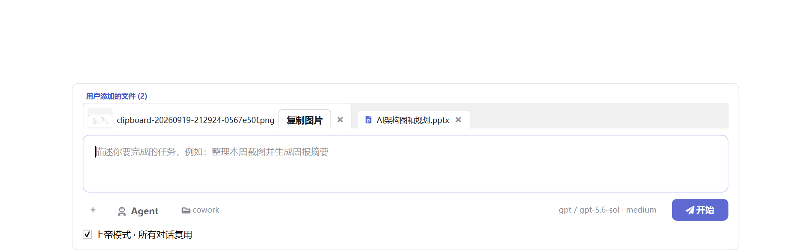

## 6. 把任务说清楚

一个容易执行的要求应包含目标、资料、读者、格式和边界。结果不满意时，指出具体差异。

### 操作步骤

1. 说明做什么：“整理会议纪要”，比“帮我看一下”更明确。
2. 说明依据：“只使用这两个附件”，并给出读者、长度和输出格式。
3. 说明边界：“另存为，不覆盖原文件；没有证据的内容标记待确认”。
4. 需要先讨论时使用“+ → 拷问模式”。回答问卷后，检查总结，再选择“确认并执行”“继续拷问”或“自定义”。
5. 拷问模式每个周期最多 10 轮，可继续开启新周期；停止或取消不会执行原任务。它不能与 PPT/办公稿专用流程或显式 `@Agent` 同时提交。

**任务模板：**请依据【资料】为【读者】制作【成果】，要求【长度与格式】，保存为【文件名】，不要【禁止事项】，完成后列出文件路径和待确认内容。

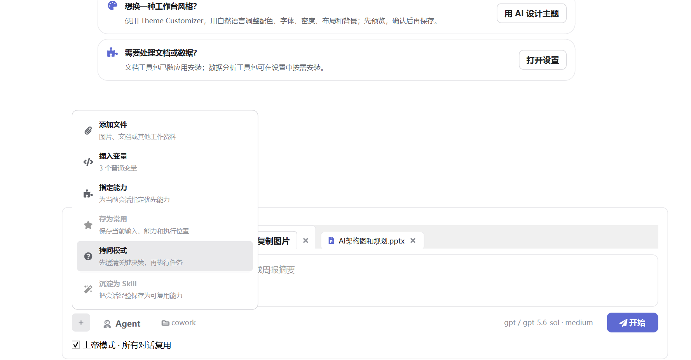

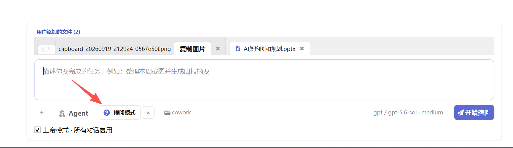

## 7. 理解执行授权

输入框下方的“上帝模式 · 所有对话复用”是全局默认执行授权，影响之后启动的任务。

### 操作步骤

1. 初次使用可先关闭上帝模式。读取、分析和制作任务产物仍可进行；修改原有资产或执行代码时可能出现许可请求。
2. 看到许可卡时，检查目标、操作内容和影响范围，再选择“允许本次执行”或“拒绝”。
3. “允许本次执行”只批准当前动作，不等于给后续所有动作授权。
4. 确需持续执行时再开启上帝模式。正在运行的任务保持启动时权限；若要改变它，请停止后重新启动。

**检查重点：**上帝模式是授权方式，不代表结果一定正确。批量修改前仍应说清文件范围、备份和是否允许覆盖。

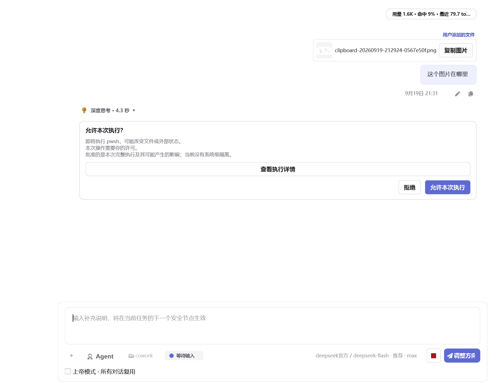

## 8. 运行中补充要求和停止

任务执行期间仍可以补充要求。补充内容会在安全节点进入后续处理，已启动的工具可能需要先结束当前步骤。

### 操作步骤

1. 直接发送补充文字，例如“请保留原文引用，不要只给摘要”。
2. 查看引导卡状态：“等待下一安全节点”“完成当前步骤后应用”或“已应用”。
3. 尚未应用时可编辑或删除引导；删除后正文和附件回到当前会话输入框。已应用后不再提供撤回入口。
4. 需要中断时点击停止；已显示的回答和已产生的文件需继续检查。后台任务需要你回答时，回到对应会话处理。
5. 编辑历史消息并选择“保存并重新生成”会替换该消息之后的对话。先看确认提示；已写入磁盘的文件不会因此撤销。

**完成标志：**补充要求显示已应用，或任务明确显示完成、停止或失败。暂时出错时先看提示，避免反复发送相同要求。

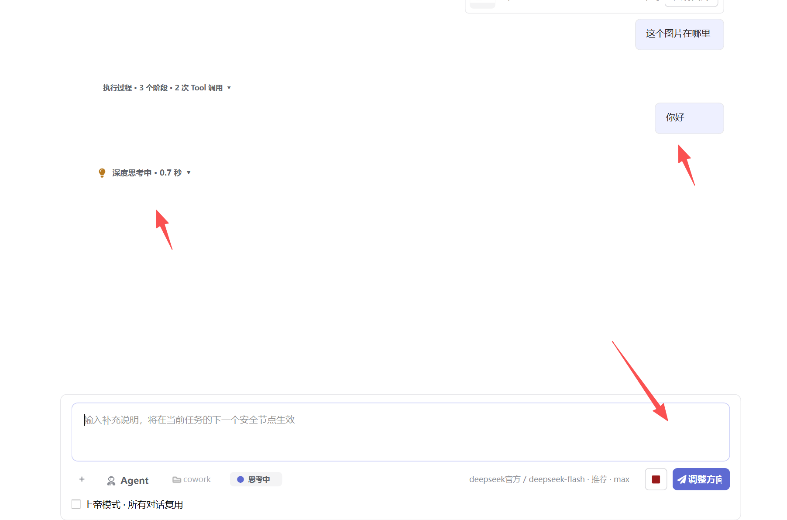

## 9. 查看用量和上下文组成

点击对话中的“用量”按钮，可查看用量概览。Token 是模型计量输入和输出的单位，不等同于字数或费用。

### 操作步骤

1. 完成一轮对话后点击“用量”，查看累计用量、缓存输入、命中比例和上一轮用量。
2. 注意统计范围是当前会话、当前服务、模型与协议，不代表整个账户全部消耗。
3. 查看“上下文组成”，了解下一次请求中各类内容的占比；尚无请求时会显示待统计。
4. 需要排错时展开“统计详情”，可以选择并复制文字。完成后按 `Esc` 或关闭按钮收起。

**读数提示：**缓存输入属于输入用量，不应再加一次。“—”或“待补全”不表示零消耗。账户余额是最近查询结果；生成速度是估算，均以界面说明为准。

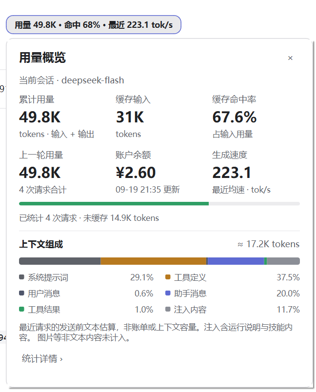

## 10. 查找生成文件并预览

先查看真实文件，再判断任务是否完成。AI 回复中的说明不能代替文件本身。

### 操作步骤

1. 点击会话顶部“文件与交付物”，打开当前会话的实际工作区。
2. 在“交付物”和“工作区文件”之间切换，用搜索、类型筛选和排序定位文件。
3. 点击文件打开预览标签，可保留多个标签来回比较。
4. 使用“更多操作”中的打开、在资源管理器中显示或复制路径，找到本地文件。
5. 后台修改后若预览仍旧，手动刷新。找不到文件时先清除筛选，再让 AI 回复完整路径，不要立即重新生成。

**常见格式：**DOCX、PPTX、XLSX、PDF、图片和常见文本均可预览；旧版 DOC、PPT、XLS 先转换为新版格式。

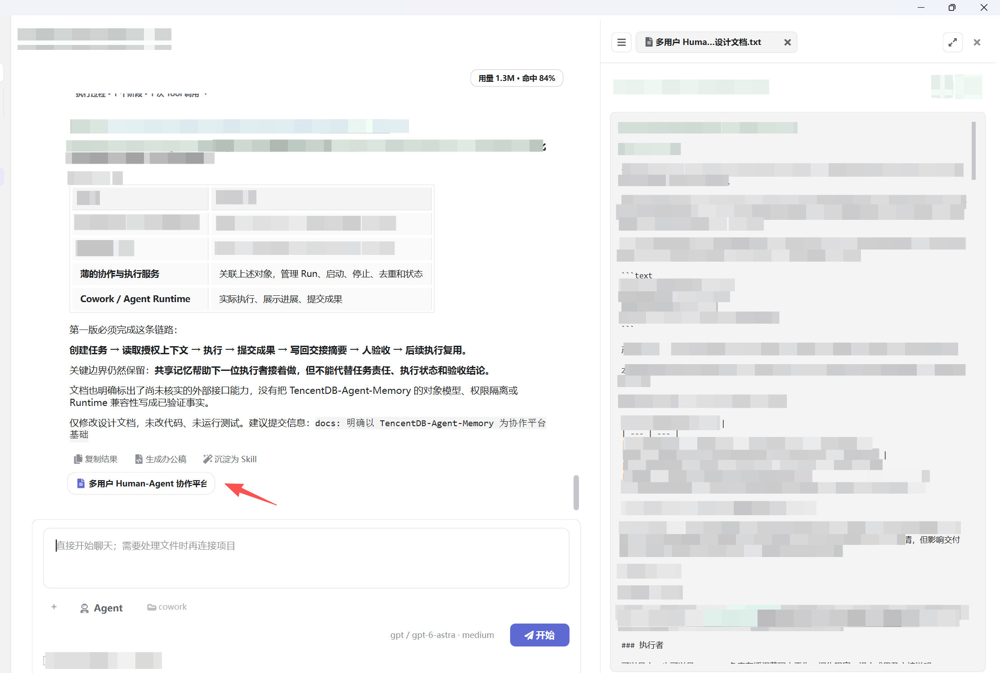

## 11. 编辑文件并保存

可编辑格式会提供铅笔按钮。进入前应用会检查兼容性；提示只读或不支持时，应使用对应办公软件处理。

### 操作步骤

1. 打开文件，点击铅笔进入编辑。修改后检查内容，再保存或另存为。
2. 保存会覆盖当前文件，并保留唯一的上一版备份；需要永久保留原件时用“另存为”。
3. 保存失败时保留编辑内容，阅读错误后重试。检测到外部修改时，选择重新载入或另存为，避免覆盖别人的更改。
4. 有未保存修改时切换文件或离开页面，按统一确认提示处理。
5. 需要撤回最近一次保存时，在更多操作中选择恢复上一版。

**格式边界：**普通 DOCX、XLSX、HTML 和文本可编辑；PDF、PPTX、图片只读。含真实批注、脚注、修订或复杂对象的 DOCX，以及含图表、透视表等内容的 XLSX，可能被阻止编辑以保护内容。

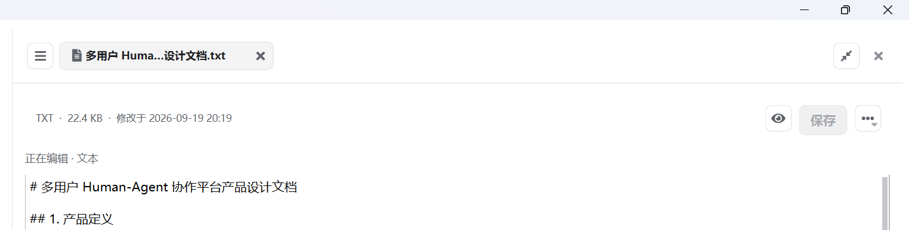

## 12. 生成 Word 文档和 PDF

需要正式交付时，先确认内容和样式，再生成最终文件，可以减少来回修改。

### 操作步骤

1. 先让 AI 给出完整内容，或提供原始资料和成果要求。
2. 从回答末尾点击“生成办公稿”，选择合适类型，例如 DOCX。
3. 等待生成可预览的工作稿，检查标题、段落、数字、图表和缺失内容。
4. 在 HTML 工作稿中点击“生成文件…”，选择 DOCX 或 PDF。
5. 等待完成后打开最终文件，确认内容与工作稿一致，再分享给读者。

**可直接说：**请把这些资料整理成面向新员工的操作手册，先给清楚的步骤，再列常见问题，截图位置留白，结果保存为“操作手册.docx”。

## 13. 使用 PPT 助手

PPT 助手适合有明确受众和汇报目的的演示任务。先决定直接生成 PPTX，还是先做 HTML 演示工作稿。

### 操作步骤

1. 从新对话首页“PPT 助手”，或输入区“Agent → PPT 助手”进入。
2. 说明目的、受众、页数和必须包含的内容，添加参考资料。
3. 默认输出 PPTX，需要添加模板原文件；也可选择“16:9 演示型 HTML”，此模式不读取 PPTX 模板。
4. 在更多设置中选择支持图片理解的模型；该选择只用于本次任务。
5. 完成后逐页检查。PPTX 视觉检查需要本机 PowerPoint 或 WPS；如果继续生成但未完成视觉检查，结果会明确标记。

**依赖提示：**文档工具包随应用安装；组件异常时到“设置 → 组件与依赖”检测。PPTX 模板和最终稿的截图检查需要另外安装的 PowerPoint/WPS。

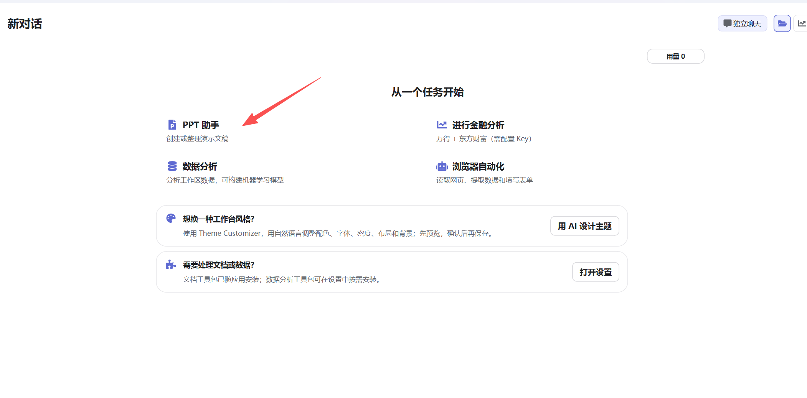

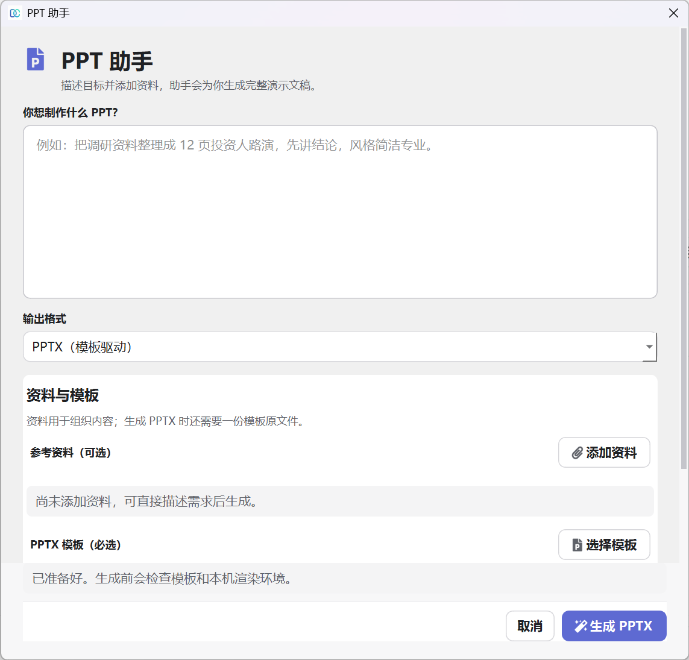

## 14. 连接资料库

资料库让你读取已有云端知识并用于对话，也能把成果保存回指定位置。没有团队资料库时可跳过。

### 操作步骤

1. 点击左侧“资料库”，在顶部“资料来源”选择 WeKnora、腾讯文档或乐享知识库。
2. WeKnora：填写服务地址、邮箱和密码，点击“连接并登录”。密码不保存；使用团队提供的账号与地址。
3. 腾讯文档：点击“打开授权页面”，在浏览器用 QQ 或微信完成授权，再回 Cowork 点击“已完成授权”。授权链接有效期为 5 分钟。
4. 乐享知识库：点击“打开官方配置页”，取得企业标识和 Token，填入后点击“连接”。
5. 连接成功后再浏览资料。授权失效时使用“账号与连接”中的检查连接或重新连接。

**完成标志：**页面显示已连接并能列出有权限访问的资料。各来源账号独立；不要把模型 API Key 填进资料来源凭据字段。

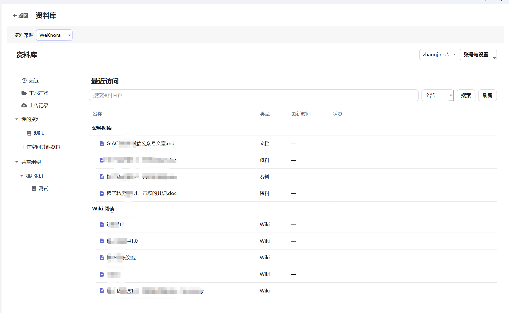

## 15. 阅读资料并加入对话

先选资料，再提问题，可让 AI 围绕明确范围处理内容。腾讯文档搜索框针对文档标题，WeKnora 支持资料内容搜索。

### 操作步骤

1. 在资料库中选择目录或搜索关键词，点击资料查看正文与来源。
2. 单份资料点击“和 Agent 一起用”，选择新建对话、添加到当前对话或添加到项目。
3. 多份资料勾选后，点击“添加到…”并选择目标位置。
4. 回到输入框，核对引用资料，再输入“请根据所选资料回答，并保留出处；资料没有的内容请说明”。
5. 云端资料刚改过却仍显示旧内容时，点击“刷新”。云端目录和搜索有短期缓存，正文缓存更长；刷新会清除当前来源缓存。

账号、组织或资料范围改变后，必要时重新选择引用。不要把“已连接”理解为 AI 可以任意读取整个账号的全部资料。

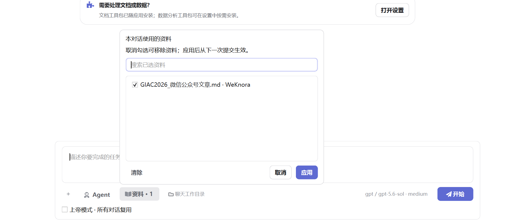

## 16. 把成果保存回资料库

只有点击上传才会提交本地文件。先确认来源、目标资料库和文件夹，避免把内部成果放错位置。

### 操作步骤

1. 在本地文件或交付物的菜单中选择“保存到资料库…”，也可从资料库的本地产物中选择成果。
2. 在保存窗口核对文件列表、资料来源、目标资料库和目标文件夹；需要时进入下一级文件夹。
3. 点击“上传”，到“上传记录”检查状态。WeKnora 上传后还需完成解析，显示“可检索”才表示可用于检索。
4. 若显示“已导入 · 目标归位未完成”，使用“继续放入目标目录”；不要再次上传同一份文件。
5. 显示结果未知时先到原平台核对。没有目标位置时，在原平台创建目录或申请写入权限。

**完成标志：**上传结果明确成功，并能在目标位置找到文件。连接成功、文件上传成功和解析成功是不同状态。

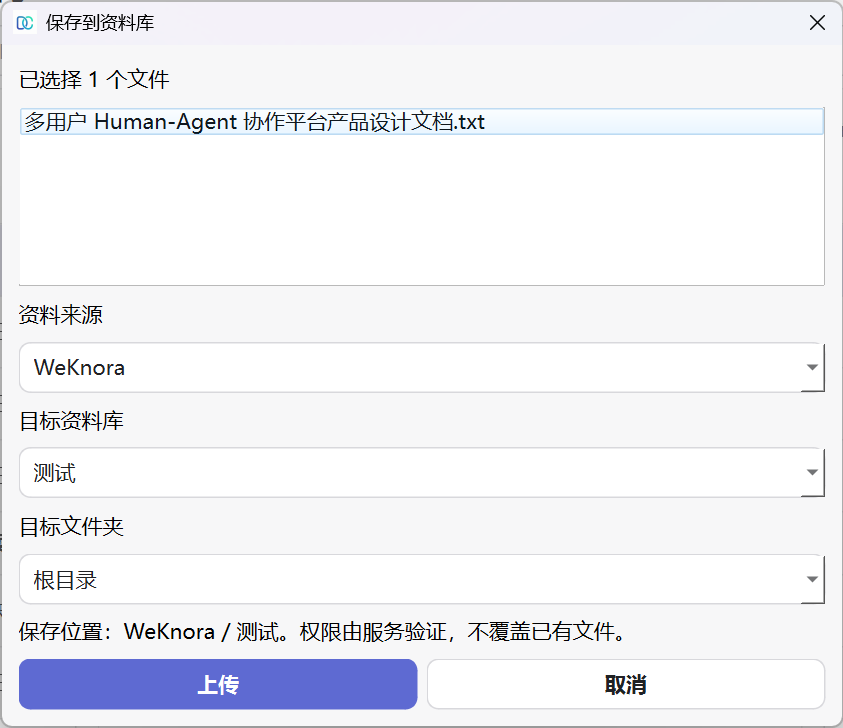

## 17. 开启能力和安装 SkillHub 技能

能力是 AI 可用的工具；Skill 是某类任务的做法；Agent 是带特定角色和工作规则的助手。初次使用只启用当前需要的内容。

### 操作步骤

1. 打开“能力商城”。当前分类入口包括“精选技能”“SkillHub”和“我的能力”。
2. 在精选技能按任务场景找能力，阅读用途，点击开启或设置后开启。
3. 在 SkillHub 搜索或浏览技能，打开详情查看作者、版本和更新说明，再点击“安装到我的能力”。
4. 安装完成后进入“我的能力”，手动开启；需要凭据的能力先完成设置。安装不等于自动启用。
5. 需要更新时在详情检查更新、选择版本并确认。有任务运行时需先结束，才能更新已有技能。

本轮必须使用某项能力时，点击输入区“+ → 指定能力”。若安装失败或版本已变化，按提示刷新并查看诊断信息，不要把下载完成当成已可用。

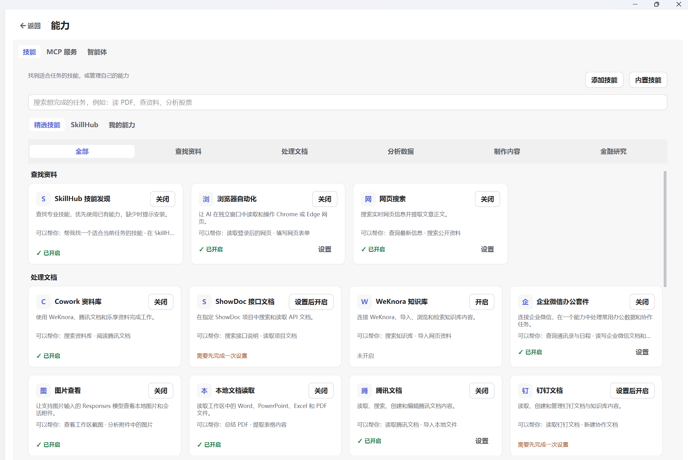

## 18. 选择助手并保存成熟做法

同一类工作反复出现时，可以选择适合的 Agent，或把已经验证的流程沉淀为 Skill。

### 操作步骤

1. 从输入区“Agent”选择助手，核对角色和任务要求后发送。
2. 一项任务效果稳定后，使用“+ → 沉淀为 Skill”或回答末尾同名入口。
3. 选择需要分析的会话范围，点击“开始复用分析”；任务转到后台后可继续聊天。
4. 打开“复用分析待确认”，检查目标、规律和失败边界，选择创建、合并或追加经验。
5. 继续生成 Skill 草稿，检查内容和校验结果，再确认保存。低置信或校验错误应先处理。

**完成标志：**技能已经确认保存，可在我的能力中管理。把一次偶然成功的结果直接当作长期规则，可能使后续任务重复犯错。

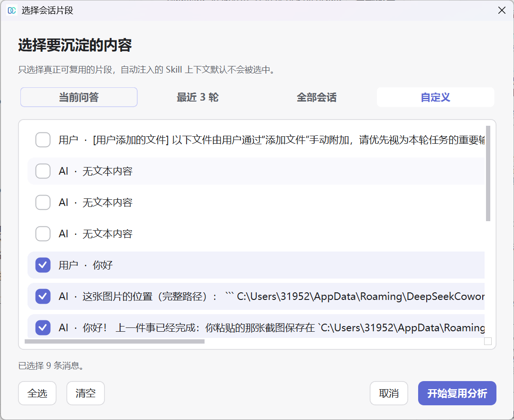

## 19. 保存常用任务并设置计划

“常用”保存重复使用的任务内容、能力组合和执行位置。需要自动执行时，再给它附加一个计划。

### 操作步骤

1. 进入“常用”，新建任务，填写名称、用途、任务内容与需要的能力。
2. 在“运行环境与自动化”设置执行位置；要处理固定资料时选择对应项目。
3. 需要定时时选择单次、每天、每周、每月、间隔或 Cron；新手优先使用直观的日期和周期。
4. 保存后先点“立即运行计划”，核对输入、输出目录和权限，再启用日程。
5. 在“运行历史”查看结果，可按运行中、失败或中断、投递异常筛选。

计划依赖 Cowork 正在运行。关闭期间错过的计划会记录为已错过，不会集中补跑。每个常用项最多附加一个计划；只有能力而没有任务内容时需先补齐。

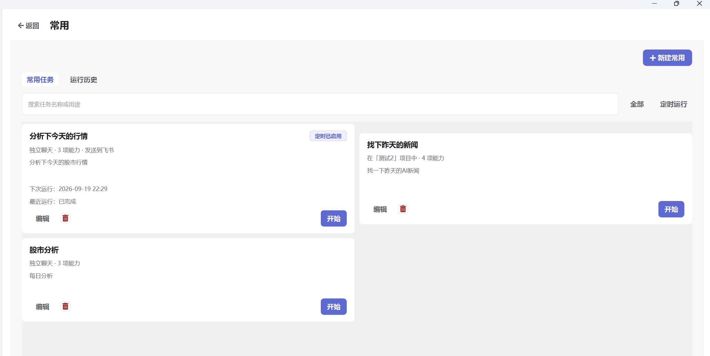

## 20. 连接聊天软件并投递计划结果

“设置 → 消息连接”用于把助手接入聊天软件。一次只运行一个渠道，切换后会停用旧渠道并保留配置。

### 操作步骤

1. 飞书、QQ、微信使用页面扫码入口并在手机确认；钉钉、企业微信按页面填写连接信息。
2. 连接后先发一条简单文字验证。QQ 支持私聊及群聊 `@` 机器人；微信首版支持私聊文字与链接。
3. 定时结果投递在常用任务中打开“发送到企业消息”，生成绑定码。计划投递支持飞书、企业微信和钉钉，钉钉还需固定 HTTPS Webhook。
4. 在接收会话中发送“复制完整消息”取得的绑定消息，不要只发数字。绑定码 10 分钟有效且仅使用一次。
5. 用“立即运行计划”验证。普通“开始”不会触发计划投递；任务状态和消息投递状态分别查看。

**计划附件：**飞书可上传最终答复明确引用的本地文件，图片上限 10 MB、其他文件 30 MB；钉钉和企业微信计划只发正文。结果未知时先核对是否送达，再决定重发。

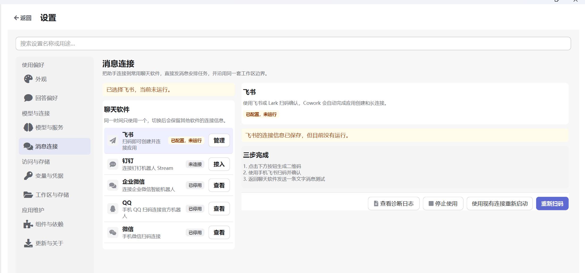

## 21. 启用浏览器自动化

需要读取已登录网页或操作网页表单时，再开启浏览器自动化。浏览器扩展需由你亲自加载或安装。

### 操作步骤

1. 进入“能力商城”，找到“浏览器自动化”，点击开启并开始设置。
2. 明确选择 Chrome 或 Edge，点击“离线安装扩展”。应用会打开扩展管理页和扩展所在目录。
3. 在浏览器启用开发者模式，选择“加载已解压的扩展程序”，指定 Cowork 显示的目录。
4. 也可从 Chrome Web Store 安装，但不要在同一浏览器配置里同时启用商店版和离线版。
5. 回到能力详情，点击“检查并开启”；看到“已开启”后再安排网页任务。

**完成标志：**连接检查通过且能力显示已开启。失败时按当前步骤的错误处理；提交、发送、购买或发布前核对具体对象与内容。

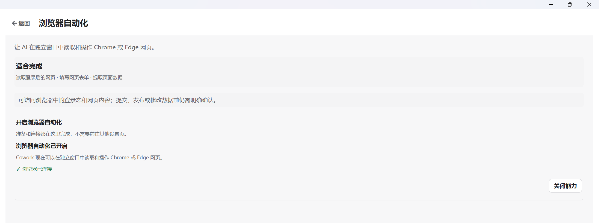

## 22. 将录音转成文字

语音转文字支持本地组件和远程接口。先选好能力，再添加音频或视频文件。

### 操作步骤

1. 在能力中选择“语音转文字”，进入设置，选择本地语音组件或 OpenAI 兼容接口。
2. 本地模式先到“设置 → 组件与依赖”安装语音转文字组件，支持说话人分离与时间戳。
3. 远程模式填写完整的 `audio/transcriptions` 接口地址、模型和密钥；原始音频会发送给该服务。
4. 添加 WAV、MP3、M4A、MP4、WebM 等支持文件，并说明输出要求。
5. 按提问选择是否润色。不润色时转录正文直接保存；选择 AI 润色时转录文字会交给当前模型，润色前保留原文稿。

远程模式不运行本地说话人分离，失败不会自动改为本地。优先使用 HTTPS；接口的大小、时长和格式限制由服务端决定。

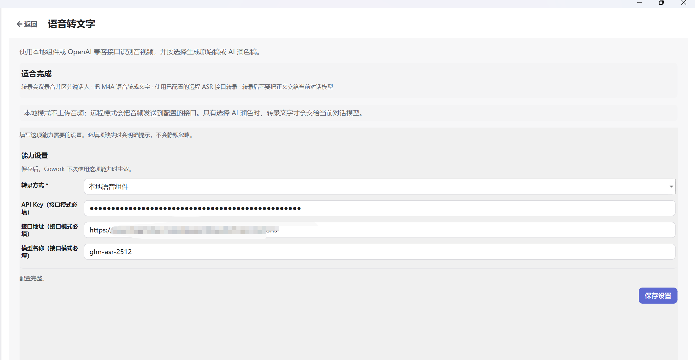

## 23. 调整外观和常用设置

当前设置按使用偏好、模型与连接、访问与存储、应用维护组织。先调整影响阅读和日常工作的选项。

### 操作步骤

1. “外观”：选择或编辑主题草稿，先预览，满意后保存；不满意则放弃。默认浅色主题是安全基线。
2. “回答偏好”：按个人需要调整回答设置，完成后保存。
3. “变量与凭据”：普通变量可通过输入区“+ → 插入变量”使用；敏感凭据默认不允许 AI 读取。
4. 只有明确需要时才开启某项凭据的“允许 AI 按准确名称读取”。读取后明文会进入当前模型请求和会话历史。
5. “工作区与存储”：修改后续新独立聊天使用的根目录；已有会话不会被自动搬走。

**保存边界：**有保存按钮的设置修改后需保存。主题预览不是正式启用；凭据加密保护本机存储，并不代表发送给模型后仍不可见。

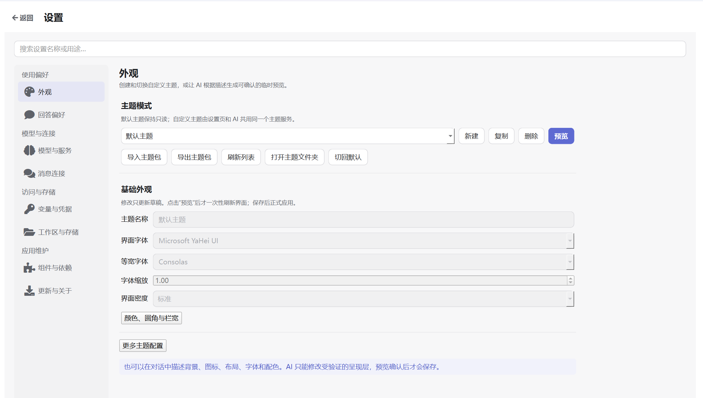

## 24. 按需选择极简启动

极简启动是可选的模型启动方式，适用于部分 DeepSeek 官方模型的新对话。新手可以先保持默认流程。

### 操作步骤

1. 进入“设置 → 模型与服务”，编辑受支持的模型，找到“启动方式 → 启用极简启动”。
2. 当前支持官方 HTTPS 地址下的 `deepseek-flash`、`deepseek-v4-pro` 和 `deepseek-pro`；其他模型不会显示可用开关。
3. 保存后新建普通对话进行尝试。已有对话、PPT 等专用流程及带明确资料引用的任务会直接使用完整能力。
4. 首个模型请求先用精简上下文；若已经完成回答，任务直接结束，需要继续处理时再转入完整能力。

**注意：**这不是保证更快或更便宜的开关。它会改变首轮可用上下文；需要严格遵循项目规则或复杂能力时，可先使用默认流程并检查结果。

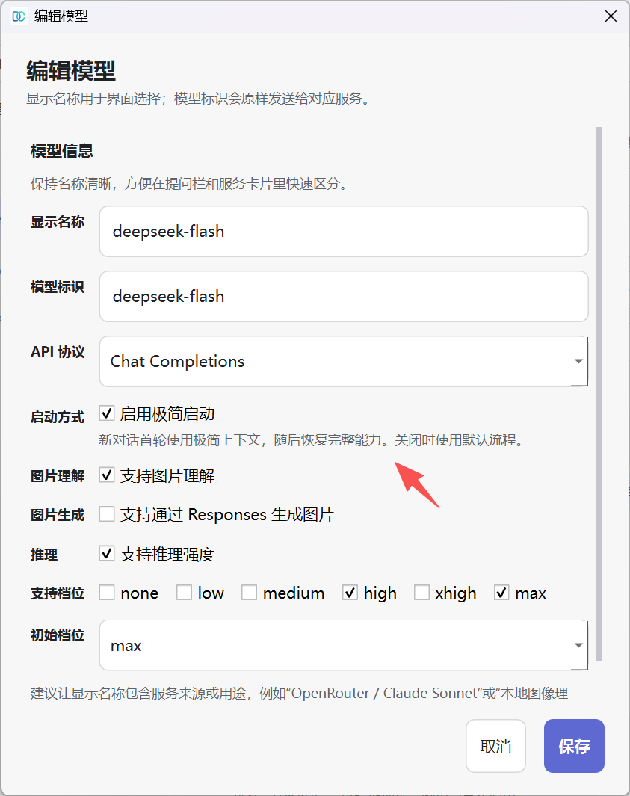

## 25. 更新应用和下载日志

更新和排错都从设置进入。遇到错误先保留输入、成果和完整错误信息，再处理原因。

### 操作步骤

1. “设置 → 更新与关于”：检查当前版本，使用“检查并更新”获取更新。
2. 已取得官方安装 ZIP 时可选择本地安装包；只支持比当前版本新的 Windows 打包版，不用于降级或同版本重装。
3. “设置 → 组件与依赖”：查看上次记录，点击检测状态或手动刷新获取新状态。文档工具包随应用安装，其他组件按需准备。
4. “设置 → 工作区与存储 → 日志下载”：点击“下载日志…”，选择 TXT 保存位置。
5. 求助时一并提供版本、所在页面、操作步骤、错误文字和日志。日志可能包含路径及部分任务内容，分享前检查。

日志导出保留每个现有日志文件末尾最多 2 MiB；导出失败不会改动原日志，可以换保存位置重试。

## 附录 A：常见问题

### 没有配置模型或无法发送

进入“设置 → 模型与服务”，确认渠道、模型和默认模型有效并保存。认证错误时核对地址、密钥及账户状态。

### 看不到图片或不能发送图片

确认缩略图已经添加，并选择支持图片理解的模型。已有模型配置不会因为升级自动重置。

### 无法切换项目

已有消息的对话不能中途更换项目。新建空白对话后再选择。

### 资料库还是旧内容

点击刷新后重新打开资料；授权失效时先重新连接。腾讯文档搜索按标题进行，可调整关键词。

### 技能已安装却没有使用

进入“我的能力”手动开启并补齐配置；本轮必须使用时，通过“+ → 指定能力”选择。

### 任务完成却未收到计划消息

分别检查任务状态和投递状态、当前渠道、绑定位置。发送结果未知时先核对接收端，避免重复投递。

### 计划没有运行

确认应用当时正在运行、计划启用、内容及执行位置有效。先用“立即运行计划”验证。

### 生成文件找不到或不能编辑

清除交付物筛选，查看工作区文件及完整路径。只读或兼容性检查失败时用对应办公软件打开。

### 需要请别人排错

记录 5.2.3 或实际显示版本、操作步骤和完整错误，从“工作区与存储”下载日志，检查隐私后提供。

## 附录 B：可复制的任务模板

### 整理文档

> 请阅读【文件名】，为【读者】整理摘要。先给 5 条结论，再按主题说明。保留数字出处；无法确认的内容写“待核实”。另存为【文件名.docx】，不要覆盖原文件。

### 对比方案

> 请比较【方案 A】和【方案 B】，按成本、时间、风险、使用难度和维护要求给出比较表。先说明结论和成立前提，再列出仍需确认的信息。

### 会议纪要

> 请根据【资料】制作会议纪要，包含结论、决定事项、待办、负责人和截止时间。不要把讨论写成已决定；没有依据的负责人和日期写“待确认”。

### 批量整理文件

> 请先扫描【文件夹】，统计类型、数量和命名问题，不要修改。给出分类和重命名方案，等我确认后执行。不要删除文件，执行后保留变更清单。

### 资料库问答

> 请仅依据本次选中的资料回答【问题】，说明依据和来源。资料没有覆盖的内容请明确说明，不要补写成事实。

### 制作演示

> 请为【受众】制作不超过【页数】页的项目汇报，目标是【目的】。先结论，后证据和行动，每页一个重点。先生成 HTML 工作稿供我确认，再生成最终文件。

## 附录 C：常用快捷操作

| 操作 | 快捷键或方法 |
| --- | --- |
| 粘贴附件或文字 | `Ctrl+V` |
| 复制选中内容 | `Ctrl+C` |
| 撤销与重做输入 | `Ctrl+Z` / `Ctrl+Y` |
| 重命名项目或对话 | `F2` |
| 取消编辑或关闭预览 | `Esc` |
| 从管理页面返回 | `Alt+Left` |
