# DeepSeek Cowork 用户手册

文档适用版本：**5.4.1**

从配置模型、完成第一项任务，到处理文件、使用资料库和复用工作流程。安装与源码启动见[项目首页](../README_CN.md)，平台部署见[企业平台说明](../web/platform/README.md)。

本版变化见 [5.4.1 版本说明](releases/5.4.1.md)：数据分析与常用能力随包提供，办公稿和 Skill 使用统一草稿审阅，新增多媒体实验插件，并完善图片、流程图、浏览器和更新交互。

## 目录

- [新版 Windows 工作台](#新版-windows-工作台)
- [开始第一项任务](#开始第一项任务)
- [Mac 与统信的功能范围](#mac-与统信的功能范围)
- [配置模型与服务](#配置模型与服务)
- [使用多媒体](#使用多媒体)
- [组织项目与对话](#组织项目与对话)
- [发送消息与控制任务](#发送消息与控制任务)
- [查看执行过程与子任务](#查看执行过程与子任务)
- [使用工作区与文件](#使用工作区与文件)
- [制作文档和演示](#制作文档和演示)
- [管理技能连接器与专家](#管理技能连接器与专家)
- [使用资料库](#使用资料库)
- [企业账号与团队空间](#企业账号与团队空间)
- [常用任务与消息连接](#常用任务与消息连接)
- [个性化与设置](#个性化与设置)
- [应用更新与记录导出](#应用更新与记录导出)
- [常用快捷操作](#常用快捷操作)

## 新版 Windows 工作台

本手册对应 5.4.1 源码，安装包的实际功能以其构建版本为准；本次版本整理未构建或发布安装包。默认入口为 Electron 工作台。Windows 成品包含独立 Python 服务及文档、数据分析依赖，不需要另装 Python、Node 或 Qt。

应用直接使用原数据目录，启动页显示当前初始化阶段；不会复制历史、附件或工作区。若启动失败，原数据仍保留，启动页可直接“查看诊断日志”，处理后点击“重试”会重新连接或启动后台。启动中也可点击“退出应用”，停止本次启动，保留已有数据。

窗口右上角“×”收起到托盘，后台任务继续运行。应用菜单或托盘中的“退出应用”会先保存草稿与恢复副本、停止进行中的任务，等待本应用后台结束后再关闭窗口和托盘图标；保存或停止失败时保持窗口打开并说明原因。

1. 完整解压 `cowork-desktop-v版本号-windows-x64.zip`，运行文件夹内的 `deepseek-cowork.exe`。正式包直接读取原数据；便携版使用可执行文件旁的 `user_data`。原有历史、设置和草稿自动可见，无需手工导入。源码开发默认使用隔离目录。新旧版使用同一份历史和项目文件，切换版本前先正常退出当前应用；新版的运行中任务不能交给旧版继续执行。
2. 在“设置 → 模型与服务”添加服务与模型。原有正式数据中的模型、项目与对话会继续读取；从其他数据目录迁移模型时，可使用“导入旧版模型设置”。
3. 输入区“+”添加附件、技能、连接器、资料和对话引用；专家、权限、模型就近选择。“+ → 技能”隐藏内置能力；“能力 → 技能”区分“发现技能”“我的能力”和“内置技能”，可打开 SkillHub、查看详情和安装。
4. “工作区”采用紧凑标签栏，左侧边界可拖动，也可展开到整个主区域。文件目录按需浮出或固定；“任务”直接打开标签页，保留“调用记录／子任务／执行上下文”三项。收起工作区保留编辑内容和后台任务。
5. 工作区支持 Markdown 写作、XLSX 编辑、Word/PPT 页面版式预览、PDF/图片预览、HTML 预览与可视化编辑，以及原生终端和网页。Word/PPT 通过 LibreOffice 生成只读页面，编辑时打开本机应用。文件工具栏仅在有改动时显示保存，其余文件操作收在“更多”菜单；外部修改产生冲突时保留草稿，可另存副本。网页支持后退、前进、查找、缩放和接管／交还。
6. 运行时可补充、停止、切换聊天；历史消息可编辑、重新生成、分支和导出。页面重新加载先保存草稿，重新连接不会自动重复提交。点击用量查看服务返回的 Token、缓存命中和上下文估算。

窗口顶部不重复显示品牌文字，菜单栏使用“应用／编辑／视图”；“应用”菜单提供重新载入界面、恢复内置界面、打开诊断日志和退出入口。

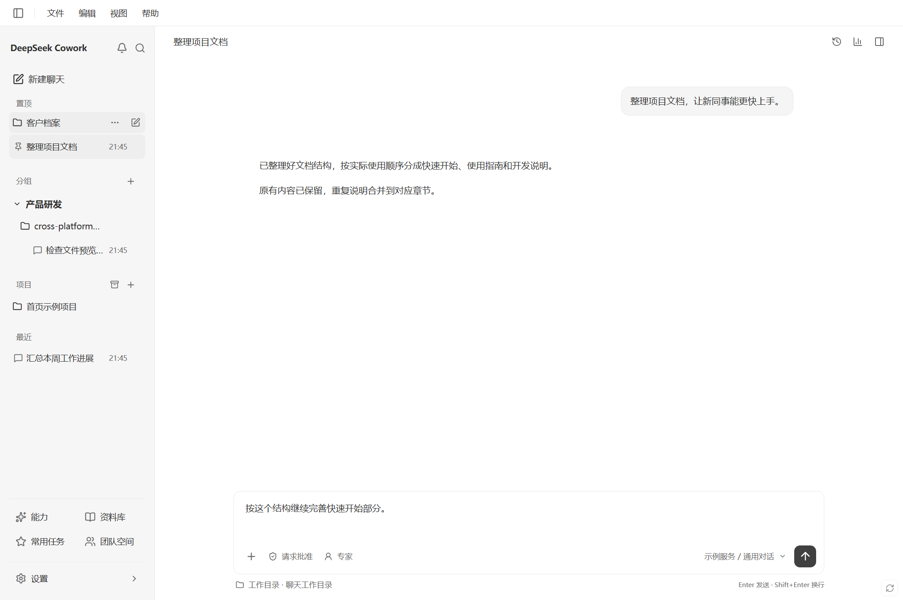

侧栏底部的“能力／资料库／常用任务／团队空间”使用两列入口，“设置”独立固定在最下方，整行可点击。“能力”使用“技能／MCP 服务／专家／界面插件”横向分类，在同一内容区切换；“资料库”“常用任务”“团队空间”和“设置”使用独立管理页面。管理页左上角统一提供“返回聊天”，返回后继续原有草稿。定时任务、消息渠道、账号连接、记忆、变量、数据设置和更新均接入本地服务；外部服务需要各自有效配置。

从输入区“+ → 模式 → 创造模式”统一设计界面、主题和插件。“设置 → 外观与阅读”也会进入创造模式的主题页，可选择浅色、深色、跟随系统、字体、字号、密度与主题包。AI 候选先隔离预览，再选择应用或放弃。对话中的 Visualize 图表保留交互状态，重新打开历史对话后可以继续查看和操作。

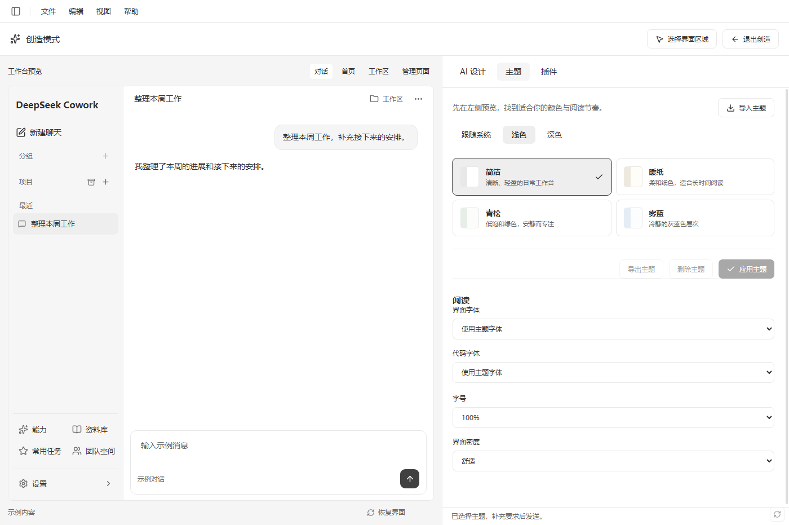

“能力 → 界面插件”可添加本地插件目录并预览，再应用到整个工作台、页面、面板或编辑器。预览只读取示例内容；应用前保存恢复副本，候选就绪后才切换。输入、未保存文稿、表单和后台任务继续保留；恢复副本不会代替文件或设置的“保存”。插件加载失败会保留现有界面并显示原因。可停用、重新预览启用或恢复上一版；独立的“界面恢复”按钮和应用菜单可恢复内置界面。开发示例和接口见 [UI SDK](../desktop/sdk/README.md)。

更新包必须属于新版 Electron 工作台。在线源尚未发布时会明确提示，也可在“设置 → 更新与关于”选择本地 ZIP。以下章节介绍各领域的任务规则；配图保留当前工作台中与操作直接相关的场景。

## Mac 与统信的功能范围

本分支面向 Apple Silicon Mac 和统信 V25 x86_64 个人桌面环境，目标系统实机验收与安装包发布仍待完成。Intel Mac、统信 V20／ARM／龙架构及新增 Windows ARM64 不在此次范围内；Windows 原有功能保留。

| 任务 | Mac／统信首期规则 |
| --- | --- |
| 聊天、项目、历史、文件编辑 | 复用现有流程；历史检索使用关键词搜索 |
| 使用网页 | 在应用内浏览器操作，暂不连接外部浏览器或复用其登录会话 |
| 执行脚本与交互终端 | 提供应用 Python／Node 与 POSIX 终端；Windows 专用脚本会明确提示不支持 |
| Office 内容处理 | 保留基本读取、生成与编辑；版式预览需要另装 LibreOffice，字体和分页可能与 Office 不同 |
| 高级演示与视频 | 暂停 Huashu Design、Guizang PPT 工具；基础 Office 文件生成仍可使用 |
| 企业微信办公套件 | 暂不提供办公 CLI；独立机器人消息渠道不受此限制 |
| DeepSeek 模型 | 使用完整 Agent 流程，非 Windows 不启用 PowerShell 极简启动插件 |
| 后台任务 | 面向用户登录后的桌面会话，不承诺注销、睡眠或关机期间继续执行 |
| 安装更新 | 检查并下载当前平台安装包，校验后打开所在目录，由用户关闭应用并手动安装 |

敏感变量、资料库凭据和脱敏映射共用系统凭据保护：Windows 保留 DPAPI；Mac 使用 Keychain；统信使用支持 Secret Service 的桌面密钥环。新平台需要重新录入凭据，不迁移 Windows 密文。密钥环不可用或锁定时，保存／读取会报错并保留原数据，不改为明文保存。请保留原用户密钥环；复制数据目录不能代替密钥环备份。本次未将所有既有配置字段统一迁移到加密存储。

未安装 LibreOffice 时，预览页提供下载入口，安装后重新载入文件；也可使用系统办公软件。已有文档始终保留原文件，转换在独立副本上进行。

非 Windows 的新版界面、系统集成和安装更新尚待目标设备验证；本页 Windows 配图不能作为其他平台的兼容证明。

## 开始第一项任务

1. 从项目发布页下载 Windows ZIP，完整解压后运行 `deepseek-cowork.exe`。
2. 在“设置 → 模型与服务”填写服务与 API Key，验证并同步模型。
3. 点击“新建聊天”，输入一个明确要求，例如“把以下讨论整理成结论和待办”，再粘贴内容或添加文件。
4. 核对输入区的模型、专家、权限和工作目录，发送要求。
5. 阅读最终回答，打开生成文件，继续补充修改要求。

首页提供快捷入口与最近任务；开始对话后，输入区固定在底部。切换对话时可以继续各自的草稿。未使用的空白“新对话”不进入最近任务；实际草稿和已选内容继续保留。

## 配置模型与服务

从“设置 → 模型与服务”进入服务总览。聊天输入区的模型菜单也提供“配置新模型”入口。

1. 点击“添加服务”，选择“账号登录”或“填写 API Key”。
2. 账号登录方式先填写 sub2api / New API 站点地址并识别站点，再输入账号信息；按站点提示完成验证码步骤。
3. 勾选账号中的密钥，点击“获取所选密钥的模型”；需要新密钥时使用“创建 DeepSeek Cowork 专用密钥”。API Key 方式直接填写服务地址与密钥。
4. 勾选模型并点击“添加所选模型”，或在服务详情中手动添加模型。
5. 在模型行编辑协议、图片输入能力、推理档位及高级参数，点击“测试当前配置”。主聊天模型的原生图片生成暂时下线，旧配置也不会启用；图片输入仍可使用。需要生成或编辑图片时，在[多媒体](#使用多媒体)中配置对应服务。
6. 选择“新对话默认模型”，点击“保存更改”。从聊天进入配置时，可使用“返回对话并使用”切回原会话。

服务详情可按密钥或分组查看模型，提供编辑、测试和批量操作；连接信息在“编辑连接”中维护。测试与保存是两个独立动作，切换服务和设置分类时保留设置草稿。

输入区的模型列表在模型按钮上方对齐打开；服务标题用于分组，勾选标记表示当前模型。搜索框、推理深度和管理入口固定，模型较多时只滚动列表。

## 使用多媒体

1. 在“设置 → 实验功能”勾选“启用多媒体”并保存，随后出现独立的“多媒体”管理页。
2. 在“多媒体”左侧选择要使用的能力，例如“图片 → 生成”，在右侧配置服务、模型和接入方式；小窗口中配置区排列在能力选择下方，修改后点击“保存配置”。已有服务可以复用；新服务选择 Agnes、火山方舟或 OpenAI 兼容预设后，填写地址与 API Key。只配置需要的项目即可。
3. 点击配置区底部的“去聊天使用”，返回原聊天并填入可编辑示例；已有草稿与附件保留。也可从聊天“+”中选择“生成图片”“生成视频”“文字配音”等入口。需要修正配置时会打开对应项目，保存后再试用。
4. 聊天输入区选择支持工具调用的**对话模型**，发送要求后才开始调用多媒体服务。生成模型在多媒体页配置，不能把已知的视频或图片专用模型选作聊天主模型；未知用途仍可选择，并标为待确认。对话模型列表只列出可选项；图片、视频专用模型从列表移出，浮层底部的“图片、视频与音频”直接进入多媒体配置。

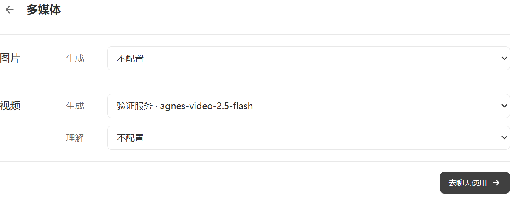

表格中的“音频 → 生成”用于文字配音，“音频 → 理解”用于音频转写。图片生成支持参考图编辑；视频理解要求模型支持 `video_url`，当前使用服务可访问的视频链接，不会自动改用抽帧或音轨转写。Agnes 视频参考图同样需要公网链接；火山方舟视频参考图可以使用当前工作目录的图片。通用 Videos 预设当前支持文字生成，实际接口、时长与尺寸范围以第三方服务为准。保存配置不代表已经验证模型权限或成功生成。

能力选择区显示“未配置”“已配置”“待保存”或“需调整”。配置区独立显示最近调用记录；“暂无记录”表示还没有该配置的调用结果，不表示配置失败。接入方式不匹配时，可直接点击建议按钮修正，修正内容仍需保存。最近调用记录只属于对应服务、模型和能力，不代表同一模型的其他能力也通过验证。Agnes 的专用模型选择 **Agnes 接入方式**；Video 2.5 Flash 支持 720P、4–12 秒和最多 5 张参考图，参数不合要求会在提交前提示。

移除配置在配置标题右侧的“更多”菜单中，保存后才生效；保存前可“取消修改”，已有任务和成果保留。

成果保存到当前对话工作目录的 `media` 子目录。聊天显示实际提交、生成、下载和完成状态，可查看图片、播放音视频，点击文件打开工作区。管理页“任务与成果”读取同一份记录；下载失败使用“重试下载”，不会重新生成。提交结果未确认时，先核查服务后台；视频任务可补充远端编号恢复查询，Agnes 使用 `video_id`。

“停止等待”只停止本地查询或下载，远端生成可能继续。应用重新打开后，可在多媒体页恢复已有编号或成果；不会自动重发生成请求。停用后管理入口与后续聊天的多媒体工具撤下，已有任务继续收尾，配置、历史与文件保留；重新启用可继续管理。

## 组织项目与对话

独立聊天使用自己的文件目录。处理已有项目时，在空对话输入框下方选择项目，或通过侧栏“项目”旁的“+”登记目录。

侧栏按项目和独立聊天组织记录。悬停或键盘聚焦项目行时显示“+”和“…”：“+”新建该项目的聊天，“…”归档项目，目录不可用时也可归档。归档只从常用列表和本地资料库收起项目，聊天与文件仍保留；点击“项目”旁的归档图标，在项目的“…”中恢复。对话行的“…”提供重命名、置顶、归档等操作。

“搜索项目和对话”可查找项目名、标题及历史内容。输入关键词后选择结果，通过“显示更多结果”继续浏览。对话内使用 `Ctrl+F` 搜索，或点击时钟图标打开“历史提问”，定位到要阅读的提问。

在输入区“+ → 对话”或 `@` 选择器中添加其他对话作为参考。发送后，用户消息顶部保留发送时的对话引用标签；后续更改选择不会改写旧消息标签。

## 发送消息与控制任务

### 添加上下文

“+”菜单提供文件、资料、模式、专家、技能、连接器和对话入口。分类切换保持菜单位置不变，长列表在右侧独立滚动；技能与连接器在本次打开期间共用已读取的列表。技能、连接器与专家采用相同的选择行，说明默认显示两行，“展开说明”不会改变选择；技能和连接器可以多选，专家单选。文件可从资源管理器拖入或粘贴，剪贴板图片也可以直接粘贴。输入区直接显示已选的对话、附件、能力和资料名称，可逐项移除。标签同时带类型文字与图标；默认用灰蓝区分对话、灰紫区分技能和连接器、青绿区分资料，附件保持中性灰，颜色随主题适配。

“浏览资料库”直接打开聊天右侧的资料库标签。可以一边查看对话，一边将资料添加进来；原管理页入口仍可使用，两处共用资料库能力。

发送时选中的对话、技能、连接器、资料及附件也显示在该条用户消息上，便于核对本轮选择；这些标签是发送时的记录，不表示 AI 已经读取全部资料。

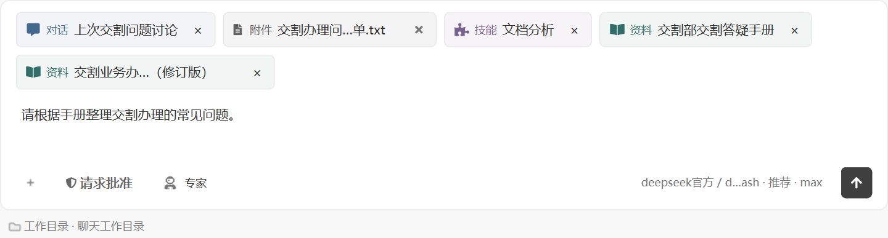

图片粘贴成功后，输入框显示可移除的缩略图；发送后显示在文字气泡上方。多图横向排列，空间不足时自动换行。点击缩略图在工作区查看原图；右键选择“复制图片”可复制图片内容，待发送、已发送和执行过程中的图片均支持。预览失败仍保留文件入口，未加载成功的图片不能复制。

直接让聊天模型看图时，需要启用该模型的图片输入能力。若主模型不支持图片，但已启用多媒体并配置图片生成或理解服务，图片会作为文件交给对应工具处理；否则发送会保留草稿并提示切换模型。

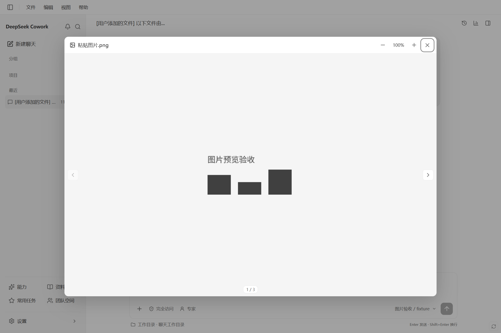

长文本粘贴会按输入区规则转换成文本附件。任务要求尽量写明目标、来源、输出形式和保存位置，例如：

> 阅读这两份方案，按成本、实施时间和维护工作量比较，先给建议，再把对比表保存到当前工作目录。

### 选择执行授权

点击输入区的权限入口，选择“请求批准”或“完全访问（上帝模式）”。请求批准模式下，涉及许可的动作会显示审批卡；展开详情核对动作后作出选择。权限设置作为之后启动任务的默认值。

需要先讨论任务时，在“+ → 模式”选择拷问模式。输入框底部会出现“拷问模式”胶囊，仅用于下一项任务；发送前点击左侧“×”可取消，草稿和附件保留。点击胶囊文字可重新选择模式，默认模式不占位。开始任务后，回答问题并检查阶段总结，再明确选择开始执行或继续讨论；运行中沿用停止按钮控制任务。

创造模式和拷问模式都是随应用提供的模式插件，可在“能力 → 插件”或创造面板的“插件”页启用、停用。停用阻止新的对应任务，已运行任务、历史和输入仍保留；直接推进始终可用。在创造模式中先退出回原对话，再使用拷问模式。

### 补充、停止与编辑

任务运行时可以继续输入和发送补充要求。补充消息按实际发送时点穿插在执行过程中；后续输出继续显示在其后，重新打开对话时保持顺序。输入区有待发送内容时主按钮用于发送补充，没有内容时用于停止；右下角已显示停止按钮时，“+”菜单不重复提供停止；编辑补充期间，仍可从“+”停止当前任务并保留草稿。

鼠标移到已发送的提问上可编辑或复制。编辑时可点击“添加附件”，也可拖入或粘贴文件、图片，并逐项移除附件；粘贴长文本会沿用聊天框规则转为 TXT 附件。编辑内容与底部输入框的草稿独立，取消不改变原消息，保存失败会保留当前编辑内容。

常用任务或手动选择的技能会保留在历史消息的编辑区。保存并重新回答、重新生成时，沿用该消息发送时的技能快照；当前输入框后来清空或更换技能，不会覆盖原消息的选择。

编辑后点击“保存并重新回答”，按编辑区说明替换此消息及后续对话；`Esc` 取消编辑。编辑框随内容增高，长内容可在框内滚动，保存失败保留草稿。回答末尾提供复制、重新生成、分支和更多操作。

提问气泡随正文收缩，时间和操作图标位于气泡外。提问和回答的时间默认隐藏，鼠标悬停消息或键盘聚焦操作时显示；AI 回复的时间紧跟左侧“⋯”操作，悬停时间可查看完整日期，没有时间记录的旧消息不显示推测值。选中文字后右键可复制；输入框和历史编辑框的右键菜单提供撤销、剪切、复制、粘贴和全选。

### 回答问卷

AI 提问时，在对话内逐题选择选项或填写其他回答，再点击统一的“提交回答”。提交后可在发起该问卷的工具记录下，通过“已提交 N 项回答 · 查看”阅读实际提交的答案。推荐项的预选状态仍可修改。任务结束后，已提交问卷随执行过程一起收起；点击“用时”或“执行过程”展开，即可在对应阶段查看完整答案。待回答或提交失败的问卷保持可操作，最终回答不会随过程折叠。

## 查看执行过程与子任务

运行时只保留一处状态提示：过程出现后显示在过程标题，首次输出前显示在等待位置。主动停止后仅显示“已停止”，保留已有输出，不再出现错误说明或“继续这个任务”按钮；可直接在输入区继续提问。意外中断与真实失败仍显示原因和恢复入口。过程末尾不再重复显示日期时间。编辑历史消息重新发送后直接更新对话，不再弹出“历史已更新”。

已结束回复的执行过程默认折叠；标题旁显示本轮用时，运行中持续更新，结束后固定。深度思考的耗时从收到思考内容计至正文或工具调用开始，缺少记录时不显示。展开后沿时间线阅读“深度思考”、阶段说明和工具记录，单段思考也可独立收起。最终回答始终可见。点击工具打开参数与结果，工具记录中的文件路径可直接打开对应文件。用户消息可选中文字，也可点击“复制消息”复制全文。回复下方“⋯”中的“生成办公稿”“沉淀为 Skill”会打开工作区草稿，选择来源和要求后生成；原聊天输入保持不变。

回复底部的复制、重新生成、分支和“⋯”集中在左侧，消息时间紧跟在“⋯”后方。悬停回复或聚焦操作按钮时显示，悬停时间可查看完整日期。

对话标题与右侧工作区标签栏齐顶，常用入口如下：

| 入口 | 用途 |
| --- | --- |
| 工作区 | 文件、网页、终端和写作页面 |
| 工作区内的“任务”标签 | 调用记录、子任务和执行上下文 |
| 对话标题旁的图表、搜索和时钟图标 | 当前会话用量、对话内搜索和历史提问 |

工作区的任务图标打开“任务”标签后收起，避免重复入口。关闭标签后图标重新出现，再次打开可继续查看原来的任务详情。

“执行上下文”分别展示“当前选择”“本轮任务提交”和“最近模型请求”。点击“查看完整请求”读取实际发送的模型请求，可复制完整内容。每个会话只保留最新一次请求快照；从旧工具记录进入时，顶部标明“正在查看历史任务”，可点击“返回当前任务”查看最新请求。已经覆盖的历史请求不能恢复，历史工具记录和提交上下文仍可查看。调用记录用于定位某一次工具调用。

工具失败时，调用列表与执行过程显示错误原因；在调用详情的“结果”中可查看、复制完整返回值，包括错误代码和退出码。外部 BrowserSkill 提示 `no_browser_connected` 时，先打开 Chrome 或 Edge 中的 BrowserSkill 扩展并等待连接，再继续任务；已有消息和调用记录仍保留。

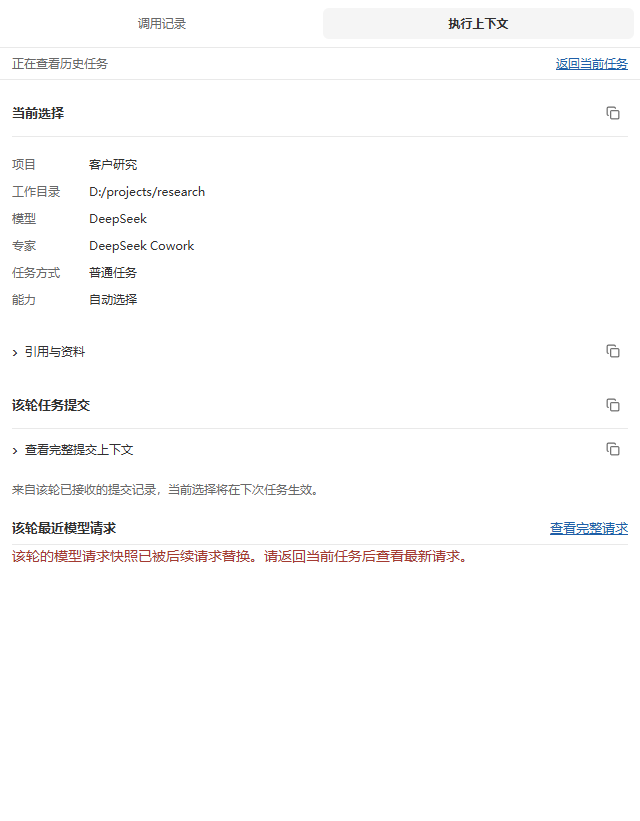

在子任务列表选择任务后，可以阅读其独立对话，在“发送给：任务名称”输入框追加要求，使用“停止本轮”或“继续处理”控制工作。“加载更早消息”读取历史，“查看运行详情”展开事件。

点击标题旁的图表图标，查看累计 Token、缓存命中率和最近请求的上下文估算。横向比例条展示对话消息、工具结果、指令与技能、工具定义的占比，另一条显示已占有效上限的比例。数字和百分比同时保留；展开统计详情可查看和复制原始用量。

可直接在浮窗内调整“目标上限”，选择 300K 或 1M 后点击“保存”；选择“未启用”可关闭自动整理。保存后从下一次开始或重试任务生效，当前任务预算保持不变。取消恢复已保存值，关闭浮窗会保留尚未保存的选择，重新打开可继续。

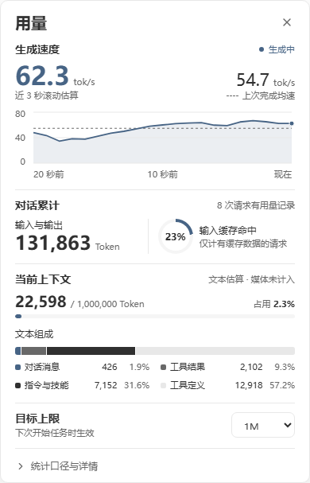

目标上限不等于模型容量：当前预算还受模型资料中的容量、输出预留和安全余量约束。点击“当前预算”查看来源与计算。上下文剩余量是本地估算；组成比例仅统计最近请求的文本，两者与累计 token 的口径不同。未计入的图片数量会单独提示。

临时操作通知显示 6 秒后自动收起，也可手动关闭；切换对话或页面时清除。需要继续处理的错误在对应任务、文件或表单区域保留。

图片查看工具成功后，执行过程时间线显示“已查看 N 张图片”。点击展开横向缩略图，再次点击收起；“详情”查看原始调用。历史预览使用工具实际读取的只读快照，不会随源文件之后的修改而改变，历史记录仍按所属对话展示。

## 使用工作区与文件

“新标签页”按网页、页面、终端分组。输入网址后打开网页；点击“新增页面”开始写作；在“打开终端”旁选择终端类型。

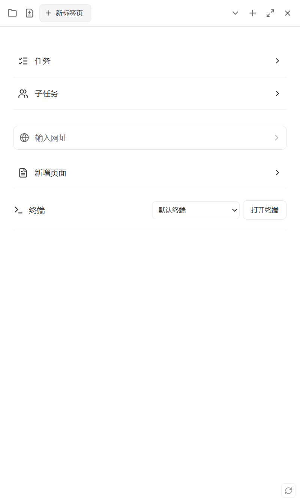

### 审阅工具草稿

办公稿和 Skill 标签按需出现。可以从回答下方“⋯”调用，也可以直接要求 AI 生成并提交审阅。后台完成时会增加标签或提示，保留你正在查看的页面。关闭标签只收起视图；从对应回答的入口，或工具调用详情中的“打开草稿审阅”可以继续。

- **办公稿**：选择本轮回答、本轮任务或自选内容，设置 Word、PPT 或 Excel 格式和标题，再生成。审阅真实文件；Excel 可在工作区编辑，Word/PPT 沿用页面预览与本机应用编辑。确认后点击“保存到项目”，同名文件不会被覆盖。
- **Skill**：检查适用场景、步骤、验证与边界，按需编辑正文、勾选附带资源。可以新建 Skill，或向已有的可编辑技能追加方法与资源；更新前能查看原指导和新增内容。目标技能变化时，先核对最新版本再保存。

从草稿设置开始生成后，聊天区显示“正在生成办公稿”或“正在沉淀为 Skill”任务卡片，标明目标文件或方法名称。点击“查看执行过程”可展开原有记录；等待回答时，问题直接展开。关闭工作区标签后，聊天中的卡片仍显示所属任务的状态，可以继续补充要求或停止。任务结束后，卡片恢复为原有执行过程、回复和文件列表；停止或失败按实际结果显示，已经输出的内容保留。

草稿及尚未保存的编辑随会话保留，生成失败、保存失败或版本冲突时不会清空；可根据提示调整后重试。重新生成会保留已有可审阅结果，并创建另一份草稿。点击“保存到项目”或“保存到我的技能”之后才成为正式成果。

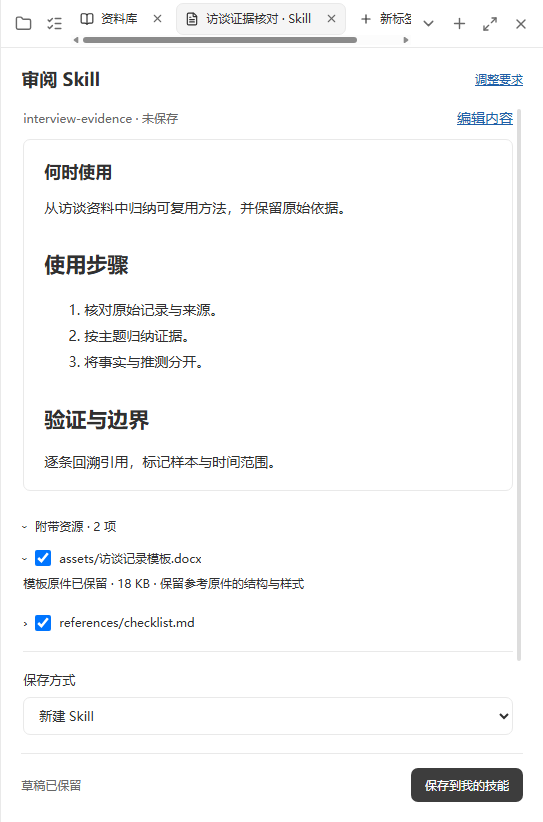

### 查找和预览

1. 打开右侧“工作区”，点击目录按钮，在“交付物”或“工作区文件”中查找文件。
2. 按名称搜索，使用类型和排序筛选，点击文件打开标签。
3. 使用文件菜单打开系统应用、显示资源管理器位置或复制路径。
4. 文件内容发生变化时，点击预览区的“刷新”加载新版。

聊天中的附件、文件链接和本地路径可以打开当前工作目录以外的现存文件，无需切换工作目录；文件被删除或移动时会提示恢复原位置。文件写入仍需显式保存，新建文件和另存副本继续使用当前工作目录。

文件、网页和终端共用标签栏。标签较多时，点击标签栏右侧的向下箭头“全部标签页”，按名称、文件路径或网址搜索并跳转；当前标签带勾选标记，切换后标签栏会自动滚动到它。列表支持上下方向键选择、Enter 跳转、Esc 收起。

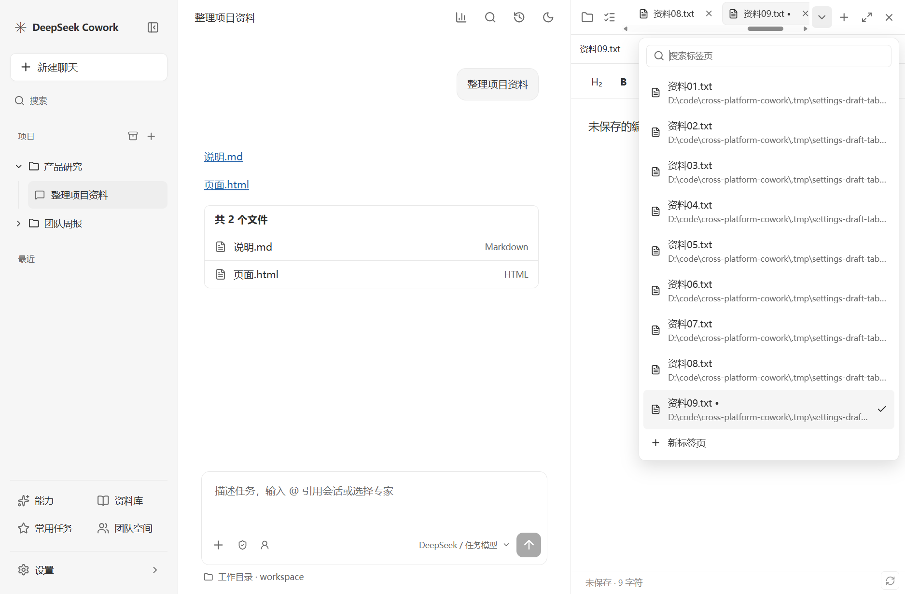

拖动工作区左侧分隔线调整宽度，也可聚焦分隔线后用左右方向键微调、Home 恢复默认宽度、End 展开。右上角展开按钮可以扩大工作区；展开后点击固定的“对话”标签回到完整消息区，再恢复分栏。

文件信息和编辑入口集中在标签栏下方，仅有未保存改动时显示“保存”。更新提示与“刷新”继续单独显示，刷新前保留当前内容和阅读位置。原工作目录已移动或删除时，文件导航会显示原因，并提供“重试”“重新选择目录”；重新选择前需要停止该会话及其子任务。

AI 回复下方会列出回复中引用、且仍存在于当前工作目录的文件。点击文件行、正文中的文件链接或本地路径，在右侧工作区打开；同一文件的相对与绝对路径复用已有标签，保留未保存编辑。超过三个文件时可展开完整列表。重新打开历史对话时也会恢复文件列表。

Markdown 文件首次打开默认显示预览，点击“编辑”后才进入编辑；已经打开的编辑草稿继续保留。阅读预览提供页边距和最大行宽，标题、引用、列表、代码与表格采用当前主题；展开工作区可获得更宽的阅读空间。原文的分隔线和强调格式保留，切换主题不会重新加载正文。

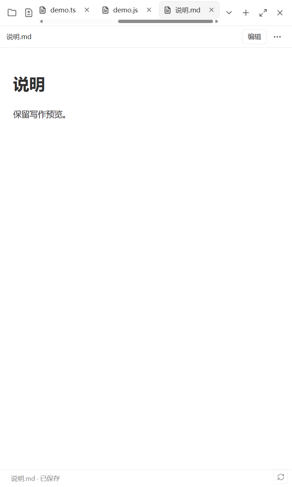

### 编辑并保存

Java、Python、TypeScript／TSX、JavaScript／JSX 等源码使用代码编辑器，JSON、YAML、XML、CSS、SQL 也有对应高亮；TXT、LOG 使用纯文本，Markdown 保留写作与预览。

代码编辑器提供行号、语法高亮、括号匹配、自动缩进、折叠、查找替换和跳转行。`Ctrl+S` 保存，`Ctrl+Z` 撤销；底部显示语言、行列与保存状态。默认保留代码行结构，可横向滚动或勾选“自动换行”。切换标签或会话保留草稿、撤销记录、光标及滚动位置；保存沿用宿主的文件冲突保护，保留原编码与换行风格，不自动格式化。

文件提供编辑入口时，点击铅笔进入编辑，修改后保存或另存。离开未保存内容时，按提示选择保存、放弃或取消。

Markdown 使用一个“编辑／预览”切换按钮，保存由宿主工具栏统一提供，修改后才显示；`Ctrl+S` 同样可保存。XLSX 继续使用表格编辑器。HTML 默认展示页面，点击“编辑”在页面上直接修改文字、标题、列表和基本格式，点击“预览”检查结果后保存。页面脚本在编辑时暂停，预览和保存时恢复；原有样式与脚本保留，保存失败保留当前草稿。

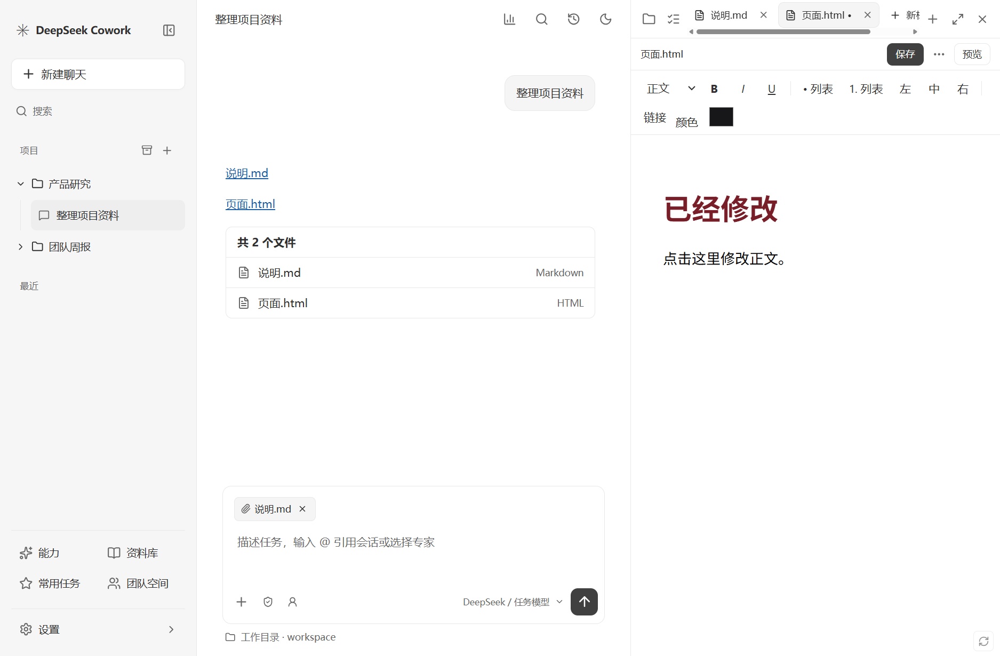

Word（DOC/DOCX）和 PPT（PPT/PPTX）只读展示页面版式。Windows x64 首次打开时可点击“安装预览组件”，下载约 356 MiB 的 LibreOffice；安装进度可查看、取消或重试。安装在应用数据目录，不修改系统文件关联。其他平台可安装本机 LibreOffice 后重新载入。转换使用独立副本，失败时原文件和已有预览保留；复杂字体、动画和特殊版式仍应在原生应用核对。点击“打开应用编辑”，保存后在“更多 → 重新载入文件”更新预览。

### 新建写作页

点击标签栏“+ → 新增页面”，直接进入编辑界面。顶部可填写文件名，正文工具栏提供标题、加粗和列表，也可切换预览。空白页不会创建文件；输入内容先作为当前对话的草稿保留，重新打开应用后可以继续写。点击“保存”或按 `Ctrl+S`，才在当前工作目录创建 Markdown 或文本文件。

首次保存期间继续输入的文字会保留为未保存修改。离开有修改的文稿时，可保存、放弃修改或取消关闭；空白草稿可以直接关闭。

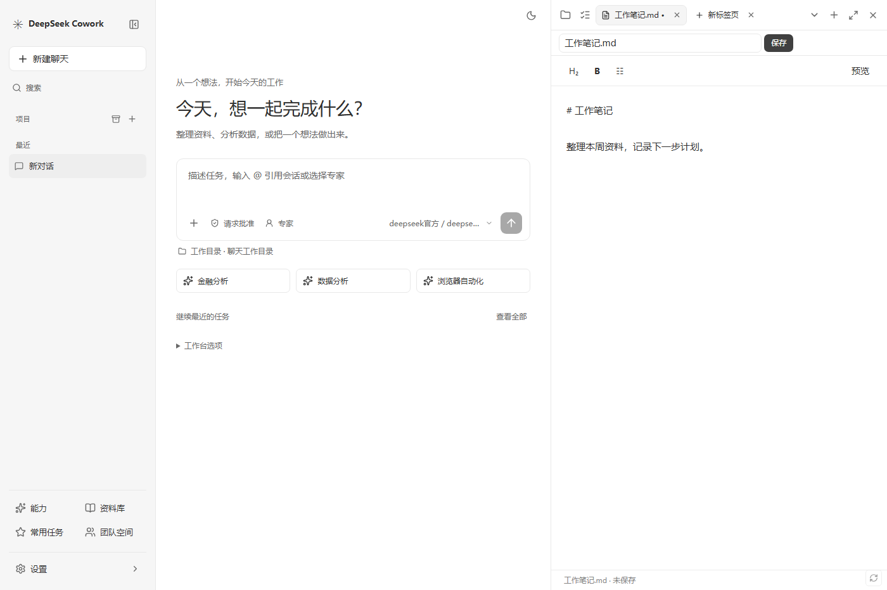

### 网页与终端

新标签页可以输入网址、搜索词，或打开 Git Bash、PowerShell 终端。网页工具栏提供导航、查找、缩放、下载及外部打开。

可以直接要求 AI“分析右侧打开的网页”或“检查当前终端结果”。发送时会附带当前聊天的标签状态，AI 再按任务读取内容。

网页使用“接管”，终端使用“接管终端”切换操作方；终端右键菜单还提供“停止当前命令”和“接管并停止当前命令”。终端支持选择复制、粘贴、命令历史和字号调整。

### 浏览器自动化

在“设置 → 实验功能”选择浏览器模式：“使用外部 Chrome / Edge”勾选时使用 BrowserSkill，取消勾选并保存后使用工作区内置网页。外部 BrowserSkill 模式需要准备服务和浏览器扩展，按页面指引完成浏览器连接。设置从下一轮任务生效；已有浏览任务结束后才能切换，历史调用记录仍显示当时使用的工具。操作网页时可按需要接管页面。

内置网页在切换标签或最小化应用后仍可继续截图和操作。截图坐标与网页视口保持一致，适配 Windows 显示缩放和网页缩放。点击或按键返回“已派发”后，AI 需要重新观察页面确认结果；不会因为暂时没有变化而自动重复提交。截图失败时仍保留文字和元素信息，并说明原因。

## 制作文档和演示

### Word 与 PDF

先提供源资料、读者、篇幅和格式要求。可以让 AI 直接生成文件，也可以从回答末尾“⋯ → 生成办公稿”选择 Word，生成后在工作区审阅并保存 DOCX。需要 PDF 时，在对话中明确提出转换要求。

内置“文档处理”支持 Office/PDF 读取、Word 创建、局部编辑与模板复用。提供模板时会优先保留原有页面、样式和结构；默认另存修改结果，要求覆盖原件时请明确说明。只问文件内容不会自动创建报告。

AI 可分批将 Word、PPT 和 PDF 渲染成页面图片检查版式。Word/PPT 使用可选 LibreOffice 组件，PDF 页面转图随完整应用提供。文件生成、结构有效和页面检查是不同结果：渲染组件不可用或模型不支持看图时，会保留成果并说明未完成的检查，可在工作区预览或用本机应用继续检查。

### 制作演示文稿

直接在对话中提供素材、受众、汇报目的、页数和输出格式。需要沿用模板时添加 PPTX 原文件；需要 HTML 演示时说明页面比例和风格。完成后在工作区预览，逐页检查并继续修改。

内置“演示文稿”默认制作可编辑 PPTX，支持新建、模板复用和指定页面修改，检查中文换行、图表、图片比例与逐页排版。没有模板时默认宽屏；复杂动画、媒体和嵌入对象需要额外核对，不能仅凭静态预览判断完整保留。

专门的 PPT 助手及其自动策略选择流程已下线，Frontend Slides 不再随应用内置。旧会话和生成文件保留，打开旧 PPT 助手会话时会显示下线说明，后续发送使用普通对话。Huashu Design、Guizang PPT 也不再随应用内置；用户自行安装的副本和已有成果保留。普通 PPTX 文件读取、生成和预览能力保留。

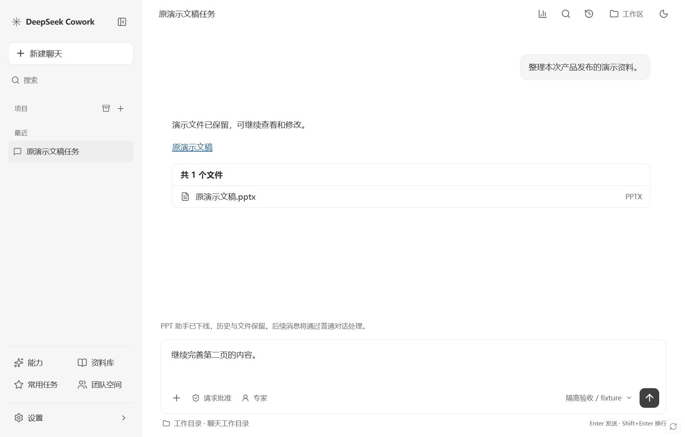

### 分析数据

提供数据文件或已连接的数据来源，并说明要比较的指标、时间和用途。内置“数据分析”会按问题核对记录粒度、缺失、重复、连接关系、统计口径与比较范围，再完成计算和结论核验。简单求和直接回答；缺少关键数据时说明缺口，不用示例数据填补真实结论。

上传 Excel 不代表一定交付 Excel。可直接要求聊天结论、交互图表、Word 或 PPT；这些成果复用同一份核验结果。修改日期、筛选或指标定义后，可以要求同步更新所有成果。未完整月份、退款、零值和缺失金额会分别处理，贡献拆解不会自动当作原因。

## 管理技能连接器与专家

能力页分为“技能、MCP 服务、专家、界面插件”四个并列标签，切换时保留顶部导航。

### 技能与 SkillHub

在“发现技能”按任务搜索或筛选能力，查看用途并开启。底部的 SkillHub 入口提供在线目录、版本详情和安装；安装后到“我的能力”配置并开启。

“添加技能”用于导入本地技能，技能详情提供更新、导出和删除。输入区“+ → 技能”可显式选择本会话使用的能力；点击已选技能或连接器标签的名称，可直接展开对应选择列表，勾选、取消或切换能力，右侧“×”仍用于移除。该列表不展示 Skill Builder、Theme Customizer 等内置能力，内置能力仍按原规则供应用使用。

### MCP 服务

添加服务时选择 Streamable HTTP 或 stdio，填写服务地址或启动命令。展开“导入 JSON”可选择文件自动解析，或粘贴后点击“解析并填入”；多服务配置显示为列表，点击其中一项即可填入。解析只填入表单，不保存或连接；检查认证信息并点击“保存”后，才可使用“测试连接”。格式错误或保存失败会保留当前输入；暂不支持的 SSE 配置会明确提示。输入区将 MCP 称为“连接器”，可从“+ → 连接器”选择。

### 专家、记忆与经验

在专家页查看角色和用途，可创建专家或复制已有专家进行定制。“指定可用技能”中勾选需要使用的技能，选中项以复选框和底色标明，小窗口自动排成单列。

内置的 **HTML创作** 可根据图片复刻或文字要求制作可编辑、可离线打开的 HTML 页面。在输入区点击“专家”直接选择，或输入 `@` 选择后点击“应用选择”。“能力 → 专家”中可以查看内置工作指引，点击“复制为自建专家”后修改并保存；内置原件保留。

通过输入区的“专家”或 `@` 选择后，继续在当前会话中使用。

全局与项目记忆在“管理 → 记忆”维护。AI 在执行任务时发现已验证、值得复用的方法或限制，可自主保存经验，无须逐条确认。项目相关经验留在当前项目，跨项目成立的经验进入全局；没有项目不会自动转存全局。拷问阶段不写记忆，创造模式的设计目录也不算项目。记忆从下一轮任务生效，可在记忆页查看、修改或删除；若编辑期间有其他任务更新记忆，保存会提示先合并并保留编辑内容。

任务形成可复用方法后，从回答的“⋯ → 沉淀为 Skill”选择来源范围并生成草稿，在右侧审阅指导正文与附带资源，再保存到“我的技能”。更新已有技能时追加本次方法，保留原有指导、工具和资源；有同名资源时需取消附带或调整草稿。

## 使用资料库

资料来源使用左侧的单行下拉选择器，切换本地资料库、WeKnora、腾讯文档和腾讯乐享。下面只显示当前来源的项目或目录；右侧用列表浏览，显示名称、所属项目或类型及更新时间。来源之间分别保留浏览范围、搜索和列表位置。

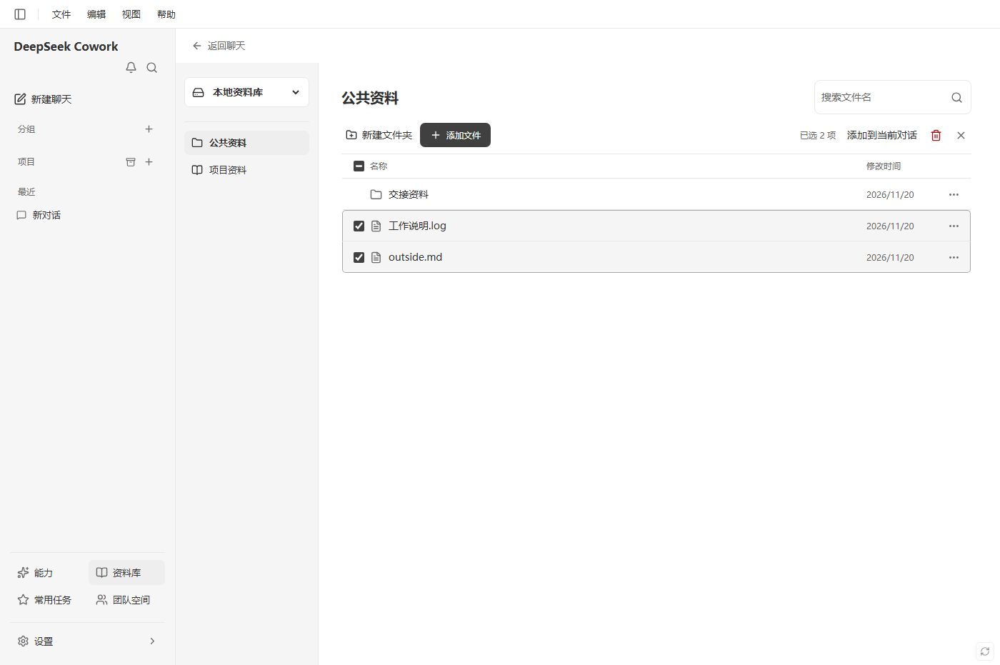

### 本地资料库

自动汇集已有项目和项目对话工作目录中的文档、表格、演示文稿与图片。“全部项目资料”按修改时间展示，选择项目可逐层浏览目录；搜索按当前项目范围匹配文件名或相对路径。“添加项目”可选择其他项目目录。隐藏目录、依赖与构建目录不纳入汇总，文件保留在原目录。目录不可用时会说明列表不完整，恢复目录后刷新即可。

点击文件在右侧主区域阅读，使用“返回列表”恢复之前的位置。Markdown、文本、HTML、PDF 与图片可直接预览；其他格式可用“在本机打开”查看。点击“添加到当前对话”会通过已有附件流程复制到当前对话，返回聊天核对附件后发送。

### 连接来源

选择远程来源并连接：

| 来源 | 连接步骤 |
| --- | --- |
| WeKnora | 填写服务地址、邮箱和密码 |
| 腾讯文档 | 打开授权页面，完成授权后返回点击“已完成授权” |
| 腾讯乐享 | 填写企业标识和访问令牌 |

已连接来源按平台提供的信息区分“个人文件”和“共享空间”。同一资料库被多个空间共享时只显示一次，并标注共享来源；自己创建后再共享的资料库仍归入个人文件。也可从左侧目录进入，右上角可刷新或断开当前连接。

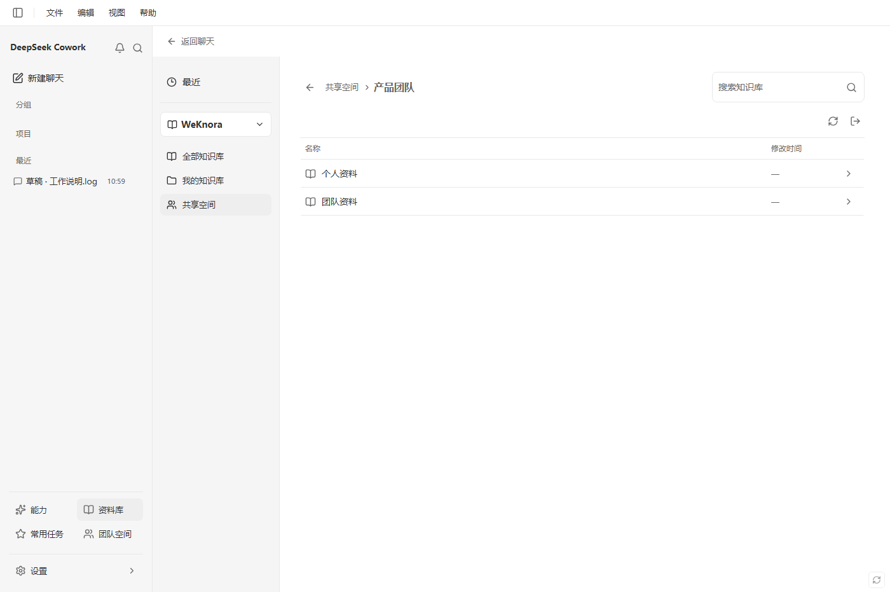

### 阅读与引用

选择目录或搜索资料，点击条目在主区域阅读，预览不会追加到列表底部。“返回列表”保留原位置；“添加到当前对话”添加单份资料，资料库工具栏的“引用整个资料库”添加整个范围。返回聊天核对资料标签后发送任务。

读取文件期间仍可切换目录或来源；离开后会取消读取，旧文件的迟到结果不会覆盖新页面。WeKnora 的 HTML、文本、图片和 PDF 按文件类型预览，Office 文件使用已安装的 LibreOffice 生成只读页面；组件未安装、格式不支持或平台尚未返回正文时，会显示原因。腾讯文档与腾讯乐享在主区域展示平台返回的正文。

资料标签表示本对话选择的资料范围，不代表 AI 已读取全部内容；调整资料不改变已发送消息或正在运行的任务。来源支持原文链接时，可在原平台打开。

### 上传文件

进入远程资料库后，点击“上传文件”选择本地文件。在“后台操作”查看提交结果，再刷新目标目录确认。取消、失败或切换来源不会自动重传。

## 企业账号与团队空间

### 登录企业

企业客户端在“设置 → 企业账号”提供“登录企业账号”。在打开的认证页面完成登录后返回客户端，刷新模型并从聊天模型菜单选择企业分配的模型。

平台管理员通过网页维护成员和模型授权，部署及管理操作见[企业平台说明](../web/platform/README.md)。

### 共同完成任务

1. 打开“团队空间”，创建空间并邀请同事，或接受已有邀请。
2. 在“资料”上传文件，在“计划”填写分工、负责人、优先级和所选资料版本。
3. 打开计划，点击“在本机开始任务”，选择任务目录、模型和技能，填写本次目标。
4. 在原有对话界面完成工作；从空间的“我的任务”回到对应本机任务。
5. 点击“选择内容发布为成果”，检查要分享的文字、说明、文件和关联计划，再确认发布。
6. 在计划详情填写完成说明，并关联成果版本。成员通过留言继续讨论。

空间的“计划、资料、成果、动态”分别组织分工、共享文件、发布内容和协作动态；空间设置、成员管理和归档在更多菜单中。

## 常用任务与消息连接

### 保存常用任务

打开“常用 → 新建常用”，填写名称、任务内容、能力和执行位置，保存后点击“开始”。需要自动执行时展开定时设置，选择日期、周期或 Cron，并保存启用。

“立即运行计划”用于按计划路径启动；“运行历史”集中查看任务及消息投递状态。点击名称编辑内容，行末更多菜单提供历史和删除操作。

### 连接消息渠道

在“设置 → 消息连接”选择飞书、钉钉、企业微信、QQ 或微信。页面只显示所选渠道的配置，低频字段放在“更多选项”。顶部按钮只切换查看，不修改配置，也不会触发未保存提醒；勾选“接收此渠道消息”并保存后才切换接收渠道，取消勾选并保存则停止接收。切换查看保留未保存输入，真正修改后离开仍会提示保留草稿。扫码渠道按手机提示确认，表单渠道填写对应连接信息并启动。

如果检测到旧版本留下的连接草稿，页面默认显示已保存配置，并提供“恢复草稿”和“丢弃草稿”。旧草稿在恢复前不会触发离开提醒；主动恢复后可以继续编辑、保存或取消修改。新编辑的草稿仍按原流程保留。

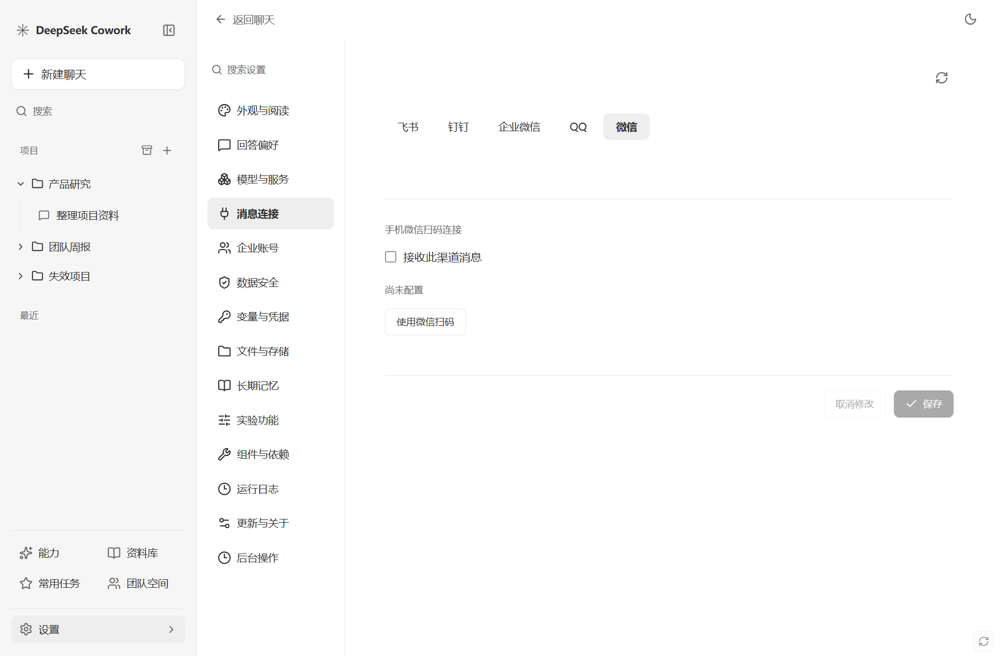

常用计划需要发送结果时，启用“发送到企业消息”，生成并复制完整绑定消息，在目标聊天中发送，再使用“立即运行计划”检查投递。

## 个性化与设置

设置侧栏集中提供外观与阅读、回答偏好、模型与服务、消息连接、企业账号、隐私与数据、文件与存储、高级与维护。可以搜索设置名称或用途，按 Enter 定位。表单修改按页面的“保存更改”提交。

### 后台操作

“设置 → 后台操作”可搜索操作名称、执行日志或错误内容，并按状态筛选。点击操作行展开带时间的执行日志，可复制完整保留的日志；较早记录通过“加载更早记录”查看，进行中的操作可取消。每个操作最多保留最近 300 条日志，超出时显示省略数量；旧记录没有过程日志时明确提示，不补造历史。

### 创造模式：界面、主题与插件

在“+ → 模式”选择“创造模式”。左侧是独立预览，右侧统一提供“AI 设计”“主题”“插件”。可选择整个界面、首页、侧栏、顶部工具栏、输入区、工作区或管理页面作为修改范围；“选择界面区域”也可直接点击预览中的区域。

点击“AI 主题”或“自由设计工作台”填入起始要求，按正常对话发送。设计任务使用独立会话和工作目录，复用原有模型、权限、停止和恢复流程；未发送的原对话输入会保留。重新进入继续同一份设计任务，界面重载后也能恢复草稿和修改范围。

AI 主题候选直接出现在面板中；生成的界面通过“预览界面候选”检查。可查看原版、放弃候选或应用，预览中的发送等操作不改变真实对话。应用界面前会保存宿主草稿并等待候选就绪，失败保留当前界面及设计成果。主题候选按设计会话隔离，AI 不能自行应用；“应用”后才改变日常界面。

在“主题”页选择简洁、暖纸、青松、雾蓝或已保存主题，预览后点击“应用主题”；也可导入、导出、自定义字体和密度。“插件”页提供模式启停、本地插件添加和原有版本恢复。

“退出创造”返回原对话，设计输入和文件保留，后台任务继续运行。“恢复界面”恢复内置工作台及上次应用前的主题；右下角独立的“界面恢复与诊断”也始终可用。

### Mermaid 流程图与 Visualize

回复中的 `mermaid` 代码块会直接显示为图表，也兼容未标注语言、以 `flowchart TB` 或 `graph LR` 等方向声明开头的代码块。可查看／复制源码、放大缩小或适应宽度；生成中的未闭合代码块先显示源码，完成后绘图。语法有误时保留源码并提示重试。

交互可视化、文档处理、演示文稿、数据分析、图片查看和 Workbench 均列在“能力 → 技能 → 内置技能”中，升级后自动加载，不受旧版本关闭标记影响。内置技能无需手动启用，不能在技能页停用或删除。图片查看仍需要当前模型支持图片输入；Workbench 的网页操作仍服从所选浏览器模式与用户接管状态。旧文档技能 `document-reader` 已移除，不兼容或自动迁移旧配置引用；历史对话与已生成文件保留。

### Visualize

Visualize（交互可视化）已内置并默认可用，无需在输入框选择。在对话中说明要比较的方案、可调条件和希望看到的结果。生成后使用视图中的筛选器、按钮或参数控件继续探索，也可以要求 AI 调整内容。

视图跟随当前浅色、深色或自定义主题，切换主题保留筛选状态。支持窄窗口与键盘操作；筛选无匹配记录时显示空结果。发布成功表示片段通过发布校验，实际运行或版式尚未检查时，AI 会说明验证范围。

### HTML 与 JavaScript 代码预览

AI 回复中标注为 `html`、`js` 或 `javascript` 的代码块默认显示源码。点击“预览”或“运行 / 输出”，可就地查看 HTML 页面、操作按钮，或查看 JavaScript 创建的页面及控制台输出。生成中的代码块须等结束标记出现后才能运行；打开历史对话不会自动执行。

“代码”与“预览”之间切换保留当前交互；“重新运行”重置页面，“停止预览”释放运行实例并保留源码和已收到的控制台输出。源码发生变化、离开消息或重新打开应用后，需要再次点击运行。预览本身不修改聊天记录，也不把输出加入模型上下文。

预览支持自包含 HTML（可含内嵌 CSS、脚本）与浏览器原生 JavaScript；不提供外部资源加载、联网、模块导入、Node.js 或 JSX 编译环境。依赖缺失、语法错误和被阻止的操作会在代码块内说明，源码始终可复制。`alert()` 作为展开的控制台提示显示，不弹出阻塞聊天的系统对话框。

每次运行在独立沙箱中执行；预览可见且应用在前台时，超过 10 秒无响应会停止该预览并提供重新运行入口。单段源码上限为 256 KB，同时最多打开 16 个预览；控制台最多显示 100 条输出和一条达到上限的提示，较长单条输出显示前 4,000 字符。预览不会获得文件、终端或应用接口权限。

### 数据安全与凭据

在“隐私与数据”打开数据安全设置，选择需要的风险检查、凭证提醒或文本令牌化功能；令牌化还需选择数据类别，随后保存。

变量与凭据在同一区域维护。填写变量名称和值，敏感项按页面选项设置是否允许 AI 读取。

### 超长上下文与极简启动

在用量浮窗直接选择 300K 或 1M 目标上限并保存，即可启用超长上下文。“实验功能”不再重复提供此入口。接近预算时自动整理较早内容，完整对话仍保留。新设置从下一次开始或重试任务时生效。

DeepSeek 官方服务的极简启动在模型编辑页“高级设置”中管理。修改模型配置后保存，再开始新任务。

## 应用更新与记录导出

Windows 完整安装包启动约 15 秒后会检查更新，持续运行时每 24 小时检查一次。也可到“设置 → 更新与关于”手动检查。普通版优先使用已配置的公共更新源，没有公共源时使用 GitHub；公共源暂时不可用会明确提示后改用 GitHub。企业安装包只获取所属中心由管理员发布并推荐的新版工作台版本，登录企业账号不会改变普通安装包的更新渠道。

安装包下载、校验和准备完成后，侧栏设置入口上方显示版本与“重启并更新”。关闭提示只在本次运行隐藏该版本，准备好的包仍可从设置页安装，下次启动会重新校验并恢复提示。网络错误最多尝试 5 次，可随时取消准备；包校验错误会停止并保留原因。

“选择本地安装包”支持离线准备完整的 Windows x64 新版工作台 ZIP，以包内版本为准：高版本升级、同版本显示“重启并重新安装”、低版本拒绝。普通版使用标准包，企业版使用同一中心的企业包。本地 ZIP 原件保持不变；若同目录有对应的 `latest-desktop-windows-x64.json`，会核对大小和 SHA-256。没有配套清单时，页面会说明未验证发布者身份。企业本地离线更新无法在线确认管理员是否已撤回该包。

企业下载页提供安装包及“下载校验清单”，离线更新时同时下载并放在同一目录。企业包重新封装后摘要已变化，不要搭配普通标准包的清单。企业中心只支持 Electron 工作台，旧 Qt 客户端不再接收推荐更新；首次使用当前企业版请完整解压企业包后启动。

点击安装前，应用会保存草稿及编辑恢复副本，并检查后台任务；有任务运行时等待任务结束后再试。确认后先准备安装，侧栏和更新页显示进度，可点击“取消准备”。取消完成后继续使用当前版本；连接中断或准备超时会撤销未提交的安装。准备完成后再次保存草稿，应用退出，由独立安装器完成替换并重新打开。更新不会主动删除用户数据。

重复点击同一数据目录的应用只会唤起已有窗口；更新后提前手动打开应用，也能由已有窗口完成启动确认。安装成功后更新窗口自动关闭。替换失败但原版本已恢复并确认打开时，更新窗口退出，失败原因保留在“更新与关于”。应用无法打开或恢复未完成时，窗口保留“重新打开／重试恢复”和“结束更新”；结束更新会释放安装锁，诊断记录与恢复备份保留。文件正在替换或恢复时需等待操作结束，再关闭窗口。

Python、文档与数据分析工具包均随完整应用包提供，解压后即可使用，无需选择下载源或单独安装、修复、卸载工具包。数据分析包含 NumPy、pandas、SciPy、Matplotlib、seaborn 和 scikit-learn，依赖版本随应用整体更新；随包文件损坏时，通过“更新与关于”重新安装完整包。桌面中的 `run_node_code` 复用 Electron 自带的 Node.js，无需另装运行时；npm/npx 不随本次改动新增内置。新增第三方技能和 MCP 的额外依赖仍由各自功能准备。Word/PPT 版式预览仍需按提示安装可选 LibreOffice 组件。

旧版语音转文字技能及其安装、配置和转写入口已下线，已有音频文件与转写历史保留。旧草稿中仅授权转写或本地处理的音频会阻止提交并提示移除附件，避免扩大原有授权。需要新的音频转写任务时，启用[多媒体](#使用多媒体)并配置“音频 → 理解”，按新任务重新选择素材。

运行日志在“高级与维护 → 运行日志”查看，按时间、来源或关键词筛选，通过“导出日志…”保存 TXT。对话更多菜单可以下载或复制聊天记录；任务详情中的请求记录可用于查看或导出最近一次 AI 请求。

## 常用快捷操作

| 操作 | 方式 |
| --- | --- |
| 当前对话搜索 | `Ctrl+F`，`Enter / Shift+Enter` 切换命中，`Esc` 关闭 |
| 修改对话标题 | 点击标题或聚焦后按 `F2`，`Enter` 保存、`Esc` 取消 |
| 历史提问编辑 | 悬停提问后点击编辑，`Ctrl+Enter` 保存并重新生成 |
| 添加引用或专家 | 输入 `@` 或打开输入区“+”菜单 |
| 保存写作页 | `Ctrl+S` |
| 网页缩放 | `Ctrl++`、`Ctrl+-`、`Ctrl+0` |
| 终端复制与粘贴 | `Ctrl+Shift+C`、`Ctrl+Shift+V`，或右键菜单 |

架构、能力开发和构建命令见[技术文档](technical-design.md)，版本变化见[发布记录](releases/index.md)。
